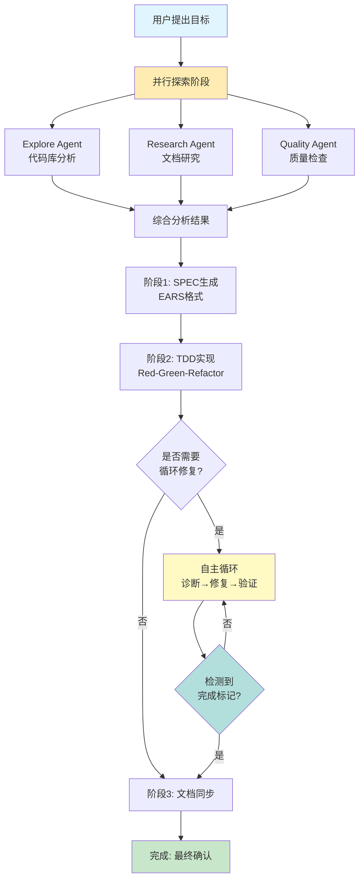
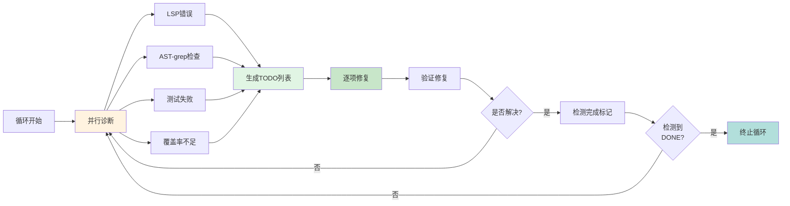
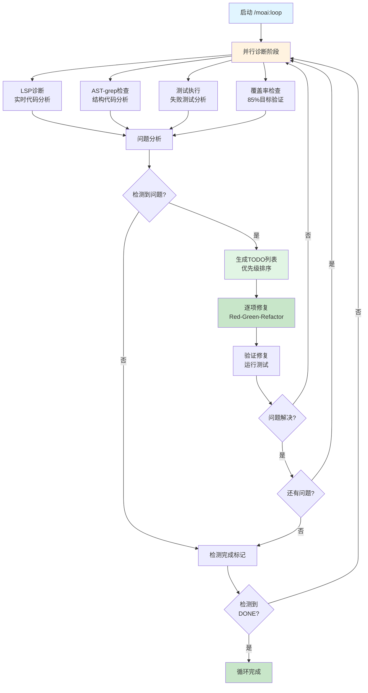
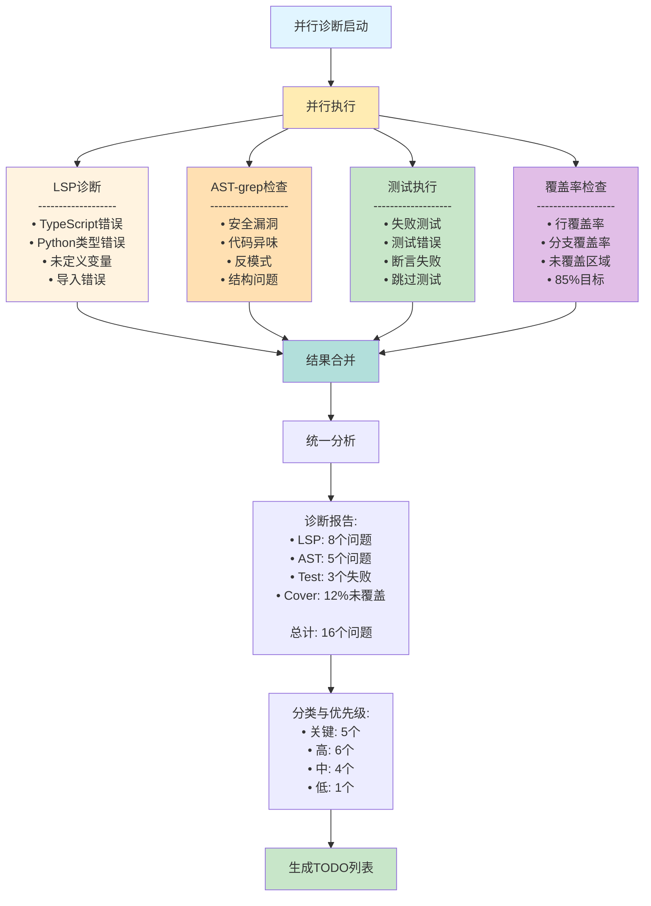
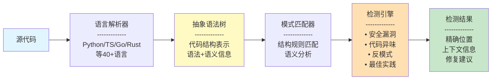
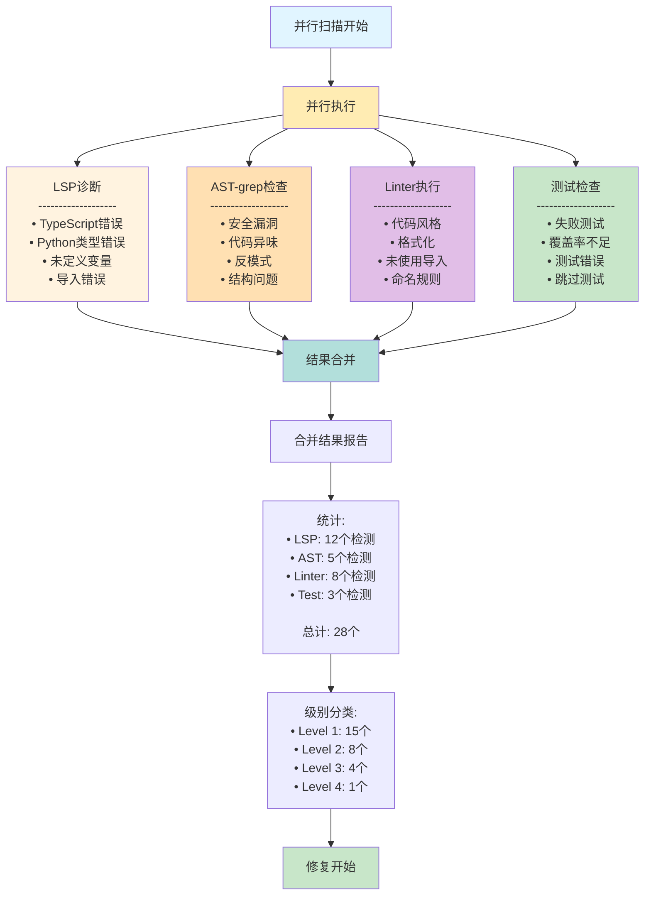
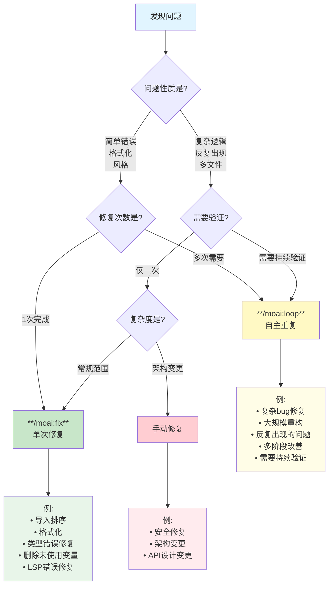
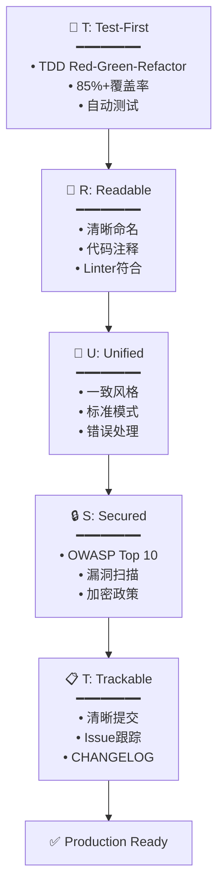

# 🗿 MoAI-ADK: AI 智能体开发框架


**可用语言:** [🇰🇷 한국어](./README.ko.md) | [🇺🇸 English](./README.md) | [🇯🇵 日本語](./README.ja.md) | [🇨🇳 中文](./README.zh.md)

[](https://pypi.org/project/moai-adk/)
[](./LICENSE)
[](https://www.python.org/)

> **"Vibe Coding的目的不是快速生产力，而是代码质量。"**

MoAI-ADK提供**高质量代码的AI开发环境**。SPEC-First TDD、测试驱动开发、持续重构和20个专业AI智能体协同工作。

---

## 🎁 MoAI-ADK赞助商: z.ai GLM 4.7

**💎 经济高效的AI开发最佳解决方案**

MoAI-ADK通过**z.ai GLM 4.7**合作伙伴关系为开发者提供经济高效的AI开发环境。

### 🚀 GLM 4.7 特别优惠

| 优惠                | 说明                                |
| ------------------- | ----------------------------------- |
| **💰 70% 成本节省** | Claude的1/7价格获得同等性能         |
| **⚡ 快速响应**     | 优化的基础设施提供低延迟响应        |
| **🔄 兼容性**       | 与Claude Code完全兼容，无需修改代码 |
| **📈 无限使用**     | 无每日/每周令牌限制，自由使用       |

### 🎁 注册特别折扣

**👉 [GLM 4.7 注册 (10% 额外折扣)](https://z.ai/subscribe?ic=1NDV03BGWU)**

通过此链接注册:

- ✅ **额外10%折扣**优惠
- ✅ 为**MoAI开源开发**做贡献 (奖励积分用于开源项目)

### 💡 使用指南

```bash
# 1. 获取GLM API密钥
通过上方链接注册后获取API密钥

# 2. 在MoAI-ADK中配置GLM
moai glm YOUR_API_KEY
```

> **💡 提示**: 在Worktree环境中使用GLM 4.7，用Opus设计并用GLM大量实现，最多可节省70%成本。

---

## 🌟 核心价值

- **🎯 SPEC-First**: 清晰的规格说明减少90%返工
- **🔴 TDD强制**: 自动保证85%+测试覆盖率
- **🤖 AI编排**: 20个专业智能体 + 48个技能
- **🌐 多语言路由**: 自动支持韩语/英语/日语/中文
- **🌳 Worktree并行开发**: 完全隔离环境中无限并行工作
- **🏆 MoAI Rank**: 通过Vibe Coding排行榜获得动力

---

> **📚 详细内容请参考官方在线文档:** [https://adk.mo.ai.kr](https://adk.mo.ai.kr)

## 1. 30秒安装

### 🚀 方法1: 快速安装 (推荐)

```bash
curl -LsSf https://modu-ai.github.io/moai-adk/install.sh | sh
```

### 🔧 方法2: 手动安装

```bash
# 步骤1: 安装uv (macOS/Linux)
curl -LsSf https://astral.sh/uv/install.sh | sh

# 步骤2: 安装MoAI-ADK
uv tool install moai-adk
```

### 🎨 交互式设置向导

运行`moai init`命令时，**9步交互式向导**启动:


---

#### 步骤1: 语言选择

选择对话语言。之后所有指南将以所选语言显示。

```text
🌐 Language Selection
❯ Select your conversation language: [↑↓] Navigate  [Enter] Select
❯ Korean (한국어)
  English
  Japanese (日本語)
  Chinese (中文)
```

---

#### 步骤2: 输入姓名

输入您的姓名。AI将提供个性化响应。

```text
👤 用户设置
❯ 输入用户名 (可选):
```

---

#### 步骤3: 输入GLM API密钥

输入Z.AI公司的GLM API密钥。

```text
🔑 API 密钥输入
GLM CodePlan API key (optional - press Enter to skip)

✓ 找到现有GLM API密钥: 99c1a2df...
按Enter保留现有密钥，输入新密钥将替换

? 输入GLM API密钥:
```

> 🎁 **GLM注册优惠**: 如果您没有GLM账户，请通过下方链接注册!
>
> **👉 [GLM 注册 (10% 额外折扣)](https://z.ai/subscribe?ic=1NDV03BGWU)**
>
> 通过此链接注册可获得**额外10%折扣**。
> 此外，通过链接注册产生的奖励将用于**MoAI开源开发**。🙏

---

#### 步骤4: 项目设置

输入项目名称。

```text
📁 项目设置
❯ 项目名称: MoAI-ADK
```

---

#### 步骤5: Git设置

选择Git模式。

```text
🔀 Git设置
❯ 选择Git模式: [↑↓] Navigate  [Enter] Select
❯ manual (仅本地) - 仅使用本地仓库
  personal (GitHub个人) - 使用GitHub个人账户
  team (GitHub团队) - 使用GitHub团队/组织
```

---

#### 步骤6: GitHub用户名

选择personal/team时输入GitHub用户名。

```text
❯ GitHub用户名:
```

---

#### 步骤7: 提交消息语言

选择Git提交消息使用的语言。

```text
🗣️ 输出语言设置
❯ 提交消息语言: [↑↓] Navigate  [Enter] Select
  English
❯ Korean (한국어)
  Japanese (日本語)
  Chinese (中文)
```

---

#### 步骤8: 代码注释语言

选择代码注释使用的语言。

```text
❯ 代码注释语言: [↑↓] Navigate  [Enter] Select
  English
❯ Korean (한국어)
  Japanese (日本語)
  Chinese (中文)
```

---

#### 步骤9: 文档语言

选择文档使用的语言。

```text
❯ 文档语言: [↑↓] Navigate  [Enter] Select
  English
❯ Korean (한국어)
  Japanese (日本語)
  Chinese (中文)
```

> 💡 **令牌优化策略**: 指导智能体的内部提示固定为**英语**。
>
> **原因**: 非英语语言在Claude中**额外消耗12%~20%令牌**。当无限重复的智能体工作增多时，会对成本和每周令牌限制产生重大影响，因此MoAI将内部智能体指导固定为英语，**仅用用户语言提供一般对话**。
>
> 这是MoAI**减少令牌浪费的努力**。

---

#### Step 10: TAG 系统激活

🎯 TAG 系统：TDD 的代码 ↔ 文档追踪

TAG 系统维护代码与 SPEC 文档之间的可追溯性，
以支持 TDD（测试驱动开发）循环。

TDD 目的:
•  RED (编写测试) → @SPEC SPEC-XXX verify
•  GREEN (实现代码) → @SPEC SPEC-XXX impl
•  REFACTOR (改进) → @SPEC SPEC-XXX impl 或 related

清晰追踪每个代码文件实现哪个 SPEC，
促进文档驱动开发并保持质量。

💡 推荐激活 TAG。在 TDD 循环中保持代码与文档的
一致性，提高质量和可维护性。

```text
? 是否启用 TAG 系统？ (TDD 推荐) (Y/n)
```

---

**TAG 验证模式指南**

• warn: 开发期间警告提示 (默认值，推荐)
• enforce: TAG 缺失时阻止提交 (严格质量控制)
• off: 跳过验证 (不推荐)

```text
❯ 选择 TAG 验证模式: [↑↓] Navigate  [Enter] Select
❯ warn (警告) - 仅显示缺失 TAG 的警告。开发中灵活处理
  enforce (强制) - TAG 缺失时阻止提交。严格质量控制
  off (关闭) - 跳过 TAG 验证。不推荐
```

---

#### 安装完成

所有设置完成后，5步安装自动进行:

```text
🚀 Starting installation...

Phase 1: Preparation and backup...        ████████████████ 100%
Phase 2: Creating directory structure...  ████████████████ 100%
Phase 3: Installing resources...          ████████████████ 100%
Phase 4: Generating configurations...     ████████████████ 100%
Phase 5: Validation and finalization...   ████████████████ 100%

✅ Initialization Completed Successfully!
────────────────────────────────────────────────────────────────

📊 Summary:
  📁 Location:   /path/to/my-project
  🌐 Language:   Auto-detect (use /moai:0-project)
  🔀 Git:        manual (github-flow, branch: manual)
  🌍 Locale:     ko
  📄 Files:      47 created
  ⏱️  Duration:   1234ms

🚀 Next Steps:
  1. Run cd my-project to enter the project
  2. Run /moai:0-project in Claude Code for full setup
  3. Start developing with MoAI-ADK!
```

### 添加到现有项目

```bash
cd your-existing-project
moai init .
# 现有文件保持不变
```

---

### 🔄 MoAI-ADK更新

将现有项目更新到最新版本。

```bash
moai update
```

**3步智能更新工作流**:

```text
Stage 1: 📦 检查包版本
         └─ 从PyPI检查最新版本 → 必要时自动升级

Stage 2: 🔍 比较配置版本
         └─ 比较包模板 vs 项目配置
         └─ 相同则跳过 (性能提升70-80%)

Stage 3: 📄 同步模板
         └─ 创建备份 → 更新模板 → 恢复用户配置
```

**主要选项**:

```bash
# 仅检查版本 (不更新)
moai update --check

# 仅同步模板 (跳过包升级)
moai update --templates-only

# 配置编辑模式 (重新运行init向导)
moai update --config
moai update -c

# 无备份强制更新
moai update --force

# All is well~ 自动模式 (自动批准所有确认)
moai update --yes
```

**合并策略选择**:

```text
🔀 Choose merge strategy:
  [1] Auto-merge (default)
      → 自动保留模板 + 用户更改
  [2] Manual merge
      → 创建备份 + 合并指南 (直接控制)
```

```bash
# 强制自动合并 (默认)
moai update --merge

# 强制手动合并
moai update --manual
```

**自动保留项目**:

| 项目             | 说明                                         |
| ---------------- | -------------------------------------------- |
| **用户设置**     | `.claude/settings.local.json` (MCP, GLM设置) |
| **自定义智能体** | 模板中不存在的用户创建智能体                 |
| **自定义命令**   | 用户定义斜杠命令                             |
| **自定义技能**   | 用户定义技能                                 |
| **自定义钩子**   | 用户定义钩子脚本                             |
| **SPEC文档**     | `.moai/specs/` 整个文件夹                    |
| **报告**         | `.moai/reports/` 整个文件夹                  |

> 💡 **更新提示**: 使用`moai update -c`随时更改语言、API密钥、Git设置。
> 建议在moai以外的文件夹中创建您的命令、智能体、技能、钩子。

---

## 2. 项目文档生成 (可选)

在新项目或现有项目中**自动生成帮助Claude Code理解项目的项目文档**:

```text
> /moai:0-project
```

### 生成的3个文件

| 文件                         | 目标         | 主要内容                                        |
| ---------------------------- | ------------ | ----------------------------------------------- |
| `.moai/project/product.md`   | **产品概述** | 项目名称/描述、目标用户、核心功能、用例         |
| `.moai/project/structure.md` | **结构分析** | 目录树、主要文件夹目的、核心文件位置、模块组成  |
| `.moai/project/tech.md`      | **技术栈**   | 使用技术、框架选择原因、开发环境、构建/部署设置 |

### 为什么需要?

- **提供上下文**: Claude Code快速掌握项目上下文
- **保持一致性**: 团队成员间共享项目理解
- **加速入职**: 缩短新开发者的项目掌握时间
- **优化AI协作**: 更准确的代码建议和审查

> 💡 **提示**: 在项目初期或结构变更时运行`/moai:0-project`以最新状态更新文档。

---

## 3. 核心命令集合

### 🎯 `/moai:0-project` - 项目初始化

```bash
> /moai:0-project
```

自动分析项目当前状态并配置最佳开发环境。检测编程语言和框架，自动设置Git工作流和质量保证标准。所有配置完成后立即可开始开发。

**工作内容**:

- ✅ 分析项目结构
- ✅ 检测编程语言/框架
- ✅ 生成`.moai/config/config.yaml`
- ✅ 设置Git工作流
- ✅ 配置会话内存系统
- ✅ 设置质量保证标准

---

### 📋 `/moai:1-plan` - SPEC编写

```bash
> /moai:1-plan "功能描述"
```

使用EARS格式自动生成无歧义的规格说明。包含需求定义、成功标准、测试场景，明确指明开发方向。生成的SPEC作为开发团队和AI共享理解的单一来源(Single Source of Truth)。

**自动生成**:

- EARS格式规格说明
- 需求定义
- 成功标准
- 测试场景

**示例**:

```bash
> /moai:1-plan "用户档案页面"
# → 生成SPEC-002

> /moai:1-plan "支付API"
# → 生成SPEC-003
```

**重要**: 之后必须执行`> /clear`

---

### 💻 `/moai:2-run` - TDD实现

```bash
> /moai:2-run SPEC-001
```

通过Red-Green-Refactor循环先编写测试，然后实现通过的代码。所有实现必须通过85%以上测试覆盖率以及linting、类型检查、安全检查。自动验证TRUST 5质量原则，只提交稳定的代码。

**自动执行**:

- 🔴 先编写测试 (Red)
- 🟢 测试通过代码 (Green)
- 🔵 重构 (Refactor)
- ✅ TRUST 5验证

**验证项目**:

- 测试覆盖率 >= 85%
- Linting通过
- 类型检查通过
- 安全检查通过

---

### 📚 `/moai:3-sync` - 文档同步

```bash
> /clear  # 同步前始终运行clear以重置会话并运行质量检查
> /moai:3-sync SPEC-001
```

从质量验证开始执行文档同步、Git提交、PR自动化。自动生成API文档、架构图、README、CHANGELOG并保持最新状态。自动提交更改，团队模式下将PR从Draft转换为Ready。

**自动执行任务**:

1. **阶段1: 质量验证**
   - 测试执行 (pytest, jest, go test等)
   - Linter检查 (ruff, eslint, golangci-lint等)
   - 类型检查器 (mypy, tsc, go vet等)
   - 代码审查 (manager-quality)

2. **阶段2-3: 文档同步**
   - 自动生成API文档
   - 更新架构图
   - 更新README
   - 同步SPEC文档

3. **阶段4: Git自动化**
   - 提交更改
   - PR Draft → Ready转换
   - (可选) Auto-merge

**执行模式**:

- `auto` (默认): 仅同步更改的文件
- `force`: 重新生成所有文档
- `status`: 仅执行状态检查
- `project`: 同步整个项目

**详细内容**: 参考命令文件

---

### 🚀 `/moai:alfred` - 完全自主自动化

```bash
> /moai:alfred "功能描述"
```

**「从目标到完成，AI全自动执行」**

用户只需提出目标，Alfred AI自行执行探索、规划、实现、验证。通过并行探索快速分析代码库，通过自主循环自动修复问题。检测到完成标记(`<moai>DONE</moai>`)时自动终止，开发者只需确认最终结果。

---

#### 🎯 工作流程



---

#### 📋 阶段详解

**阶段0: 并行探索 (快速启动)**

- **Explore Agent**: 分析代码库结构和模式
- **Research Agent**: 搜索相关文档和最佳实践
- **Quality Agent**: 检查当前质量状态

并行执行速度提升 **3-4倍**。

**阶段1: SPEC生成 (明确规划)**

- 使用EARS格式创建清晰SPEC文档
- 定义验收标准和测试要求
- 架构设计和技术选型

**阶段2: TDD实现 (质量保证)**

- 红灯: 编写失败测试
- 绿灯: 实现最小代码通过测试
- 重构: 优化代码结构
- 可选启用自主循环自动修复问题

**阶段3: 文档同步 (保持最新)**

- 自动更新README
- 同步API文档
- 更新架构文档
- 提交Pull Request (可选)

---

#### 🔄 自主循环

启用 `--loop` 选项时，Alfred在阶段2自动执行以下循环:



**循环终止条件**:

- 检测到 `<moai>DONE</moai>` 标记 (自动检测)
- 达到最大重复次数 (默认: 100)
- 用户手动取消

---

#### 🎬 何时使用

| 场景                | 推荐命令          | 理由                           |
| ------------------- | ----------------- | ------------------------------ |
| 新功能完整开发      | `/moai:alfred`    | 从SPEC到实现的全自动流程       |
| Bug修复            | `/moai:loop`      | 快速诊断和修复循环             |
| 文档更新           | `/moai:3-sync`    | 仅文档同步                     |
| 代码质量改进       | `/moai:fix`       | 单次修复问题                   |
| 完整工作流程       | `/moai:alfred --loop` | 包含自动循环的完全自主化     |

---

#### 🛠️ 选项和示例

```bash
# 基本自主执行 (并行为默认值)
> /moai:alfred "添加JWT认证"

# 启用自动循环
> /moai:alfred "JWT认证" --loop

# 限制最大重复次数
> /moai:alfred "JWT认证" --loop --max 50

# 顺序探索 (用于调试)
> /moai:alfred "JWT认证" --seq

# 自动创建分支和PR
> /moai:alfred "JWT认证" --branch --pr

# 恢复之前的SPEC
> /moai:alfred resume SPEC-AUTH-001
```

---

> **💡 性能**: 并行探索已成为默认设置，可实现3-4倍更快的分析。`--sequential`仅用于调试。

---

### 🔁 `/moai:loop` - 自主重复修复

```bash
> /moai:loop
```

**「自主诊断、修复、验证，循环直到完成」**

AI自动诊断LSP错误、测试失败、覆盖率不足等问题并重复修复。通过并行诊断同时执行LSP、AST-grep、Tests、Coverage，快3-4倍解决问题。检测到完成标记(`<moai>DONE</moai>`)或达到最大重复次数时自动终止。

---

#### 🎯 工作流程



---

#### 🔍 并行诊断详解

**4种诊断工具并行执行，速度提升3.75倍**。



**并行执行性能提升**:

- 顺序执行: 150秒 (LSP 45s + AST 35s + Test 40s + Coverage 30s)
- 并行执行: 40秒 (最慢工具的时间)
- **速度提升**: 3.75倍

---

#### 📖 AST-grep是什么？

> **"grep查找文本，但AST-grep查找代码结构"**

**概念**:

AST-grep是**结构代码检查工具**。与普通grep或正则表达式搜索文本不同，AST-grep分析代码的**抽象语法树**(Abstract Syntax Tree)来检查代码的**结构和模式**。

**对比表**:

| 特性           | grep/正则表达式        | AST-grep               |
| -------------- | ---------------------- | ---------------------- |
| 搜索目标       | 文本模式              | 代码结构              |
| 理解能力       | 仅字符串匹配          | 理解语法和语义        |
| 语言支持       | 有限(需要不同正则)    | 40+ 语言统一规则      |
| 误报率         | 高(匹配注释、字符串)  | 低(仅匹配代码结构)    |
| 复杂查询       | 难以实现              | 自然表达              |
| 重构支持       | 不支持                | 原生支持              |

**工作原理**:



**检测能力**:

1. **安全漏洞**:
   - SQL注入模式
   - 硬编码密钥
   - 不安全的随机数生成
   - XSS漏洞模式

2. **代码异味**:
   - 重复代码
   - 过长函数
   - 复杂条件
   - 死代码

3. **反模式**:
   - 空异常捕获
   - 资源泄漏
   - 竞争条件
   - 不当类型转换

4. **最佳实践违反**:
   - 缺少错误处理
   - 不当命名
   - 缺少文档
   - 测试覆盖不足

**示例场景**:

```python
# 检测: 硬编码密钥
api_key = "sk-1234567890"  # ❌ AST-grep检测到

# 检测: SQL注入
query = f"SELECT * FROM users WHERE id={user_input}"  # ❌ AST-grep检测到

# 检测: 空异常捕获
try:
    risky_operation()
except:
    pass  # ❌ AST-grep检测到
```

**为什么重要**:

1. **超越文本搜索**: 理解代码结构，不是简单匹配文本
2. **减少误报**: 仅匹配实际代码，忽略注释和字符串
3. **跨语言统一**: 40+语言使用相同的检查规则
4. **精确修复**: 提供基于AST的精确修复建议
5. **实时反馈**: 集成到LSP，实时显示问题

**MoAI-ADK集成**:

```mermaid
flowchart LR
    Loop[/moai:loop] --> Diagnose[并行诊断]
    Diagnose --> AST[AST-grep<br/>结构检查]
    AST --> Pattern[模式匹配:<br/>• 安全规则<br/>• 代码质量<br/>• 最佳实践]
    Pattern --> Result[结构化问题报告]
    Result --> Fix[精确修复建议]
    Fix --> Apply[自动应用修复]

    style Loop fill:#e1f5ff
    style AST fill:#ffe0b2
    style Result fill:#c8e6c9
```

---

#### 📋 修复级别和过程

**修复级别**:

| 级别 | 类型      | 批准   | 说明                          |
| ---- | --------- | ------ | ----------------------------- |
| 1    | 立即修复  | 不需要 | import排序、空白、格式       |
| 2    | 安全修复  | 仅日志 | 变量重命名、类型添加          |
| 3    | 需要批准  | 需要   | 逻辑变更、API修改、方法替换   |
| 4    | 手动需要  | 不可   | 安全、架构、设计决策          |

**修复过程**:

1. **并行诊断执行**: 同时运行LSP、AST-grep、Tests、Coverage
2. **问题合并**: 合并所有诊断结果并去重
3. **TODO生成**: 按优先级和依赖关系排序
4. **逐项修复**:
   - 按优先级处理每个问题
   - 每次修复后验证
   - 失败时重新诊断
5. **重复或完成**:
   - 全部问题解决时 `<moai>DONE</moai>` 标记
   - 最多重复100次后保存快照

---

#### 🎬 何时使用

| 场景             | 说明                         | 示例                          |
| ---------------- | ---------------------------- | ----------------------------- |
| **实现后质量保证** | 代码编写后自动质量改进       | 功能实现后运行 `/moai:loop`   |
| **测试失败修复**  | 自动分析和修复测试失败       | 测试运行后失败时执行          |
| **覆盖率提升**    | 自动达到85%目标              | 新代码编写后执行              |
| **重构维护**      | 持续改进代码质量             | 定期运行以保持代码质量        |

**选项**:

- `--max N`: 最大重复次数 (默认: 100)
- `--auto`: 启用自动修复 (Level 1-3)
- `--sequential` / `--seq`: 顺序诊断 (用于调试) - 并行为默认值
- `--errors`: 仅修复错误
- `--coverage`: 包含覆盖率 (100%目标)
- `--resume ID`: 恢复快照

> **性能**: 并行诊断已成为默认设置，可同时执行LSP、AST-grep、Tests、Coverage (快3.75倍)。

**示例**:

```bash
# 基本自主循环 (并行为默认值)
> /moai:loop

# 顺序 + 自动修复 (用于调试)
> /moai:loop --seq --auto

# 最多重复50次
> /moai:loop --max 50

# 恢复快照
> /moai:loop --resume latest
```

---

### 🔧 `/moai:fix` - 单次自动修复

```bash
> /moai:fix
```

**「一次执行，一次性修复」**

并行扫描LSP错误、linting问题、AST-grep模式，检测到的问题在一次执行中一次性修复。Level 1-2立即修复，Level 3需用户批准后修复，Level 4报告需要手动修复。使用`--dry`选项预览确认后应用实际修复。

---

#### 🎯 概念和工作流程

`/moai:fix`是**一次执行完成单次修复**的命令。与自主循环的`/moai:loop`不同，按扫描→修复→报告的顺序仅执行一次。

```mermaid
flowchart TB
    Start[/moai:fix 开始] --> Scan[并行扫描执行]

    Scan --> LSP[LSP诊断]
    Scan --> AST[AST-grep检查]
    Scan --> Linter[Linter执行]
    Scan --> Test[测试执行]

    LSP --> Gather[结果收集]
    AST --> Gather
    Linter --> Gather
    Test --> Gather

    Gather --> Analyze[问题分析和分类]

    Analyze --> Level1{Level判定}
    Level1 -->|Level 1<br/>立即修复| Fix1[自动修复]
    Level1 -->|Level 2<br/>安全修复| Fix2[日志记录后修复]
    Level1 -->|Level 3<br/>需要批准| Ask{用户批准}
    Level1 -->|Level 4<br/>手动需要| Report[仅报告]

    Ask -->|批准| Fix3[修复执行]
    Ask -->|拒绝| Skip[跳过]

    Fix1 --> Verify[修复验证]
    Fix2 --> Verify
    Fix3 --> Verify
    Skip --> Verify
    Report --> End[完成报告]

    Verify --> TestCheck{测试执行?}
    TestCheck -->|是| TestRun[测试执行]
    TestCheck -->|否| End
    TestRun --> TestPass{通过?}
    TestPass -->|是| End
    TestPass -->|否| Ask

    style Start fill:#e1f5ff
    style End fill:#c8e6c9
    style LSP fill:#fff3e0
    style AST fill:#fff3e0
    style Linter fill:#fff3e0
    style Test fill:#fff3e0
    style Fix1 fill:#c8e6c9
    style Fix2 fill:#c8e6c9
    style Fix3 fill:#c8e6c9
    style Report fill:#ffcdd2
    style Ask fill:#fff9c4
```

---

#### 🔍 并行扫描详解

**并行执行4种诊断工具，扫描速度快3.75倍**。



**并行执行性能提升**:

- 顺序执行: 150秒 (LSP 45s + AST 35s + Linter 40s + Test 30s)
- 并行执行: 40秒 (最慢工具的时间)
- **速度提升**: 3.75倍

---

#### 📋 修复级别和过程

每个问题根据复杂度分为4个级别。

| Level | 说明           | 批准   | 示例                                   | 自动修复可否 |
| ----- | -------------- | ------ | -------------------------------------- | ------------ |
| 1     | 立即修复       | 不需要 | 导入排序、空白、格式化                 | ✅ 可        |
| 2     | 安全修复       | 仅日志 | 变量重命名、类型添加、简单重构          | ✅ 可        |
| 3     | 需要批准       | 需要   | 逻辑变更、API修改、方法替换            | ⚠️ 批准后    |
| 4     | 手动需要       | 不可   | 安全、架构                             | ❌ 不可      |

**修复过程**:

1. **并行扫描执行**: 同时运行LSP、AST-grep、Linter、Test
2. **结果合并**: 合并所有诊断结果并去重
3. **级别分类**: 每个问题分为Level 1-4
4. **修复执行**:
   - Level 1: 立即修复（仅记录日志）
   - Level 2: 安全修复（记录变更内容）
   - Level 3: 用户批准后修复
   - Level 4: 报告需要手动修复
5. **验证**: 修复后运行测试进行回归验证
6. **完成报告**: 报告修复内容和统计

---

#### 🎬 何时使用

| 场景                         | 推荐命令       | 理由                                           |
| ---------------------------- | -------------- | ---------------------------------------------- |
| 日常代码质量维护             | `/moai:fix`    | 快速单次修复，无需循环                         |
| CI失败原因一次性修复         | `/moai:fix`    | 一次执行修复所有问题                           |
| 新功能实现后清理             | `/moai:fix`    | 批量格式化和风格修复                           |
| 复杂反复出现的Bug            | `/moai:loop`   | 需要持续修复和验证                             |
| 大规模重构                   | `/moai:loop`   | 需要多阶段修复和渐进式验证                     |
| PR创建前最终检查             | `/moai:fix`    | 一次执行清理                                   |
| 遗留代码大幅改善             | `/moai:loop`   | 需要多次反复逐步改善                           |

---

#### 🔀 `/moai:fix` vs `/moai:loop` 选择指南

**不确定使用哪个时，通过此流程图决定**。



**总结**:

- **`/moai:fix`**: 一次执行完成，适用于日常问题修复
- **`/moai:loop`**: 需要持续修复和验证的复杂问题
- **手动修复**: 架构变更或安全修复等需要人工判断

---

#### 🛠️ 选项和示例

```bash
# 基本修复（并行为默认值）
> /moai:fix

# 仅预览（无实际修复）
> /moai:fix --dry

# 顺序扫描（用于调试）
> /moai:fix --seq

# 仅修复Level 3以下
> /moai:fix --level 3

# 仅修复错误
> /moai:fix --errors

# 包含安全检查
> /moai:fix --security

# 特定文件
> /moai:fix src/auth.py

# 跳过格式化
> /moai:fix --no-fmt
```

---

> **💡 性能**: 并行扫描已成为默认设置，可同时执行LSP、AST-grep、Linter（快3.75倍）。

---

### ⏹️ `/moai:cancel-loop` - 取消循环

```bash
> /moai:cancel-loop
```

安全取消正在运行的自主循环并将所有进度保存为快照。取消时TODO状态、修复历史、重复次数全部保留，之后可以继续。使用`--list`选项查看以前的快照并恢复到特定时间点。

**选项**:

- `--force`: 无确认取消
- `--snapshot`: 保存快照
- `--keep`: 保留state文件
- `--reason TEXT`: 记录取消原因
- `--list`: 查看快照列表

**恢复**:

```bash
# 恢复最新快照
> /moai:loop --resume latest

# 恢复特定快照
> /moai:loop --resume cancel-20240111-105230
```

**示例**:

```bash
# 基本取消 (确认后)
> /moai:cancel-loop

# 强制取消
> /moai:cancel-loop --force

# 保存快照
> /moai:cancel-loop --snapshot

# 快照列表
> /moai:cancel-loop --list
```

**实际输出结果**:

```text
⏺ ✅ 循环取消完成

  状态报告

  ═══════════════════════════════════════════════════════
           Loop: Cancelled (No Active Loop)
  ═══════════════════════════════════════════════════════

  ### Status
  - 运行中的循环: 无
  - 完成的工作: 100%
  - 剩余TODO: 0个

  ### Completed Tasks
  ✅ README.ko.md "3. 核心命令集合" 部分更新
  ✅ Fenced code blocks语言指定添加 (MD040) - 9项
  ✅ Emphasis → Heading变更 (MD036) - 2项
  ✅ Table column style修改 (MD060) - 2项

  ### Changes Summary
  - 命令数量: 4个 → 8个 (loop, fix, cancel-loop添加)
  - 说明风格: 简单列表 → 3句以上详细说明
  - Markdown linting: 13项问题 → 0项

  ═══════════════════════════════════════════════════════

  最终文件状态

  README.ko.md:
  - 所有markdown linting问题已解决
  - 8个核心命令详细说明完成
  - 标准markdown格式符合

  ---
  所有工作已成功完成! 🎉
```

---

## 4. 🤖 All is Well - 智能体自主自动化

**MoAI-ADK最强大的功能**: AI自主探索、计划、实现、验证，直到检测到完成标记为止。

### 核心概念

```text
用户: "添加认证功能"
  ↓
AI: 探索 → 计划 → 实现 → 验证 → 重复
  ↓
AI: 所有问题已解决
  ↓
AI: <moai>DONE</moai>  ← 完成标记
```

### 三个命令层级

| 命令           | 类型     | 说明                                    |
| -------------- | -------- | --------------------------------------- |
| `/moai:fix`    | 单次     | 1次扫描 + 自动修复                      |
| `/moai:loop`   | 自主循环 | 重复修复直到完成标记或最大次数          |
| `/moai:alfred` | 完全自主 | 目标 → SPEC → 实现 → 文档全过程自动化   |

### 命令链关系

```text
/moai:alfred
  ├── Phase 0: 并行探索 (Explore + Research + Quality)
  ├── Phase 1: /moai:1-plan (SPEC生成)
  ├── Phase 2: /moai:2-run (TDD实现)
  │     └── /moai:loop (自主循环)
  │           └── /moai:fix (单次修复) × N次
  └── Phase 3: /moai:3-sync (文档同步)
```

### 完成标记

AI完成工作时添加标记，自主循环终止:

| 标记                      | 说明     |
| ------------------------- | -------- |
| `<moai>DONE</moai>`       | 任务完成 |
| `<moai>COMPLETE</moai>`   | 全部完成 |
| `<moai:done />`           | XML格式  |

### 自动修复级别

| Level | 说明     | 批准   | 示例              |
| ----- | -------- | ------ | ----------------- |
| 1     | 立即修复 | 不需要 | import排序、空白  |
| 2     | 安全修复 | 仅日志 | 变量名、类型添加  |
| 3     | 需要批准 | 需要   | 逻辑变更、API修改 |
| 4     | 手动需要 | 不可能 | 安全、架构        |

### 快速开始

```bash
# 单次修复 (并行为默认值)
> /moai:fix

# 自主循环 (直到完成标记，并行为默认值)
> /moai:loop --auto

# 完全自主自动化 (All is Well!，并行为默认值)
> /moai:alfred "添加JWT认证" --loop

# 继续
> /moai:alfred resume SPEC-AUTH-001
```

---

## 5. Mr.Alfred和Sub-Agents

### 🎩 Mr.Alfred - 超级智能体 (首席编排者)

**角色**: 分析用户请求并委派给适当的专业智能体

**工作流程**:

1. **Understand**: 请求分析和明确化
2. **Plan**: 通过Plan智能体建立执行计划
3. **Execute**: 委派专业智能体 (顺序/并行)
4. **Integrate**: 整合结果并向用户报告

### 🌐 多语言自动路由 (NEW)

Alfred自动识别4种语言请求并调用正确的智能体:

| 请求语言 | 示例                        | 调用智能体     |
| -------- | --------------------------- | -------------- |
| 英语     | "Design backend API"        | expert-backend |
| 韩语     | "백엔드 API 설계해줘"       | expert-backend |
| 日语     | "バックエンドAPIを設計して" | expert-backend |
| 中文     | "设计后端API"               | expert-backend |

---

### 🔧 Tier 1: 领域专家 (8个)

| 智能体              | 专业领域                | 使用示例             |
| ------------------- | ----------------------- | -------------------- |
| **expert-backend**  | FastAPI, Django, DB设计 | API设计、查询优化    |
| **expert-frontend** | React, Vue, Next.js     | UI组件、状态管理     |
| **expert-security** | 安全分析、OWASP         | 安全审计、漏洞分析   |
| **expert-devops**   | Docker, K8s, CI/CD      | 部署自动化、基础设施 |
| **expert-debug**    | Bug分析、性能           | 问题诊断、瓶颈解决   |
| **expert-perf**     | 性能分析、优化          | 响应时间改善         |
| **expert-refactor** | 代码重构、AST-Grep      | 大规模代码转换       |
| **expert-testing**  | 测试策略、E2E           | 测试计划、覆盖率     |

---

### 🎯 Tier 2: 工作流管理器 (8个)

| 智能体               | 角色            | 自动调用时机      |
| -------------------- | --------------- | ----------------- |
| **manager-spec**     | SPEC编写 (EARS) | `/moai:1-plan`    |
| **manager-tdd**      | TDD自动执行     | `/moai:2-run`     |
| **manager-docs**     | 文档自动生成    | `/moai:3-sync`    |
| **manager-quality**  | TRUST 5验证     | 实现完成后        |
| **manager-strategy** | 执行策略建立    | 复杂规划时        |
| **manager-project**  | 项目初始化      | `/moai:0-project` |
| **manager-git**      | Git工作流       | 分支/PR管理       |
| **manager-claude**   | Claude Code集成 | 设置优化          |

---

### 🏗️ Tier 3: Claude Code Builder (4个)

| 智能体              | 角色         | 使用示例         |
| ------------------- | ------------ | ---------------- |
| **builder-agent**   | 创建新智能体 | 组织专家智能体   |
| **builder-skill**   | 创建新技能   | 团队专用技能模块 |
| **builder-command** | 创建新命令   | 自定义工作流     |
| **builder-plugin**  | 创建插件     | 分发用插件       |

---

## 6. Agent-Skills

### 📚 技能库结构

```text
🏗️ Foundation (5)    → 核心哲学、执行规则
🎯 Domain (4)        → 领域专业知识
💻 Language (16)     → 16种编程语言
🚀 Platform (10)     → 云/BaaS集成
📋 Workflow (7)      → 自动化工作流
📚 Library (4)       → 特殊库
🛠️ Tool (2)         → 开发工具
```

### 常用技能组合

| 目标         | 技能组合                                                                 |
| ------------ | ------------------------------------------------------------------------ |
| **后端API**  | `moai-lang-python` + `moai-domain-backend` + `moai-platform-supabase`    |
| **前端UI**   | `moai-lang-typescript` + `moai-domain-frontend` + `moai-library-shadcn`  |
| **文档生成** | `moai-library-nextra` + `moai-workflow-docs` + `moai-library-mermaid`    |
| **测试**     | `moai-lang-python` + `moai-workflow-testing` + `moai-foundation-quality` |

### 技能使用法

```python
# 方法1: 直接调用 (智能体)
Skill("moai-lang-python")

# 方法2: Alfred自动选择 (一般用户)
"FastAPI服务器制作"
→ Alfred自动选择moai-lang-python
```

---

## 7. TRUST 5质量原则

MoAI-ADK的所有项目遵循**TRUST 5**质量框架。

### 🏆 TRUST 5 = Test + Readable + Unified + Secured + Trackable



### T - Test-First (测试优先)

**原则**: 所有实现从测试开始

**验证**:

- 测试覆盖率 >= 85%
- 先编写失败的测试 (Red)
- 测试通过的代码 (Green)
- 重构 (Refactor)

### R - Readable (可读性)

**原则**: 代码必须清晰易懂

**验证**:

- 清晰的变量名
- 复杂逻辑的注释
- 代码审查通过
- Linter检查通过

### U - Unified (统一性)

**原则**: 项目整体保持一致的风格

**验证**:

- 遵循项目风格指南
- 一致的命名规则
- 统一的错误处理
- 标准文档格式

### S - Secured (安全性)

**原则**: 所有代码通过安全检查

**验证**:

- OWASP Top 10检查
- 依赖漏洞扫描
- 加密政策符合
- 访问控制验证

### T - Trackable (可追踪性)

**原则**: 所有更改清晰可追踪

**验证**:

- 清晰的提交消息
- Issue跟踪 (GitHub Issues)
- 维护CHANGELOG
- 代码审查记录

---

## 8. 自动质量检查

### 🔍 AST-Grep结构化检查

**AST-Grep**分析**代码结构**而非文本:

| 功能           | 说明         | 示例                            |
| -------------- | ------------ | ------------------------------- |
| **结构化搜索** | AST模式匹配  | 查找未参数化的SQL查询           |
| **安全扫描**   | 自动漏洞检测 | SQL Injection、XSS、硬编码密钥  |
| **模式重构**   | 安全代码转换 | 批量更改变量名、提取函数        |
| **多语言支持** | 40+种语言    | Python、TypeScript、Go、Rust... |

### 自动检查流程

```text
代码编写
    ↓
[Hook] AST-Grep自动扫描
    ↓
⚠️  发现漏洞时立即通知
    ↓
✅ 重构为安全代码
```

**检测示例**:

```bash
⚠️  AST-Grep: src/auth.py:47潜在SQL注入
   Pattern: execute(f"SELECT * FROM users WHERE id={user_id}")
   Suggestion: execute("SELECT * FROM users WHERE id=%s", (user_id,))
```

---

## 9. 📊 Statusline 定制

MoAI-ADK提供可定制的statusline，在Claude Code终端中显示实时状态信息。

### 默认布局

```text
🤖 Opus 4.5 | 💰 152K/200K | 💬 Mr. Alfred | 📁 MoAI-ADK | 📊 +0 M58 ?5 | 💾 57.7MB | 🔀 main
```

### 可用组件

| 图标 | 组件   | 说明                                    | 配置键           |
| ---- | ------ | --------------------------------------- | ---------------- |
| 🤖   | 模型   | Claude模型 (Opus, Sonnet等)             | `model`          |
| 💰   | 上下文 | 上下文窗口使用量 (例: 77K/200K)         | `context_window` |
| 💬   | 风格   | 活动输出风格 (例: Mr. Alfred)           | `output_style`   |
| 📁   | 目录   | 当前项目名称                            | `directory`      |
| 📊   | Git状态| 暂存/修改/未跟踪文件数                  | `git_status`     |
| 💾   | 内存   | 进程内存使用量                          | `memory_usage`   |
| 🔀   | 分支   | 当前Git分支                             | `branch`         |
| 🔅   | 版本   | Claude Code版本 (可选)                  | `version`        |

### 配置

在`.moai/config/statusline-config.yaml`文件中配置:

```yaml
display:
  model: true           # 🤖 Claude模型
  context_window: true  # 💰 上下文窗口
  output_style: true    # 💬 输出风格
  directory: true       # 📁 项目名称
  git_status: true      # 📊 Git状态
  memory_usage: true    # 💾 内存使用量
  branch: true          # 🔀 Git分支
  version: 1.1.0        # 🔅 版本 (可选)
  active_task: true     # 活动任务
```

### 内存收集器

启用`memory_usage`时，MoAI-ADK使用`psutil`收集实时内存使用量:

- **进程内存**: 当前Python进程的RSS (常驻集大小)
- **缓存**: 10秒TTL优化性能
- **跨平台**: 支持macOS, Linux, Windows
- **优雅降级**: psutil不可用时显示"N/A"

### 显示模式

| 模式       | 最大长度 | 使用场景   |
| ---------- | -------- | ---------- |
| `compact`  | 80字符   | 标准终端   |
| `extended` | 120字符  | 宽屏终端   |
| `minimal`  | 40字符   | 窄屏终端   |

设置模式:

```bash
export MOAI_STATUSLINE_MODE=extended
```

---

## 10. 🌳 Worktree并行开发

MoAI-ADK的核心创新: **通过Worktree完全隔离、无限并行开发**

### 💡 为什么选择Worktree?

**问题**: 使用`moai glm`/`moai cc`更改LLM时，适用于**所有打开的会话**。在同一会话中更改模型会导致认证错误，难以继续。

**解决方案**: 通过Git Worktree完全隔离每个SPEC，保持独立的LLM设置

---

### 📦 Worktree工作流

```text
┌─────────────────────────────────────────────────────────────────┐
│  终端1 (Claude Opus) - SPEC设计专用                              │
│  ━━━━━━━━━━━━━━━━━━━━━━━━━━━━━━━━━━━━━━━━━━━━━━━━━━━━━━━━━━━━━  │
│  $ cd my-project                                                │
│  $ claude                                                        │
│                                                                  │
│  > /moai:1-plan "用户认证系统" --worktree                        │
│  ✅ SPEC-AUTH-001生成完成                                        │
│  ✅ Worktree创建: ~/moai/worktrees/my-project/SPEC-AUTH-001       │
│  ✅ Branch: feature/SPEC-AUTH-001                                │
│                                                                  │
│  > /moai:1-plan "支付系统" --worktree                            │
│  ✅ SPEC-PAY-002生成完成                                         │
│  ✅ Worktree创建: ~/moai/worktrees/my-project/SPEC-PAY-002        │
│                                                                  │
│  > /moai:1-plan "仪表板UI" --worktree                            │
│  ✅ SPEC-UI-003生成完成                                          │
│  ✅ Worktree创建: ~/moai/worktrees/my-project/SPEC-UI-003         │
│                                                                  │
│  💡 用Opus完成所有SPEC规划 (会话保持中...)                        │
└─────────────────────────────────────────────────────────────────┘

┌─────────────────────────────────────────────────────────────────┐
│  终端2 - SPEC-AUTH-001 Worktree (GLM 4.7)                       │
│  ━━━━━━━━━━━━━━━━━━━━━━━━━━━━━━━━━━━━━━━━━━━━━━━━━━━━━━━━━━━━━  │
│  $ moai-worktree go SPEC-AUTH-001                                │
│  # 或简写: moai-wt go SPEC-AUTH-001                              │
│                                                                  │
│  📁 当前位置: ~/moai/worktrees/my-project/SPEC-AUTH-001         │
│  🔀 Branch: feature/SPEC-AUTH-001                                │
│                                                                  │
│  $ moai glm                                                       │
│  ✅ Switched to GLM backend                                      │
│                                                                  │
│  $ claude                                                        │
│  > /moai:2-run SPEC-AUTH-001                                     │
│  🔄 TDD执行中... (Red → Green → Refactor)                         │
│  ✅ 实现完成!                                                    │
│  ✅ 测试通过 (Coverage: 92%)                                     │
│                                                                  │
│  > /moai:3-sync SPEC-AUTH-001                                    │
│  ✅ 文档同步完成                                                 │
│                                                                  │
│  # 完成后合并                                                    │
│  $ git checkout main                                             │
│  $ git merge feature/SPEC-AUTH-001                               │
│  $ moai-worktree clean --merged-only                             │
└─────────────────────────────────────────────────────────────────┘

┌─────────────────────────────────────────────────────────────────┐
│  终端3 - SPEC-PAY-002 Worktree (GLM 4.7)                        │
│  ━━━━━━━━━━━━━━━━━━━━━━━━━━━━━━━━━━━━━━━━━━━━━━━━━━━━━━━━━━━━━  │
│  $ moai-wt go SPEC-PAY-002                                       │
│  $ moai glm                                                       │
│  $ claude                                                        │
│                                                                  │
│  > /moai:alfred SPEC-PAY-002                                     │
│  🔄 Plan → Run → Sync自动执行                                    │
│  ✅ 完成!                                                        │
│                                                                  │
│  $ git checkout main && git merge feature/SPEC-PAY-002           │
└─────────────────────────────────────────────────────────────────┘

┌─────────────────────────────────────────────────────────────────┐
│  终端4 - SPEC-UI-003 Worktree (GLM 4.7)                         │
│  ━━━━━━━━━━━━━━━━━━━━━━━━━━━━━━━━━━━━━━━━━━━━━━━━━━━━━━━━━━━━━  │
│  $ moai-wt go SPEC-UI-003                                        │
│  $ moai glm                                                       │
│  $ claude                                                        │
│  > /moai:alfred SPEC-UI-003                                      │
│  ✅ 完成!                                                        │
└─────────────────────────────────────────────────────────────────┘
```

---

### 🎯 核心工作流

#### 阶段1: 用Claude 4.5 Opus规划 (终端1)

```bash
/moai:1-plan "功能描述" --worktree
```

- ✅ 生成SPEC文档
- ✅ 自动创建Worktree
- ✅ 自动创建功能分支

#### 阶段2: 用GLM 4.7实现 (终端2, 3, 4...)

```bash
moai-wt go SPEC-ID
moai glm
claude
> /moai:2-run SPEC-ID
> /moai:3-sync SPEC-ID
```

- ✅ 独立工作环境
- ✅ GLM成本效率
- ✅ 无冲突并行开发

**阶段3: 合并和清理**

```bash
# 方法1: 一键完成 (推荐)
moai-wt done SPEC-ID              # checkout main → merge → cleanup
moai-wt done SPEC-ID --push       # 上述 + 推送到远程

# 方法2: 手动处理
git checkout main
git merge feature/SPEC-ID
moai-wt clean --merged-only
```

---

### ✨ Worktree优势

| 优势         | 说明                            |
| ------------ | ------------------------------- |
| **完全隔离** | 每个SPEC独立Git状态，无文件冲突 |
| **LLM独立**  | 每个Worktree可设置不同LLM       |
| **无限并行** | 无依赖无限SPEC并行开发          |
| **安全合并** | 仅将完成的SPEC按顺序合并到main  |

---

### 📊 Worktree命令

| 命令                     | 说明                         | 使用示例                         |
| ------------------------ | ---------------------------- | -------------------------------- |
| `moai-wt new SPEC-ID`    | 创建新Worktree               | `moai-wt new SPEC-AUTH-001`      |
| `moai-wt go SPEC-ID`     | 进入Worktree (打开新shell)   | `moai-wt go SPEC-AUTH-001`       |
| `moai-wt list`           | 查看Worktree列表             | `moai-wt list`                   |
| `moai-wt done SPEC-ID`   | 合并后清理 (checkout→merge)  | `moai-wt done SPEC-AUTH-001`     |
| `moai-wt remove SPEC-ID` | 删除Worktree                 | `moai-wt remove SPEC-AUTH-001`   |
| `moai-wt status`         | 查看Worktree状态和注册表     | `moai-wt status`                 |
| `moai-wt sync [SPEC-ID]` | 同步Worktree                 | `moai-wt sync --all`             |
| `moai-wt clean`          | 清理已合并的Worktree         | `moai-wt clean --merged-only`    |
| `moai-wt recover`        | 从磁盘恢复注册表             | `moai-wt recover`                |
| `moai-wt config`         | 查看Worktree配置             | `moai-wt config root`            |

---

## 11. 理解CLAUDE.md

MoAI-ADK安装后在项目根目录生成的`CLAUDE.md`是**Alfred（AI编排器）的执行指令书**。此文件定义Claude Code在项目中如何运行。

### 什么是CLAUDE.md？

`CLAUDE.md`是Claude Code在会话开始时自动读取的项目配置文件。在MoAI-ADK中，此文件定义**Alfred编排器**的行为规则。

```text
📁 项目根目录
├── CLAUDE.md              ← Alfred执行指令书（不建议修改）
├── CLAUDE.local.md        ← 个人自定义指令（可选）
├── .claude/
│   ├── settings.json      ← Claude Code设置
│   ├── agents/            ← 子代理定义
│   ├── commands/          ← 斜杠命令
│   └── skills/            ← 技能定义
└── .moai/
    └── config/            ← MoAI配置
```

### CLAUDE.md核心结构

| 章节 | 说明 | 主要内容 |
|------|------|----------|
| **Core Identity** | Alfred角色定义 | 战略编排器、HARD规则 |
| **Request Processing Pipeline** | 请求处理流程 | Analyze → Route → Execute → Report |
| **Command Reference** | 命令分类 | Type A (Workflow), Type B (Utility), Type C (Feedback) |
| **Agent Catalog** | 子代理列表 | Manager 8个, Expert 8个, Builder 4个 |
| **SPEC-Based Workflow** | SPEC驱动开发 | Plan → Run → Sync 流程 |
| **Quality Gates** | 质量验证规则 | HARD/SOFT规则检查列表 |
| **Configuration Reference** | 配置参考 | 语言、输出格式规则 |

### 使用方法：不要修改

> **建议**：`CLAUDE.md`请**原样使用，不要修改**。

**原因**：
- MoAI-ADK更新时会自动替换为最新版本
- 修改可能导致更新冲突
- 确保代理间行为一致性

```bash
# 更新时CLAUDE.md自动更新
moai update
```

### 自定义：使用CLAUDE.local.md

如需添加指令，请创建**`CLAUDE.local.md`**文件。

```bash
# 在项目根目录创建CLAUDE.local.md
touch CLAUDE.local.md
```

**CLAUDE.local.md示例**：

```markdown
# 项目本地指令

## 编码风格
- 所有函数必须有类型提示
- 使用Google风格的docstring

## 项目特定规则
- API响应始终使用snake_case
- 测试文件必须有test_前缀

## 禁止事项
- 禁止使用console.log（使用logger）
- 禁止使用any类型
```

**优点**：
- 与`CLAUDE.md`更新不冲突
- 可按项目自定义设置
- 可添加到`.gitignore`保持个人设置

### CLAUDE.md vs CLAUDE.local.md

| 对比 | CLAUDE.md | CLAUDE.local.md |
|------|-----------|-----------------|
| **目的** | Alfred执行指令 | 个人/项目附加指令 |
| **修改** | 不建议 | 自由修改 |
| **更新** | MoAI自动管理 | 用户自行管理 |
| **Git** | 提交对象 | 可选（可.gitignore） |
| **优先级** | 基本规则 | 附加/覆盖规则 |

### 核心规则（HARD Rules）

`CLAUDE.md`中定义的**HARD规则**必须遵守：

1. **Language-Aware Responses**：使用用户语言响应
2. **Parallel Execution**：独立任务并行执行
3. **No XML in User Responses**：用户响应中不显示XML标签

这些规则即使使用`CLAUDE.local.md`也无法覆盖。

---

## 12. MoAI Rank介绍

**智能体编程的新维度**: 追踪您的编程之旅，与全球开发者竞争!

### 为什么选择MoAI Rank?

| 功能                | 说明                     |
| ------------------- | ------------------------ |
| **📊 令牌追踪**     | 自动记录每个会话AI使用量 |
| **🏆 全球排行榜**   | 日/周/月/全部排名        |
| **🎭 编程风格分析** | 发现您独有的开发模式     |
| **📈 仪表板**       | 可视化统计和洞察         |

---

### 🚀 CLI命令

```bash
❯ moai rank
Usage: moai rank [OPTIONS] COMMAND [ARGS]...

  MoAI Rank - Token usage leaderboard.

  Track your Claude Code token usage and compete on the leaderboard.
  Visit https://rank.mo.ai.kr for the web dashboard.

Commands:
  register   Register with MoAI Rank via GitHub OAuth.
  status     Show your current rank and statistics.
  exclude    Exclude a project from session tracking.
  include    Re-include a previously excluded project.
  logout     Remove stored MoAI Rank credentials.
```

---

### 步骤1: GitHub OAuth注册

```bash
❯ moai rank register

╭──────────────────────────── Registration ────────────────────────────╮
│ MoAI Rank Registration                                               │
│                                                                      │
│ This will open your browser to authorize with GitHub.                │
│ After authorization, your API key will be stored securely.           │
╰──────────────────────────────────────────────────────────────────────╯

Opening browser for GitHub authorization...
Waiting for authorization (timeout: 5 minutes)...

╭───────────────────────── Registration Complete ──────────────────────╮
│ Successfully registered as your-github-id                            │
│                                                                      │
│ API Key: moai_rank_a9011fac_c...                                     │
│ Stored in: ~/.moai/rank/credentials.json                             │
╰──────────────────────────────────────────────────────────────────────╯

╭───────────────────────── Global Hook Installed ──────────────────────╮
│ Session tracking hook installed globally.                            │
│                                                                      │
│ Your Claude Code sessions will be automatically tracked.             │
│ Hook location: ~/.claude/hooks/moai/session_end__rank_submit.py      │
│                                                                      │
│ To exclude specific projects:                                        │
│   moai rank exclude /path/to/project                                 │
╰──────────────────────────────────────────────────────────────────────╯
```

---

### 步骤2: 同步会话数据

将现有的Claude Code会话数据同步到MoAI Rank。

```bash
❯ moai rank sync

Syncing 2577 session(s) to MoAI Rank
Phase 1: Parsing transcripts (parallel: 20 workers)

  Parsing transcripts ━━━━━━━━━━━━━━━━━━━━━━━━━━━━━━━━━━━━━━━━ 100% (2577/2577)

Phase 2: Submitting 1873 session(s) (batch mode)
Batch size: 100 | Batches: 19

  Submitting batches ━━━━━━━━━━━━━━━━━━━━━━━━━━━━━━━━━━━━━━━━ 100% (19/19)

Sync Complete
  ✓ Submitted: 1169
  ○ Skipped:   704 (no usage or duplicate)
  ✗ Failed:    0
```

---

### 步骤3: 查看我的排名

```bash
❯ moai rank status

╭────────────────────────────── MoAI Rank ─────────────────────────────╮
│ your-github-id                                                       │
│                                                                      │
│ 🏆 Global Rank: #42                                                  │
╰──────────────────────────────────────────────────────────────────────╯
╭───── Daily ──────╮  ╭───── Weekly ─────╮  ╭──── Monthly ─────╮  ╭──── All Time ────╮
│ #12              │  │ #28              │  │ #42              │  │ #156             │
╰──────────────────╯  ╰──────────────────╯  ╰──────────────────╯  ╰──────────────────╯
╭─────────────────────────── Token Usage ──────────────────────────────╮
│ 1,247,832 total tokens                                               │
│                                                                      │
│ Input  ██████████████░░░░░░ 847,291 (68%)                            │
│ Output ██████░░░░░░░░░░░░░░ 400,541 (32%)                            │
│                                                                      │
│ Sessions: 47                                                         │
╰──────────────────────────────────────────────────────────────────────╯

● Hook: Installed  |  https://rank.mo.ai.kr
```

---

### 步骤3: 网页仪表板


**[https://rank.mo.ai.kr](https://rank.mo.ai.kr)**

在仪表板中:

- 令牌使用趋势
- 工具使用统计
- 按模型的使用分析
- 周/月报告

📖 **详细信息**: 参考[modu-ai/moai-rank](https://github.com/modu-ai/moai-rank)仓库。

---

### 步骤4: 收集的指标

| 指标         | 说明                       |
| ------------ | -------------------------- |
| **令牌使用** | 输入/输出令牌、缓存令牌    |
| **工具使用** | Read、Edit、Bash等使用次数 |
| **模型使用** | Opus、Sonnet、Haiku按量    |
| **代码指标** | 添加/删除行、修改文件      |
| **会话信息** | 持续时间、轮数、时间戳     |

### 🔒 隐私保护

```bash
# 排除当前项目
moai rank exclude

# 排除特定路径
moai rank exclude /path/to/private

# 通配符模式
moai rank exclude "*/confidential/*"

# 查看排除列表
moai rank list-excluded
```

**保证**: 收集的数据**仅数值指标** (不发送代码内容、文件路径)

---

## 13. FAQ 5个

### Q1: SPEC总是必需的吗?

| 条件          | SPEC需求      |
| ------------- | ------------- |
| 1-2个文件修改 | 可选 (可省略) |
| 3-5个文件修改 | 推荐          |
| 10+个文件修改 | 必需          |
| 新功能添加    | 推荐          |
| Bug修复       | 可选          |

### Q2: 需要安装MCP服务器吗?

**必需 (2个)**:

- **Context7**: 最新库文档、Skill参考生成时使用

**可选**:

- claude-in-chrome: 浏览器中使用Claude及Web自动化测试
- Playwright: Web自动化测试
- Figma: 设计系统

### Q3: MoAI Rank有费用吗?

免费。仅自动收集会话数据。

### Q4: GLM设置是必需的吗?

不是。仅使用Claude也可以。但为节省成本推荐。

### Q5: 可以应用到现有项目吗?

可以。使用`moai init .`保持现有文件不变。

---

## 14. 社区 & 支持

### 🌐 参与

- **Discord (官方)**: [https://discord.gg/umywNygN](https://discord.gg/umywNygN)
- **GitHub**: [https://github.com/modu-ai/moai-adk](https://github.com/modu-ai/moai-adk)
- **开发者博客**: [https://goos.kim](https://goos.kim)

### 🆘 支持

- 电子邮件: [support@mo.ai.kr](mailto:support@mo.ai.kr)
- 文档: [https://adk.mo.ai.kr](https://adk.mo.ai.kr)

---

## 📝 许可证

Copyleft License (COPYLEFT-3.0) - [LICENSE](./LICENSE)

---

## 🙏 由MoAI-ADK团队用❤️制作

**最后更新:** 2026-01-11
**哲学**: SPEC-First TDD + 智能体编排 + 混合LLM
**MoAI**: MoAI意为"所有人的AI (Modu-ui AI)"。

> **"无限可能主义 - 所有人的AI"**
