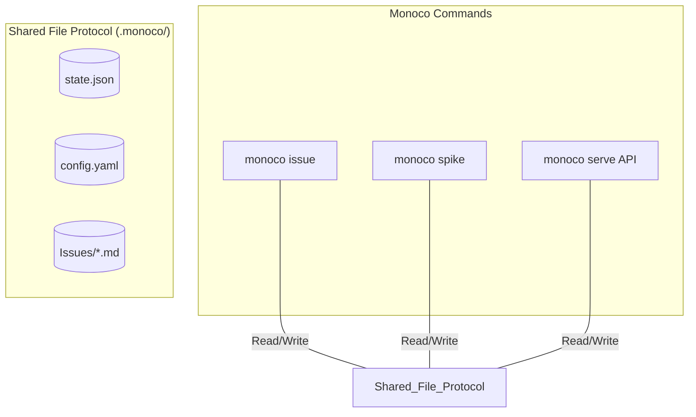

## EPIC-0013: 架构深化：基于文件协议的模块化对齐

## 背景 (Context)

**现状**：

- Monoco Toolkit 的单体架构已确立，通过 `monoco` CLI 统一入口。
- 但目前的命令实现和 API 路由在文件操作逻辑上仍存在碎片化，且部分逻辑存在跨模块耦合。
- **过度工程化风险**：需要避免陷入传统的、中心化的“核心服务层”陷阱。

**核心哲学**：

- **基石定位 (The Foundation)**：`config`, `init`, 和 `issue` 是系统的基石。它们定义了 Monoco 的物理协议（`.monoco` 结构、配置合并规则、Issue 数据 Schema）。
- **文件即协议 (File as Protocol)**：所有的工具必须通过基石层与文件系统进行交互。
- **命令自治与基石依赖**：每个子命令独立实现其功能，但必须强制依赖基石层以确保行为一致性。

## 目标 (Objective)

深化模块化设计，确保各子命令的独立性与文件行为的一致性：

1. **标准化文件 Schema**：通过 Pydantic 模型形式化 `.monoco/state.json`、`config.yaml` 和 Issue 文件的物理结构。
2. **物理行为对齐**：确保 `monoco serve` 提供的 API 和其它 CLI 命令在对同一文件进行读写时，执行完全一致的逻辑规则。
3. **彻底去中心化**：不建立上帝式的 `core.services`，保持功能模块的解耦，新功能的加入仅需适配现有的文件协议。

## 策略 (Strategy)

采用 **以文件系统为总线的模块化架构**：

## 工作包 (Work Packages / Stories)

### 1. 文件 Schema 标准化 (File Protocol Formalization)

- 提取并完善 Issues、State 和 Config 的 Pydantic 模型。
- 确保这些模型仅定义“物理存储结构”，不包含业务逻辑。
- 模块独立引用这些模型作为文件 IO 的唯一标准。

### 2. API 行为对齐与工具解耦 (Action Alignment)

- 重构 API 路由，确保其操作文件的方式与对应的独立命令完全一致。
- 清理任何非必要的跨模块代码调用，强制回归到“通过文件交换状态”的模式。

### 3. 配置加载逻辑收敛 (Config Convergence)

- 确保所有子命令启动时，均通过统一的逻辑定位最近的 `.monoco` 并加载配置。
- **配置管理 (Configuration Management)**: 实现 `monoco config` 子命令，支持规范化的 Schema 读写与 Scope 管理（FEAT-0070）。

### 4. VS Code 插件“协议适配” (Extension Realignment)

- 插件彻底移除对 Issue 文件的手动解析，仅作为 API 服务器暴露的协议内容的展示器（Proxy）。
- 插件的操作行为必须转化为标准的协议读写请求发送给服务器。

## 验收标准 (Acceptance Criteria)

- [ ] **物理共识**：所有的状态变更必须通过基石层定义的物理文件协议实现。
- [ ] **基石对齐**：`monoco` 命令行与 `serve` API 在操作 Issue、读取配置时，使用的是完全相同的基石层逻辑。
- [ ] **实时互操作**：命令行对文件系统的修改能被 `monoco serve` 实时检测并正确反映在 API 返回中。
- [ ] **插件瘦身**：VS Code 插件彻底移除对 Issue 文件的手动解析，转而通过 API 代理基石层的协议内容。
