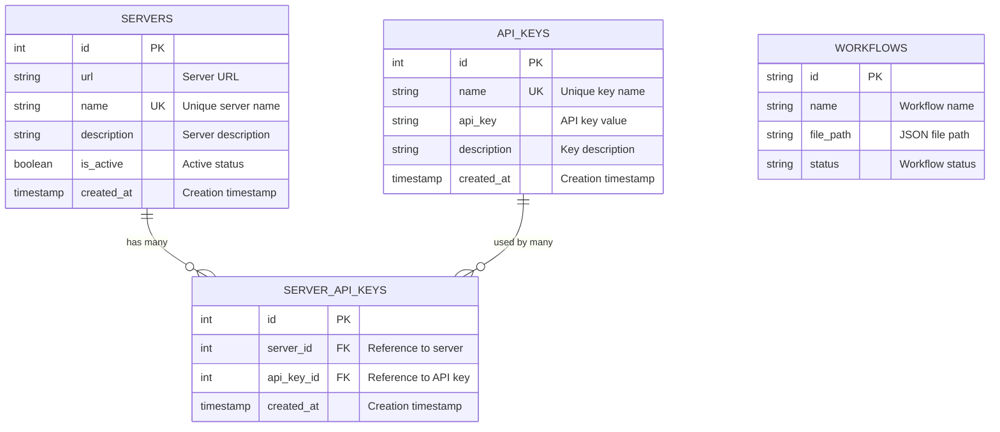

# Data Model

```mermaid
erDiagram
    SERVERS {
        int id PK
        string url "Server URL"
        string name UK "Unique server name"
        string description "Server description"
        boolean is_active "Active status"
        timestamp created_at "Creation timestamp"
    }
    API_KEYS {
        int id PK
        string name UK "Unique key name"
        string api_key "API key value"
        string description "Key description"
        timestamp created_at "Creation timestamp"
    }
    SERVER_API_KEYS {
        int id PK
        int server_id FK "Reference to server"
        int api_key_id FK "Reference to API key"
        timestamp created_at "Creation timestamp"
    }
    WORKFLOWS {
        string id PK
        string name "Workflow name"
        string file_path "JSON file path"
        string status "Workflow status"
    }
    SERVERS ||--o{ SERVER_API_KEYS : "has many"
    API_KEYS ||--o{ SERVER_API_KEYS : "used by many"
```
