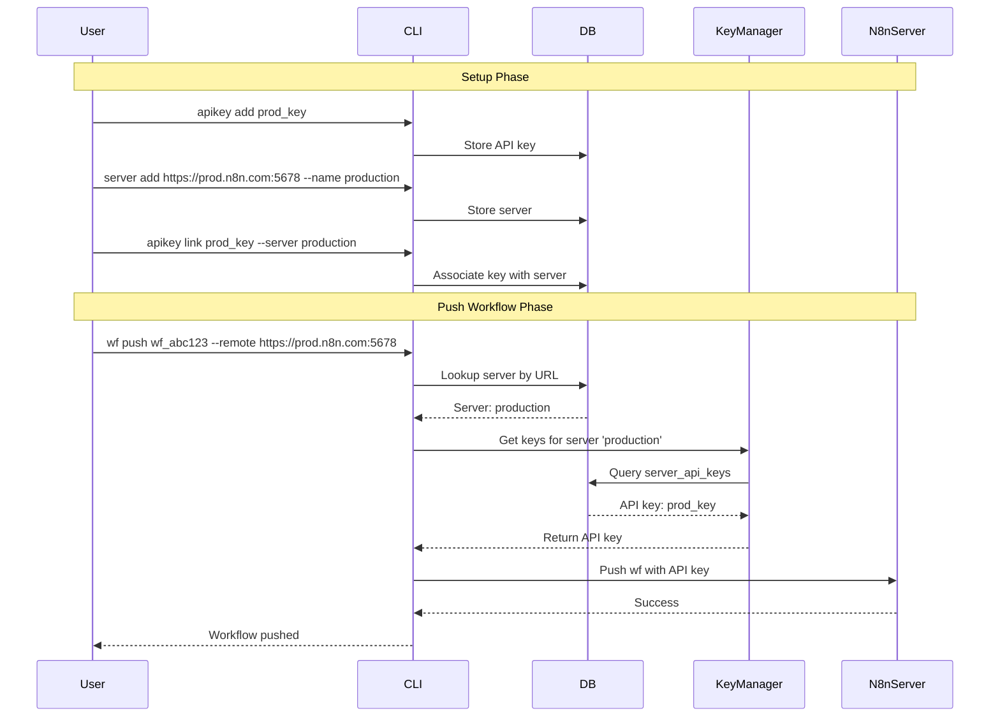

# Sequence Diagram

```mermaid
sequenceDiagram
    participant User
    participant CLI
    participant DB
    participant KeyManager
    participant N8nServer

    Note over User,N8nServer: Setup Phase
    User->>CLI: apikey add prod_key
    CLI->>DB: Store API key

    User->>CLI: server add https://prod.n8n.com:5678 --name production
    CLI->>DB: Store server

    User->>CLI: apikey link prod_key --server production
    CLI->>DB: Associate key with server

    Note over User,N8nServer: Push Workflow Phase
    User->>CLI: wf push wf_abc123 --remote https://prod.n8n.com:5678
    CLI->>DB: Lookup server by URL
    DB-->>CLI: Server: production
    CLI->>KeyManager: Get keys for server 'production'
    KeyManager->>DB: Query server_api_keys
    DB-->>KeyManager: API key: prod_key
    KeyManager-->>CLI: Return API key
    CLI->>N8nServer: Push wf with API key
    N8nServer-->>CLI: Success
    CLI-->>User: Workflow pushed
```
