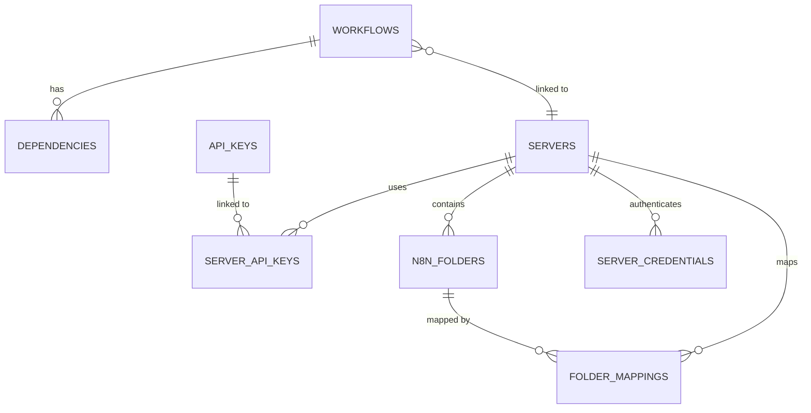

# Database Schema

Complete reference for n8n-deploy database structure and relationships.

## 📋 Schema Overview

The database consists of 10 tables organized into 4 functional groups:
1. **Workflow Management** (2 tables)
2. **Server & API Key Management** (3 tables)
3. **Folder Synchronization** (2 tables)
4. **Configuration & Schema** (3 tables)

**Current Schema Version**: 8

---

## 🗂️ Workflow Management Tables

### workflows Table

Stores workflow metadata and file references.

| Column | Type | Constraints | Description |
|--------|------|-------------|-------------|
| id | TEXT | PRIMARY KEY | n8n workflow ID (unique identifier) |
| name | TEXT | NOT NULL | Workflow display name (UTF-8 supported) |
| file | TEXT | | Custom filename (e.g., 'my-workflow.json') |
| file_folder | TEXT | NOT NULL | Directory containing workflow JSON file |
| server_id | INTEGER | FOREIGN KEY | Linked n8n server reference |
| status | TEXT | DEFAULT 'active' | Workflow status (active/inactive/archived) |
| created_at | TIMESTAMP | NOT NULL | Creation timestamp |
| updated_at | TIMESTAMP | | Last modification timestamp |
| last_synced | TIMESTAMP | | Last sync with n8n server |
| n8n_version_id | INTEGER | | n8n version identifier |
| push_count | INTEGER | DEFAULT 0 | Number of times pushed to server |
| pull_count | INTEGER | DEFAULT 0 | Number of times pulled from server |
| scripts_path | TEXT | | Remote path for workflow scripts (v7) |

**Indexes:**
- `idx_workflows_name` on `name` (for search operations)
- `idx_workflows_status` on `status` (for filtering)

### dependencies Table

Records workflow dependency relationships for graph-push functionality.

| Column | Type | Constraints | Description |
|--------|------|-------------|-------------|
| id | INTEGER | PRIMARY KEY AUTOINCREMENT | Auto-increment ID |
| workflow_id | TEXT | FOREIGN KEY | Workflow that has dependency |
| depends_on | TEXT | NOT NULL | Workflow that is depended upon |
| dependency_type | TEXT | DEFAULT 'wf' | Dependency type (workflow) |
| created_at | TIMESTAMP | DEFAULT CURRENT_TIMESTAMP | Record creation time |

**Foreign Keys:**
- `workflow_id` → `workflows.id` (CASCADE DELETE)

**Usage:** If "Workflow A" depends on "Workflow B", the row stores `workflow_id='A'` and `depends_on='B'`. This ensures B is deployed before A in graph-push operations.

---

## 🖥️ Server & API Key Management Tables

### servers Table

Stores n8n server configurations.

| Column | Type | Constraints | Description |
|--------|------|-------------|-------------|
| id | INTEGER | PRIMARY KEY AUTOINCREMENT | Auto-increment ID |
| url | TEXT | NOT NULL | Server URL (e.g., `http://n8n.example.com:5678`) |
| name | TEXT | NOT NULL UNIQUE | Server name (UTF-8, emojis supported) |
| is_active | INTEGER | DEFAULT 1 | Active status (1=active, 0=inactive) |
| skip_ssl_verify | INTEGER | DEFAULT 0 | Skip SSL verification (v8) |
| created_at | TIMESTAMP | NOT NULL | Creation timestamp |
| last_used | TIMESTAMP | | Last connection timestamp |

**Indexes:**
- `idx_servers_name` on `name` (UNIQUE)
- `idx_servers_active` on `is_active`

{: .note }
> **SSL Configuration**: Use `n8n-deploy server ssl <name> --skip-verify` to enable SSL bypass for servers with self-signed certificates.

### api_keys Table

Stores n8n API keys (plain text JWT tokens).

| Column | Type | Constraints | Description |
|--------|------|-------------|-------------|
| id | INTEGER | PRIMARY KEY AUTOINCREMENT | Auto-increment ID |
| name | TEXT | NOT NULL UNIQUE | Key identifier (UTF-8 supported) |
| api_key | TEXT | NOT NULL | Plain text n8n JWT token |
| description | TEXT | | Optional key documentation |
| created_at | TIMESTAMP | NOT NULL | Creation timestamp |
| last_used_at | TIMESTAMP | | Last usage timestamp |
| is_active | INTEGER | DEFAULT 1 | Active status (1=active, 0=inactive) |

**Indexes:**
- `idx_api_keys_name` on `name` (UNIQUE)

{: .warning }
> **Security**: API keys stored in plain text. Protect database file with `chmod 600` permissions.

### server_api_keys Table

Junction table for many-to-many relationship between servers and API keys.

| Column | Type | Constraints | Description |
|--------|------|-------------|-------------|
| server_id | INTEGER | FOREIGN KEY | Server reference |
| api_key_id | INTEGER | FOREIGN KEY | API key reference |
| created_at | TIMESTAMP | NOT NULL | Link creation timestamp |

**Primary Key:** Composite `(server_id, api_key_id)`

**Foreign Keys:**
- `server_id` → `servers.id` (CASCADE DELETE)
- `api_key_id` → `api_keys.id` (CASCADE DELETE)

**Cascade Behavior:**
- Deleting a server removes all its links (preserves API keys)
- Deleting an API key removes all its links (preserves servers)

---

## ⚙️ Configuration & Schema Tables

### configurations Table

Stores application configuration and backup metadata.

| Column | Type | Constraints | Description |
|--------|------|-------------|-------------|
| key | TEXT | PRIMARY KEY | Configuration key |
| value | TEXT | | Configuration value (backup metadata, SHA256) |
| updated_at | TIMESTAMP | | Last update timestamp |

**Common keys:**
- `last_backup_path` - Path to most recent backup
- `last_backup_checksum` - SHA256 hash of last backup
- `last_backup_timestamp` - Backup creation time

### schema_info Table

Tracks database schema version for migrations.

| Column | Type | Constraints | Description |
|--------|------|-------------|-------------|
| version | INTEGER | PRIMARY KEY | Schema version number |
| migration_script | TEXT | | SQL migration script |
| applied_at | TIMESTAMP | | Migration application timestamp |

**Current Version:** 8 (as of December 2025)

### server_credentials Table

Stores server authentication credentials.

| Column | Type | Constraints | Description |
|--------|------|-------------|-------------|
| id | INTEGER | PRIMARY KEY AUTOINCREMENT | Auto-increment ID |
| server_id | INTEGER | FOREIGN KEY | Server reference |
| credential_type | TEXT | NOT NULL | Credential type (ssh, api, etc.) |
| credential_data | TEXT | | Credential data (JSON) |
| created_at | TIMESTAMP | | Creation timestamp |

---

## 📁 Folder Synchronization Tables

### n8n_folders Table

Stores n8n folder metadata for folder sync.

| Column | Type | Constraints | Description |
|--------|------|-------------|-------------|
| id | INTEGER | PRIMARY KEY AUTOINCREMENT | Auto-increment ID |
| folder_id | TEXT | NOT NULL | n8n folder ID |
| name | TEXT | NOT NULL | Folder name |
| server_id | INTEGER | FOREIGN KEY | Server reference |
| created_at | TIMESTAMP | | Creation timestamp |

### folder_mappings Table

Maps local directories to remote n8n folders.

| Column | Type | Constraints | Description |
|--------|------|-------------|-------------|
| id | INTEGER | PRIMARY KEY AUTOINCREMENT | Auto-increment ID |
| local_path | TEXT | NOT NULL | Local directory path |
| folder_id | INTEGER | FOREIGN KEY | n8n folder reference |
| server_id | INTEGER | FOREIGN KEY | Server reference |
| created_at | TIMESTAMP | | Creation timestamp |

---

## 🔗 Relationship Diagram



**Key Relationships:**
- Workflows link to servers via `server_id` for automatic server resolution
- Servers have SSL configuration (`skip_ssl_verify`) for self-signed certificates
- Servers and API keys have many-to-many relationship via junction table
- Folder mappings connect local paths to remote n8n folders

---

## 🔄 Schema Migrations

Schema changes are tracked via the `schema_info` table. Each migration increments the version number.

**Migration process:**
1. Check current schema version
2. Apply incremental migrations if needed
3. Record migration in `schema_info`
4. Verify integrity

**Example migration check:**

```bash
# Check current schema version
sqlite3 n8n-deploy.db "SELECT version FROM schema_info ORDER BY version DESC LIMIT 1;"
```

---

## 📖 Related Documentation

- [Database Operations](operations/) - Initialize, backup, compact
- [Troubleshooting](troubleshooting/) - Common issues
- [Developer Guide](../../../developers/database/) - Developer schema reference
- [DevOps Guide](../../../devops-guide/) - Advanced automation

---

## 💡 Schema Design Principles

1. **Simplicity**: Minimal normalization for performance
2. **UTF-8 Support**: International characters in names
3. **Plain Text Keys**: No encryption complexity
4. **Cascade Deletes**: Automatic cleanup of relationships
5. **Timestamps**: Track creation and usage
6. **Versioning**: Schema evolution via migrations
7. **Integrity**: Foreign key constraints enforced
