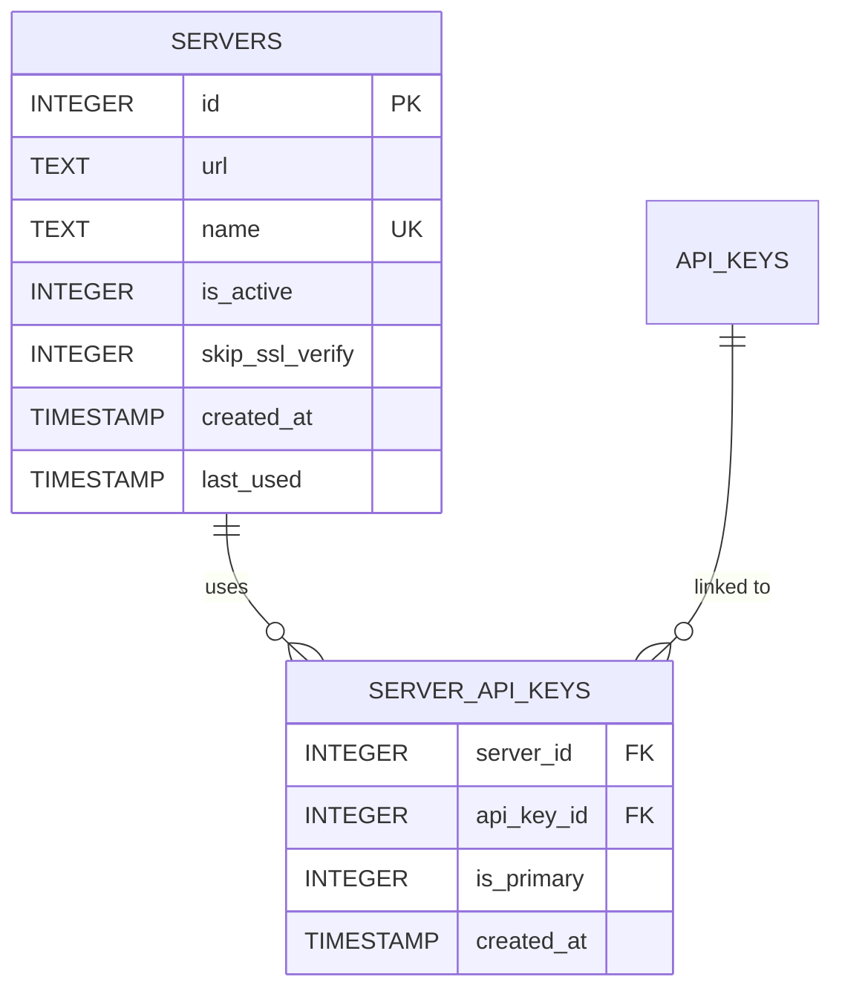

# Server Management

n8n-deploy enables management of multiple n8n server connections, each with dedicated API keys and configurations for seamless multi-environment workflows.

## 🎯 Overview

Server management in n8n-deploy provides:
- **Multi-Server Support**: Connect to development, staging, and production n8n instances
- **Server-Key Linking**: Associate specific API keys with servers
- **SSL Configuration**: Per-server SSL verification settings for self-signed certificates
- **UTF-8 Names**: Use descriptive names with international characters and emojis
- **Active/Inactive States**: Toggle server availability without deletion
- **Centralized Configuration**: All servers managed from single database

---

## 🏗️ Database Schema



**Relationships:**
- Servers can have multiple API keys (one-to-many)
- API keys can be linked to multiple servers (many-to-many)
- Deleting a server cascades to `server_api_keys` but preserves `api_keys`

---

## 📖 Documentation Sections

### [Server Operations](operations/)
Create, list, and manage n8n server configurations.

**Topics:**
- Create new servers with UTF-8 names
- List servers with filtering
- View API keys linked to servers
- Remove servers with cleanup options

### [Server-Key Linking](linking/)
Associate API keys with servers for authentication.

**Topics:**
- Link keys during server creation
- Link keys during API key creation
- Multi-key scenarios for different access levels
- Unlink and relink keys

### [Troubleshooting](troubleshooting/)
Common server management issues and solutions.

**Topics:**
- Server already exists errors
- Connection refused issues
- No API keys linked warnings
- Server not found errors

---

## 🚀 Quick Commands

| Operation | Command |
|-----------|---------|
| Create server | `n8n-deploy server create "Name" URL` |
| List servers | `n8n-deploy server list` |
| Active servers | `n8n-deploy server list --active` |
| Server keys | `n8n-deploy server keys "Name"` |
| Skip SSL verify | `n8n-deploy server ssl "Name" --skip-verify` |
| Enable SSL verify | `n8n-deploy server ssl "Name" --verify` |
| Remove server | `n8n-deploy server remove "Name"` |
| JSON output | `n8n-deploy server list --json` |

---

## 💡 Quick Examples

### Create Server with Emoji

```bash
n8n-deploy server create "Production 🚀" https://n8n-prod.company.com
n8n-deploy server create "Staging 🧪" http://n8n-staging:5678
n8n-deploy server create "Dev 🔧" http://localhost:5678
```

### Link API Key to Server

```bash
# Create server
n8n-deploy server create "QA Server" http://n8n-qa:5678

# Add and link API key
echo "$QA_API_KEY" | n8n-deploy apikey add - --name qa_key --server "QA Server"
```

### Configure SSL for Self-Signed Certificates

```bash
# Disable SSL verification for server with self-signed cert
n8n-deploy server ssl "Production 🚀" --skip-verify

# Re-enable SSL verification
n8n-deploy server ssl "Production 🚀" --verify
```

### List Active Servers

```bash
# Rich output
n8n-deploy server list --active

# JSON for scripts
n8n-deploy server list --active --json
```

---

## 📖 Related Documentation

- [API Key Management](../apikeys/) - Manage authentication keys
- [Workflow Management](../workflows/) - Push/pull workflows using servers
- [DevOps Guide](../../devops-guide/) - CI/CD automation
- [Configuration](../../configuration/) - Environment variables
- [Troubleshooting](../../troubleshooting/) - Common issues

---

**Last Updated**: October 2025
**Feature Status**: Stable (v2.x)
