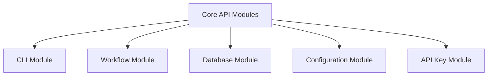

# API Reference

{: .warning }
> This reference provides detailed information about n8n-deploy's core API modules.

## Module Structure



## CLI Module (`api.cli`)

### Entry Points
- `app.py`: Main CLI application
- Supports global flags and configuration

#### Key Functions
```python
def initialize_database(app_dir: str, force: bool = False) -> None:
    """Initialize the SQLite database."""
    pass

def list_workflows(config: Config) -> List[Workflow]:
    """List available workflows."""
    pass
```

## Workflow Module (`api.workflow`)

### Core Classes
```python
class WorkflowManager:
    """Manages workflow operations."""
    def add_workflow(self, workflow_path: str) -> Workflow:
        """Add a new workflow to the database."""
        pass

    def delete_n8n_workflow(self, workflow_id: str) -> bool:
        """Delete workflow from n8n server and local database."""
        pass

    def sync_workflow(self, workflow_name: str) -> SyncResult:
        """Synchronize workflow with n8n server."""
        pass
```

## Database Module (`api.database`)

### Schema and Operations
```python
class DatabaseManager:
    """Manages SQLite database operations."""
    def init_database(self, path: str) -> None:
        """Initialize database with schema."""
        pass

    def backup_database(self, destination: str) -> BackupResult:
        """Create a database backup."""
        pass

    def restore_database(self, backup_path: str) -> None:
        """Restore database from backup."""
        pass
```

## Configuration Module (`api.config`)

### Configuration Resolution
```python
def get_config(
    base_folder: Optional[str] = None,
    flow_folder: Optional[str] = None
) -> Config:
    """Resolve configuration from multiple sources."""
    pass

class Config:
    """Configuration management."""
    app_dir: str
    flow_dir: str
    server_url: Optional[str]
```

## API Key Module (`api.apikey`)

### Key Management
```python
def add_api_key(
    key: str,
    description: Optional[str] = None
) -> APIKey:
    """Add a new API key."""
    pass

def list_api_keys() -> List[APIKey]:
    """List all stored API keys."""
    pass

def delete_api_key(key_id: str) -> bool:
    """Delete an API key."""
    pass
```

## Type Definitions

```python
from typing import TypedDict, Optional, List

class Workflow(TypedDict):
    """Workflow metadata structure."""
    id: str
    name: str
    file_path: str
    status: str
    tags: List[str]

class APIKey(TypedDict):
    """API key metadata structure."""
    id: str
    key: str
    description: Optional[str]
    created_at: str
```

## Error Handling

{: .warning }
> All modules use clean, descriptive error messages.

### Common Exceptions
- `DatabaseInitializationError`
- `WorkflowNotFoundError`
- `APIKeyValidationError`

{: .tip }
> Error messages are designed to be user-friendly and actionable.

## Environment Variables

```python
# Supported environment variables
N8N_DEPLOY_FLOWS_DIR: str       # Workflow directory
N8N_DEPLOY_DATA_DIR: str        # Application data directory
N8N_SERVER_URL: str            # n8n server URL
N8N_DEPLOY_TESTING: str        # Testing mode flag
```

{: .note }
> "Good API design is about managing complexity through abstraction." — Unknown
