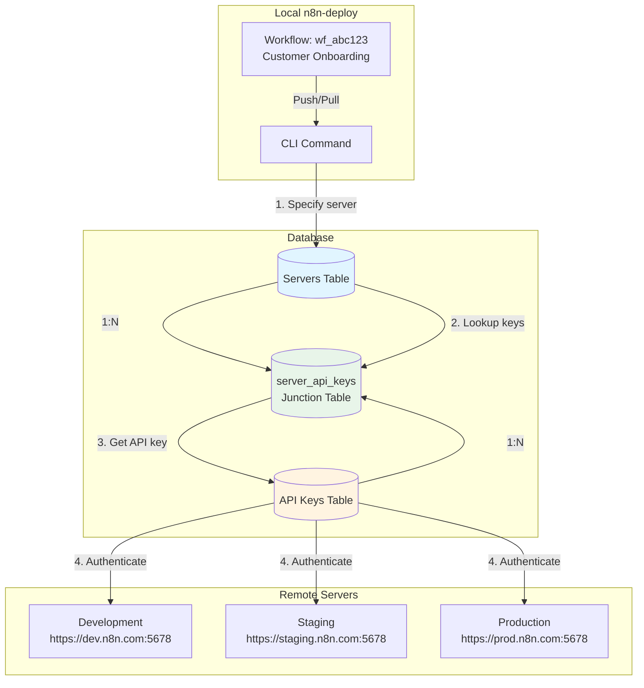

# API Key Management Flow

```mermaid
graph TB
    subgraph "Local n8n-deploy"
        WF[Workflow: wf_abc123<br/>Customer Onboarding]
        CLI[CLI Command]
    end

    subgraph "Database"
        SERVERS[(Servers Table)]
        KEYS[(API Keys Table)]
        ASSOC[(server_api_keys<br/>Junction Table)]

        SERVERS -->|"1:N"| ASSOC
        KEYS -->|"1:N"| ASSOC
    end

    subgraph "Remote Servers"
        DEV[Development<br/>https://dev.n8n.com:5678]
        STAGE[Staging<br/>https://staging.n8n.com:5678]
        PROD[Production<br/>https://prod.n8n.com:5678]
    end

    CLI -->|"1. Specify server"| SERVERS
    SERVERS -->|"2. Lookup keys"| ASSOC
    ASSOC -->|"3. Get API key"| KEYS
    KEYS -->|"4. Authenticate"| DEV
    KEYS -->|"4. Authenticate"| STAGE
    KEYS -->|"4. Authenticate"| PROD
    WF -->|"Push/Pull"| CLI

    style SERVERS fill:#e1f5ff
    style KEYS fill:#fff4e1
    style ASSOC fill:#e8f5e9
```
