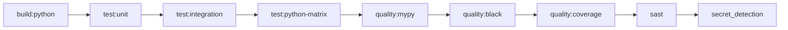

# CI/CD Pipeline Troubleshooting

> "If debugging is the process of removing software bugs, then programming must be the process of putting them in." — Edsger Dijkstra

This guide helps diagnose and resolve common CI/CD pipeline issues in the n8n-deploy project.

## Pipeline Architecture

n8n-deploy uses an **MR-only workflow** pattern to reduce resource usage:

- **Merge Requests to master**: Full validation pipeline
- **Master branch**: Deployment pipeline
- **Tags**: Release pipeline

## Common Issues

### Test Failures

#### Permission-Related Test Failures

**Symptom**: Tests pass locally but fail in GitLab CI

**Cause**: CI runs in Docker containers with elevated permissions (often root)

**Solution**:
```python
# Bad - may fail in CI
def test_directory_creation_failure():
    with pytest.raises(PermissionError):
        Path("/nonexistent/path").mkdir(parents=True)

# Good - works in all environments
def test_directory_creation_failure():
    with pytest.raises(OSError):
        Path("/dev/null/invalid_path").mkdir(parents=True)
```

{: .tip }
> Use `/dev/null/invalid_path` for reliable failure testing across environments.

#### Test Environment Variables

**Symptom**: Default workflow initialization interferes with tests

**Solution**: Set `N8N_DEPLOY_TESTING=1` in test commands

```yaml
# .gitlab-ci.yml
test:unit:
  script:
    - N8N_DEPLOY_TESTING=1 python -m pytest tests/unit/
```

### Build Issues

#### Missing Dependencies

**Symptom**: Import errors during CI build

**Cause**: Requirements not installed or cached incorrectly

**Solution**:
```bash
# Clear cache and reinstall
rm -rf .venv/
python -m venv .venv
source .venv/bin/activate
pip install -r requirements.txt
```

#### Type Checking Failures

**Symptom**: `mypy` errors in CI but not locally

**Cause**: Missing type stubs or version mismatch

**Solution**:
```bash
# Install type stubs
pip install types-requests types-setuptools

# Run strict mode locally
mypy api/ --strict
```

### Docker Container Issues

#### APT Proxy Timeout

**Symptom**: Package installation hangs or times out

**Cause**: APT proxy (`apt.pirouter.dev:3142`) unavailable

**Solution**:
```yaml
# Temporarily disable proxy
before_script:
  - apt-get update  # Without proxy configuration
```

#### Container Permission Conflicts

**Symptom**: File permissions differ between local and CI

**Solution**: Design tests to be permission-agnostic
- Use temporary directories with `pytest` fixtures
- Avoid hard-coded paths
- Clean up test artifacts

### Pipeline Performance

#### Slow Test Execution

**Optimization strategies**:

1. **Parallel Testing**
   ```bash
   pytest tests/ -n auto  # Use pytest-xdist
   ```

2. **Cache Dependencies**
   ```yaml
   cache:
     paths:
       - .venv/
       - .cache/pip/
   ```

3. **Run Tests Horizontally**
   - Test all parameters for one command
   - Move to next command
   - Exit on first failure (`-x` flag)

### Artifact Issues

#### Missing Test Reports

**Symptom**: Test artifacts not uploaded

**Cause**: Artifact paths incorrect or tests didn't run

**Solution**:
```yaml
artifacts:
  when: always  # Upload even on failure
  paths:
    - test-results/
    - coverage/
  expire_in: 1 week
```

## Pipeline Stages

### Validation Jobs (MR to Master)



**Troubleshooting Steps**:

1. **Check Job Logs**: Click failed job in GitLab UI
2. **Verify Environment**: Check Python version, dependencies
3. **Local Reproduction**: Run exact CI command locally
4. **Isolate Issue**: Run specific test file or class

### Deployment Jobs (Master + Tags)

**Common Issues**:

- **Docker Build Failures**: Check Dockerfile syntax
- **Package Upload Errors**: Verify PyPI credentials
- **Cache Issues**: Clear and rebuild

### Release Jobs (Tags Only)

**Manual PyPI Upload**:

```bash
# Verify package locally
python -m build
pip install dist/*.whl

# Test installation
n8n-deploy --help
```

## Debugging Techniques

### Retrieve Job Trace

```bash
# Using GitLab API
curl -H "PRIVATE-TOKEN: your_token" \
  "https://gitlab.pirouter.dev:8443/api/v4/projects/9/jobs/JOB_ID/trace"
```

### Local Pipeline Simulation

```bash
# Run exact CI commands locally
docker run --rm -it python:3.11 bash
cd /workspace
git clone your_repo
# Run CI script commands
```

### Enable Debug Logging

```yaml
variables:
  CI_DEBUG_TRACE: "true"  # GitLab runner debug mode
```

## Environment-Specific Configuration

### GitLab CI Variables

Set in: **Settings → CI/CD → Variables**

Required variables:
- `PYPI_TOKEN`: PyPI authentication token
- `TEST_PYPI_TOKEN`: Test PyPI token (optional)

### Runner Tags

Jobs require specific runner tags:
- `python`: Python-based tasks
- `docker`: Docker image builds

{: .warning }
> Ensure runners with these tags are available and active.

## Best Practices

1. **Test Locally First**: Run full test suite before pushing
2. **Use Fail-Fast**: Exit on first failure with `-x` flag
3. **Monitor Cache**: Clear stale cache if issues persist
4. **Review Logs**: Check full job output, not just summaries
5. **Incremental Fixes**: Fix one issue at a time

## Getting Help

If issues persist:

1. **Check Pipeline History**: Compare with successful runs
2. **Review Recent Changes**: Look for related code modifications
3. **Consult Documentation**: [GitLab CI/CD Docs](https://docs.gitlab.com/ee/ci/)
4. **Open Issue**: Provide job logs and reproduction steps

{: .note }
> "The most effective debugging tool is still careful thought, coupled with judiciously placed print statements." — Brian Kernighan

---

**Remember**: CI/CD failures are opportunities to improve test reliability and code quality.
