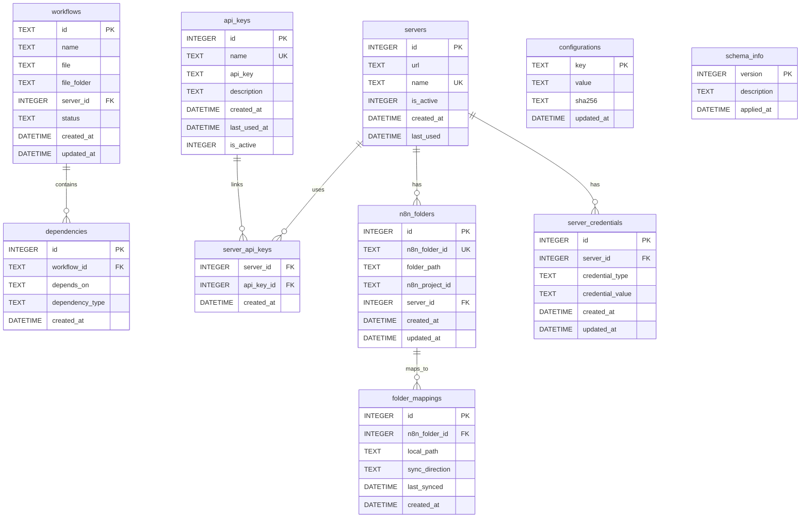

# Database Schema

{: .warning }
> Detailed overview of n8n-deploy's SQLite database structure and management.

## Schema Overview

n8n-deploy uses a lightweight, efficient SQLite database (schema v6) to manage workflow metadata, configurations, and folder synchronization.

### Database Tables (Schema v6)



## Table Descriptions

### 1. `workflows` Table
- **Purpose**: Store workflow metadata
- **Key Fields**:
  - `id`: Unique workflow identifier
  - `name`: Workflow display name
  - `file_path`: Path to workflow JSON
  - `status`: Current workflow status
  - `tags`: User-defined tags
  - `created_at`: Creation timestamp
  - `updated_at`: Last modification timestamp

### 2. `api_keys` Table
- **Purpose**: Store n8n server API keys for authentication
- **Key Fields**:
  - `id`: Auto-increment primary key
  - `name`: Unique key identifier (UTF-8 supported)
  - `api_key`: Plain-text n8n JWT token
  - `description`: Optional key documentation
  - `created_at`: Key creation timestamp
  - `last_used_at`: Last usage timestamp
  - `is_active`: Active status (1=active, 0=inactive)

### 3. `servers` Table
- **Purpose**: Store n8n server configurations
- **Key Fields**:
  - `id`: Auto-increment primary key
  - `url`: Server URL (e.g., `http://n8n.example.com:5678`)
  - `name`: Unique server name (UTF-8 supported, emojis allowed)
  - `is_active`: Active status (1=active, 0=inactive)
  - `created_at`: Server creation timestamp
  - `last_used`: Last connection timestamp

### 4. `server_api_keys` Junction Table
- **Purpose**: Many-to-many relationship between servers and API keys
- **Key Fields**:
  - `server_id`: Foreign key to servers.id (CASCADE DELETE)
  - `api_key_id`: Foreign key to api_keys.id (CASCADE DELETE)
  - `created_at`: Link creation timestamp
- **Composite Primary Key**: (server_id, api_key_id)

### 5. `configurations` Table
- **Purpose**: Store application configurations
- **Key Fields**:
  - `key`: Configuration key
  - `value`: Configuration value
  - `updated_at`: Last update timestamp

### 6. `dependencies` Table
- **Purpose**: Store workflow dependency relationships for graph-push functionality
- **Key Fields**:
  - `id`: Auto-increment primary key
  - `workflow_id`: The workflow that has a dependency (foreign key to workflows.id)
  - `depends_on`: The workflow that is depended upon (ID of required workflow)
  - `dependency_type`: Type of dependency (default: 'wf' for workflow)
  - `created_at`: Timestamp when dependency was recorded

**Usage**: Enables future graph-push feature where workflows are deployed in correct dependency order. For example, if "Workflow A" depends on "Workflow B", a row would have `workflow_id='A'` and `depends_on='B'`, ensuring B is pushed before A.

### 7. `schema_info` Table
- **Purpose**: Track database schema versions
- **Key Fields**:
  - `version`: Current schema version number
  - `description`: Human-readable version description
  - `applied_at`: Migration timestamp

### 8. `n8n_folders` Table (v6)
- **Purpose**: Store n8n server folder metadata for folder sync
- **Key Fields**:
  - `id`: Auto-increment primary key
  - `n8n_folder_id`: Unique identifier from n8n server
  - `folder_path`: Full path on n8n server (e.g., `project/subfolder`)
  - `n8n_project_id`: Project identifier on n8n server
  - `server_id`: Foreign key to servers.id
  - `created_at`: Record creation timestamp
  - `updated_at`: Last update timestamp

### 9. `folder_mappings` Table (v6)
- **Purpose**: Store local-to-remote folder mappings for sync
- **Key Fields**:
  - `id`: Auto-increment primary key
  - `n8n_folder_id`: Foreign key to n8n_folders.id
  - `local_path`: Absolute path to local directory
  - `sync_direction`: One of `push`, `pull`, or `bidirectional`
  - `last_synced`: Last successful sync timestamp
  - `created_at`: Mapping creation timestamp

### 10. `server_credentials` Table (v6)
- **Purpose**: Store server authentication credentials for internal API
- **Key Fields**:
  - `id`: Auto-increment primary key
  - `server_id`: Foreign key to servers.id
  - `credential_type`: Type of credential (e.g., `cookie`, `session`)
  - `credential_value`: Encrypted/stored credential value
  - `created_at`: Creation timestamp
  - `updated_at`: Last update timestamp

## Schema Versioning

```python
# Example schema version management
SCHEMA_VERSION = 6  # Current database schema version

def check_schema_version(current_version: int) -> bool:
    """Check and potentially migrate database schema."""
    if current_version < SCHEMA_VERSION:
        apply_migrations(current_version)
    return True
```

## Migration Strategies

{: .tip }
> Migrations are designed to be backward-compatible and non-destructive.

### Migration Principles
1. Incremental version updates
2. Preserve existing data
3. Minimal downtime
4. Rollback support

### Migration Example
```python
def migrate_v1_to_v2():
    """Example migration script."""
    # Add new columns
    # Populate with default values
    # Maintain data integrity
```

## Best Practices

1. Always backup database before migrations
2. Test migrations in isolated environments
3. Use transactions for migration safety
4. Provide clear migration path

{: .warning }
> Improper migrations can lead to data loss.

## Performance Considerations

- Indexes on frequently queried columns
- Minimal normalization for speed
- SQLite-specific optimization techniques

### Indexing Strategy
```sql
-- Example index creation
CREATE INDEX idx_workflows_name ON workflows(name);
CREATE INDEX idx_api_keys_created_at ON api_keys(created_at);
```

## Security Notes

{: .note }
> "Security is not a product, but a process." — Bruce Schneier

- No encryption of stored keys
- File-level permissions critical
- Recommend restrictive file modes (600)

## Backup and Recovery

```bash
# Backup database
n8n-deploy db backup

# Restore from backup
n8n-deploy db restore backup_file.db
```

{: .tip }
> Regular backups are your best defense against data loss.