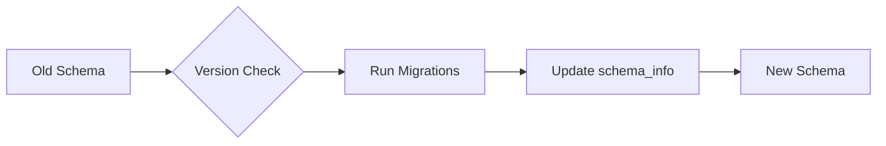

# Migration Guide

> "Change is the only constant in software development." — Heraclitus (adapted)

This guide helps you migrate between n8n-deploy versions and handle database schema changes.

## Version 2.0.0 → Latest

### Breaking Changes

#### WorkflowType Removal

**What changed**: The `WorkflowType` enum and `type` field were completely removed from the database schema.

**Why**: Simplified architecture focuses on workflow metadata without categorization.

**Migration steps**:

```bash
# Backup existing database
n8n-deploy db backup --name "pre-upgrade-backup"

# Upgrade n8n-deploy
pip install --upgrade n8n-deploy

# Database will auto-migrate on first use
n8n-deploy db status
```

{: .note }
> Schema migrations are automatic. The database version is tracked in the `schema_info` table.

#### API Key Simplification

**What changed**: Removed service categorization, key hashing, and master key rotation.

**Migration**:
- Existing API keys remain functional
- Service field ignored (no action needed)
- Keys stored in plain text (always were)

### Configuration Changes

#### Environment Variable Renaming

**Updated variable names**:

| Old (Pre-2.0) | New (2.0+) | Purpose |
|---------------|------------|---------|
| `ELEKTRONIK_FLOW_DIR` | `N8N_DEPLOY_FLOWS_DIR` | Workflow directory |
| `ELEKTRONIK_APP_DIR` | `N8N_DEPLOY_DATA_DIR` | Application data directory |
| `ELEKTRONIK_TESTING` | `N8N_DEPLOY_TESTING` | Testing mode flag |

**Migration script**:

```bash
# Update environment file
sed -i 's/ELEKTRONIK_/N8N_DEPLOY_/g' ~/.env

# Or manually update
cat > ~/.env << EOF
N8N_DEPLOY_FLOWS_DIR=$HOME/workflows
N8N_DEPLOY_DATA_DIR=$HOME/.n8n-deploy
N8N_SERVER_URL=https://n8n.example.com
EOF
```

#### Database File Rename

**Old location**: `elektronik.db`
**New location**: `n8n-deploy.db`

**Migration**:

```bash
# Backup old database
cp ~/.n8n-deploy/elektronik.db ~/.n8n-deploy/elektronik.db.backup

# Rename database file
mv ~/.n8n-deploy/elektronik.db ~/.n8n-deploy/n8n-deploy.db

# Verify migration
n8n-deploy db status
```

### CLI Command Changes

#### Database Initialization

**Old syntax** (deprecated):
```bash
n8n-deploy db init --force
```

**New syntax**:
```bash
n8n-deploy db init --import
```

{: .tip }
> `--import` flag accepts existing databases without prompting, replacing old `--force` behavior.

#### Workflow Commands

**UTF-8 Support**: Workflow names now fully support Unicode characters.

```bash
# Now supported
n8n-deploy wf add "Customer Onboarding 🚀"
n8n-deploy wf add "データ処理ワークフロー"
n8n-deploy wf add "Processus de données"
```

## Database Migration

### Automatic Schema Migration

n8n-deploy automatically migrates database schema on version upgrade:



**Migration process**:

1. Detect current schema version
2. Apply incremental migrations
3. Update `schema_info` table
4. Verify integrity

### Manual Migration

If automatic migration fails, perform manual migration:

```bash
# 1. Backup database
n8n-deploy db backup --name "manual-migration"

# 2. Export workflows
sqlite3 ~/.n8n-deploy/n8n-deploy.db << EOF
.mode csv
.headers on
.output workflows_export.csv
SELECT * FROM workflows;
.quit
EOF

# 3. Reinitialize database
mv ~/.n8n-deploy/n8n-deploy.db ~/.n8n-deploy/n8n-deploy.db.old
n8n-deploy db init

# 4. Re-import workflows (if needed)
# Custom script based on your workflow structure
```

### Verify Migration

```bash
# Check database schema version
sqlite3 ~/.n8n-deploy/n8n-deploy.db "SELECT * FROM schema_info;"

# Verify workflow count
n8n-deploy wf list | wc -l

# Compare with backup
n8n-deploy db status
```

## Workflow File Migration

### File Location Changes

**No changes required** - workflow files remain in the same location:

```
/your/flow/dir/
├── deAVBp391wvomsWY.json  # Workflow files remain unchanged
├── kL9mX2pQ7rYtN4zW.json
└── vT8hR5nM1xKwP6qZ.json
```

### File Format Changes

Workflow JSON format follows n8n server standards. No migration needed unless n8n server version changes.

## Configuration Migration

### From Monolithic to Modular Architecture

**Pre-2.0 import paths**:
```python
from api.cli import main
from api.manager import WorkflowManager
from api.n8n_deploy_db import n8n_deploy_DB
```

**Post-2.0 import paths**:
```python
from api.cli.app import main
from api.workflow_manager import WorkflowManager
from api.database.core import n8n_deploy_DB
```

{: .warning }
> If you have custom scripts importing n8n-deploy modules, update import paths.

### Environment File Migration

**Create `.env` from `.env.example`**:

```bash
# Copy template
cp .env.example .env

# Edit with your configuration
nano .env
```

**.env structure**:

```bash
# Environment mode (development enables .env loading)
ENVIRONMENT=development

# Directory configuration
N8N_DEPLOY_FLOWS_DIR=/path/to/workflows
N8N_DEPLOY_DATA_DIR=/path/to/app/data

# Server configuration
N8N_SERVER_URL=https://n8n.example.com

# Testing (only for test environments)
# N8N_DEPLOY_TESTING=1
```

## Test Migration

### Test File Organization

**Old structure**:
```
tests/
├── test_cli.py
├── test_manager.py
└── test_n8n_deploy_db.py
```

**New modular structure**:
```
tests/
├── unit/
│   ├── cli/
│   ├── database/
│   └── workflow/
├── integration/
│   ├── cli/
│   ├── database/
│   └── workflow/
└── e2e/
```

{: .note }
> If you have custom tests, reorganize them to match the modular structure.

## Rollback Procedure

If migration fails, rollback to previous version:

```bash
# 1. Restore database from backup
n8n-deploy db restore "pre-upgrade-backup"

# 2. Downgrade n8n-deploy
pip install n8n-deploy==2.0.0

# 3. Verify functionality
n8n-deploy db status
n8n-deploy wf list
```

## Post-Migration Checklist

- [ ] Database schema version matches latest
- [ ] All workflows listed correctly
- [ ] API keys functional
- [ ] Server connectivity working
- [ ] Backups accessible
- [ ] Environment variables updated
- [ ] Custom scripts updated (if any)

## Common Migration Issues

### Database Lock Errors

**Symptom**: `database is locked` error

**Solution**:
```bash
# Close all n8n-deploy processes
pkill -f n8n-deploy

# Check for locks
lsof ~/.n8n-deploy/n8n-deploy.db

# Retry migration
n8n-deploy db status
```

### Missing Workflows After Migration

**Symptom**: Workflows missing from database

**Solution**:
```bash
# Sync workflows from file system
n8n-deploy wf sync

# Re-pull from server
n8n-deploy --server-url https://n8n.example.com wf pull --all
```

### Permission Errors

**Symptom**: Cannot write to database

**Solution**:
```bash
# Fix file permissions
chmod 644 ~/.n8n-deploy/n8n-deploy.db
chmod 755 ~/.n8n-deploy/

# Verify ownership
ls -la ~/.n8n-deploy/
```

## Version-Specific Notes

### v2.0.0 (Initial Modular Release)

- Complete architectural refactoring
- WorkflowType removed
- Modular CLI structure
- Strict type checking enforced

### v2.1.0+ (Current)

- UTF-8 workflow name support
- Enhanced testing framework
- Property-based testing with Hypothesis
- CI/CD pipeline improvements
- Development `.env` file support

## Getting Help

If you encounter migration issues:

1. **Check logs**: Review error messages carefully
2. **Consult FAQ**: [Troubleshooting Guide](../troubleshooting/)
3. **Backup first**: Always backup before troubleshooting
4. **Open issue**: Provide version info and error logs

---

{: .tip }
> Plan migrations during low-traffic periods and always test in a staging environment first.
