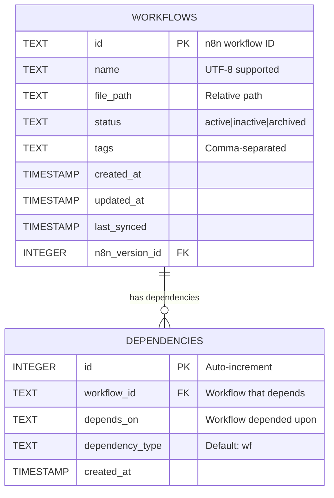
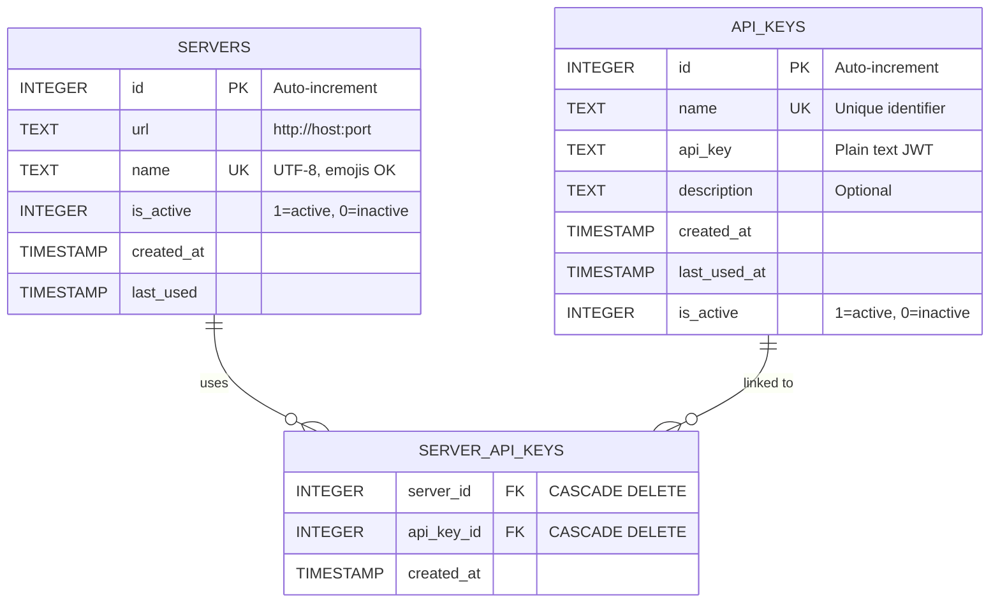
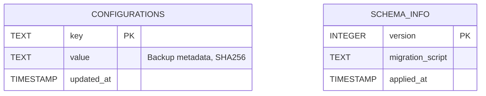

# Database Management

n8n-deploy uses SQLite as its metadata store, providing a reliable, efficient, and portable solution for managing workflows, API keys, and server configurations.

## 🎯 Database Overview

The n8n-deploy database serves as the single source of truth for:
- **Workflow Metadata**: Workflow files, sync status, and version information
- **API Keys**: n8n server authentication credentials
- **Server Configurations**: Multiple n8n server connections
- **Backup History**: Database backup operations with SHA256 verification

---

## 📊 Database Architecture

### 1. Workflow Management

### 2. Server & API Key Management

### 3. Configuration & Schema Tracking

---

## 🗂️ Schema Details

**1. Workflow Management** - Core workflow management with dependency relationships
- **workflows** - Workflow metadata with UTF-8 names, file paths, status, and sync management
- **dependencies** - Records which workflows depend on other workflows. Each row stores `workflow_id` (the workflow that has a dependency) and `depends_on` (the workflow it depends upon). Used for future graph-push functionality to deploy workflows in correct order.

**2. Server & API Key Management** - Multi-server authentication system
- **servers** - n8n server configurations (UTF-8 names, emojis supported)
- **api_keys** - Plain text JWT tokens with lifecycle management
- **server_api_keys** - Many-to-many junction table with CASCADE delete

**3. Configuration & Schema** - System metadata and versioning
- **configurations** - Backup metadata with SHA256 integrity checksums
- **schema_info** - Database version management for migration processes

{: .warning }
> **Security**: API keys stored in plain text. Protect database with `chmod 600` permissions.

---

## 📖 Documentation Sections

### [Database Operations](operations/)
Learn how to initialize, manage, backup, and compact your database.

**Topics:**
- Initialize new databases
- Check database status
- Create backups with SHA256 verification
- Compact and optimize storage

### [Schema Reference](schema/)
Detailed database schema documentation and relationships.

**Topics:**
- Table structures and fields
- Foreign key relationships
- Indexes and constraints
- Schema versioning

### [Troubleshooting](troubleshooting/)
Common database issues and solutions.

**Topics:**
- Database locked errors
- Corrupted database recovery
- Missing database initialization
- Performance optimization

---

## 🚀 Quick Commands

| Operation | Command |
|-----------|---------|
| Initialize | `n8n-deploy db init` |
| Status | `n8n-deploy db status` |
| Backup | `n8n-deploy db backup` |
| Compact | `n8n-deploy db compact` |

---

## 📖 Related Documentation

- [Getting Started](../../getting-started/) - Initial setup guide
- [Server Management](../core-features/servers/) - Configure n8n servers
- [API Key Management](../core-features/apikeys/) - Manage authentication
- [DevOps Guide](../../devops-guide/) - CI/CD automation
- [Configuration](../../configuration/) - Environment variables

---

**Last Updated**: October 2025
**Schema Version**: 2.0
