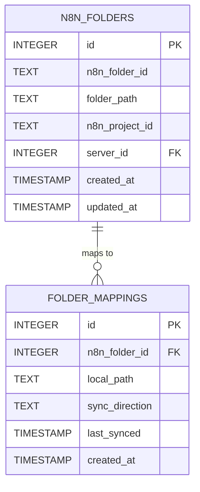

# Folder Synchronization

n8n-deploy v0.2.0 introduces folder synchronization, enabling bidirectional sync between local directories and n8n server folders.

## Overview

Folder synchronization provides:
- **Bidirectional Sync**: Push and pull entire folders of workflows
- **Folder Mappings**: Create persistent links between local and remote folders
- **Internal API Integration**: Uses n8n's internal REST API for folder operations
- **Cookie-based Authentication**: Secure session-based auth for folder access

---

## Authentication

Folder operations require authentication with the n8n server's internal API (cookie-based).

### Using Email/Password

```bash
n8n-deploy folder auth myserver --email user@example.com --password "secret"
```

### Using Session Cookie

Extract the session cookie from your browser:

1. Log in to your n8n web interface
2. Open browser DevTools (F12 or right-click → Inspect)
3. Go to **Application** tab (Chrome/Edge) or **Storage** tab (Firefox)
4. Expand **Cookies** → select your n8n domain
5. Find the `n8n-auth` cookie and copy its value

```bash
n8n-deploy folder auth myserver --cookie "n8n-auth=eyJhbGciOi..."
```

{: .tip }
> The cookie method is useful when your n8n instance uses SSO or external authentication that doesn't support email/password login.

---

## Commands Reference

### folder auth

Authenticate with n8n server for folder operations.

```bash
n8n-deploy folder auth SERVER_NAME [OPTIONS]

Options:
  --email TEXT          n8n account email
  --password TEXT       n8n account password
  --cookie TEXT         Session cookie (alternative to email/password)
  --skip-ssl-verify     Skip SSL certificate verification
```

### folder list

List folders on the n8n server.

```bash
n8n-deploy folder list [OPTIONS]

Options:
  --remote TEXT    Server name
  --json           Output as JSON
```

**Example:**

```bash
# List all folders on production server
n8n-deploy folder list --remote production

# JSON output for scripting
n8n-deploy folder list --remote production --json
```

### folder map

Create a persistent mapping between a local directory and an n8n folder.

```bash
n8n-deploy folder map LOCAL_PATH N8N_FOLDER [OPTIONS]

Options:
  --direction [push|pull|bidirectional]  Sync direction (default: bidirectional)
  --remote TEXT                          Server name
```

**Example:**

```bash
# Map local workflows to n8n folder
n8n-deploy folder map ./workflows openminded/test

# One-way push mapping
n8n-deploy folder map ./prod production --direction push
```

### folder mappings

List all configured folder mappings.

```bash
n8n-deploy folder mappings [OPTIONS]

Options:
  --json    Output as JSON
```

### folder pull

Download workflows from an n8n folder to a local directory.

```bash
n8n-deploy folder pull N8N_FOLDER LOCAL_PATH [OPTIONS]

Options:
  --remote TEXT    Server name
  --dry-run        Show what would be done without making changes
```

**Example:**

```bash
# Pull workflows from n8n folder
n8n-deploy folder pull openminded/test ./local-workflows

# Preview changes first
n8n-deploy folder pull production ./prod --dry-run
```

### folder push

Upload workflows from a local directory to an n8n folder.

```bash
n8n-deploy folder push LOCAL_PATH N8N_FOLDER [OPTIONS]

Options:
  --create          Create folder if it doesn't exist
  --remote TEXT     Server name
  --dry-run         Show what would be done without making changes
```

**Example:**

```bash
# Push local workflows to n8n folder
n8n-deploy folder push ./workflows openminded/test

# Create new folder and push
n8n-deploy folder push ./new-workflows new-folder --create
```

### folder sync

Synchronize folders based on configured mappings.

```bash
n8n-deploy folder sync [OPTIONS]

Options:
  --mapping INT    Specific mapping ID to sync
  --remote TEXT    Server name
  --dry-run        Show what would be done without making changes
```

**Example:**

```bash
# Sync all configured mappings
n8n-deploy folder sync

# Sync specific mapping
n8n-deploy folder sync --mapping 1

# Preview sync changes
n8n-deploy folder sync --dry-run
```

---

## Workflow

### Initial Setup

1. **Authenticate** with your n8n server:

   ```bash
   n8n-deploy folder auth production --email admin@example.com
   ```

2. **Discover folders** on the server:

   ```bash
   n8n-deploy folder list --remote production
   ```

3. **Create mappings** for ongoing synchronization:

   ```bash
   n8n-deploy folder map ./dev-workflows dev-folder
   n8n-deploy folder map ./prod-workflows production --direction push
   ```

4. **Run sync** to synchronize all mappings:

   ```bash
   n8n-deploy folder sync
   ```

### One-time Operations

For ad-hoc synchronization without persistent mappings:

```bash
# Pull workflows once
n8n-deploy folder pull remote-folder ./local-dir

# Push workflows once
n8n-deploy folder push ./local-dir remote-folder
```

---

## Database Schema

Folder synchronization uses two new tables (schema v6):



---

## Sync Directions

| Direction | Behavior |
|-----------|----------|
| `push` | Local changes pushed to n8n (local is source of truth) |
| `pull` | Remote changes pulled to local (n8n is source of truth) |
| `bidirectional` | Two-way sync (conflict resolution required) |

---

## Quick Reference

| Operation | Command |
|-----------|---------|
| Authenticate | `n8n-deploy folder auth SERVER --email EMAIL` |
| List folders | `n8n-deploy folder list --remote SERVER` |
| Create mapping | `n8n-deploy folder map LOCAL N8N_FOLDER` |
| List mappings | `n8n-deploy folder mappings` |
| Pull folder | `n8n-deploy folder pull N8N_FOLDER LOCAL` |
| Push folder | `n8n-deploy folder push LOCAL N8N_FOLDER` |
| Sync all | `n8n-deploy folder sync` |
| Dry run | Add `--dry-run` to any sync command |

---

## Related Documentation

- [Workflow Management](../workflows/) - Individual workflow operations
- [Server Management](../servers/) - Configure n8n servers
- [Database Operations](../database/) - Database management
- [Troubleshooting](../../troubleshooting/) - Common issues

---

**Feature Status**: New in v0.2.0
**Last Updated**: December 2025
