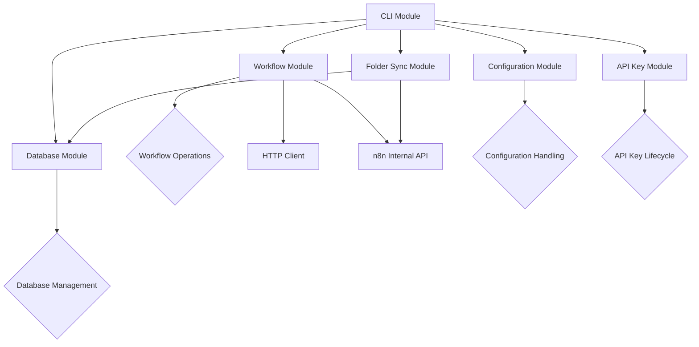
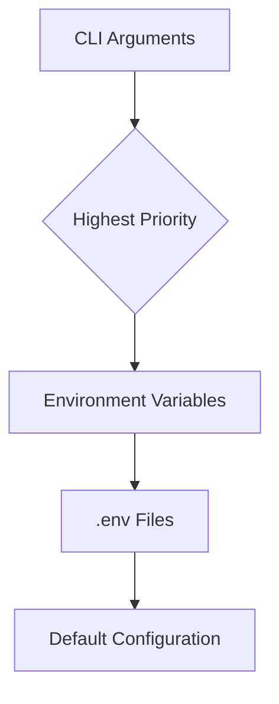

# System Architecture

{: .warning }
> Delving into the technical details of n8n-deploy's modular architecture.

## Architectural Overview

n8n-deploy follows a modular, type-safe architecture designed for flexibility and maintainability. The system is divided into several key components that work together to provide a seamless workflow management experience.

### Core Modules

#### 1. CLI Module (`api/cli/`)
- Entry point for command-line interactions
- Handles command parsing and routing
- Manages global flags and configuration
- Verbose output handling (`verbose.py`)
- Shared output formatting (`output.py`)

#### 2. Workflow Module (`api/workflow/`)
- Core workflow management logic
- CRUD operations for workflows
- Integration with n8n server API (`n8n_api.py`)
- HTTP client abstraction (`http_client.py`)
- Server resolver for flexible server selection (`server_resolver.py`)
- n8n internal API client (`n8n_internal_api.py`) - for folder/tag operations

#### 3. Database Module (`api/db/`)
- SQLite database management (schema v6)
- Schema initialization and migrations
- Backup and restore functionality
- Folder CRUD operations (`folders.py`)

#### 4. Configuration Module (`api/config.py`)
- Environment variable and configuration management
- Path resolution and validation
- Configuration precedence handling

#### 5. API Key Module (`api/api_keys.py`)
- Plain-text API key storage
- Key lifecycle management (add, list, delete)
- Server authentication support

#### 6. Folder Sync Module (`api/workflow/folder_sync.py`)
- Bidirectional folder synchronization
- Folder mapping management
- Integration with n8n internal API

## Key Design Principles

1. **Modularity**: Each component has a single, well-defined responsibility
2. **Type Safety**: Strict type annotations with `mypy`
3. **Minimal Dependencies**: Core functionality with optional extensions
4. **Configuration Flexibility**: Multiple configuration sources

## Configuration Precedence

{: .tip }
> The configuration system allows maximum flexibility while maintaining clear, predictable behavior.

## Type Safety and Error Handling

- Comprehensive type hints using Python's typing module
- Strict `mypy` configuration (zero errors in strict mode)
- Clean, user-friendly error messages
- No verbose Python tracebacks in CLI output

## Performance Considerations

- Lightweight SQLite database
- Minimal runtime dependencies
- Efficient file and API operations
- Background task support

{: .note }
> "Premature optimization is the root of all evil." — Donald Knuth

## Security Approach

- No encryption of API keys (simplicity-first design)
- SSL verification support
- Environment-based configuration
- Explicit user consent for critical operations

## Extensibility

The modular architecture allows easy extension and customization of core functionalities without modifying existing code.

{: .warning }
> While extensible, always consider the project's core design philosophy of simplicity and clarity.

## n8n Server API Interaction

### Workflow Pull Operation

The following sequence diagram shows how n8n-deploy pulls a workflow from a remote n8n server:

```mermaid
sequenceDiagram
    participant User
    participant CLI as n8n-deploy CLI
    participant DB as SQLite Database
    participant ServerAPI as Server CRUD
    participant n8n as n8n Server API
    participant Files as Local Files

    User->>CLI: wf pull "Workflow Name" --remote my-server

    Note over CLI,ServerAPI: Authentication Resolution
    CLI->>ServerAPI: get_server_by_name("my-server")
    ServerAPI->>DB: SELECT * FROM servers WHERE name = ?
    DB-->>ServerAPI: server {url, name, id}
    ServerAPI->>DB: get_api_key_for_server(server_id)
    DB-->>ServerAPI: api_key value
    ServerAPI-->>CLI: server_url + api_key

    Note over CLI,n8n: Fetch Workflow from n8n
    CLI->>n8n: GET /api/v1/workflows<br/>Headers: X-N8N-API-KEY
    n8n-->>CLI: 200 OK + workflows JSON list

    CLI->>CLI: Find workflow by name

    Note over CLI,Files: Save Locally
    CLI->>Files: Write {workflow_id}.json
    Files-->>CLI: File saved

    Note over CLI,DB: Update Metadata
    CLI->>DB: INSERT/UPDATE workflows<br/>(id, name, file_folder, status)
    DB-->>CLI: Success

    CLI-->>User: ✅ Workflow pulled successfully
```

### Workflow Push Operation

This diagram illustrates pushing a local workflow to the n8n server:

```mermaid
sequenceDiagram
    participant User
    participant CLI as n8n-deploy CLI
    participant DB as SQLite Database
    participant Files as Local Files
    participant ServerAPI as Server CRUD
    participant n8n as n8n Server API

    User->>CLI: wf push "Workflow Name" --remote my-server

    Note over CLI,DB: Load Workflow Metadata
    CLI->>DB: SELECT * FROM workflows WHERE name = ?
    DB-->>CLI: workflow {id, file_folder, status}

    Note over CLI,Files: Read Workflow JSON
    CLI->>Files: Read {workflow_id}.json
    Files-->>CLI: Workflow JSON content

    Note over CLI,ServerAPI: Resolve Credentials
    CLI->>ServerAPI: get_server_by_name("my-server")
    ServerAPI->>DB: SELECT + JOIN server_api_keys
    DB-->>ServerAPI: server + api_key
    ServerAPI-->>CLI: server_url + api_key

    Note over CLI,n8n: Check if Workflow Exists
    CLI->>n8n: GET /api/v1/workflows/{id}<br/>Headers: X-N8N-API-KEY
    alt Workflow exists on server
        n8n-->>CLI: 200 OK + existing workflow
        CLI->>n8n: PUT /api/v1/workflows/{id}<br/>Body: updated JSON
        n8n-->>CLI: 200 OK + updated workflow
    else Workflow does not exist
        n8n-->>CLI: 404 Not Found
        CLI->>n8n: POST /api/v1/workflows<br/>Body: new JSON
        n8n-->>CLI: 201 Created + workflow
    end

    Note over CLI,DB: Update Sync Status
    CLI->>DB: UPDATE workflows<br/>SET last_synced = NOW(), push_count++
    DB-->>CLI: Success

    CLI-->>User: ✅ Workflow pushed successfully
```

### Server and API Key Linking

This sequence shows the complete flow of setting up server authentication:

```mermaid
sequenceDiagram
    participant User
    participant CLI as n8n-deploy CLI
    participant ServerCRUD as Server CRUD
    participant KeyMgr as API Key Manager
    participant DB as SQLite Database

    Note over User,DB: Step 1: Create Server Entry
    User->>CLI: server create "Production" https://n8n.example.com
    CLI->>ServerCRUD: add_server(url, name)
    ServerCRUD->>DB: INSERT INTO servers (url, name, is_active)
    DB-->>ServerCRUD: server_id
    ServerCRUD-->>CLI: Success (server_id: 1)
    CLI-->>User: ✅ Server created

    Note over User,DB: Step 2: Add API Key
    User->>CLI: apikey add prod_key
    CLI->>KeyMgr: add_api_key(name, api_key)
    KeyMgr->>DB: INSERT INTO api_keys (name, api_key)
    DB-->>KeyMgr: api_key_id
    KeyMgr-->>CLI: Success
    CLI-->>User: ✅ API key stored

    Note over User,DB: Step 3: Link Server to API Key
    User->>CLI: server link "Production" prod_key
    CLI->>ServerCRUD: link_api_key(server_name, key_name)
    ServerCRUD->>DB: SELECT id FROM servers WHERE name = ?
    DB-->>ServerCRUD: server_id
    ServerCRUD->>DB: SELECT id FROM api_keys WHERE name = ?
    DB-->>ServerCRUD: api_key_id
    ServerCRUD->>DB: INSERT INTO server_api_keys<br/>(server_id, api_key_id)
    DB-->>ServerCRUD: Success
    ServerCRUD-->>CLI: Linked successfully
    CLI-->>User: ✅ API key linked to server
```

### List Remote Workflows

This diagram shows how to list workflows from a remote server:

```mermaid
sequenceDiagram
    participant User
    participant CLI as n8n-deploy CLI
    participant ServerAPI as Server CRUD
    participant DB as SQLite Database
    participant n8n as n8n Server API

    User->>CLI: wf server --remote my-server

    Note over CLI,ServerAPI: Resolve Credentials
    CLI->>ServerAPI: get_server_by_name("my-server")
    ServerAPI->>DB: SELECT servers + api_keys (JOIN)
    DB-->>ServerAPI: server_url + api_key
    ServerAPI-->>CLI: Credentials resolved

    Note over CLI,n8n: Fetch All Workflows
    CLI->>n8n: GET /api/v1/workflows<br/>Headers: X-N8N-API-KEY
    n8n-->>CLI: 200 OK + workflows array

    Note over CLI,User: Display Results
    CLI->>CLI: Format workflow list<br/>(name, id, active, tags)
    CLI-->>User: 📋 Remote workflows displayed
```

{: .tip }
> All n8n API requests use the `X-N8N-API-KEY` header for authentication.