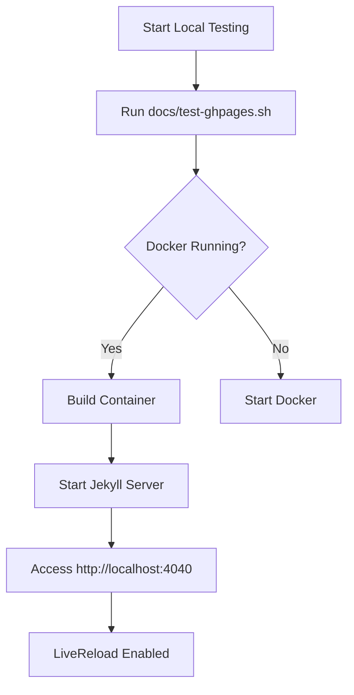

# Local GitHub Pages Testing with Docker

> "If anything can go wrong with your documentation, it will — and at the worst possible moment when someone actually needs it." — Murphy's Law of Documentation

## Overview

This guide explains how to test your GitHub Pages documentation locally using Docker Compose, ensuring a seamless documentation development experience.

## Prerequisites

{: .note }
> Before starting, ensure you have the following installed:
> - Docker
> - Docker Compose
> - Git

## Docker Compose Configuration

### Docker Compose File (`docker-compose.ghpages.yml`)

```yaml
services:
  jekyll:
    build:
      context: .
      dockerfile: Dockerfile.ghpages
    container_name: n8n-deploy-ghpages
    ports:
      - "4040:4000"      # Map host port 4040 to container port 4000
      - "35729:35729"    # LiveReload port
    volumes:
      - ./:/site:cached  # Mount current directory to /site
      - jekyll-bundle:/usr/local/bundle  # Persist Ruby bundle
    environment:
      - JEKYLL_ENV=development
    command: bundle exec jekyll serve --host 0.0.0.0 --livereload --force_polling --quiet

volumes:
  jekyll-bundle:
```

### Dockerfile Configuration (`Dockerfile.ghpages`)

```dockerfile
FROM ruby:3.1-slim

# Configure APT proxy for faster package downloads
RUN echo 'Acquire::http::Proxy "http://192.168.76.5:3142";' > /etc/apt/apt.conf.d/01proxy

# Install system dependencies
RUN apt-get update && apt-get install -y \
    build-essential \
    git \
    && rm -rf /var/lib/apt/lists/*

# Set working directory
WORKDIR /site

# Install bundler
RUN gem install bundler:2.4.22

# Copy Gemfile first for better build caching
COPY Gemfile* ./

# Install Ruby dependencies
RUN bundle install

# Copy entire site content
COPY . ./

# Expose Jekyll default port
EXPOSE 4000

# Default command to serve the site
CMD ["bundle", "exec", "jekyll", "serve", "--host", "0.0.0.0", "--livereload", "--force_polling"]
```

## Testing Script (`docs/test-ghpages.sh`)

```bash
#!/bin/bash
# Script to test GitHub Pages documentation locally

# Check Docker is running
if ! docker info > /dev/null 2>&1; then
    echo "Docker is not running. Please start Docker."
    exit 1
fi

# Build and start container
docker compose -f docker-compose.ghpages.yml build
docker compose -f docker-compose.ghpages.yml up -d

# View site at http://localhost:4040/n8n-deploy/
```

## Quick Start Guide

1. **Prepare the Environment**
   ```bash
   # Ensure Docker and Docker Compose are installed
   docker --version
   docker compose version
   ```

2. **Build and Start the Container**
   ```bash
   # Run the test script
   ./docs/test-ghpages.sh

   # Or manually
   docker compose -f docker-compose.ghpages.yml up -d
   ```

3. **Access Documentation**
   - Open [http://localhost:4040/n8n-deploy/](http://localhost:4040/n8n-deploy/) in your browser
   - LiveReload is enabled, so changes to markdown files will auto-refresh

4. **Stop the Server**
   ```bash
   docker compose -f docker-compose.ghpages.yml down
   ```

## Key Features

- **APT Proxy**: Uses local proxy (192.168.76.5:3142) for faster package downloads
- **LiveReload**: Automatically refreshes browser when files change
- **Docker Volumes**:
  - Persists Ruby bundle for faster subsequent builds
  - Mounts current directory to `/site` in the container

## Troubleshooting

{: .warning }
> **Common Issues**
> - Ensure Docker is running
> - Check that port 4040 is not in use
> - Verify Gemfile and dependencies are correct

### Rebuilding Dependencies

```bash
# Rebuild container if Gemfile changes
docker compose -f docker-compose.ghpages.yml build

# Restart server
docker compose -f docker-compose.ghpages.yml up -d
```

## Performance Tips

- Use `--incremental` flag for faster builds during active development
- Exclude unnecessary files in `_config.yml`

## Mermaid Diagram Example



## Best Practices

1. Always test documentation locally before pushing
2. Use relative links in markdown files
3. Keep documentation concise and up-to-date
4. Leverage Docker for consistent testing environment

> "In theory, there is no difference between theory and practice. In practice, there is." — Yogi Berra