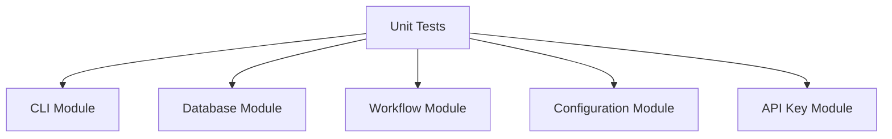
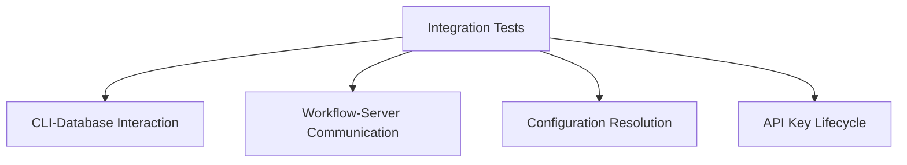
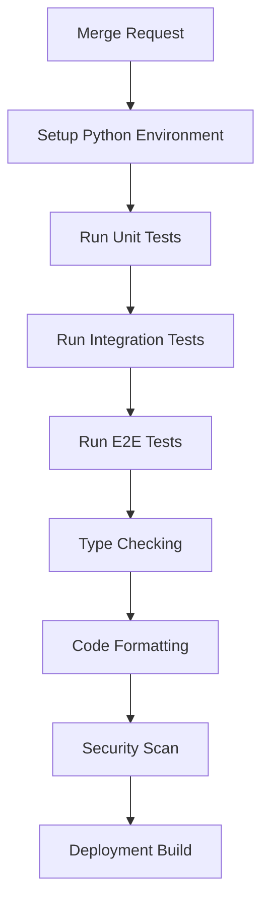

# Testing Framework

{: .warning }
> Thorough testing is critical to maintaining code quality and preventing regressions.

## Testing Philosophy

n8n-deploy employs a comprehensive, multi-layered testing approach:
- **Unit Tests**: Individual component validation
- **Integration Tests**: Component interaction testing
- **End-to-End (E2E) Tests**: Real-world scenario validation
- **Property-Based Testing**: Automated test case generation with Hypothesis
- **Manual Testing**: Interactive bash-based testing scripts

## Test Types

### Unit Tests



**Purpose**: Test individual functions in isolation

**Example**:
```python
def test_config_creation():
    """Test n8n_deploy_Config initialization"""
    config = n8n_deploy_Config(
        app_dir="/tmp/app",
        flow_dir="/tmp/flows"
    )
    assert config.app_dir == Path("/tmp/app")
    assert config.flow_dir == Path("/tmp/flows")
```

**Location**: `tests/unit/`
- Test individual functions and classes
- Mock external dependencies
- 100% coverage goal for core modules

### Integration Tests



**Purpose**: Validate component interactions

**Example**:
```python
def test_workflow_database_integration(tmp_path):
    """Test adding workflow updates database"""
    db = n8n_deploy_DB(tmp_path / "test.db")
    manager = WorkflowManager(db)

    # Add workflow
    manager.add_workflow("test.json", "Test Workflow")

    # Verify in database
    workflows = db.list_workflows()
    assert len(workflows) == 1
    assert workflows[0].name == "Test Workflow"
```

**Location**: `tests/integration/`
- Test interactions between modules
- Validate complex workflows
- Ensure components work together correctly

### End-to-End (E2E) Tests

**Purpose**: Validate complete user scenarios via actual CLI execution

**Example**:
```python
def test_workflow_lifecycle_complete(temp_dirs):
    """Test: Add → List → Update → Delete → Restore"""
    app_dir, flow_dir = temp_dirs

    # 1. Initialize database
    result = run_cli(["db", "init"], app_dir=app_dir)
    assert result.returncode == 0

    # 2. Add workflow
    result = run_cli(["wf", "add", "test.json", "My Workflow"])
    assert "added successfully" in result.stdout

    # 3. Verify in list
    result = run_cli(["wf", "list", "--no-emoji"])
    assert "My Workflow" in result.stdout
```

**Characteristics**:
- Full CLI command testing
- Real subprocess execution
- Validate complete user scenarios
- Uses `--no-emoji` for consistent output

### Property-Based Testing

**Purpose**: Generate hundreds of test cases automatically to find edge cases

**Example**:
```python
from hypothesis import given, strategies as st

@given(
    workflow_name=st.text(min_size=1, max_size=100),
    app_dir=st.text(min_size=1, max_size=50)
)
def test_workflow_add_never_crashes(workflow_name, app_dir):
    """Property: Adding workflow should never crash"""
    result = run_cli(["wf", "add", "test.json", workflow_name])
    # Should handle any input gracefully
    assert result.returncode in [0, 1, 2]
    # Should never expose Python tracebacks
    assert "Traceback" not in result.stderr
```

**Capabilities**:
- Uses Hypothesis framework
- Generates 750+ test cases automatically
- Finds edge cases human testers might miss
- Tests Unicode, special chars, path traversal, injection attempts

### Manual Testing

**Purpose**: Interactive testing for visual verification

**Example**:
```bash
# Run all manual tests
./tests/manual_test_cli.sh

# Run specific test categories
./tests/manual_test_cli.sh help env db

# Verbose mode with output
./tests/manual_test_cli.sh -v
```

**Features**:
- Bash-based interactive scripts
- 90+ tests across 10 categories
- Emoji and color output verification
- Real-time user experience validation

## Running Tests

```bash
# Run all tests
python run_tests.py --all

# Unit tests only
python run_tests.py --unit

# Integration tests
python run_tests.py --integration

# E2E tests
python run_tests.py --e2e

# Hypothesis property tests
pytest tests/generators/hypothesis_generator.py -v
```

## Test Environment Configuration

{: .note }
> `N8N_DEPLOY_TESTING=1` prevents default workflow initialization during tests.

### Test Database

- Isolated test database
- Automatic cleanup after tests
- No persistent state between test runs

### Configuration Testing

- Test multiple config sources
- Validate precedence rules
- Check error handling

## Best Practices

{: .tip }
> "Test your code like you want others to test your parachute." — Anonymous

1. **Write Tests First**: TDD approach
2. **Keep Tests Simple**
3. **Test Edge Cases**
4. **Use Meaningful Test Names**
5. **Avoid Test Interdependence**

## Continuous Integration

- Full test suite runs on every merge request
- Coverage reports generated
- Static type checking
- Code quality scans

### CI Pipeline Stages



## Troubleshooting Tests

{: .warning }
> Common issues and their solutions.

### Flaky Tests
- Add retries
- Isolate external dependencies
- Use deterministic random seeds

### Performance
- Profile slow tests
- Mock heavy operations
- Use `pytest-xdist` for parallel testing

{: .note }
> Good tests are a developer's best friend, catching issues before they reach production.