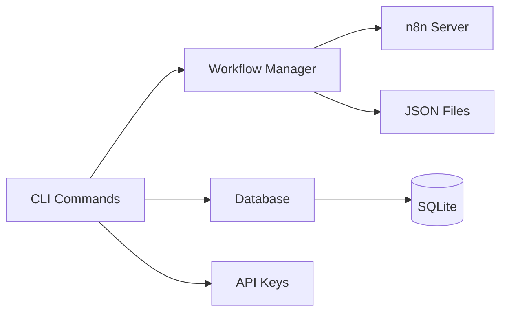

# n8n-deploy User Guide

Welcome to **n8n-deploy** – your command-line companion for managing n8n workflows with precision and control.

## What Is n8n-deploy?

n8n-deploy transforms workflow management from a point-and-click web UI experience into a version-controlled, database-backed CLI workflow tool. Perfect for teams managing remote n8n servers where web access isn't always practical.

**Core idea**: Treat workflows as local JSON files tracked in git, with SQLite maintaining metadata, sync state, and API credentials.

## Why Use n8n-deploy?

- ✅ **Version Control** - Track workflow changes in git like any other code
- ✅ **Remote Sync** - Push and pull workflows to/from remote n8n servers
- ✅ **Database-First** - SQLite as single source of truth (no fragile config files)
- ✅ **Privacy-First** - Zero telemetry, all data stays local
- ✅ **Script-Friendly** - Perfect for automation and CI/CD pipelines

## Quick Example

Set up your environment, pull a workflow, edit it locally, and push it back:

```bash
export N8N_DEPLOY_DATA_DIR=~/n8n-data
export N8N_DEPLOY_FLOWS_DIR=~/workflows
n8n-deploy db init

echo "your-api-key" | n8n-deploy apikey add production
export N8N_SERVER_URL=https://n8n.example.com

n8n-deploy wf pull "Customer Onboarding"
vim ~/workflows/deAVBp391wvomsWY.json
n8n-deploy wf push "Customer Onboarding"
```

## Key Features

- 🎯 **Smart CLI** - Commands organized by function (wf, db, apikey, env)
- 🌍 **UTF-8 Support** - Workflow names with Unicode and spaces
- 🔒 **SSL Flexibility** - `--skip-ssl-verify` for dev environments
- 📊 **Rich Output** - Beautiful terminal display or `--no-emoji` for scripts
- ⚡ **Type-Safe** - Strict mypy compliance across codebase

## Architecture at a Glance



## Documentation Map

- 📖 **[Installation & Setup](installation/)** - Get up and running in minutes
- ⚙️ **[Configuration](../configuration/)** - Environment variables and directory setup
- 🚀 **[Getting Started](../getting-started/)** - Your first workflows
- 📝 **[Workflow Management](../core-features/workflows/)** - Add, sync, push, pull, backup
- 🎯 **[Workflow Patterns](workflow-patterns/)** - Common patterns and real-world examples
- 🔄 **[Migration Guide](migration-guide/)** - Upgrade between versions
- 🔑 **[API Key Management](../core-features/apikeys/)** - Secure credential handling
- 🔧 **[Troubleshooting](../troubleshooting/)** - Common issues and solutions
- ❓ **[FAQ](../faq/)** - Frequently asked questions

## System Requirements

- Python 3.8+ (tested through 3.12)
- Linux, macOS, or WSL2
- Network access for remote operations only

## Design Principles

- **Explicit Configuration** - No hidden defaults or magic behavior
- **Clean Errors** - User-friendly messages, not Python tracebacks
- **Modular Code** - Clear separation between CLI, database, and workflows
- **Testing First** - Unit, integration, E2E, and property-based coverage

## Getting Help

```bash
n8n-deploy --help              # Global commands
n8n-deploy wf --help           # Workflow commands
n8n-deploy wf push --help      # Specific command help
```

## Next Steps

Ready to dive in? Start with **[Installation & Setup](installation/)** to get n8n-deploy running on your system.

---

*Open source at [github.com/lehcode/n8n-deploy](https://github.com/lehcode/n8n-deploy/)*
