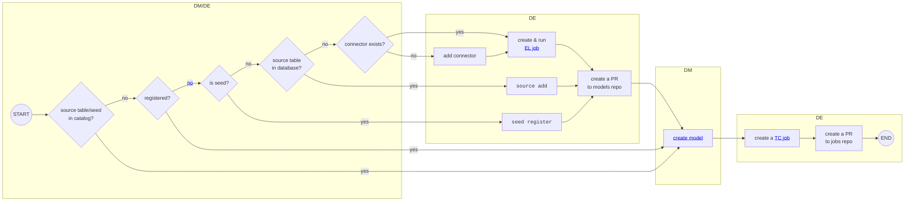
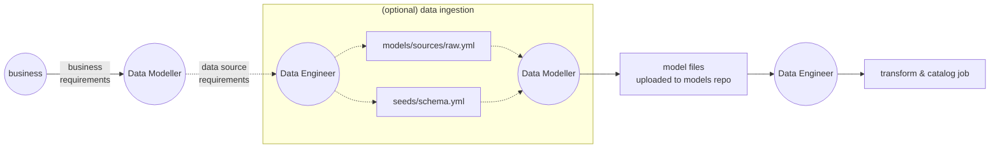

# Working with `nesso models`

Below we present example workflows for working with `nesso models` for two key users: Data Modeller (Data Analyst/Scientist/etc.) and Data Engineer.

For the workflow used inside scheduled model jobs, see [scheduling docs](../advanced_usage/scheduling.md).

## Overview

!!! note
    These workflows assume a division of responsibilities between DMs and DEs where Data Engineers own data ingestion and maintain source table metadata.

## End-to-end workflow

The end-to-end process of deploying a new data model to production.

### Reading the diagram

Reading the diagram from the bottom to the top, you will notice progressively more complex steps. In the most simple scenarios, Data Modellers can jump straight into modelling. In more complex scenarios, Data Engineers will need to be involved.

Keep in mind that the diagram includes an end-to-end process, so no one person/team needs to keep all these scenarios in their head. For example, for a Data Modeller, the important question is, "do we already have the source data I need?". If it's not there, they will simply ask DEs to provide that data -- it is up to DEs to know their relevant workflow. The DMs will only be dealing with the relevant output of DEs work, which in this case would be a modification to either sources or seeds YAML file. Once the DE part is finished, DMs simply run `git pull` on the nesso project repository and proceed with modelling.

### Summary

DEs are responsible for two things:

- registering source tables and seeds in the sources YAML file

    In the worst case scenario, this might require creating a new connector. In the simplest - running `nesso models source add` or `nesso models seed register` and creating a PR to the nesso project repository with the modified YAML file.

- deploying the model to production, which includes scheduling the execution of the model

    This execution might be part of a [TC or ELTC](../reference/glossary.md#eltc) job.

### Diagram

### Unregistered source tables/seeds

There are two main scenarios in which a source or mapping table could exist in the database, but not be [registered](../reference/glossary.md#registering-a-seedsource-table) in the YAML file (and thus not visible in the catalog):

- the table was created before `nesso` was introduced
- the table was created by different tooling

### Team APIs view

To understand interactions between the two teams, we can also look from the perspective of team APIs (inputs/outputs):

## Creating data models

This diagram presents the workflow of building a data model. It's a deep-dive into the `create model` step from the end-to-end diagram.

**NOTE:** For clarity, we've shortened the commands to only include the part after `nesso models` (eg. `seed register` stands for `nesso models seed register`).

```mermaid
graph LR
    bootstrap[<code>model bootstrap</code>]
    create_base_model[<code>base_model create</code>]
    register_seed[<code>seed register</code>]
    materialize[<code>run</code>]
    bootstrap_yaml[<code>model bootstrap-yaml</code>]
    test[<code>test</code>]
    model_update[<code>model update</code>]
    create_pr["create a PR"]
    manual_adjustments["(optional) \n manual YAML adjustments"]

    s((START)) --> need_mapping{"need to add \n a mapping?"}
    need_mapping -- no --> create_base_model --> bootstrap
    need_mapping -- yes --> register_seed --> bootstrap

    bootstrap --> work["work on the model"]

    work --> materialize --> first_model_yaml{first pass?}
    first_model_yaml -- yes --> bootstrap_yaml --> manual_adjustments
    first_model_yaml -- no --> model_update --> manual_adjustments

    manual_adjustments --> test --> tests_pass{tests pass?}

    tests_pass -- yes --> create_pr --> e((END))
    tests_pass -- no --> work
```

