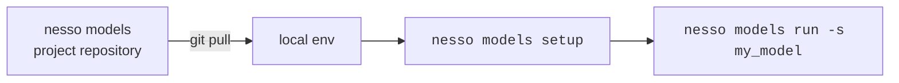
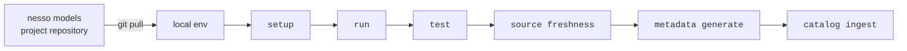

# Scheduling

While model scheduling itself is outside of the scope of `nesso models`, it's useful to be aware of the best practices around it.

In order to execute your models on a schedule in production environment, a different workflow is required than the one used to create them. Below, we present two example workflows.

!!! note "One model = one job"
    All nesso commands should utilize the `--select/-s` option to only execute a single model per each scheduled job. The main reason for this is to provide full flexibility regarding the deployment and scheduling of models. It also streamlines the monitoring & debugging of the jobs executing the models.

## Minimal workflow

To simply [materialize](../reference/glossary.md#materialization) a model, the following workflow is required:

## Full workflow

In order to utilize the [source freshness](https://docs.getdbt.com/docs/deploy/source-freshness) feature as well as nesso's data catalog integrations, the following workflow is required.

**NOTE:** For clarity, we've shortened the commands to only include the part after `nesso models` (eg. `source freshness` stands for `nesso models source freshness`).

### Workflow objectives

This workflow was built to accomplish the following key objectives:

#### Git workflow

Utilizing the Git workflow allows us to realize several benefits of Git, such as:

- version control
- built-in governance
- automation via CI/CD pipelines
- full transparency, audit logs, etc.

All this is accomplished without purchasing, deploying, maintaining, teaching, and learning a separate tool, such as a ticketing system.

It also means that users get to utilize the benefits of scale -- both data analysts/data scientists/etc. as well as all the internal teams (data platform engineers, data engineers, DevOps engineers, software engineers) already utilize Git for their daily work. They have tools, best practices, skills, and hundreds of hours of experience of using Git and collaborating with others using Git.

#### Security

See [Security](../reference/security.md) for more details on our approach.

## Scheduling a workflow

The above model execution workflows can be scheduled using any workflow orchestration tool (eg. Airflow, Prefect, Dagster, Azure Data Factory, etc.).

We provide an example [Prefect flow](https://github.com/dyvenia/viadot/blob/main/viadot/flows/transform_and_catalog.py) in `viadot`.

!!! note "`nesso jobs`"
    In the future, we will provide a `nesso jobs` CLI util to simplify the process.

## Summary

Both workflows begin by pulling the `main` branch of the project repository. This means that in order to schedule a model, it has to be merged into the repository beforehand. This workflow guarantees that **only reviewed and tested models are scheduled**.

Next, several commands are executed in order to setup the environment, execute and test the models, as well as ingest [model run metadata](../reference/glossary.md#model-run-metadata) into the data catalog.
