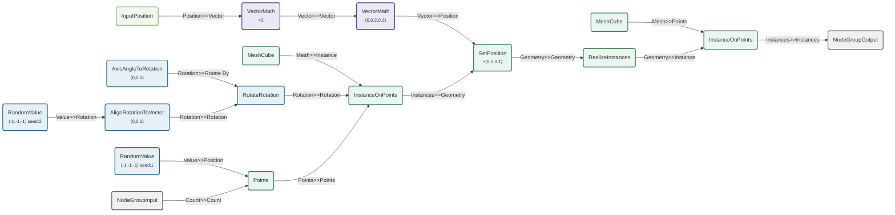

# nodebpy

[](https://github.com/BradyAJohnston/nodebpy/actions/workflows/tests.yml)
[](https://codecov.io/gh/BradyAJohnston/nodebpy)

A package to help build node trees in blender more elegantly with python
code.

## The Design Idea

Other projects have attempted similar but none quite handled the API how
I felt it should be done. Notable existing projects are
[geometry-script](https://github.com/carson-katri/geometry-script),
[geonodes](https://github.com/al1brn/geonodes),
[NodeToPython](https://github.com/BrendanParmer/NodeToPython).

Other projects implement chaining of nodes mostly as dot methos of nodes
to chain them (`InstanceOnPoints().set_position()`). This has the
potential to crowd the API for individual nodes and easy chaining is
instead approached via overriding the `>>` operator.

### Chain Nodes with `>>`

By default the operator attempts to link the first output of the
previous node with the first input of the next. You can override this
behaviour by being explicit with the socket you are passing out
(`AccumulateField().o_total`) or using the `...` for the inputs into the
next node. The dots can appear at multiple locations and each input will
be linked to the previous node via the inferred or specified socket.

# Example Node Tree

``` python
from nodebpy import TreeBuilder, nodes as n, sockets as s

with TreeBuilder("AnotherTree") as tree:
    with tree.inputs:
        count = s.SocketInt("Count", 10)
    with tree.outputs:
        instances = s.SocketGeometry("Instances")

    rotation = (
        n.RandomValue.vector(min=(-1, -1, -1), seed=2)
        >> n.AlignRotationToVector()
        >> n.RotateRotation(
            rotate_by=n.AxisAngleToRotation(angle=0.3), rotation_space="LOCAL"
        )
    )

    _ = (
        count
        >> n.Points(position=n.RandomValue.vector(min=(-1, -1, -1)))
        >> n.InstanceOnPoints(instance=n.Cube(), rotation=rotation)
        >> n.SetPosition(
            position=n.Position() * 2.0 + (0, 0.2, 0.3),
            offset=(0, 0, 0.1),
        )
        >> n.RealizeInstances()
        >> n.InstanceOnPoints(n.Cube(), instance=...)
        >> instances
    )

tree
```




# Design Considerations

Whenever possible, support IDE auto-complete and have useful types. We
should know as much ahead of time as possible if our network will
actually build.

- Stick as closely to Geometry Nodes naming as possible
  - `RandomValue` creates a random value node
    - `RandomValue.vector()` creates it set to `"VECTOR"` data type and
      provides arguments for IDE auto-complete
- Inputs and outputs from a node are prefixed with `i_*` and `o_`:
  - `AccumulateField().o_total` returns the output `Total` socket
  - `AccumulateField().i_value` returns the input `Value` socket
- If inputs are subject to change depending on enums, provide separate
  constructor methods that provide related inputs as arguments. There
  should be no guessing involved and IDEs should provide documentation
  for what is required:
  - `TransformGeometry.matrix(CombineTrasnsform(translation=(0, 0, 1))`
  - `TransformGeoemtry.components(translation=(0, 0, 1))`
  - `TransformGeometry(translation=(0, 0, 1))`
