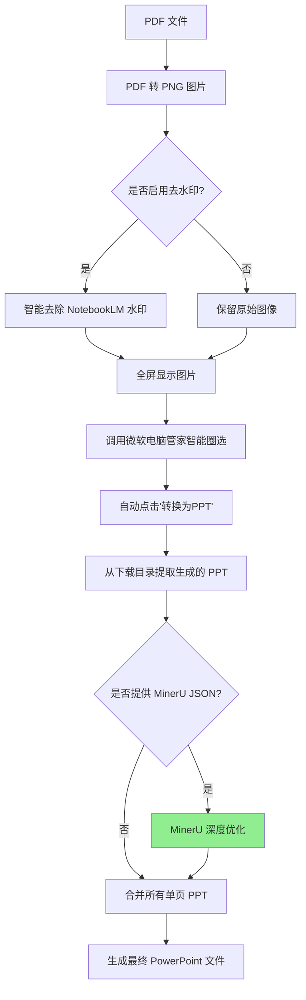
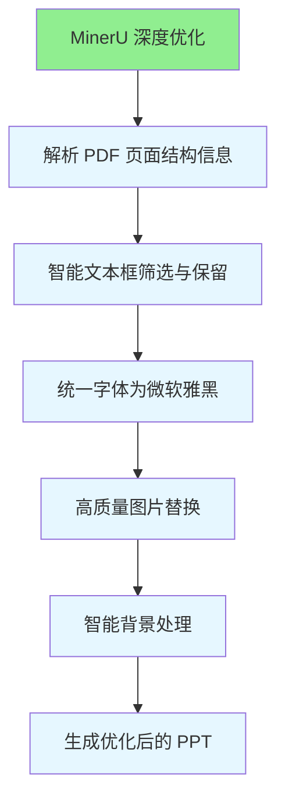

# 实现细节文档

本文档详细说明 NotebookLM2PPT 的技术实现细节和工作原理。

## 🛠️ 工作原理

本工具通过模拟人工操作，实现了一套高效的转换流程：



### 🆕 MinerU 优化流程

当提供 MinerU JSON 文件时，程序会执行以下优化操作：



## 📁 项目结构

```text
NotebookLM2PPT/
├── main.py                          # 程序主入口
├── requirements.txt                 # 依赖清单
├── src/                             # 核心源码
│   ├── pdf2png.py                   # PDF 解析与图像预处理
│   ├── ppt_combiner.py              # PPT 幻灯片合并逻辑
│   └── utils/                       # 通用工具集
│       ├── screenshot_automation.py  # 模拟操作与截图自动化
│       ├── image_viewer.py          # OpenCV 图像全屏渲染
│       ├── image_inpainter.py       # 图像修复与去水印算法
│       └── ppt_refiner.py           # MinerU 深度优化模块
├── examples/                        # 示例 PDF 存放处
└── workspace/                       # 运行时的临时文件与输出结果
```

## 🔧 核心模块说明

### PDF 转 PNG 模块

**文件**: `notebooklm2ppt/pdf2png.py`

负责将 PDF 文件转换为高分辨率 PNG 图片。使用 `pdf2image` 库实现，支持自定义 DPI 参数以确保图片质量。

**关键功能**:
- 支持自定义 DPI（默认 200）
- 批量处理多页 PDF
- 自动创建输出目录

### 图像修复模块

**文件**: `notebooklm2ppt/utils/image_inpainter.py`

使用 OpenCV 的图像修复算法自动识别并去除 NotebookLM 水印。

**关键功能**:
- 自动检测水印位置
- 使用 Telea 算法进行图像修复
- 保持图像质量的同时去除水印

### 截图自动化模块

**文件**: `notebooklm2ppt/utils/screenshot_automation.py`

负责模拟用户操作，实现自动化转换流程。

**关键功能**:
- 模拟键盘快捷键（Ctrl + Shift + A 调用智能圈选）
- 自动定位并点击"转换为PPT"按钮
- 支持自定义延迟和超时参数
- 按钮位置校准功能

### 图像查看器模块

**文件**: `notebooklm2ppt/utils/image_viewer.py`

使用 OpenCV 全屏显示转换后的图片，为智能圈选提供视觉输入。

**关键功能**:
- 全屏显示图片
- 支持自定义显示比例
- 自动适应屏幕尺寸

### PPT 合并模块

**文件**: `notebooklm2ppt/ppt_combiner.py`

将微软电脑管家生成的单页 PPT 合并为一个完整的演示文稿。

**关键功能**:
- 自动检测下载目录中的临时 PPT 文件
- 按顺序合并幻灯片
- 保持原始格式和布局

### MinerU 优化模块

**文件**: `notebooklm2ppt/utils/ppt_refiner.py`

利用 MinerU 解析结果对 PPT 进行深度优化。

**关键功能**:
- 解析 MinerU JSON 文件，提取页面结构信息
- 基于 IOU（交并比）算法筛选相关文本框
- 统一字体为"微软雅黑"
- 从 JSON 中提取高清图片并替换
- 智能背景处理（纯色填充 vs 保留原背景）

## ⚙️ 技术参数说明

### 按钮偏移参数

**重要性**: ⭐⭐⭐⭐⭐

这是程序能否正常工作的最关键参数。

**工作原理**:
1. 程序自动识别智能圈选界面的"转换为PPT"按钮位置
2. 记录按钮相对于屏幕底部的垂直偏移量（像素值）
3. 在后续转换中使用该偏移量准确定位并点击按钮

**校准流程**:
1. 勾选"校准按钮位置"选项
2. 程序显示智能圈选界面
3. 用户手动点击"转换为PPT"按钮
4. 程序记录偏移值并保存到本地配置文件

**常见问题**:
- 如果校准失败，整个转换流程将无法进行
- 微软电脑管家版本更新可能导致按钮位置变化
- 建议定期重新校准以确保准确性

### DPI 参数

**默认值**: 200

**作用**: 控制 PDF 转 PNG 时的图片分辨率

**影响**:
- DPI 越高，图片质量越好，但文件体积越大
- DPI 越低，转换速度越快，但可能影响识别准确度
- 建议值：150-300

### 显示比例参数

**默认值**: 0.8

**作用**: 控制图片在全屏显示时的缩放比例

**影响**:
- 比例过大可能导致图片超出屏幕，无法完整圈选
- 比例过小可能导致图片显示不清晰，影响识别效果
- 建议根据屏幕分辨率调整：1080p 使用 0.8，4K 使用 0.6

### 延迟参数

**默认值**: 2 秒

**作用**: 控制自动化操作之间的等待时间

**影响**:
- 延迟过短可能导致操作失败（界面未加载完成）
- 延迟过长会降低转换效率
- 建议根据电脑性能调整：性能好的电脑可减小到 1 秒

### 超时参数

**默认值**: 60 秒

**作用**: 控制等待 PPT 生成的最长时间

**影响**:
- 超时过短可能导致转换中断（PPT 未生成完成）
- 超时过长会浪费时间
- 建议根据网络状况和文档大小调整

## 🔍 算法详解

### IOU（交并比）算法

**应用场景**: MinerU 优化中的文本框筛选

**原理**:
```python
def calculate_iou(box1, box2):
    # 计算两个矩形的交集面积
    intersection = calculate_intersection(box1, box2)
    
    # 计算两个矩形的并集面积
    union = calculate_union(box1, box2)
    
    # 返回交并比
    return intersection / union
```

**使用方式**:
- 计算 MinerU 识别的文本框与 PDF 页面区域的 IOU
- 保留 IOU 值较高的文本框（相关性强）
- 删除 IOU 值较低的文本框（可能是无关元素）

### 图像修复算法

**应用场景**: 去除 NotebookLM 水印

**算法**: Telea 快速行进法

**原理**:
1. 识别水印区域的边界像素
2. 从边界向内逐步填充
3. 使用偏微分方程计算填充值
4. 保持图像的连续性和自然性

**优点**:
- 修复速度快
- 效果自然
- 对周围环境影响小

## 🚀 性能优化

### 并行处理

程序支持并行处理多个 PDF 页面，显著提升转换速度：

```python
from concurrent.futures import ThreadPoolExecutor

def process_pages(pages):
    with ThreadPoolExecutor(max_workers=4) as executor:
        results = list(executor.map(process_single_page, pages))
    return results
```

### 缓存机制

为了避免重复计算，程序实现了缓存机制：

- PDF 转 PNG 结果缓存
- 水印检测结果缓存
- MinerU JSON 解析结果缓存

### 内存管理

对于大型 PDF 文件，程序采用分块处理策略：

- 每次只处理一定数量的页面
- 及时释放不再使用的资源
- 避免内存溢出

## 🐛 故障排查

### 转换失败

**可能原因**:
1. 微软电脑管家版本过低
2. 智能圈选功能未启用
3. 按钮偏移参数不准确
4. 网络连接问题

**排查步骤**:
1. 检查微软电脑管家版本是否 ≥ 3.17.50.0
2. 手动测试智能圈选功能是否正常
3. 重新校准按钮位置
4. 检查网络连接

### 图片质量差

**可能原因**:
1. DPI 参数设置过低
2. 显示比例不合适
3. 原始 PDF 质量较差

**解决方案**:
1. 提高 DPI 参数（如设置为 300）
2. 调整显示比例（如设置为 0.9）
3. 使用高质量 PDF 源文件

### PPT 合并错误

**可能原因**:
1. 下载目录设置不正确
2. 临时文件被删除
3. 文件名冲突

**解决方案**:
1. 检查系统下载目录路径
2. 不要在转换过程中删除临时文件
3. 清理 workspace 目录后重试

## 📊 性能基准

### 转换速度

| PDF 页数 | 基础转换 | MinerU 优化 |
|---------|---------|------------|
| 10 页   | ~2 分钟 | ~3 分钟 |
| 20 页   | ~4 分钟 | ~6 分钟 |
| 50 页   | ~10 分钟| ~15 分钟|

### 资源占用

| 资源类型 | 基础转换 | MinerU 优化 |
|---------|---------|------------|
| CPU     | 30-50%  | 40-60%    |
| 内存    | 500MB   | 1GB       |
| 磁盘    | 100MB   | 500MB     |

## 🔗 相关文档

- [MinerU 技术实现细节](mineru-technical-details.md)
- [项目 README](../README.md)
