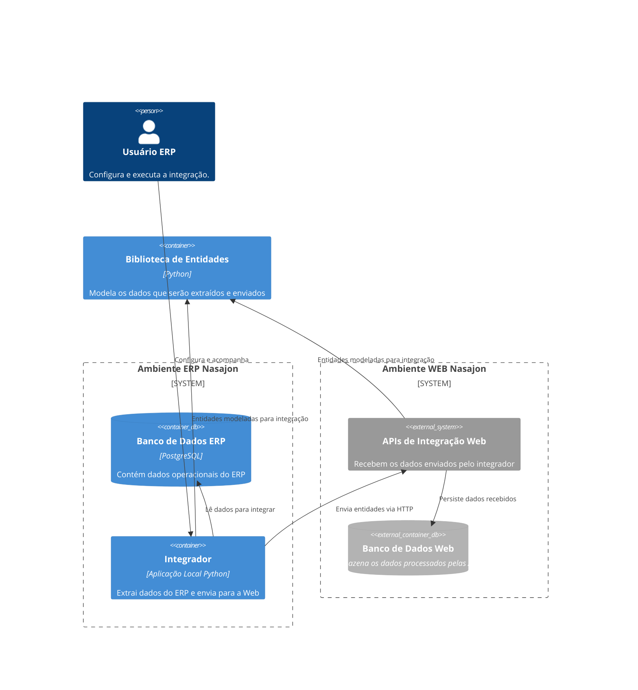

# Integracao api client

Cliente em Python desenvolvido para facilitar a extração de dados de bancos de dados de ERPs e a integração com as APIs de integração da Nasajon. Permite que se extraia dados do ERP e efetue integrações na base do bancos web para um tenant previamente configurado, para isso, utiliza-se do mesmo mecanismo de identificação da sincronia pelo Symmetrics, onde um token de tenant é utilizado para prover a comunicação.

---

## Visão geral

O Cliente possui um modo console onde disponibiliza suas principais operações sendo:

* [Instalação](#instalação)
* [Carga Inicial](#carga-inicial)
* [Integração](#intregação)
* [Recarga](#recarga)
* [Verificação de integridade](#verificação-de-integridade)

### Instalação

Possibilita através de uma **chave de ativação**, configurar a integração, escolhendo quais Grupos Empresariais serão integrados. A chave de ativação pode ser obtida no Diretório->Tenants, seguindo o mesmo fluxo da chave de ativação da sincronia. Caso já exista um sincronia instalada, usará a mesma chave no processo.


### Carga Inicial

Efetua a carga inicial de todos os dados das entidades registradas no cliente e dos grupos empresariais selecionados para as apis na web.

### Integração

Considerando as entidades com dados pendentes para envio, seleciona os dados dos grupos configurados e os envia para as APIs de integração da Nasajon.

### Recarga

Mesmo princípio da carga inicial, selecionando apenas as entidades que se deseje rcarregar.

### Verificação de integridade

Permite efetuar uma comparação entre os dados do ambiente na api e os dados locais. A saída permite identificar as diferenaças e corrigir atravéz do envio dos dados para a api de integração.

---
## Arquitetura

O diagrama abaixo apresenta a arquitetura do sistema de integração, destacando os principais componentes e suas interações:

1. **Usuário ERP**: Configura e acompanha o processo de integração.
2. **Ambiente ERP Nasajon**:
    - **Banco de Dados ERP**: Contém os dados operacionais do ERP.
    - **Integrador**: Aplicação local em Python que extrai dados do ERP e os envia para o ambiente web.
3. **Ambiente WEB Nasajon**:
    - **APIs de Integração Web**: Recebem os dados enviados pelo integrador.
    - **Banco de Dados Web**: Armazena os dados processados pelas APIs.
4. **Biblioteca de Entidades**: Modela os dados que serão extraídos e enviados, garantindo a integridade entre o integrador e as APIs.

As relações entre os componentes mostram como os dados fluem desde o ERP até o ambiente web, passando pelo integrador e utilizando a biblioteca de entidades para padronização.



### Componentes

**ERP Nasajon**
* Aplicação com banco de dados Postgres, onde residem os dados de um cliente.

**Bancos Web**
* Banco de dados Postgres multi-tenant que guarda os dados consumidos pelas aplicações web.

**Integrador**
* Captura os dados do ERP e envia para as APIs de integração, usando **bibliotecas de entidades**.

**APIs de Integração**
* Recebe os dados enviados pelo integrador e os armazena no banco de dados web. Poderão existir diversas apis, uma para cada Tribo, a exemplo [Integração Pessoas API](https://github.com/Nasajon/integracao-pessoas-api).

**Biblioteca de Entidades**
* Modela os dados que serão capturados e enviados para as APIs de integração. O Integrador e as apis usam a mesmma biblioteca de entidades ([nsj_integracao_api_entidades](https://github.com/Nasajon/nsj_integracao_api_entidades)) para garantir a integridade dos dados. Construída através da blioteca [nsj_rest_lib](https://github.com/Nasajon/nsj_rest_lib).


### Modelo de dados

| Módulo                          | Descrição                                   |
|---------------------------------|---------------------------------------------|
| `util.entidades_integracao`     | Gerencia as entidades que serão integradas. É alimentada pela trigger `TRG_registra_entidade_integracao` e função `util.registra_entidade_integracao()`. |
| `util.grupos_empresariais_integracao` | Gerencia os grupos empresariais para integração. |


## Executando localmente

Para executar localmente, Tenha disponível:

* Uma base local do ERP Nasajon;
* Copie o arquivo `env.dist` para `.env` e preencha os dados de conexão com o banco de dados local;
* Usar os comandos dispoíveis no Makefile para executar as operações.

> É possível usar tanto as Apis de QA/DEV, quanto subir uma instância de apis local. Para isso, na execução use o parâmetro `--env=local|dev|qa|prod`.

> Caso queira rodar as apis localmente, será preciso uma base de dados do bancosweb para testes e subir o projeto de apis localmente, tal como o [integracao-pessoas-api](https://github.com/Nasajon/integracao-pessoas-api).

## Distribuição

Existe uma versão do JobManager onde esta biblioteca foi distribuída como um Job, estando disponível tanto para agendamentos como execução pelo método [`run_job`](https://github.com/Nasajon/Jobmanager?#integracao_apis).


### FAQ

#### Adicionar/alterar entidades na integração?

Para adicionar ou alterar entidades na integração, siga o seguinte procedimento:

1. **Identifique a Entidade**
    Verifique qual entidade precisa ser adicionada ou alterada. Certifique-se de que ela está devidamente modelada na [biblioteca de entidades](https://github.com/Nasajon/nsj_integracao_api_entidades), seguindo a conveção do rest_lib.

1. **Atualize a Biblioteca de Entidades**
    Caso necessário, atualize a biblioteca de entidades ([nsj_integracao_api_entidades](https://github.com/Nasajon/nsj_integracao_api_entidades)) no [requirements.txt](requirements.txt) para incluir a nova versão da biblioteca.
    Atualize a [lista de entidades no Integrador](./src/nsj_integracao_api_client/service/integrador.py#L45) respeitando ordem da dependência de chaves estrangeriras.


1. **Configure no Banco de Dados ERP**
    Adicione ou atualize os registros na tabela `util.entidades_integracao` para que a nova entidade seja reconhecida pelo integrador. Crie uma trigger para a função `util.registra_entidade_integracao()` apontando a entidade.

    ```sql
    CREATE TRIGGER "TRG_registra_entidade_integracao" AFTER INSERT OR UPDATE ON esquema.tabela FOR EACH ROW EXECUTE PROCEDURE util.registra_entidade_integracao();
    ```
1. **Teste Localmente**
    Execute o integrador localmente para verificar se a nova entidade está sendo capturada e enviada corretamente para as APIs. Use o comando apropriado no Makefile, como `make carga-inicial`.

1. **Valide na API de Integração**
    Certifique-se de que os dados enviados estão sendo processados corretamente pela API de integração. Verifique os logs e o banco de dados web para confirmar.

1. **Atualize a Documentação**
    Documente a nova entidade e quaisquer alterações realizadas para garantir que a equipe esteja ciente das mudanças.

1. **Distribua as Alterações**
    Caso esteja utilizando o JobManager, atualize o job correspondente para incluir a nova entidade ou as alterações realizadas.

> **Dica:** Sempre mantenha um ambiente de QA para validar as alterações antes de aplicá-las em produção.


# Notas

> No Linux, instale designer com:

```sh
sudo apt install qttools5-dev-tools
```

```sh
sudo apt install pyqt5-dev-tools
```

sudo apt install qt5-base-dev
sudo apt install qt5-tools-dev


https://gist.github.com/r00tdaemon/1dcd57542bdaf3c9d1b0dd526ccd44ff