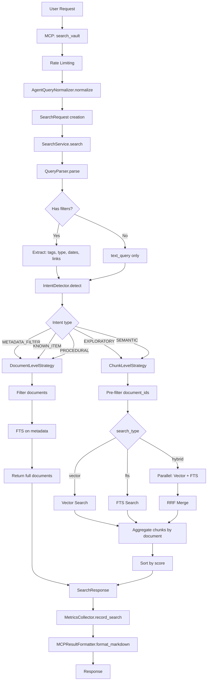
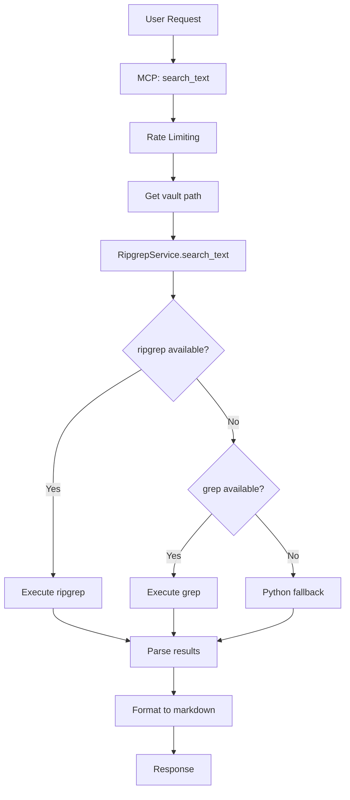
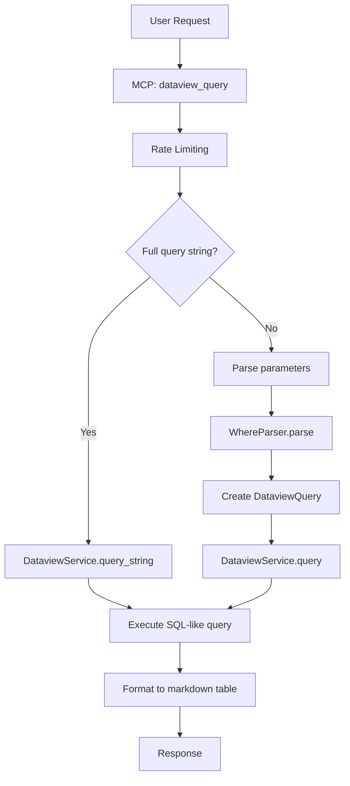
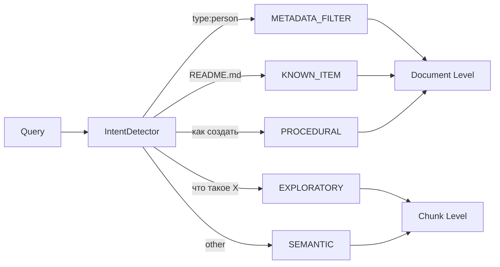
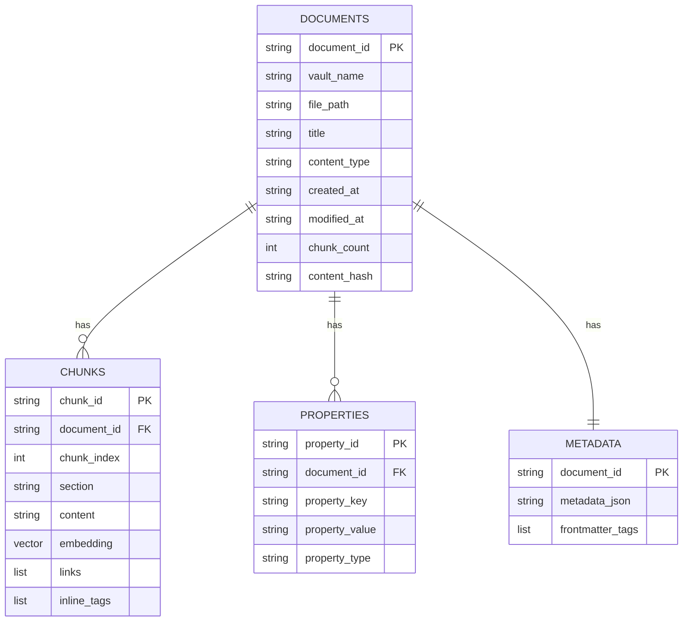

# Search Architecture - obsidian-kb

> Документация по архитектуре поисковой подсистемы obsidian-kb.
> Создано в результате аудита поисковой системы (январь 2026).

## Overview

Поисковая подсистема obsidian-kb реализует многоуровневый поиск по Obsidian vault'ам с поддержкой:
- **Vector Search** - семантический поиск через embeddings
- **Full-Text Search (FTS)** - полнотекстовый поиск через LanceDB
- **Hybrid Search** - комбинация vector + FTS с RRF (Reciprocal Rank Fusion)
- **Filter-based Search** - фильтрация по метаданным (tags, type, dates, links)

### Ключевые компоненты

| Компонент | Файл | Назначение |
|-----------|------|------------|
| SearchService | `search/service.py` | Оркестратор поиска |
| IntentDetector | `search/intent_detector.py` | Определение типа запроса |
| VectorSearchService | `search/vector_search_service.py` | Vector/FTS/Hybrid поиск |
| DocumentLevelStrategy | `search/strategies/document_level.py` | Стратегия поиска документов |
| ChunkLevelStrategy | `search/strategies/chunk_level.py` | Стратегия поиска чанков |
| QueryParser | `query_parser.py` | Парсинг фильтров из запроса |

---

## Flow Diagrams

### search_vault Flow



### search_text Flow (Ripgrep)



### dataview_query Flow



---

## Search Types

### Vector Search

| Параметр | Значение | Описание |
|----------|----------|----------|
| Модель | nomic-embed-text | Ollama embedding model |
| Размерность | 768 | Dimensions |
| Метрика | cosine | Distance metric |
| Score | `1.0 - distance` | Нормализация в [0, 1] |
| Индекс | IVF-PQ | При >= 500 chunks |
| Кэш | LRU 100 | Query embeddings cache |

**Файл:** `search/vector_search_service.py:368-474`

```python
# Пример вызова
embedding = await embedding_service.get_embedding(query, "query")
results = await chunks_table.search(embedding).limit(limit).to_list()
score = max(0.0, min(1.0, 1.0 - row["_distance"]))
```

### Full-Text Search

| Параметр | Значение | Описание |
|----------|----------|----------|
| Реализация | LanceDB native | Не SQLite FTS5 |
| Индекс | BM25 | На поле `content` |
| Score | `min(1.0, score/10.0)` | Нормализация |
| Русский | QueryNormalizer | Стоп-слова и синонимы |

**Файл:** `search/vector_search_service.py:475-594`

```python
# Создание индекса
table.create_fts_index("content", replace=True)

# Поиск
results = await chunks_table.search(query, query_type="fts").limit(limit).to_list()
```

### Hybrid Search

| Параметр | Значение | Описание |
|----------|----------|----------|
| Alpha | 0.7 | Вес vector search |
| RRF k | 60 | Параметр RRF |
| Merge | RRF | Reciprocal Rank Fusion |

**Файл:** `search/vector_search_service.py:596-717`

```python
# Параллельный запуск
vector_results, fts_results = await asyncio.gather(
    self.vector_search(...),
    self.fts_search(...)
)

# RRF формула
score = alpha * (1/(k + rank_vector)) + (1 - alpha) * (1/(k + rank_fts))
```

### Filter-based Search

**Поддерживаемые фильтры:**

| Фильтр | Синтаксис | Пример |
|--------|-----------|--------|
| Tags | `tags:tag1 tag2` | `tags:python async` |
| Type | `type:typename` | `type:person` |
| Created | `created:>2024-01-01` | `created:>=2024-12-01` |
| Modified | `modified:<2025-01-01` | `modified:2025-01-10` |
| Links | `links:notename` | `links:amuratov` |
| Inline tags | `#tag` | `#urgent #todo` |

**Логика:**
- AND: `tags:python tags:async` (оба тега)
- OR: `tags:python OR tags:javascript`
- NOT: `tags:python NOT tags:deprecated`

---

## Intent Detection

### Типы Intent



| Intent | Confidence | Granularity | Паттерны |
|--------|------------|-------------|----------|
| METADATA_FILTER | 0.95 | DOCUMENT | Только фильтры, нет текста |
| KNOWN_ITEM | 0.85-0.90 | DOCUMENT | `*.md`, `ADR-001`, person ID |
| EXPLORATORY | 0.80-0.95 | CHUNK | `что такое`, `почему`, `зачем` |
| PROCEDURAL | 0.85 | DOCUMENT | `как`, `инструкция`, `template` |
| SEMANTIC | 0.50-0.75 | CHUNK | По умолчанию |

**Файл:** `search/intent_detector.py:76-218`

---

## Search Strategies

### DocumentLevelStrategy

**Используется для:** METADATA_FILTER, KNOWN_ITEM, PROCEDURAL


**Оптимизации:**
- SQL pre-filtering cache
- Batch properties loading (size=20)
- PROCEDURAL: поиск по названиям файлов

**Файл:** `search/strategies/document_level.py:49-867`

### ChunkLevelStrategy

**Используется для:** EXPLORATORY, SEMANTIC


**Агрегация scores:**
- `max` (default): максимальный score среди чанков
- `mean`: среднее арифметическое
- `rrf`: Reciprocal Rank Fusion

**Файл:** `search/strategies/chunk_level.py:18-369`

---

## Data Schema

### LanceDB Tables



### Размерности и индексы

| Таблица | Vector Dim | FTS Index | Vector Index |
|---------|------------|-----------|--------------|
| chunks | 768 | `content` | IVF-PQ (>= 500 rows) |
| documents | - | `title`, `file_path` | - |

---

## Caching

| Кэш | Тип | TTL/Size | Назначение |
|-----|-----|----------|------------|
| TTLCache | In-memory | 300s / 10000 | Метаданные документов |
| Query Cache | LRU | 100 entries | Query embeddings |
| EmbeddingCache | LanceDB | - | File embeddings by hash |
| SQLite Cache | Persistent | 30 days | Content embeddings |

```python
# TTLCache пример
cache = TTLCache(ttl_seconds=300, max_size=10000)
cache.set("doc_id", document_info)
info = cache.get("doc_id")  # None после 5 минут
```

---

## Metrics

### SearchMetric

```python
@dataclass
class SearchMetric:
    timestamp: datetime
    vault_name: str | None
    query: str
    search_type: str  # vector, fts, hybrid
    result_count: int
    execution_time_ms: float
    empty_results: bool = False
    avg_relevance_score: float = 0.0
```

**Хранение:** LanceDB таблица `search_metrics` в `metrics.lance`

**Аналитика:**
- `MetricsCollector.get_summary(days=7)` - сводка за период
- Популярные запросы и vault'ы
- Процент пустых результатов
- Средняя релевантность

---

## Gap Analysis vs Best Practices

### RAG Best Practices

| Практика | Статус | Комментарий |
|----------|--------|-------------|
| Query expansion | :x: | Нет переформулировки запросов |
| Query classification | :white_check_mark: | IntentDetector с 5 типами |
| Hybrid search | :white_check_mark: | Vector + FTS с RRF |
| Re-ranking | :warning: | Только position bonus |
| Semantic chunking | :x: | Модуль есть, но не используется |
| Chunk overlap | :white_check_mark: | 250 символов |
| Chunk hierarchy | :x: | Нет parent-child chunks |
| MMR (diversity) | :x: | Нет Maximal Marginal Relevance |
| Evaluation metrics | :warning: | Только latency |

### LanceDB Best Practices

| Практика | Статус | Текущее |
|----------|--------|---------|
| Index type | :white_check_mark: | IVF-PQ при >= 500 rows |
| Prefilter | :white_check_mark: | document_ids pre-filtering |
| Query prefix | :x: | Нет "query:" prefix |
| Batch queries | :warning: | Частично |

---

## Recommendations

### P0 - Критично

| # | Улучшение | Сложность | Влияние |
|---|-----------|-----------|---------|
| 1 | Подключить semantic chunking | S | High |
| 2 | Исправить chunk_size (символы vs токены) | S | Med |
| 3 | Добавить query prefix для asymmetric | S | High |

### P1 - Важно

| # | Улучшение | Сложность | Влияние |
|---|-----------|-----------|---------|
| 4 | Re-ranking с cross-encoder | M | High |
| 5 | MMR для diversity | M | Med |
| 6 | Query expansion | M | Med |
| 7 | Offline evaluation metrics | M | Med |

### P2 - Желательно

| # | Улучшение | Сложность | Влияние |
|---|-----------|-----------|---------|
| 8 | Hierarchical chunks | L | Med |
| 9 | Multilingual model (BGE-M3) | M | Med |
| 10 | User relevance feedback | L | Low |

---

## File References

| Компонент | Путь | Ключевые строки |
|-----------|------|-----------------|
| SearchService | `src/obsidian_kb/search/service.py` | 58-149 |
| VectorSearchService | `src/obsidian_kb/search/vector_search_service.py` | 368-717 |
| IntentDetector | `src/obsidian_kb/search/intent_detector.py` | 76-218 |
| ChunkLevelStrategy | `src/obsidian_kb/search/strategies/chunk_level.py` | 51-369 |
| DocumentLevelStrategy | `src/obsidian_kb/search/strategies/document_level.py` | 77-866 |
| QueryParser | `src/obsidian_kb/query_parser.py` | 194-500 |
| Chunking (unused) | `src/obsidian_kb/indexing/chunking.py` | 17-373 |
| VaultIndexer | `src/obsidian_kb/vault_indexer.py` | 299-340, 713-876 |
| Config | `src/obsidian_kb/config.py` | 38-62 |
| Metrics | `src/obsidian_kb/metrics.py` | 21-481 |
| Schema | `src/obsidian_kb/schema_migrations.py` | 44-145 |
