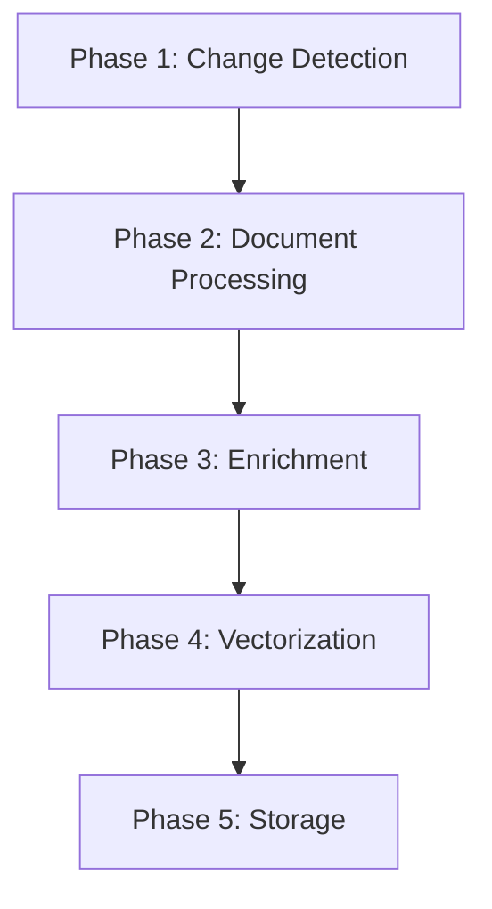

# Процесс индексации

**Версия:** 0.7.0
**Дата обновления:** 2026-01-06

## Обзор

Гибридный пайплайн индексации (Hybrid Indexing Pipeline) — это система индексации документов с поддержкой markdown-aware chunking и LLM-обогащения для улучшения качества поиска.

### Основные возможности

- **Markdown-aware chunking**: Разбиение документов с учётом структуры Markdown (заголовки, секции)
- **Contextual Retrieval**: Генерация context prefix для чанков через LLM
- **Document Summarization**: Генерация summary для документов через LLM
- **Инкрементальная индексация**: Обработка только изменённых файлов
- **Автоматическое обнаружение изменений**: ChangeMonitorService отслеживает изменения в реальном времени
- **Фоновая индексация**: BackgroundJobQueue для выполнения задач без блокировки
- **Гибкие стратегии обогащения**: none, contextual, full

---

## Архитектура пайплайна

### 5 фаз индексации



#### Phase 1: Change Detection

**Компонент:** `ChangeDetector`

Определяет изменения в документах:
- **Новые файлы**: Файлы, которых нет в индексе
- **Изменённые файлы**: Файлы с изменённым содержимым (по SHA256 хешу)
- **Удалённые файлы**: Файлы, удалённые из vault'а

**Использование:**
```python
from obsidian_kb.indexing import ChangeDetector

detector = ChangeDetector(document_repository=repo)
change_set = await detector.detect_changes(
    vault_path=Path("/path/to/vault"),
    vault_name="my-vault",
)
```

#### Phase 2: Document Processing

**Компонент:** `ChunkingService`

Обработка документа:
1. Парсинг frontmatter
2. Markdown-aware chunking по заголовкам
3. Рекурсивное разбиение больших секций
4. Анализ сложности документа

**Стратегии chunking:**
- `AUTO`: Автоматический выбор (рекомендуется)
- `HEADERS`: Разбиение только по заголовкам
- `SEMANTIC`: Семантическое уточнение через LLM
- `FIXED`: Фиксированный размер чанков

**Использование:**
```python
from obsidian_kb.indexing import ChunkingService, ChunkingStrategy

chunking = ChunkingService(chat_provider=chat_provider)
chunks = await chunking.chunk_document(
    content=document_content,
    strategy=ChunkingStrategy.AUTO,
)
```

#### Phase 3: Enrichment

**Компоненты:** `ContextualRetrievalService`, `SummarizationService`

Обогащение чанков и документов через LLM:

- **Context Prefix**: Краткое описание контекста чанка (80-100 токенов)
- **Document Summary**: Краткое описание документа (250-300 токенов)

**Стратегии обогащения:**
- `none`: Без обогащения (только chunking + embedding)
- `contextual`: Context prefix для чанков (рекомендуется)
- `full`: Context prefix + document summary

**Использование:**
```python
from obsidian_kb.enrichment import ContextualRetrievalService, SummarizationService

# Context prefix для чанков
contextual_service = ContextualRetrievalService(chat_provider=chat_provider)
enriched_chunks = await contextual_service.enrich_chunks(
    chunks=chunks,
    document_context=document_title,
)

# Summary для документа
summarization_service = SummarizationService(chat_provider=chat_provider)
summary = await summarization_service.summarize_document(
    content=document_content,
    metadata=frontmatter,
)
```

#### Phase 4: Vectorization

**Компонент:** `IndexingOrchestrator`

Генерация embeddings:
- Для чанков: `context_prefix + chunk_text` → embedding
- Для summary: `summary_text` → embedding

**Использование:**
```python
from obsidian_kb.providers.interfaces import IEmbeddingProvider

embeddings = await embedding_provider.get_embeddings_batch(chunk_texts)
summary_embedding = await embedding_provider.get_embedding(summary_text)
```

#### Phase 5: Storage

**Компонент:** `IndexingOrchestrator`

Сохранение в LanceDB:
- Чанки с embeddings в таблицу `chunks`
- Метаданные документов в таблицу `documents`
- Summary и enrichment status в таблицу `documents`

---

## Использование IndexingOrchestrator

### Базовое использование

```python
from obsidian_kb.indexing import IndexingOrchestrator, EnrichmentStrategy
from obsidian_kb.config.manager import ConfigManager
from obsidian_kb.providers.factory import ProviderFactory

# Инициализация
config_manager = ConfigManager()
embedding_provider = ProviderFactory.get_embedding_provider()
chat_provider = ProviderFactory.get_chat_provider()

orchestrator = IndexingOrchestrator(
    embedding_provider=embedding_provider,
    chat_provider=chat_provider,
    chunk_repository=chunk_repo,
    document_repository=doc_repo,
    config_manager=config_manager,
)

# Создание задачи индексации
job = await orchestrator.create_job(
    vault_name="my-vault",
    vault_path=Path("/path/to/vault"),
    paths=None,  # Все изменённые файлы
    force=False,
    enrichment=EnrichmentStrategy.CONTEXTUAL,
)

# Выполнение задачи
result = await orchestrator.run_job(job.id)
print(f"Processed {result.documents_processed}/{result.documents_total} documents")
print(f"Created {result.chunks_created} chunks")
```

### Стратегии обогащения

#### None (без обогащения)

Быстрая и дешёвая индексация без использования LLM:

```python
job = await orchestrator.create_job(
    vault_name="my-vault",
    vault_path=Path("/path/to/vault"),
    enrichment=EnrichmentStrategy.NONE,
)
```

#### Contextual (рекомендуется)

Баланс между качеством и стоимостью:

```python
job = await orchestrator.create_job(
    vault_name="my-vault",
    vault_path=Path("/path/to/vault"),
    enrichment=EnrichmentStrategy.CONTEXTUAL,
)
```

#### Full (максимальное качество)

Полное обогащение с summary:

```python
job = await orchestrator.create_job(
    vault_name="my-vault",
    vault_path=Path("/path/to/vault"),
    enrichment=EnrichmentStrategy.FULL,
)
```

---

## Конфигурация

### Параметры индексации

```yaml
indexing:
  chunk_size: 800          # Максимальный размер чанка в токенах
  chunk_overlap: 100       # Перекрытие между чанками
  min_chunk_size: 100      # Минимальный размер чанка
  complexity_threshold: 0.7 # Порог сложности для семантического уточнения
```

### Параметры обогащения

```yaml
enrichment:
  strategy: contextual           # none | contextual | full
  context_prefix_tokens: 80     # Количество токенов для context prefix
  summary_tokens: 250            # Количество токенов для summary
  batch_size: 10                # Размер батча для обогащения
```

### Настройка через ConfigManager

```python
from obsidian_kb.config.manager import ConfigManager

config_manager = ConfigManager()

# Установка параметров для vault'а
config_manager.set_config(
    key="indexing.chunk_size",
    value="1000",
    vault_name="my-vault",
)

config_manager.set_config(
    key="enrichment.strategy",
    value="full",
    vault_name="my-vault",
)

# Применение пресета
config_manager.apply_preset(
    preset_name="balanced",
    vault_name="my-vault",
)
```

---

## Схема базы данных

### Таблица `chunks` (расширена в Phase 3)

```python
{
    "chunk_id": str,              # Primary Key
    "document_id": str,           # FK на documents
    "vault_name": str,
    "chunk_index": int,
    "section": str,               # Заголовок секции
    "content": str,               # Текст чанка
    "vector": list[float],        # Embedding чанка
    "links": list[str],           # Wikilinks
    "inline_tags": list[str],     # Inline теги
    "context_prefix": str,        # NEW: Contextual Retrieval prefix
    "provider_info": str,         # NEW: JSON с информацией о провайдере
}
```

### Таблица `documents` (расширена в Phase 3)

```python
{
    "document_id": str,          # Primary Key
    "vault_name": str,
    "file_path": str,
    "title": str,
    "created_at": str,
    "modified_at": str,
    "chunk_count": int,
    "summary_vector": list[float] | None,  # NEW: Embedding summary
    "summary_text": str,                    # NEW: Текстовый summary
    "enrichment_status": str,               # NEW: none | partial | complete
    "provider_info": str,                   # NEW: JSON с информацией о провайдере
}
```

---

## Graceful Degradation

Все компоненты обогащения поддерживают graceful degradation:

- Если LLM недоступен, индексация продолжается без обогащения
- Ошибки обогащения логируются, но не прерывают процесс
- Чанки без context prefix всё равно индексируются

**Пример:**
```python
# Если chat_provider=None, обогащение пропускается
orchestrator = IndexingOrchestrator(
    embedding_provider=embedding_provider,
    chat_provider=None,  # Без обогащения
    ...
)
```

---

## Производительность

### Оценка времени индексации

- **Без обогащения**: ~1-2 сек на документ
- **С contextual enrichment**: ~3-5 сек на документ
- **С full enrichment**: ~5-10 сек на документ

### Оценка стоимости (при использовании облачных провайдеров)

- **Contextual enrichment**: ~$0.001-0.002 на документ
- **Full enrichment**: ~$0.002-0.005 на документ

---

## Примеры использования

### Индексация всех изменённых файлов

```python
job = await orchestrator.create_job(
    vault_name="my-vault",
    vault_path=Path("/path/to/vault"),
    paths=None,  # Автоматическое определение изменений
    enrichment=EnrichmentStrategy.CONTEXTUAL,
)

result = await orchestrator.run_job(job.id)
```

### Принудительная переиндексация конкретных файлов

```python
job = await orchestrator.create_job(
    vault_name="my-vault",
    vault_path=Path("/path/to/vault"),
    paths=[
        Path("/path/to/vault/file1.md"),
        Path("/path/to/vault/file2.md"),
    ],
    force=True,
    enrichment=EnrichmentStrategy.FULL,
)

result = await orchestrator.run_job(job.id)
```

### Мониторинг прогресса

```python
job = await orchestrator.create_job(...)

# В другом потоке можно проверять прогресс
while job.status == "running":
    print(f"Progress: {job.progress:.1%}")
    print(f"Processed: {job.documents_processed}/{job.documents_total}")
    await asyncio.sleep(1)

result = await orchestrator.run_job(job.id)
```

---

## Автоматическая индексация

### ChangeMonitorService

`ChangeMonitorService` автоматически отслеживает изменения в vault'ах и запускает индексацию при обнаружении изменений.

#### Как это работает

1. **Мониторинг в реальном времени**: Использует `watchdog` для отслеживания изменений файлов
2. **Периодическая проверка**: Каждые 60 секунд проверяет изменения через `ChangeDetector`
3. **Debouncing**: Избегает множественных индексаций одного файла (задержка 2 секунды)
4. **Автоматическая постановка задач**: При обнаружении изменений ставит задачи в `BackgroundJobQueue`

#### Настройка

```python
from obsidian_kb.indexing.change_monitor import ChangeMonitorService
from obsidian_kb.indexing.job_queue import BackgroundJobQueue
from obsidian_kb.config.manager import ConfigManager

# Создание сервиса
job_queue = BackgroundJobQueue(max_workers=2)
config_manager = ConfigManager()

monitor = ChangeMonitorService(
    job_queue=job_queue,
    config_manager=config_manager,
    enabled=True,              # Включить автоматический мониторинг
    polling_interval=60,       # Интервал проверки в секундах
    debounce_seconds=2.0,      # Задержка перед индексацией
)

# Запуск мониторинга
await monitor.start()
```

#### Отключение автоматической индексации

```bash
# Через переменную окружения
export OBSIDIAN_KB_AUTO_INDEX_ENABLED=false
```

---

## Фоновая индексация

### BackgroundJobQueue

`BackgroundJobQueue` управляет задачами индексации, которые выполняются в фоне без блокировки MCP сервера.

#### Возможности

- **Приоритеты задач**: high, normal, low
- **Параллельное выполнение**: До 2 задач одновременно (настраивается)
- **Отслеживание прогресса**: Реальное время выполнения задач
- **Retry логика**: Автоматические повторы при ошибках (до 3 раз)
- **Статусы задач**: pending, running, completed, failed, cancelled

#### Использование

```python
from obsidian_kb.indexing.job_queue import BackgroundJobQueue, JobPriority

# Создание очереди
job_queue = BackgroundJobQueue(max_workers=2)

# Постановка задачи в очередь
job = await job_queue.enqueue(
    vault_name="my-vault",
    vault_path=Path("/path/to/vault"),
    operation="index_documents",
    params={
        "paths": None,  # Все изменённые файлы
        "force": False,
        "enrichment": "contextual",
    },
    priority=JobPriority.NORMAL,
)

# Проверка статуса задачи
status = job.status  # pending | running | completed | failed
progress = job.progress  # 0.0 - 1.0
```

#### Мониторинг прогресса

```python
# Получение задачи по ID
job = job_queue.get_job(job_id)

# Проверка статуса
if job.status == "running":
    print(f"Progress: {job.progress:.1%}")
    print(f"Processed: {job.documents_processed}/{job.documents_total}")

# Получение результата
if job.status == "completed":
    result = job.result
    print(f"Created {result.chunks_created} chunks")
```

---

## MCP Tools для индексации

Все инструменты индексации доступны через MCP и могут использоваться агентом:

### `index_documents`

Индексация документов в vault с поддержкой различных стратегий обогащения.

```python
# Индексация всех изменённых файлов
index_documents("my-vault")

# Индексация конкретных файлов
index_documents("my-vault", paths=["file1.md", "file2.md"], force=True)

# Индексация с полным обогащением
index_documents("my-vault", enrichment="full", background=False)
```

**Параметры:**
- `vault_name`: Имя vault'а
- `paths`: Список путей для индексации (None = все изменённые)
- `force`: Принудительная переиндексация даже без изменений
- `enrichment`: Уровень обогащения (none, contextual, full)
- `background`: Запустить в фоне (True) или синхронно (False)

### `reindex_vault`

Полная переиндексация vault'а. ⚠️ Требует подтверждения (`confirm=True`).

```python
# Полная переиндексация
reindex_vault("my-vault", confirm=True)

# С полным обогащением
reindex_vault("my-vault", confirm=True, enrichment="full")
```

### `index_status`

Статус индексации для vault'а или конкретной задачи.

```python
# Все активные задачи для vault'а
index_status(vault_name="my-vault")

# Конкретная задача
index_status(job_id="job_123")
```

### `preview_chunks`

Превью разбиения документа на чанки (без сохранения).

```python
# Автоматический выбор стратегии
preview_chunks("my-vault", "file.md", strategy="auto")

# Разбиение по заголовкам
preview_chunks("my-vault", "file.md", strategy="headers")
```

### `enrich_document`

Обогащение конкретного документа.

```python
# Только context prefix
enrich_document("my-vault", "file.md", enrichment_type="context")

# Только summary
enrich_document("my-vault", "file.md", enrichment_type="summary")

# Всё обогащение
enrich_document("my-vault", "file.md", enrichment_type="all")
```

---

## Оптимизация индексации

### Рекомендации по производительности

1. **Используйте инкрементальную индексацию**: Обрабатывайте только изменённые файлы
2. **Настройте chunking**: Выберите оптимальную стратегию для ваших документов
3. **Балансируйте качество и стоимость**: Используйте `contextual` вместо `full` для больших vault'ов
4. **Используйте фоновую индексацию**: Не блокируйте MCP сервер синхронными операциями
5. **Мониторьте прогресс**: Используйте `index_status` для отслеживания выполнения

### Настройка параметров chunking

```python
from obsidian_kb.config.manager import ConfigManager

config_manager = ConfigManager()

# Увеличение размера чанков для больших документов
config_manager.set_config(
    key="indexing.chunk_size",
    value="1000",
    vault_name="my-vault",
)

# Увеличение перекрытия для лучшего контекста
config_manager.set_config(
    key="indexing.chunk_overlap",
    value="200",
    vault_name="my-vault",
)
```

### Балансировка между качеством и стоимостью

| Стратегия | Качество | Стоимость | Время | Рекомендация |
|-----------|----------|-----------|-------|--------------|
| `none` | Базовое | Бесплатно | Быстро | Для больших vault'ов |
| `contextual` | Хорошее | Низкая | Средне | **Рекомендуется** |
| `full` | Отличное | Высокая | Медленно | Для важных документов |

---

## Troubleshooting

### Проблемы с индексацией

**Проблема:** Индексация не запускается  
**Решение:**
1. Проверьте статус через `index_status("my-vault")`
2. Проверьте логи MCP сервера
3. Убедитесь, что vault существует и доступен

**Проблема:** Медленная индексация  
**Решение:**
1. Используйте `contextual` вместо `full` обогащения
2. Уменьшите размер чанков
3. Используйте более мощный провайдер (Yandex Cloud вместо Ollama)

**Проблема:** Ошибки при обогащении  
**Решение:**
1. Проверьте доступность chat провайдера через `test_provider("ollama")`
2. Система автоматически продолжает индексацию без обогащения (graceful degradation)
3. Проверьте логи для деталей ошибок

### Как проверить статус индексации

```python
# Через MCP tool
index_status(vault_name="my-vault")

# Через CLI
obsidian-kb stats --vault "my-vault"
```

### Как исправить проблемы с индексацией

1. **Проверьте покрытие индекса:**
   ```python
   index_coverage("my-vault")
   ```

2. **Переиндексируйте проблемные файлы:**
   ```python
   index_documents("my-vault", paths=["problem-file.md"], force=True)
   ```

3. **Полная переиндексация (если необходимо):**
   ```python
   reindex_vault("my-vault", confirm=True)
   ```

---

## Следующие шаги

- [PROVIDERS.md](PROVIDERS.md) — выбор провайдера для индексации
- [EXAMPLES.md](EXAMPLES.md) — примеры использования инструментов индексации
- [CONFIGURATION.md](CONFIGURATION.md) — настройка параметров индексации
- [TROUBLESHOOTING.md](TROUBLESHOOTING.md) — решение проблем

