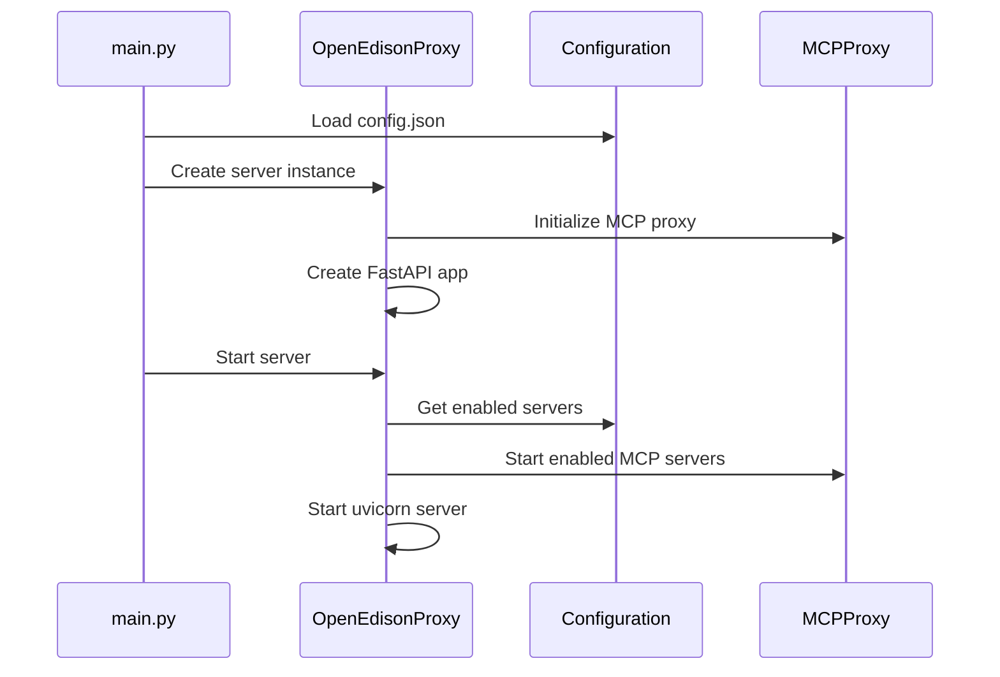

import { Callout } from 'fumadocs-ui/components/callout'
import { Card, Cards } from 'fumadocs-ui/components/card'

# Project Structure

<Callout type="info">
  Open Edison is a **single-user MCP (Model Context Protocol) proxy server** designed for simplicity and local deployment.
</Callout>

## Overview

Open Edison is a **single-user MCP (Model Context Protocol) proxy server** designed for simplicity and local deployment. Unlike complex multi-user systems, it focuses on providing a straightforward way to manage and proxy MCP servers for individual use.

## Project Structure

### Core Architecture

```
open-edison/
├── main.py                # Entry point - starts both MCP and API servers
├── config.json            # JSON configuration (no database needed)
├── src/                   # Main source code
│   ├── server.py          # FastAPI management API + dashboard wiring
│   ├── config.py          # JSON configuration management
│   ├── single_user_mcp.py # FastMCP single-user manager (MCP protocol server)
│   └── __init__.py        # Package initialization
├── tests/                 # Test suite
│   ├── test_config.py     # Configuration tests
│   ├── test_server.py     # Server API tests
│   └── __init__.py        # Test package initialization
├── docs/                  # Documentation
├── Makefile               # Development workflow automation
├── Dockerfile             # Container support
└── pyproject.toml         # Python project configuration
```

### Key Components

#### 1. Main Server (`src/server.py`)

- **OpenEdisonProxy**: Orchestrates both servers and routes
- **Ports**: FastMCP protocol on 3000 (path `/mcp/`), FastAPI management API on 3001
- **Authentication**: Bearer token API key for management endpoints
- **MCP management**: Mount/unmount/reinitialize configured MCP servers
- **Dashboard**: Serves packaged frontend at `/dashboard` on the API server

#### 2. Configuration System (`src/config.py`)

- **JSON-based config**: Simple `config.json` file, no database required
- **Dataclass validation**: Type-safe configuration with Python dataclasses
- **Auto-generation**: Creates default config if missing
- **Hot reload**: Configuration changes require restart (keeps it simple)

#### 3. Single-User MCP (`src/single_user_mcp.py`)

- **FastMCP integration**: Hosts the MCP protocol server
- **Server lifecycle**: Initializes and manages configured servers
- **Mounting**: Supports dynamic mount/unmount via API

## Data Flow

### Server Startup Flow



### MCP Request Flow

See mcp streamable http standard definition for details,
<https://modelcontextprotocol.io/specification/2025-06-18/basic/transports>

MCP over streamable HTTP works by sending JSON-RPC messages from the client to the server using HTTP POST requests to a single endpoint. The server responds with a single JSON object per request—no streaming or SSE is required for basic operation. Each POST contains one JSON-RPC message, and the response is a single JSON-RPC result or error.

## Key Features

- **Single-User Design**: No multi-user complexity, just simple local use
- **JSON Configuration**: Easy-to-edit configuration file
- **Simple Authentication**: Single API key, no complex auth systems
- **Process Management**: MCP servers run as managed subprocesses
- **REST API**: Simple HTTP API for server management
- **Container Ready**: Docker support for easy deployment

## Development Stack

- **Python 3.12+** with **uv** package management
- **FastAPI** for HTTP API endpoints
- **JSON** for configuration (no database)
- **Subprocess** for MCP server management
- **Loguru** for structured logging
- **Dataclasses** for configuration validation

## Use Cases

1. **Personal MCP Management**: Manage your own collection of MCP servers
2. **Development/Testing**: Safe environment for testing new MCP servers
3. **Local AI Workflows**: Single endpoint for multiple MCP data sources
4. **Self-Hosted Simplicity**: No cloud dependencies or complex setup

## Configuration

The project uses a **simple JSON configuration approach** with no database dependencies:

### Main Configuration (`config.json`)

```json
{
  "server": {
    "host": "localhost",
    "port": 3000,
    "api_key": "your-secure-api-key"
  },
  "logging": {
    "level": "INFO"
  },
  "mcp_servers": [
    {
      "name": "filesystem",
      "command": "uvx",
      "args": ["mcp-server-filesystem", "/path/to/directory"],
      "env": {"CUSTOM_VAR": "value"},
      "enabled": true
    }
  ]
}
```

### Configuration Philosophy

- **No Database**: Configuration stored in simple JSON file
- **Version Control Friendly**: Can be committed to git
- **Portable**: Easy to backup and restore
- **Human Readable**: Easy to edit and understand

## API Endpoints (Management API on Port 3001)

### Public

- **GET /health**: Health check (no auth)
- **GET /mcp/status**: List configured MCP servers and enabled flags (no auth)
- **GET /sessions**: Recent session summaries (no auth)

### Auth required (Bearer: `Authorization: Bearer <api_key>`)

- **GET /mcp/mounted**: List currently mounted servers
- **POST /mcp/reinitialize**: Reinitialize servers from config
- **POST /mcp/mount/{server_name}**: Mount a server by name
- **DELETE /mcp/mount/{server_name}**: Unmount a server by name
- **GET /mcp/oauth/status** and related `/mcp/oauth/*` endpoints: OAuth status/management for remote servers

### Utilities

- **POST /api/permissions-changed**: Invalidate internal caches after JSON permission updates
- **GET /events**: Server-Sent Events stream

MCP protocol server runs on Port 3000 at path `/mcp/`.

## Getting Started

1. **Install dependencies**: `make sync`
2. **Setup configuration**: `make setup` (creates default config.json)
3. **Configure MCP servers**: Edit `config.json` with your MCP servers
4. **Run server**: `make run`

The MCP protocol server starts on `localhost:3000/mcp/`, and the management API + dashboard on `http://localhost:3001`.

## Design Philosophy

### Simplicity First

- **Single User**: No user management, organizations, or permissions
- **Local Deployment**: Designed for self-hosting, not cloud
- **JSON Config**: No database setup or migrations
- **Process Management**: Simple subprocess approach, no complex orchestration

### Practical Focus

- **Developer Friendly**: Clear separation of concerns
- **Easy Setup**: Minimal configuration required
- **Container Ready**: Docker support for easy deployment
- **Extensible**: Easy to add new MCP servers and features

### Future Growth Path

Open Edison is designed to be a stepping stone:

- **Learning Platform**: Great for understanding MCP concepts

The project follows modern Python practices with clean architecture, strong typing, and focuses on the essential functionality needed for single-user MCP proxy deployment.
