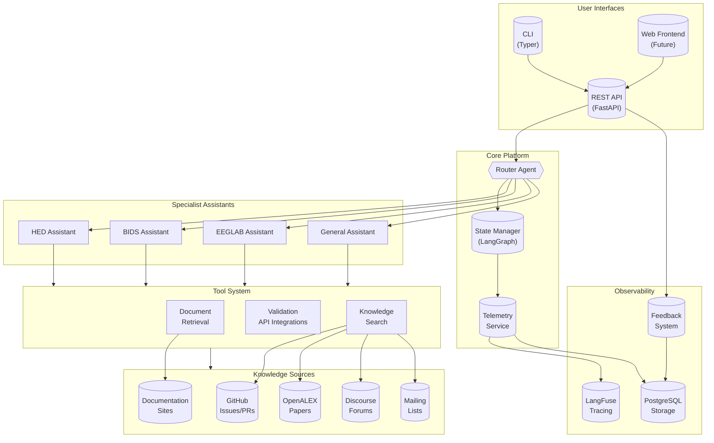
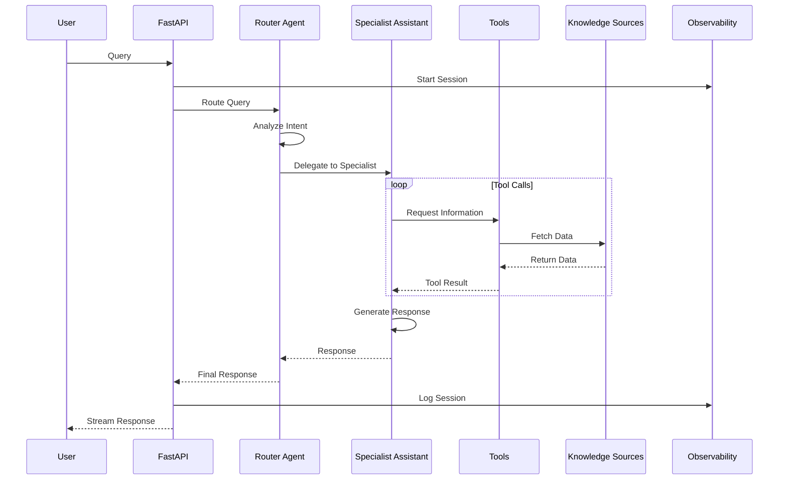
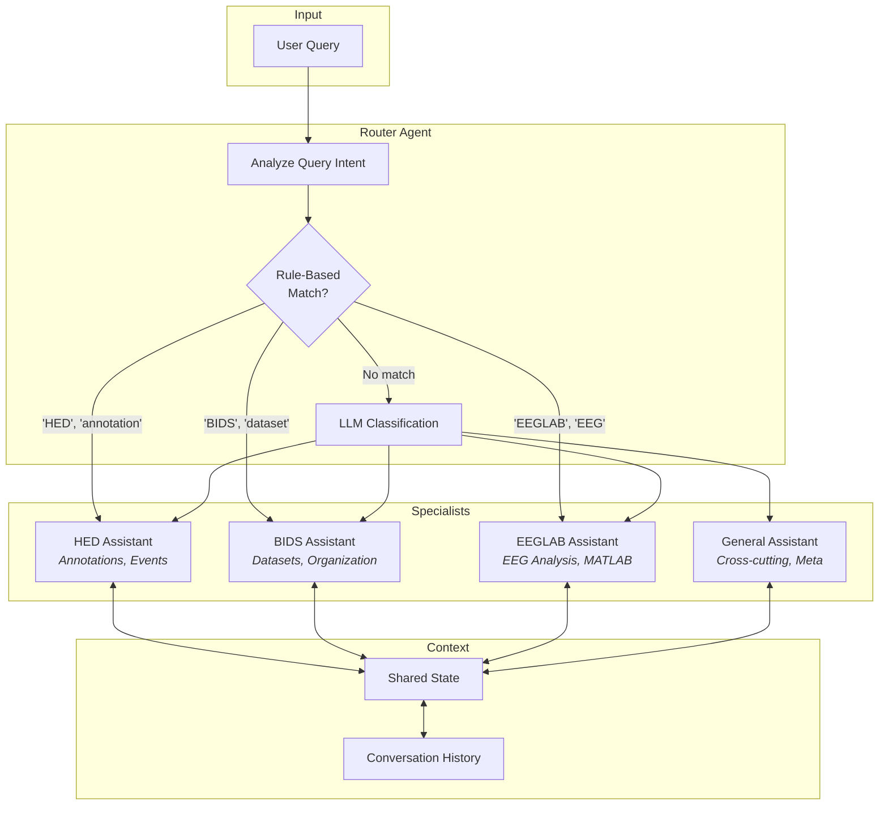
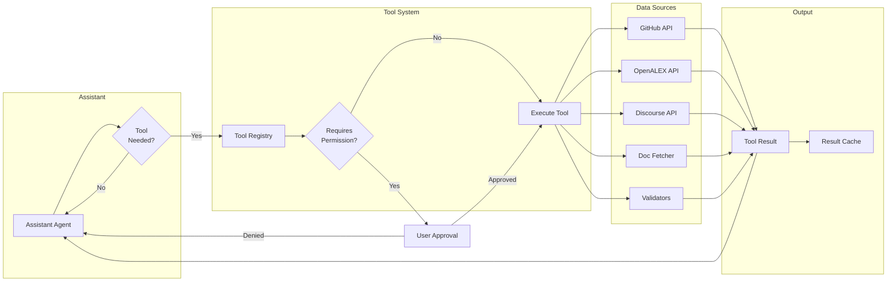
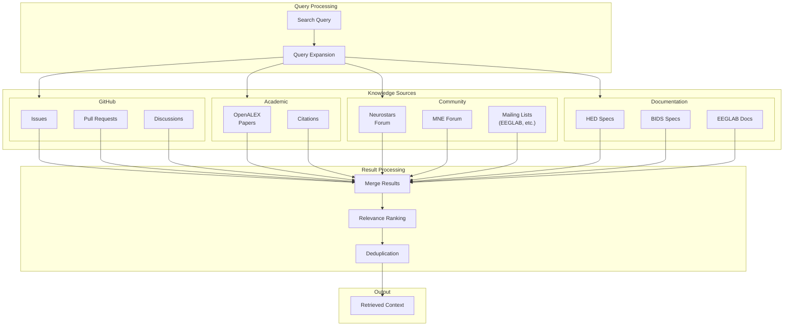
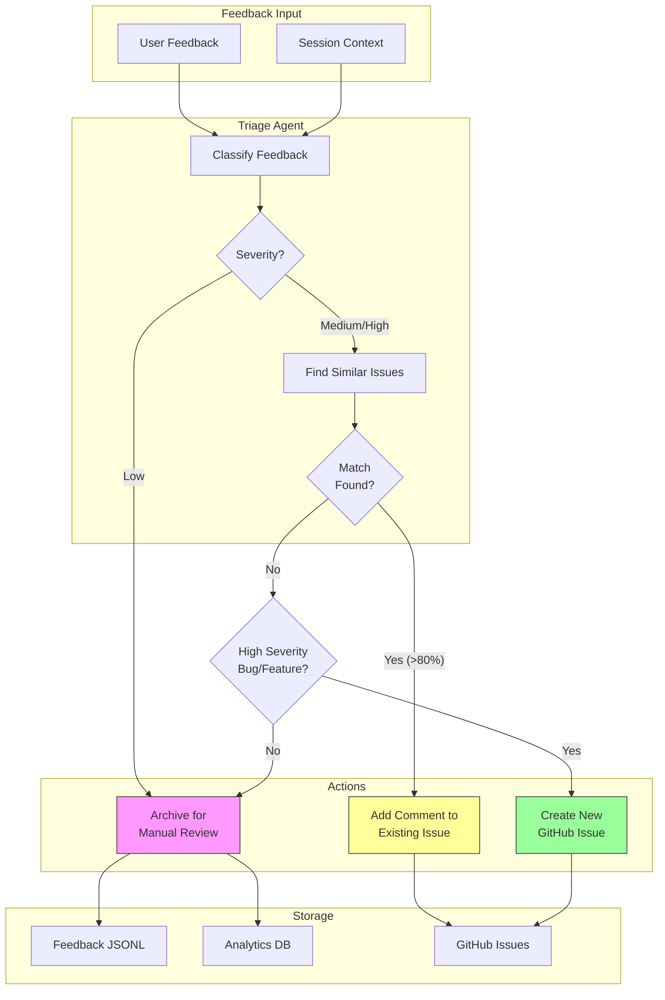
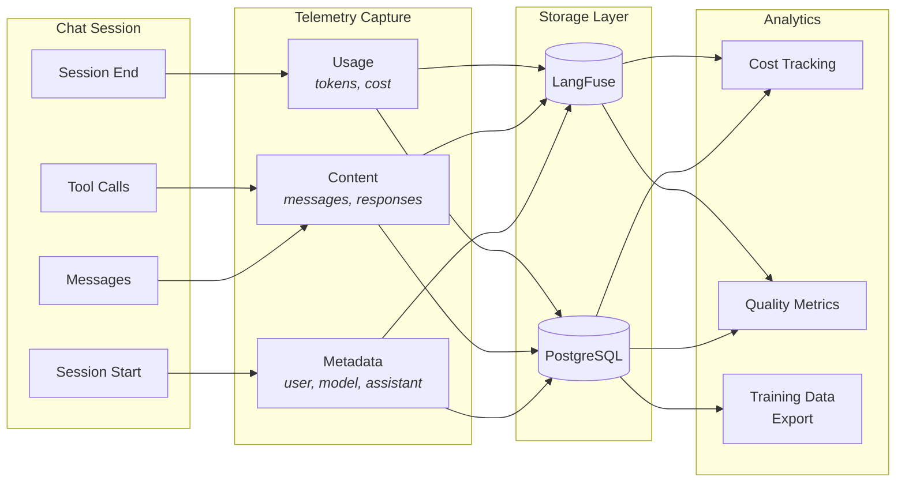
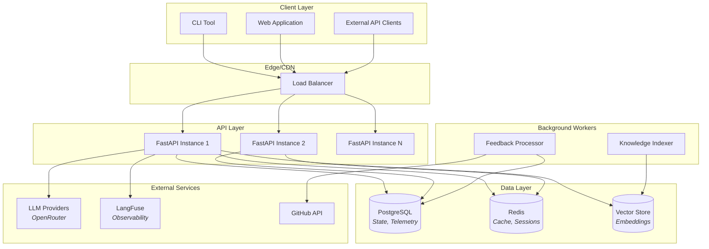

# Open Science Assistant (OSA) - Architecture

This document describes the system architecture of OSA with diagrams suitable for documentation and publications.

---

## 1. System Overview

---

## 2. Request Flow

---

## 3. Assistant Routing (Supervisor Pattern)

---

## 4. Tool Execution Pipeline

---

## 5. Knowledge Source Integration

---

## 6. Feedback Triage System

---

## 7. Telemetry and Session Recording

---

## 8. Deployment Architecture

---

## Component Summary

| Component | Technology | Purpose |
|-----------|------------|---------|
| API Server | FastAPI | REST API, WebSocket streaming |
| CLI | Typer + Rich | Command-line interface |
| Orchestration | LangGraph | Multi-agent workflows, state management |
| LLM Framework | LangChain | Model abstraction, tool calling |
| Observability | LangFuse | Tracing, cost tracking, prompt management |
| Knowledge DB | SQLite + FTS5 | Issues, PRs, papers with full-text search |
| Session State | In-memory / SQLite | Single instance, simple persistence |
| Vector Store | FAISS/Qdrant | Semantic search (future) |

### External API Integrations

OSA integrates with existing validator and tool APIs rather than hosting validation engines locally. This approach:
- Reduces deployment complexity (no need to maintain validator dependencies)
- Ensures validation logic is always up-to-date
- Leverages existing, well-tested infrastructure

| Service | API Endpoint | Integration |
|---------|--------------|-------------|
| HED Validation | https://hedtools.org/hed | String, sidecar, spreadsheet, BIDS validation |
| BIDS Validator | https://bids-validator.github.io | Dataset structure validation |
| OpenALEX | https://api.openalex.org | Academic paper search |
| GitHub API | https://api.github.com | Issues, PRs, discussions |

The assistant tools call these APIs on behalf of users, parsing results and presenting them in context.

### Why SQLite with FTS5 for Knowledge Sources?

For single-instance lab deployment, SQLite with FTS5 is the optimal choice:

| Approach | Search Speed | Dependencies | Use Case |
|----------|-------------|--------------|----------|
| JSON files | O(n) linear | None | Tiny datasets (<1K) |
| MongoDB | O(log n) indexed | External server | Multi-instance, large scale |
| **SQLite + FTS5** | O(log n) indexed | None (stdlib) | **Single instance, 10K-1M records** |
| PostgreSQL | O(log n) indexed | External server | Multi-instance, complex queries |

**SQLite + FTS5 advantages:**
- No external server (single file per project)
- Full-text search with ranking (`bm25()`)
- 100-1000x faster than JSON linear scan
- Python stdlib (no extra dependencies)
- Easy backup (just copy the file)

---

## Notes for Publication-Quality Figures

For creating SVG figures suitable for scientific publications:

1. **Export Mermaid to SVG**: Use [mermaid.live](https://mermaid.live) or mermaid CLI
2. **Post-process in Inkscape/Illustrator**:
   - Adjust fonts to publication standards (Arial, Helvetica)
   - Ensure colorblind-friendly palette
   - Add figure labels (A, B, C, etc.)
   - Set appropriate stroke widths for print
3. **Recommended dimensions**:
   - Single column: 85mm width
   - Double column: 170mm width
   - Resolution: Vector (infinite) or 300 DPI minimum

The diagrams above can be combined into a single multi-panel figure showing:
- (A) Overall architecture
- (B) Request flow
- (C) Tool execution
- (D) Feedback system
