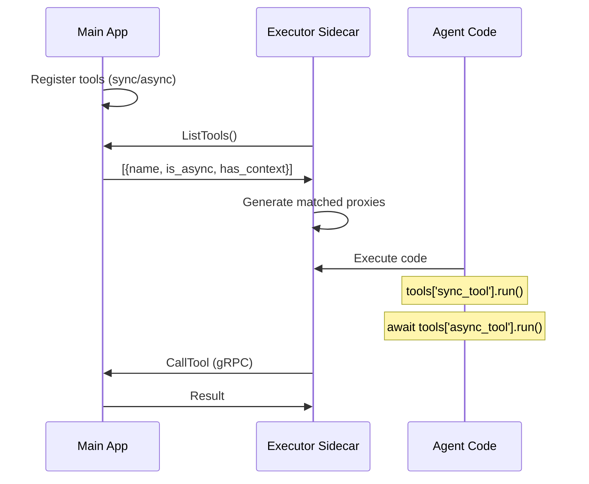

# gRPC Bridge Architecture

## Overview

The gRPC Bridge is Codemode's core innovation that enables **secure code execution** while maintaining **full tool access**. Code runs in an isolated container with no network access, but tools execute in the main application with full permissions.

## Problem It Solves

Traditional code execution faces a dilemma:

- **Option 1**: Execute code with full access → **Security risk**
- **Option 2**: Execute code in isolation → **No tool access**

**Codemode's Solution**: Execute code in isolation, but proxy tool calls back to main app via gRPC.

## Architecture

```
┌─────────────────────────────────────────────────────────────┐
│ POD / Container Group                                        │
│                                                              │
│  ┌──────────────────┐              ┌──────────────────────┐ │
│  │ Main App         │◄────gRPC────►│ Executor             │ │
│  │ (HAS network)    │              │ (NO network)         │ │
│  │                  │              │                      │ │
│  │ - Real tools     │              │ - Code execution    │ │
│  │ - ToolService    │              │ - Tool proxies      │ │
│  │ - Postgres ✅     │              │ - Read-only FS      │ │
│  │ - APIs ✅         │              │ - No capabilities   │ │
│  └────────┬─────────┘              └──────────────────────┘ │
│           │                                                  │
│           ▼                                                  │
│  [Database, APIs, External Services]                        │
└─────────────────────────────────────────────────────────────┘
```

## Matched Proxy Pattern

Codemode uses a **matched proxy pattern** where the tool proxy in the executor matches the actual tool's sync/async signature. This enables agents to generate correct code patterns.

### How It Works

1. **At startup**, the executor fetches tool metadata via `ListTools` RPC
2. **For each tool**, the executor generates the appropriate proxy:
   - **Sync tool** → `SyncToolProxy` (blocking `run()`)
   - **Async tool** → `AsyncToolProxy` (async `run()`)
3. **Agent-generated code** uses the correct calling pattern



## Tool Calling Patterns

### Sync Tools

Most tools are synchronous. Call them directly **without await**:

```python
# Sync tool - direct call
weather = tools['weather'].run(location='NYC')
db = tools['database'].run(query='SELECT 1')
result = {'weather': weather, 'db': db}
```

For **parallel execution** of sync tools, use `ThreadPoolExecutor`:

```python
from concurrent.futures import ThreadPoolExecutor

with ThreadPoolExecutor() as ex:
    f1 = ex.submit(tools['weather'].run, location='NYC')
    f2 = ex.submit(tools['database'].run, query='SELECT 1')
    weather, db = f1.result(), f2.result()

result = {'weather': weather, 'db': db}
```

### Async Tools

Async tools **must be awaited**:

```python
import asyncio

async def main():
    # Async tool - must use await
    weather = await tools['weather_async'].run(location='NYC')
    db = await tools['database_async'].run(query='SELECT 1')
    return {'weather': weather, 'db': db}

result = asyncio.run(main())
```

For **parallel execution** of async tools, use `asyncio.gather`:

```python
import asyncio

async def main():
    # Async tools run in parallel with gather
    weather, db = await asyncio.gather(
        tools['weather_async'].run(location='NYC'),
        tools['database_async'].run(query='SELECT 1')
    )
    return {'weather': weather, 'db': db}

result = asyncio.run(main())
```

### Context-Aware Tools

Tools that need runtime context use `run_with_context()`:

```python
# Sync context-aware tool
result = tools['my_tool'].run_with_context(context, value='test')

# Async context-aware tool
result = await tools['my_async_tool'].run_with_context(context, value='test')
```

## Tool Metadata

The `ListTools` RPC returns metadata for each tool:

```protobuf
message ToolInfo {
  string name = 1;
  bool is_async = 2;        // True if tool.run() is async
  bool has_context = 3;     // True if tool has run_with_context()
  string description = 4;   // Optional description
}
```

This enables:
- **Correct proxy generation** (sync vs async)
- **Agent awareness** of tool capabilities
- **Validation** of tool calls

## Implementation

### Main App: gRPC ToolService

```python
from codemode.grpc import create_tool_server

# Register tools
registry.register_tool('weather', WeatherTool())       # sync
registry.register_tool('weather_async', WeatherAsync())  # async

# Start gRPC ToolService
server = create_tool_server(
    registry,
    host="0.0.0.0",
    port=50051,
    api_key="your-secret-key",
    enable_concurrency=True,  # Enable parallel tool execution
    max_workers=4,
)
await server.start()
```

### Executor: Matched Tool Proxies

The executor generates appropriate proxies based on tool metadata:

```python
# Sync tool proxy (for sync tools)
class SyncToolProxy:
    def run(self, **kwargs):
        with grpc.insecure_channel(self.target) as channel:
            stub = codemode_pb2_grpc.ToolServiceStub(channel)
            response = stub.CallTool(request, metadata=metadata)
            return response.result

# Async tool proxy (for async tools)
class AsyncToolProxy:
    async def run(self, **kwargs):
        async with grpc.aio.insecure_channel(self.target) as channel:
            stub = codemode_pb2_grpc.ToolServiceStub(channel)
            response = await stub.CallTool(request, metadata=metadata)
            return response.result

# Proxies are generated based on metadata
tools = {
    'weather': SyncToolProxy('weather', ...),        # is_async=False
    'weather_async': AsyncToolProxy('weather_async', ...),  # is_async=True
}
```

## Security Benefits

### Executor Container (Isolated)

| Feature | Status | Prevents |
|---------|--------|----------|
| Network access | ❌ Disabled | Data exfiltration, API abuse |
| Filesystem | 📖 Read-only | Malware persistence |
| Capabilities | ❌ Dropped | Privilege escalation |
| User | 👤 nobody (65534) | Root exploits |

### Main App Container (Controlled)

| Feature | Status | Benefit |
|---------|--------|---------|
| Tool execution | ✅ Validated | Access control per tool |
| Network access | ✅ Full | Tools can access databases, APIs |
| Audit logging | ✅ Enabled | Track all tool calls |
| Rate limiting | ✅ Available | Prevent abuse |

## gRPC Protocol

### Services

```protobuf
service ToolService {
  rpc CallTool(ToolCallRequest) returns (ToolCallResponse);
  rpc ListTools(google.protobuf.Empty) returns (ListToolsResponse);
}
```

### Request Format

```protobuf
message ToolCallRequest {
  string tool_name = 1;
  google.protobuf.Struct arguments = 2;
  google.protobuf.Struct context = 3;
}
```

### Response Format

```protobuf
message ToolCallResponse {
  bool success = 1;
  string error = 2;
  google.protobuf.Struct result = 3;
}
```

## Performance

### Latency

- **Intra-pod communication**: <5ms
- **gRPC overhead**: ~10-20ms per tool call
- **Total**: Comparable to direct tool execution

### Concurrency

With `enable_concurrency=True`:
- **Sync tools** execute in a thread pool (parallel)
- **Async tools** execute natively with asyncio (parallel)
- **Multiple gRPC requests** handled concurrently

## Best Practices

### 1. Define Tools with Correct Signatures

```python
# Sync tool (I/O-bound, simple operations)
class WeatherTool:
    def run(self, location: str) -> str:
        return fetch_weather_sync(location)

# Async tool (I/O-bound, concurrent operations)
class WeatherToolAsync:
    async def run(self, location: str) -> str:
        return await fetch_weather_async(location)
```

### 2. Use Context-Aware Tools for Request Scoping

```python
from codemode.tools.base import ContextAwareTool

class DatabaseTool(ContextAwareTool):
    def run_with_context(self, context, query: str) -> dict:
        user_id = context.get('user_id')
        return execute_query(query, user_id=user_id)
```

### 3. Handle Errors Gracefully

```python
try:
    data = tools['database'].run(query="SELECT ...")
    result = {'success': True, 'data': data}
except Exception as e:
    result = {'success': False, 'error': str(e)}
```

### 4. Use Appropriate Parallelism

```python
# For sync tools: ThreadPoolExecutor
from concurrent.futures import ThreadPoolExecutor
with ThreadPoolExecutor() as ex:
    results = [ex.submit(tools['x'].run, **args) for args in tasks]

# For async tools: asyncio.gather
results = await asyncio.gather(*[tools['x'].run(**args) for args in tasks])
```

## Troubleshooting

### Issue: "Tool returned coroutine object"

**Cause**: Calling async tool without await

**Solution**:
```python
# Wrong
result = tools['async_tool'].run(location='NYC')  # Returns coroutine

# Correct
result = await tools['async_tool'].run(location='NYC')  # Returns result
```

### Issue: "Can't await sync tool"

**Cause**: Using await on sync tool

**Solution**:
```python
# Wrong
result = await tools['sync_tool'].run(location='NYC')  # TypeError

# Correct
result = tools['sync_tool'].run(location='NYC')  # Returns result
```

### Issue: "Tool not found"

**Cause**: Tool not registered or metadata not fetched

**Solution**:
```python
# Ensure tool is registered
registry.register_tool('my_tool', MyTool())

# Executor fetches metadata at startup via ListTools
```

## Related Features

- [Secure Executor](./secure-executor.md) - Executor container security
- [CrewAI Integration](./crewai-integration.md) - Using with CrewAI
- [Sidecar Deployment](../SIDECAR_DEPLOYMENT.md) - Deployment guide
