# TLS/mTLS Encryption for gRPC

Codemode supports TLS (Transport Layer Security) and mTLS (mutual TLS) encryption for secure gRPC communication between the main application and the executor sidecar.

## Table of Contents

1. [Overview](#overview)
2. [Why TLS?](#why-tls)
3. [Configuration](#configuration)
4. [Certificate Management](#certificate-management)
5. [Deployment Scenarios](#deployment-scenarios)
6. [Environment Variables](#environment-variables)
7. [Troubleshooting](#troubleshooting)
8. [Best Practices](#best-practices)

## Overview

TLS encryption protects gRPC traffic from:
- **Eavesdropping**: Encrypted communication prevents packet sniffing
- **Man-in-the-middle attacks**: Certificate validation ensures authenticity
- **Unauthorized access**: mTLS provides mutual authentication

### Communication Channels

TLS secures three gRPC communication channels:

1. **Main App → Executor** (`ExecutorClient` → `ExecutorService`)
2. **Executor → Main App** (`ToolProxy` → `ToolService`)
3. **Executor → Main App** (`ExecutorService` → `ToolService` metadata fetch)

## Why TLS?

### Without TLS

```mermaid
graph LR
    MainApp[Main App] -->|"unencrypted gRPC"| Executor[Executor]
    Executor -->|"unencrypted gRPC"| MainApp
    Attacker[👤 Attacker] -.->|"can intercept"| MainApp
    Attacker -.->|"can intercept"| Executor
```



- ✗ Traffic is visible to network attackers
- ✗ No certificate validation
- ✗ No identity verification

### With TLS

```mermaid
graph LR
    MainApp[Main App] -->|"🔒 encrypted gRPC"| Executor[Executor]
    Executor -->|"🔒 encrypted gRPC"| MainApp
    Attacker[👤 Attacker] -.x|"cannot decrypt"| MainApp
    Attacker -.x|"cannot decrypt"| Executor
```

- ✓ Traffic is encrypted
- ✓ Certificate validation prevents MITM
- ✓ mTLS provides mutual authentication

## Configuration

### Configuration File (codemode.yaml)

```yaml
grpc:
  tls:
    enabled: true
    mode: custom  # Options: 'system' or 'custom'
    cert_file: ./certs/server.crt
    key_file: ./certs/server.key
    ca_file: ./certs/ca.crt
    # Optional: For mTLS
    client_cert_file: ./certs/client.crt
    client_key_file: ./certs/client.key
```

### Configuration Options

| Option | Type | Default | Description |
|--------|------|---------|-------------|
| `enabled` | `bool` | `false` | Enable TLS encryption |
| `mode` | `"system"` \| `"custom"` | `"system"` | Certificate mode |
| `cert_file` | `str` | `None` | Path to server certificate (PEM) |
| `key_file` | `str` | `None` | Path to server private key (PEM) |
| `ca_file` | `str` | `None` | Path to CA certificate (PEM) |
| `client_cert_file` | `str` | `None` | Path to client certificate for mTLS (PEM) |
| `client_key_file` | `str` | `None` | Path to client private key for mTLS (PEM) |

### Mode: System Certificates

Uses the operating system's trusted certificate store:

```yaml
grpc:
  tls:
    enabled: true
    mode: system
```

**Use when:**
- Using CA-signed certificates (e.g., Let's Encrypt)
- Certificates are installed in OS trust store
- Production deployments with public CAs

### Mode: Custom Certificates

Uses provided certificate files:

```yaml
grpc:
  tls:
    enabled: true
    mode: custom
    cert_file: /path/to/server.crt
    key_file: /path/to/server.key
    ca_file: /path/to/ca.crt
```

**Use when:**
- Self-signed certificates for development
- Internal CA certificates
- Testing and development

### Mutual TLS (mTLS)

Requires both server and client to present certificates:

```yaml
grpc:
  tls:
    enabled: true
    mode: custom
    cert_file: /path/to/server.crt
    key_file: /path/to/server.key
    ca_file: /path/to/ca.crt
    client_cert_file: /path/to/client.crt
    client_key_file: /path/to/client.key
```

**Use when:**
- Zero-trust security model
- High-security requirements
- Compliance requirements (SOC2, HIPAA, etc.)

## Certificate Management

### Development: Self-Signed Certificates

#### Generate Test Certificates

```bash
# Using provided script
make generate-certs

# Or manually
bash scripts/generate_test_certs.sh
```

This creates:
- `test_certs/ca.crt` / `ca.key` - Certificate Authority
- `test_certs/server.crt` / `server.key` - Server certificate
- `test_certs/client.crt` / `client.key` - Client certificate

#### Manual Certificate Generation

```bash
# Create directory
mkdir -p certs && cd certs

# Generate CA
openssl req -x509 -newkey rsa:4096 -days 365 -nodes \
  -keyout ca.key \
  -out ca.crt \
  -subj "/CN=My CA/O=MyOrg"

# Generate server certificate
openssl req -newkey rsa:4096 -nodes \
  -keyout server.key \
  -out server.csr \
  -subj "/CN=localhost/O=MyOrg"

openssl x509 -req -in server.csr \
  -CA ca.crt \
  -CAkey ca.key \
  -CAcreateserial \
  -out server.crt \
  -days 365 \
  -extfile <(echo "subjectAltName=DNS:localhost,IP:127.0.0.1")

# Generate client certificate (for mTLS)
openssl req -newkey rsa:4096 -nodes \
  -keyout client.key \
  -out client.csr \
  -subj "/CN=client/O=MyOrg"

openssl x509 -req -in client.csr \
  -CA ca.crt \
  -CAkey ca.key \
  -CAcreateserial \
  -out client.crt \
  -days 365

# Set permissions
chmod 600 *.key
chmod 644 *.crt
```

### Production: CA-Signed Certificates

#### Let's Encrypt (Free)

```bash
# Install certbot
sudo apt install certbot  # Ubuntu/Debian
brew install certbot       # macOS

# Get certificate
sudo certbot certonly --standalone -d your-domain.com

# Configure Codemode
export CODEMODE_GRPC_TLS_CERT_FILE=/etc/letsencrypt/live/your-domain.com/fullchain.pem
export CODEMODE_GRPC_TLS_KEY_FILE=/etc/letsencrypt/live/your-domain.com/privkey.pem
```

#### Internal CA

```bash
# Request certificate from your internal CA
# Example: using HashiCorp Vault
vault write pki/issue/server-role \
  common_name="your-service.internal" \
  alt_names="localhost" \
  ttl=8760h

# Save certificate and key
vault read -format=json pki/issue/server-role > cert.json
jq -r '.data.certificate' cert.json > server.crt
jq -r '.data.private_key' cert.json > server.key
jq -r '.data.issuing_ca' cert.json > ca.crt
```

### Certificate Rotation

**Automated Rotation (Recommended):**

```bash
# Setup cron job for certificate renewal
0 0 * * * certbot renew --quiet && systemctl restart your-service
```

**Manual Rotation:**

1. Generate new certificates
2. Update configuration or environment variables
3. Restart services (zero-downtime with blue-green deployment)

## Deployment Scenarios

### Scenario 1: Development (Self-Signed)

**Setup:**
```bash
make generate-certs
export CODEMODE_GRPC_TLS_ENABLED=true
export CODEMODE_GRPC_TLS_MODE=custom
export CODEMODE_GRPC_TLS_CERT_FILE=./test_certs/server.crt
export CODEMODE_GRPC_TLS_KEY_FILE=./test_certs/server.key
export CODEMODE_GRPC_TLS_CA_FILE=./test_certs/ca.crt
```

**Use case:** Local development and testing

### Scenario 2: Docker Compose

**docker-compose.yml:**
```yaml
services:
  app:
    environment:
      - CODEMODE_GRPC_TLS_ENABLED=true
      - CODEMODE_GRPC_TLS_MODE=custom
      - CODEMODE_GRPC_TLS_CERT_FILE=/certs/server.crt
      - CODEMODE_GRPC_TLS_KEY_FILE=/certs/server.key
      - CODEMODE_GRPC_TLS_CA_FILE=/certs/ca.crt
    volumes:
      - ./certs:/certs:ro

  executor:
    environment:
      - CODEMODE_GRPC_TLS_ENABLED=true
      - CODEMODE_GRPC_TLS_MODE=custom
      - CODEMODE_GRPC_TLS_CERT_FILE=/certs/executor.crt
      - CODEMODE_GRPC_TLS_KEY_FILE=/certs/executor.key
      - CODEMODE_GRPC_TLS_CA_FILE=/certs/ca.crt
    volumes:
      - ./certs:/certs:ro
```

**Use case:** Multi-container development, testing

### Scenario 3: Kubernetes (Production)

**secret.yaml:**
```yaml
apiVersion: v1
kind: Secret
metadata:
  name: tls-certs
type: Opaque
data:
  server.crt: <base64-encoded-cert>
  server.key: <base64-encoded-key>
  ca.crt: <base64-encoded-ca>
```

**deployment.yaml:**
```yaml
apiVersion: apps/v1
kind: Deployment
metadata:
  name: codemode-app
spec:
  template:
    spec:
      containers:
      - name: app
        env:
        - name: CODEMODE_GRPC_TLS_ENABLED
          value: "true"
        - name: CODEMODE_GRPC_TLS_MODE
          value: "custom"
        - name: CODEMODE_GRPC_TLS_CERT_FILE
          value: "/certs/server.crt"
        - name: CODEMODE_GRPC_TLS_KEY_FILE
          value: "/certs/server.key"
        - name: CODEMODE_GRPC_TLS_CA_FILE
          value: "/certs/ca.crt"
        volumeMounts:
        - name: tls-certs
          mountPath: /certs
          readOnly: true

      - name: executor
        env:
        - name: CODEMODE_GRPC_TLS_ENABLED
          value: "true"
        - name: CODEMODE_GRPC_TLS_MODE
          value: "custom"
        - name: CODEMODE_GRPC_TLS_CERT_FILE
          value: "/certs/server.crt"
        - name: CODEMODE_GRPC_TLS_KEY_FILE
          value: "/certs/server.key"
        - name: CODEMODE_GRPC_TLS_CA_FILE
          value: "/certs/ca.crt"
        volumeMounts:
        - name: tls-certs
          mountPath: /certs
          readOnly: true

      volumes:
      - name: tls-certs
        secret:
          secretName: tls-certs
```

**Use case:** Production deployments

## Environment Variables

The executor sidecar and generated ToolProxy code read TLS configuration from environment variables:

### Server Configuration (ExecutorService, ToolService)

| Variable | Description | Example |
|----------|-------------|---------|
| `CODEMODE_GRPC_TLS_ENABLED` | Enable TLS | `true` |
| `CODEMODE_GRPC_TLS_MODE` | Certificate mode | `custom` |
| `CODEMODE_GRPC_TLS_CERT_FILE` | Server certificate path | `/certs/server.crt` |
| `CODEMODE_GRPC_TLS_KEY_FILE` | Server key path | `/certs/server.key` |
| `CODEMODE_GRPC_TLS_CA_FILE` | CA certificate path | `/certs/ca.crt` |
| `CODEMODE_GRPC_TLS_REQUIRE_CLIENT_AUTH` | Require client certificate | `true` |

### Client Configuration (ExecutorClient, ToolProxy)

| Variable | Description | Example |
|----------|-------------|---------|
| `CODEMODE_GRPC_TLS_ENABLED` | Enable TLS | `true` |
| `CODEMODE_GRPC_TLS_MODE` | Certificate mode | `custom` |
| `CODEMODE_GRPC_TLS_CA_FILE` | CA certificate path | `/certs/ca.crt` |
| `CODEMODE_GRPC_TLS_CLIENT_CERT_FILE` | Client certificate path | `/certs/client.crt` |
| `CODEMODE_GRPC_TLS_CLIENT_KEY_FILE` | Client key path | `/certs/client.key` |

## Troubleshooting

### Issue: Certificate Verification Failed

**Error:**
```
SSL certificate verify failed: self signed certificate
```

**Solutions:**
1. Ensure certificate CN/SAN matches hostname
2. Provide CA certificate via `ca_file`
3. Check certificate hasn't expired
4. For self-signed certs, use `mode: custom` and provide CA

**Check certificate:**
```bash
openssl x509 -in server.crt -noout -text
openssl x509 -in server.crt -noout -dates
```

### Issue: Connection Refused

**Error:**
```
failed to connect to all addresses
```

**Solutions:**
1. Verify TLS is enabled on both client and server
2. Check certificate files exist and are readable
3. Verify correct ports (default: 50051 for ToolService, 8001 for ExecutorService)
4. Check firewall rules

### Issue: Hostname Mismatch

**Error:**
```
Hostname mismatch: certificate is valid for 'localhost' but connecting to '127.0.0.1'
```

**Solutions:**
1. Use hostname that matches certificate CN/SAN
2. Add IP addresses to SAN: `subjectAltName=DNS:localhost,IP:127.0.0.1`
3. For Docker, use service names instead of localhost

### Issue: Permission Denied

**Error:**
```
PermissionError: [Errno 13] Permission denied: '/certs/server.key'
```

**Solutions:**
```bash
# Fix file permissions
chmod 600 /certs/*.key
chmod 644 /certs/*.crt

# Verify ownership
chown user:group /certs/*
```

## Best Practices

### Security

1. ✅ **Use strong key sizes** (4096-bit RSA minimum)
2. ✅ **Enable mTLS** for production
3. ✅ **Rotate certificates** every 90 days
4. ✅ **Never commit private keys** to version control
5. ✅ **Use secrets management** (Vault, Kubernetes Secrets)
6. ✅ **Monitor certificate expiration**
7. ✅ **Set restrictive file permissions** (`chmod 600` for private keys)
8. ✅ **Test certificate validation** in staging

### Performance

- **Expected overhead**: 5-10% latency, <5% CPU
- **Handshake cost**: ~50-100ms (amortized over connection lifetime)
- **Use keep-alive connections** to minimize handshake overhead
- **Consider hardware acceleration** (AES-NI) for high-throughput scenarios

### Operations

1. **Test in non-production first**
2. **Have rollback plan** (disable TLS quickly if issues arise)
3. **Monitor certificate expiration** (30 days warning)
4. **Automate certificate renewal**
5. **Document certificate locations** and renewal procedures
6. **Test disaster recovery** (certificate loss, expiration)

## References

- [gRPC Authentication](https://grpc.io/docs/guides/auth/)
- [OpenSSL Documentation](https://www.openssl.org/docs/)
- [Let's Encrypt](https://letsencrypt.org/)
- [TLS Best Practices (Mozilla)](https://wiki.mozilla.org/Security/Server_Side_TLS)
