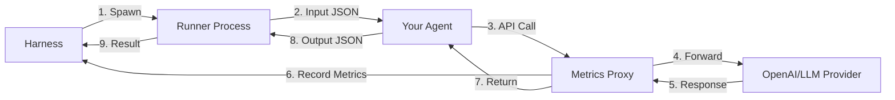

<h1 align="center">PacaBench</h1>

<p align="center">
  <strong>A local-first Benchmark Harness for LLM agents</strong>
</p>

<p align="center">
  <i>Stop playing script whack-a-mole with your benchmarks & start looking at reproducible results.</i>
</p>

<p align="center">
  <a href="https://github.com/fastpaca/pacabench/actions/workflows/lint.yml">
    
  </a>
  <a href="https://opensource.org/license/apache-2-0">
    
  </a>
  <a href="https://www.rust-lang.org/">
    
  </a>
  <a href="https://pypi.org/project/pacabench/">
    
  </a>
</p>

<p align="center">
  <a href="https://github.com/fastpaca/pacabench/stargazers">
    
  </a>
</p>

<p align="center">
  
</p>

---

## The Problem

Benchmarking LLM agents *should* be simple. In reality it usually looks like this

* A long run fails at 13% due to an API hiccup after ~5hrs.
* You restart from scratch.
* Some cases silently succeed while others crash your scripts.
* You copy JSON blobs around trying to recover partial results and write one-off scripts to juggle it.
* You don't know how many tokens were actually used or how long responses truly took.

What should be a **"start it, walk away, come back for results"** evaluation turns into a multi-day slog of brittle scripts, half-finished results, and unreliable metrics.

**Benchmarks shouldn't be harder than building the agent.** 

You don't need an enterprise platform that takes weeks to integrate. You need a tool that works.

## What is PacaBench

PacaBench is a harness built for the reality of agentic LLM development. It handles the messy parts of benchmarking so you can focus on your agents.

* **It doesn't crash.** Agents run in isolated processes. If one crashes, the harness records the failure and keeps moving.
* **It remembers where it left off.** State is saved after every single case. If you kill the process or your machine restarts, you resume exactly where you stopped.
* **It handles the retry loop.** Run the suite, let it finish, then retry failures with a single command.
* **It measures reality.** A built-in proxy sits between your agent and the LLM provider to track exact latency and token usage. No more guessing or relying on self-reported metrics.

[Examples](examples/) | [Issues](https://github.com/fastpaca/pacabench/issues)

---

## Quick Start

### Installation

```bash
pip install pacabench
```

Or run directly without installing:

```bash
uvx pacabench@latest --help
```

### Usage

Initialize a new project:

```bash
pacabench init
```

Run a quick test:

```bash
pacabench run --limit 10
```

<p align="center">
  
</p>

See all runs:

```bash
pacabench show
```

<p align="center">
  
</p>

Drill into a specific run:

```bash
pacabench show <run-id>
pacabench show <run-id> --cases
pacabench show <run-id> --failures
```

<p align="center">
  
</p>


Retry failures:

```bash
pacabench retry <run-id>
```

Export for analysis:

```bash
pacabench export <run-id> > results.json
```

---

## CLI Reference

| Command | Description |
|---------|-------------|
| `pacabench show` | List all runs |
| `pacabench show <run>` | Show run details |
| `pacabench show <run> --cases` | Show individual case results |
| `pacabench show <run> --failures` | Show only failed cases |
| `pacabench run` | Start a benchmark run |
| `pacabench run --limit N` | Run with limited cases (for testing) |
| `pacabench run -a agent1,agent2` | Run only specific agents |
| `pacabench retry <run>` | Retry failed cases from a run |
| `pacabench export <run>` | Export results to JSON |
| `pacabench export <run> --format md` | Export results to Markdown |
| `pacabench show-config` | Show parsed configuration |
| `pacabench init` | Create a new project |

Partial run IDs work - just type enough to uniquely match (e.g., `pacabench show 120358`).

---

## Configuration

Define your entire benchmark in one `pacabench.yaml` file. Configure it once, run it forever.

```yaml
name: memory-benchmark
description: Evaluating long-term memory capabilities
version: "1.0.0"

config:
  concurrency: 4
  timeout_seconds: 60

agents:
  - name: "mem0-agent"
    command: "python agents/mem0_agent.py"

datasets:
  - name: "membench"
    source: "git:https://github.com/import-myself/Membench.git"
    prepare: "python scripts/prepare_membench.py"
    input_map:
      input: "question"
      expected: "ground_truth"
    evaluator:
      type: "llm_judge"
      model: "gpt-4o-mini"

output:
  directory: "./runs"
```

### Why YAML?

Because you should be able to _describe_ a benchmark, not build a bespoke system for every new test suite.

---

## Agent Interface

Your agent needs to read JSON from stdin and write JSON to stdout. *No new SDK to learn here*.

| Input (STDIN) | Output (STDOUT) |
|---------------|-----------------|
| `{"case_id": "1", "input": "Hi"}` | `{"output": "Hello!", "error": null}` |

Write your agent as a hook, or straight up usage in python, golang, rust, node, whatever you fancy.

---

## Why?

Because I was sick of my own benchmarks blowing up. I tried running serious agent benchmarks locally and kept hitting the same wall:

* Runs would fail at 60% or 20% because of one bad response.
* I ended up with script spaghetti just to get through a single dataset.
* Re-running failures meant copy/pasting JSON blobs and praying nothing broke.
* I didn't want a heavyweight enterprise system like Arize. I wanted something that just works.
* I wanted a tool I could configure once, leave overnight, then run and re-run locally without thinking.

Benchmarking agents became a game of whack-a-mole: 

**run → isolate failures → rerun → inspect → repeat → rage**

PacaBench exists because I wanted to stop fighting my tools and start getting actual signal from my agents.


## Architecture

PacaBench is built in Rust for failure isolation and reliability, while remaining easy to install via pip/uvx. It isolates your code from the harness.



### Key Components

1.  **Harness**: Manages the run loop, persistence, and retries.
2.  **Proxy**: Intercepts API calls to provide ground-truth metrics (`OPENAI_BASE_URL` injection).
3.  **Runners**: Worker processes that ensure a bad agent doesn't kill the benchmark.
4.  **Evaluator**: Flexible scoring (LLM judges, regex, F1, exact match, etc).

---

## Contributing

We welcome contributions. See [Contributing Guidelines](CONTRIBUTING.md).

---

## License

Apache 2.0 - see [LICENSE](LICENSE)
