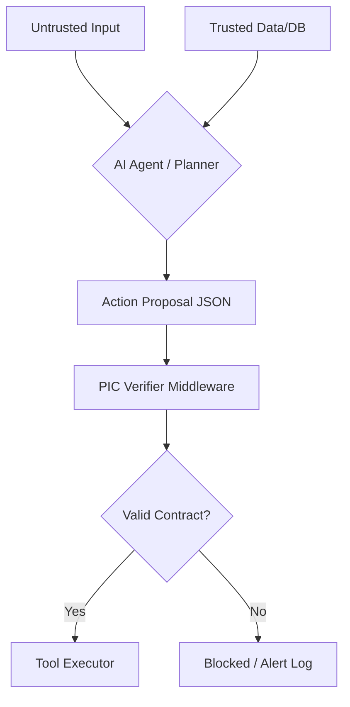

# <p> PIC Standard: Provenance & Intent Contracts</p>
**The Open Protocol for Causal Governance in Agentic AI.**

[](LICENSE)
[]()

---

## Quickstart (60 seconds)

### Option A — Install from PyPI (recommended)

```bash
pip install "pic-standard[langgraph]"
```

Verify an example proposal:

```bash
pic-cli verify examples/financial_irreversible.json
```

Expected output:

```text
✅ Schema valid
✅ Verifier passed
```

Validate schema only:

```bash
pic-cli schema examples/financial_irreversible.json
```

Expected output:

```text
✅ Schema valid
```

### Option B — Install from source (dev / contributors)

```bash
git clone https://github.com/madeinplutofabio/pic-standard.git
cd pic-standard
pip install -e .
pip install -r sdk-python/requirements-dev.txt
```

Run tests:

```bash
pytest -q
```

Run the CLI:

```bash
pic-cli verify examples/financial_irreversible.json
```

Expected output:

```text
✅ Schema valid
✅ Verifier passed
```

If you installed from source and your shell still uses an old `pic-cli`:

```bash
python -m pic_standard.cli verify examples/financial_hash_ok.json --verify-evidence
```

---

## Evidence (v0.3.0): Resolvable SHA-256 artifacts

PIC v0.3.0 introduces **deterministic evidence verification**: evidence IDs can point to a real artifact and be validated via **SHA-256**.

### What this gives you

- `evidence_id` is no longer just a label — it can be **resolved** to a file (`file://...`) and **verified**.
- Verification is **fail-closed**: if evidence can’t be resolved or verified, high-impact actions are blocked.
- “Trusted” becomes an **output** of verification (in-memory): verified evidence IDs upgrade `provenance[].trust` to `trusted` before the verifier runs.

### Run evidence verification

Verify evidence only:

```bash
pic-cli evidence-verify examples/financial_hash_ok.json
```

Expected output:

```text
✅ Schema valid
✅ Evidence invoice_123: sha256 verified
✅ Evidence verification passed
```

See it fail (expected):

```bash
pic-cli evidence-verify examples/failing/financial_hash_bad.json
```

Expected output:

```text
✅ Schema valid
❌ Evidence invoice_123: sha256 mismatch (expected ..., got ...)
❌ Evidence verification failed
```

### Gate the verifier on evidence

This runs: **schema → evidence verify → upgrade provenance trust → PIC verifier**.

```bash
pic-cli verify examples/financial_hash_ok.json --verify-evidence
```

Expected output:

```text
✅ Schema valid
✅ Verifier passed
```

And this fails closed:

```bash
pic-cli verify examples/failing/financial_hash_bad.json --verify-evidence
```

Expected output:

```text
✅ Schema valid
❌ Evidence verification failed
- invoice_123: sha256 mismatch (expected ..., got ...)
```

### Evidence references: `file://` is relative to the proposal file

`file://artifacts/invoice_123.txt` is resolved relative to the JSON proposal directory:

- `examples/financial_hash_ok.json` → `examples/artifacts/invoice_123.txt`
- `examples/failing/financial_hash_bad.json` uses `file://../artifacts/invoice_123.txt`

If you edit an artifact file, its SHA-256 changes. On Windows, recompute with:

```powershell
Get-FileHash .\examples\artifacts\invoice_123.txt -Algorithm SHA256
```

---

## Stability & Versioning

- `PIC/1.0` refers to the **proposal schema protocol version**.
- The Python package follows **Semantic Versioning**. Breaking changes will bump the major version.

---

## Integrations

### LangGraph (anchor integration)

PIC can be enforced at the **tool boundary** using a LangGraph-compatible tool execution node.

This repo provides:

- `pic_standard.integrations.PICToolNode`: a drop-in tool node that
  - requires a PIC proposal in each tool call (`args["__pic"]`)
  - validates **schema + verifier + tool binding**
  - blocks high-impact calls when provenance is insufficient
  - returns `ToolMessage` outputs (LangGraph-style messages state)

#### Run the demo (no install required)

```bash
pip install -r sdk-python/requirements-langgraph.txt
python examples/langgraph_pic_toolnode_demo.py
```

Expected output:

```text
✅ blocked as expected (untrusted money)
✅ allowed as expected (trusted money)
```

#### How it works (tool-call contract)

Your agent must attach a PIC proposal under a reserved argument key:

```json
{
  "name": "payments_send",
  "args": {
    "amount": 500,
    "__pic": {
      "protocol": "PIC/1.0",
      "intent": "Send payment",
      "impact": "money",
      "provenance": [{"id": "invoice_123", "trust": "trusted"}],
      "claims": [{"text": "Pay $500", "evidence": ["invoice_123"]}],
      "action": {"tool": "payments_send", "args": {"amount": 500}}
    }
  },
  "id": "tool_call_1"
}
```

> Tool binding is enforced: `proposal.action.tool` must match the actual tool name (`payments_send`).

---

## 1. The Core Thesis: Closing the "Causal Gap"
Traditional AI safety focuses on **Dialogue Guardrails**. However, enterprise agents operate via **Side Effects** (API calls, financial transfers).

The **Causal Gap** occurs when an agent performs a high-impact action based on instructions from an untrusted source (e.g., Indirect Prompt Injection). PIC bridges this gap by enforcing a machine-verifiable contract between **Input Provenance** and **Action Impact**.

### 🔍 Comparative Landscape
| Feature | CaMeL | RTBAS | **PIC Standard** |
| :--- | :--- | :--- | :--- |
| **Primary Focus** | Multi-Agent Dialogue | Physical/Robotic Safety | **Business Logic & Side Effects** |
| **Enforcement** | Cognitive/Reasoning | Sensor-based | **Causal Contract (JSON Schema)** |
| **Target Domain** | Research/Chat | Robotics | **SaaS / FinTech / Enterprise** |

---

## 2. Technical Glossary
* **Action Proposal:** A JSON contract generated by the agent *before* tool execution.
* **Causal Taint:** When an untrusted input influences a high-impact output without trusted evidence.
* **Impact Class:** A taxonomy of risk (e.g., `money`, `privacy`, `compute`).
* **Provenance Triplet:** The classification of data sources into `Trusted`, `Semi-Trusted`, or `Untrusted`.

---

## 3. How It Works (The Flow)


---

## 4. v1.0 Roadmap
- [✅] Phase 1 (MVP): Standardize money and privacy Impact Classes.
- [✅] Phase 2 (SDK): Reference Python/Pydantic implementation.
- [ ] Phase 3 (Integrations): Native middleware for LangGraph and CrewAI.
- [ ] Phase 4 (Advanced): Cryptographic signing for trusted provenance (v0.4+).

---

## 🤝 Community & Governance
The PIC Standard is an open-source movement. We are actively seeking:

- Security Researchers to stress-test causal logic.
- Framework Authors to build native PIC integrations.
- Enterprise Architects to define domain-specific Impact Classes.

Maintained by [ @fmsalvadori](https://www.linkedin.com/in/fmsalvadori/)
&nbsp;
[ MadeInPluto](https://github.com/madeinplutofabio)
