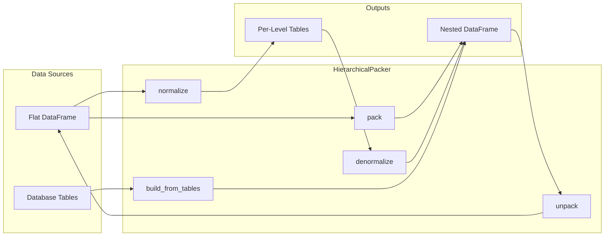

# Hierarchical Data

The `HierarchicalPacker` provides operations for working with hierarchical data structures, similar to how pandas MultiIndex works but using Polars' native nested types (structs and lists).

## The Concept

Consider geographic data with this hierarchy:

```
Country
└── City
    └── Street
```

In a flat representation, this might look like:

**Flat Table Representation**

| country.code | country.city.id | country.city.street.name | country.population | country.city.population | country.city.street.population |
|--------------|----------------|-------------------------|--------------------|------------------------|-------------------------------|
| US           | NYC            | Broadway                | 10000000           | 8000000                | 21.0                          |
| US           | NYC            | 5th Ave                 | 10000000           | 8000000                | 10.0                          |
| US           | LA             | Sunset Blvd             | 10000000           | 4000000                | 35.0                          |
| US           | LA             | Sunset Blvd             | 10000000           | 4000000                | 35.0                          |

**Nested Representation (packed at country level):**

```json
{
  "country": {
    "code": "US",
    "population": 10000000,
    "city": [
      {
        "id": "NYC",
        "population": 8000000,
        "street": [
          {"name": "Broadway", "population": 21.0},
          {"name": "5th Ave", "population": 10.0}
        ]
      },
      {
        "id": "LA",
        "population": 4000000,
        "street": [
          {"name": "Sunset Blvd", "population": 35.0}
        ]
      }
    ]
  }
}
```


The benefit of a nested structure is that multiple granularities can be represented in a single table, unlike standard flat/denormalized data. One current limitation with polars is that operations cannot easily be carried out between different granularities, but using Nexpresso, you can perform operations between different granularities by simply unpacking to your required level, performing your operations, and then packing back.

## Key Operations

### Pack - Aggregate to Coarser Granularity

```python
# From street-level (3 rows) to country-level (1 row)
country_level = packer.pack(flat_df, "country")
```

Packing:

1. Groups rows by parent keys
2. Collects child records into lists
3. Creates nested struct columns

### Unpack - Explode to Finer Granularity

```python
# From country-level (1 row) back to street-level (3 rows)
street_level = packer.unpack(country_level, "street")
```

Unpacking:

1. Explodes list columns
2. Unnests struct columns
3. Prefixes field names appropriately

## Defining a Hierarchy

### Using HierarchySpec

```python
from nexpresso import HierarchySpec, LevelSpec, HierarchicalPacker

spec = HierarchySpec(
    levels=[
        LevelSpec(name="country", id_fields=["code"]),
        LevelSpec(name="city", id_fields=["id"]),
        LevelSpec(name="street", id_fields=["name"]),
    ]
)

packer = HierarchicalPacker(spec)
```

### Using from_levels (for database tables)

```python
spec = HierarchySpec.from_levels(
    LevelSpec(name="country", id_fields=["code"]),
    LevelSpec(name="city", id_fields=["id"], parent_keys=["country_code"]),
    LevelSpec(name="street", id_fields=["name"], parent_keys=["city_id"]),
)
```

The `parent_keys` specify which columns in a child table link to the parent's `id_fields`.

## LevelSpec Options

```python
LevelSpec(
    name="city",           # Level identifier
    id_fields=["id"],      # Columns that uniquely identify records
    required_fields=None,  # Columns that must be non-null
    order_by=None,         # Expressions for ordering children
    parent_keys=None,      # Foreign keys to parent level (for build_from_tables)
)
```

## Building from Database Tables

When your data comes from normalized tables (like a database):

```python
# Separate tables with foreign keys
regions = pl.DataFrame({"id": ["west"], "name": ["West Coast"]})
stores = pl.DataFrame({
    "id": ["s1", "s2"],
    "name": ["SF Store", "LA Store"],
    "region_id": ["west", "west"],  # FK to regions
})

spec = HierarchySpec.from_levels(
    LevelSpec(name="region", id_fields=["id"]),
    LevelSpec(name="store", id_fields=["id"], parent_keys=["region_id"]),
)

packer = HierarchicalPacker(spec)
nested = packer.build_from_tables({
    "region": regions,
    "store": stores,
})
```

## Column Naming Convention

Columns follow a dot-separated naming convention:

```
{level1}.{level2}.{field_name}
```

Examples:
- `country.code` - The code field at country level
- `country.city.id` - The id field at city level
- `country.city.street.name` - The name field at street level

### Custom Separators

```python
packer = HierarchicalPacker(spec, granularity_separator="/")
# Columns: country/city/street/name
```

## Handling Extra Columns

Columns that don't belong to the hierarchy can be handled with `extra_columns`:

```python
# Data with extra column not in hierarchy
df = pl.DataFrame({
    "country.code": ["US"],
    "country.city.id": ["NYC"],
    "metadata": [{"source": "api"}],  # Not in hierarchy!
})

# Options:
packer.pack(df, "country", extra_columns="preserve")  # Default: keep if uniform
packer.pack(df, "country", extra_columns="drop")      # Silently drop
packer.pack(df, "country", extra_columns="error")     # Raise error
```

## Normalize and Denormalize

Split hierarchical data into separate tables and reconstruct:

```python
# Split into per-level tables
tables = packer.normalize(nested_df)
# {"country": country_df, "city": city_df, "street": street_df}

# Reconstruct
rebuilt = packer.denormalize(tables)
```

## Validation

Check data integrity:

```python
# Validate key columns aren't null
errors = packer.validate(df, raise_on_error=False)
for error in errors:
    print(f"Error at {error.level}: {error}")
```

Enable validation during packing:

```python
packer = HierarchicalPacker(spec, validate_on_pack=True)
# Raises if aggregated values aren't uniform
```

## Data Flow Diagram


