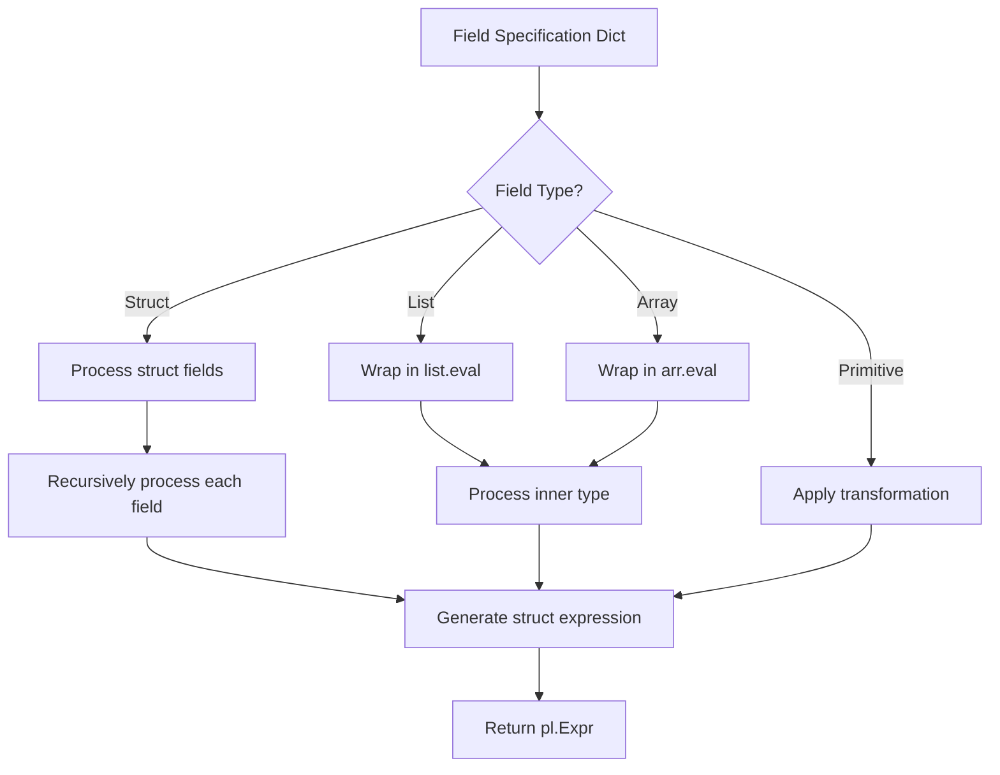

# Nested Expressions

The Nested Expression Builder is the core of Nexpresso, providing an intuitive way to transform deeply nested data structures in Polars.

## The Problem

Polars' expression API is powerful but becomes verbose with nested data:

```python
# Transforming a field inside a list of structs requires:
df.with_columns(
    pl.col("items").list.eval(
        pl.element().struct.with_fields(
            (pl.element().struct.field("price") * 
             pl.element().struct.field("qty")).alias("total")
        )
    )
)
```

## The Solution

Nexpresso provides a declarative dictionary syntax:

```python
apply_nested_operations(df, {
    "items": {
        "total": pl.field("price") * pl.field("qty"),
    }
}, struct_mode="with_fields")
```

## Field Value Types

Each key in the fields dictionary is a column or field name. The value specifies what to do:

### `None` - Keep As-Is

```python
{"field_name": None}  # Keep the field unchanged
```

!!! note "When is `None` needed?"
    - **`struct_mode="select"`**: Use `field: None` for every field you want to keep
    - **`struct_mode="with_fields"`**: `None` is **not needed inside structs** - all struct fields are preserved automatically. Only specify fields you want to add or modify.
    
    **Important:** To keep top level columns, use the standard `.with_columns()` context.

### `Callable` - Transform

```python
{"price": lambda x: x * 1.1}  # Apply 10% increase
```

The callable receives a `pl.Expr` and should return a `pl.Expr`.

### `dict` - Recurse Into Nested Structure

```python
{"customer": {"name": None, "email": None}}
```

For structs, this processes nested fields. For lists of structs, the transformation is applied to each element.

### `pl.Expr` - Create or Replace

```python
{"total": pl.field("price") * pl.field("qty")}
```

Use `pl.field()` to reference other fields in the same struct.

## How It Works

The expression builder traverses the schema and generates appropriate Polars expressions:



## Using `pl.field()` vs `pl.col()`

Inside nested structures, use `pl.field()` to reference sibling fields:

```python
# Inside a struct, pl.field() references struct fields
{"nested": {
    "a": None,
    "b": pl.field("a") * 2,  # References nested.a
}}

# pl.col() references top-level columns
{"new_col": pl.col("existing_col") + 1}
```

!!! warning "Important"
    `pl.field()` references the **original** field values, not transformed ones.
    
    ```python
    {"struct": {
        "x": lambda x: x * 2,           # x becomes 2
        "y": pl.field("x") + 1,         # Uses original x (1), not 2
    }}
    ```

## Chaining Transformations

For complex transformations, chain multiple calls:

```python
# First pass: calculate subtotals
df1 = apply_nested_operations(df, {
    "items": {"subtotal": pl.field("price") * pl.field("qty")}
}, struct_mode="with_fields")

# Second pass: calculate totals (can now reference subtotal)
df2 = apply_nested_operations(df1, {
    "items": {"total": pl.field("subtotal") * 1.08}  # With tax
}, struct_mode="with_fields")
```

## Lists of Structs

The builder automatically handles lists by wrapping expressions in `list.eval()`:

```python
df = pl.DataFrame({
    "orders": [
        [{"item": "A", "qty": 2}, {"item": "B", "qty": 3}],
        [{"item": "C", "qty": 1}],
    ]
})

# This automatically applies to each element in the list
result = apply_nested_operations(df, {
    "orders": {
        "item": None,
        "qty": None,
        "double_qty": pl.field("qty") * 2,
    }
}, struct_mode="with_fields")
```

## Arrays

As of Polars 1.0+, Arrays are fully supported using `arr.eval()`:

```python
df = pl.DataFrame({
    "values": [[1, 2], [3, 4]]
}, schema={"values": pl.Array(pl.Int64, 2)})

# Works the same as lists
```

## Deeply Nested Structures

The builder handles arbitrary nesting depth:

```python
{
    "level1": {
        "level2": {
            "level3": {
                "level4": {
                    "value": lambda x: x * 2
                }
            }
        }
    }
}
```

## Performance

The expression builder generates native Polars expressions, so performance is equivalent to hand-written code. The expressions are lazy-compatible and benefit from Polars' query optimization.
