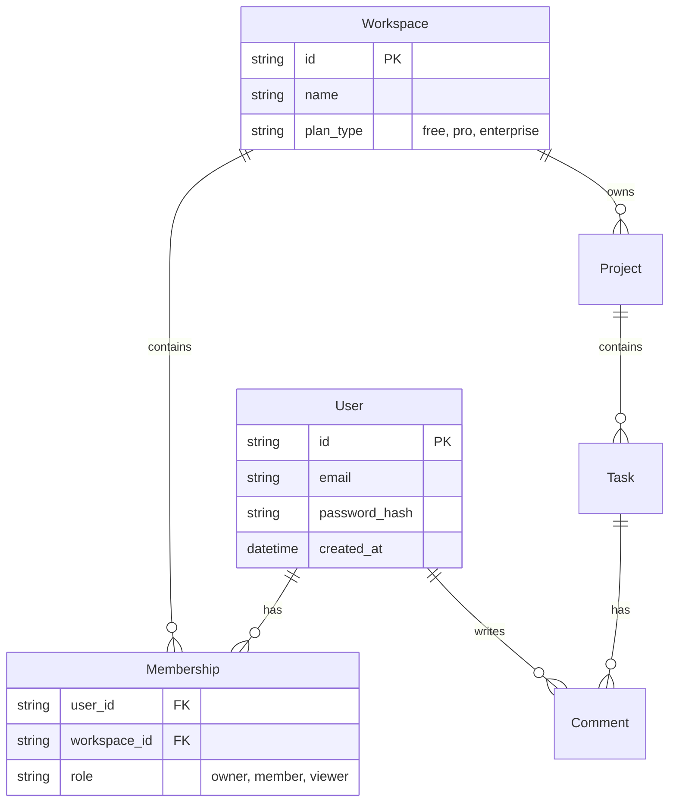

# 🗄️ [PRODUCT_NAME] Data Model
<!-- Example: Product Kit Data Model, TaskFlow Data Model, etc. -->

> "[TAGLINE]"
<!-- Example: "How our entities relate to each other." -->

## Purpose
This document maps the current data structures, entity relationships, and data constraints. Use this to ensure new features don't break existing data integrity or create incompatible schemas.

---

## 1. Entity Relationship Diagram (ERD)
*Visual representation of how entities relate to each other.*

```mermaid
erDiagram
    [ENTITY_1] ||--o{ [RELATIONSHIP_TABLE] : [RELATIONSHIP_TYPE]
    [ENTITY_2] ||--o{ [RELATIONSHIP_TABLE] : [RELATIONSHIP_TYPE]
    [ENTITY_2] ||--o{ [ENTITY_3] : [RELATIONSHIP_TYPE]
    [ENTITY_3] ||--o{ [ENTITY_4] : [RELATIONSHIP_TYPE]
    [ENTITY_1] ||--o{ [ENTITY_4] : [RELATIONSHIP_TYPE]

    [ENTITY_1] {
        string id PK
        string [FIELD_1]
        string [FIELD_2]
        datetime [FIELD_3]
    }

    [ENTITY_2] {
        string id PK
        string [FIELD_1]
        string [FIELD_2] "[ENUM_VALUES]"
    }

    [RELATIONSHIP_TABLE] {
        string [ENTITY_1_ID] FK
        string [ENTITY_2_ID] FK
        string [FIELD_1] "[ENUM_VALUES]"
    }
```

<!-- Example:

-->

---

## 2. Key Entities
*Detailed documentation of core data objects.*

### [ENTITY_1_ICON] [ENTITY_1_NAME]
<!-- Example: 👤 User -->
-   **Source of Truth**: [SYSTEM_OF_RECORD]
-   **Key Constraints**: [CONSTRAINT_DESCRIPTION]
-   **Relationships**: [RELATIONSHIP_SUMMARY]

<!-- Example:
-   **Source of Truth**: User directory service.
-   **Key Constraints**: Email must be unique. Password must be hashed using bcrypt.
-   **Relationships**: Can belong to multiple Workspaces via Membership
-->

### [ENTITY_2_ICON] [ENTITY_2_NAME]
<!-- Example: 🏢 Workspace -->
-   **Source of Truth**: [SYSTEM_OF_RECORD]
-   **Key Constraints**: [CONSTRAINT_DESCRIPTION]
-   **Relationships**: [RELATIONSHIP_SUMMARY]

<!-- Example:
-   **Source of Truth**: Workspace service.
-   **Key Constraints**: `plan_type` defaults to "free". Name must be unique per user.
-   **Relationships**: Has many Projects, has many Users via Membership
-->

### [ENTITY_3_ICON] [ENTITY_3_NAME]
<!-- Example: 📋 Task -->
-   **Source of Truth**: [SYSTEM_OF_RECORD]
-   **Key Constraints**: [CONSTRAINT_DESCRIPTION]
-   **Relationships**: [RELATIONSHIP_SUMMARY]

<!-- Example:
-   **Source of Truth**: Task service.
-   **Key Constraints**: `status` enum (`todo`, `in_progress`, `done`). Must belong to a Project.
-   **Relationships**: Belongs to Project, has many Comments, assigned to User
-->

---

## 3. Data Lifecycle
*How data is created, retained, archived, and deleted.*

### Retention Policies
-   **[ENTITY_NAME]**: [RETENTION_POLICY]
-   **[ENTITY_NAME]**: [RETENTION_POLICY]

<!-- Example:
-   **Tasks**: Deleted tasks are "soft deleted" (kept for 30 days) before permanent removal.
-   **Users**: Account data retained for 90 days after deletion for legal compliance.
-->

### Archival Strategy
-   **[ARCHIVAL_RULE_1]**: [ARCHIVAL_DESCRIPTION]
-   **[ARCHIVAL_RULE_2]**: [ARCHIVAL_DESCRIPTION]

<!-- Example:
-   **Projects**: Inactive for > 1 year are moved to cold storage (S3 Glacier).
-   **Logs**: Archived after 6 months to reduce storage footprint.
-->

### Backup & Recovery
-   **Backup Frequency**: [BACKUP_SCHEDULE]
-   **Retention**: [BACKUP_RETENTION]
-   **Recovery Time Objective (RTO)**: [RTO_VALUE]

<!-- Example:
-   **Backup Frequency**: Daily at 2 AM UTC
-   **Retention**: 30 days rolling window
-   **Recovery Time Objective (RTO)**: < 4 hours
-->

---

## 4. Data Validation Rules
*Business logic enforced at the data layer.*

### [ENTITY_NAME] Validation
-   **[FIELD_NAME]**: [VALIDATION_RULE]
-   **[FIELD_NAME]**: [VALIDATION_RULE]

<!-- Example:
### Task Validation
-   **Title**: Max 140 characters, required
-   **Due Date**: Cannot be in the past (validated at creation)
-   **Assignee**: Must be a member of the parent workspace
-->

---

**Version**: [DATA_MODEL_VERSION] | **Last Updated**: [LAST_UPDATED_DATE]
<!-- Example: Version: 3.2.0 | Last Updated: 2026-01-02 -->
