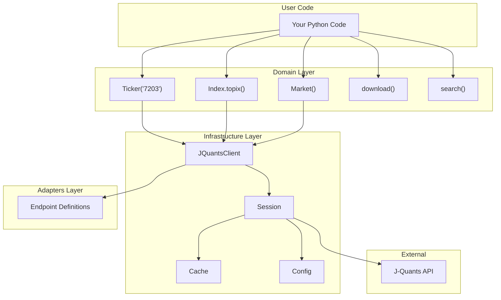
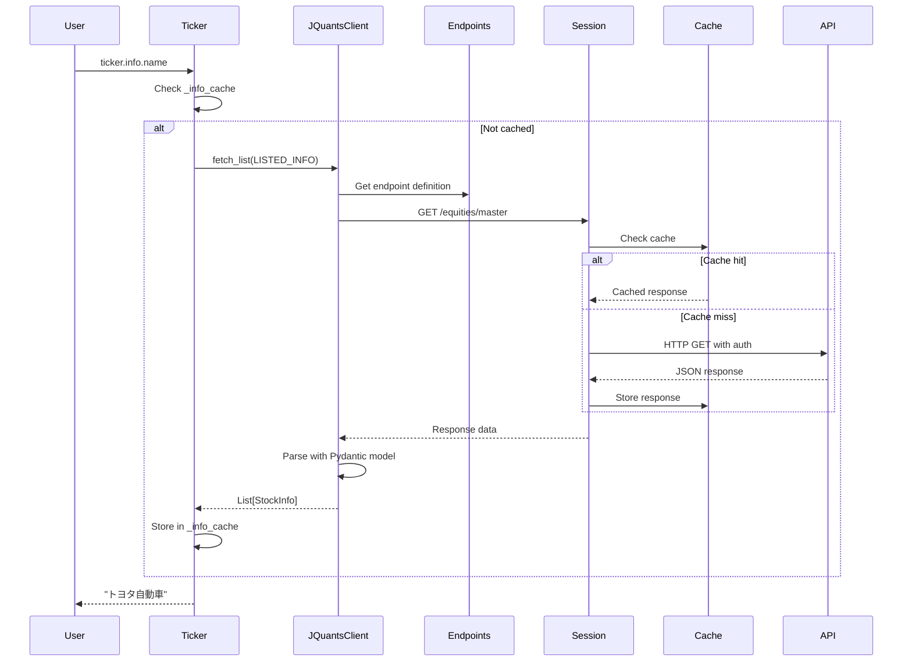
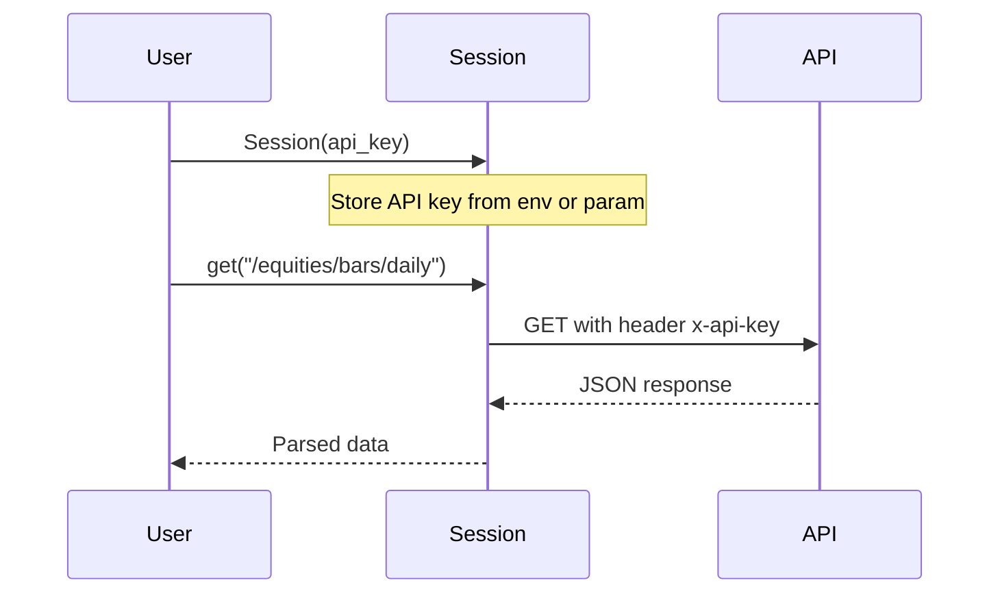

# Architecture

PyJQuants follows a **Clean Domain-Driven Design** with a yfinance-style public API.

## High-Level Overview



## Layer Responsibilities

### Domain Layer (`pyjquants/domain/`)

The **domain layer** provides the user-facing OOP interface. These classes are what you import and use directly.

| Module | Purpose |
|--------|---------|
| `ticker.py` | `Ticker` class with `.info`, `.history()`, `.financials`, `.dividends` |
| `index.py` | `Index` class with `.history()` for market indices |
| `market.py` | `Market` class with trading calendar and sector info |
| `info.py` | `TickerInfo` dataclass for convenient attribute access |
| `utils.py` | Date parsing utilities (`parse_period`, `parse_date`) |
| `models/` | Pydantic models organized by domain |

**Key pattern**: Lazy loading. Properties like `ticker.info` fetch data only on first access, then cache.

### Infrastructure Layer (`pyjquants/infra/`)

The **infrastructure layer** handles HTTP, authentication, caching, and configuration.

| Module | Purpose |
|--------|---------|
| `session.py` | `Session` with API key auth and rate limiting |
| `client.py` | `JQuantsClient` - generic fetch/parse with typed endpoints |
| `config.py` | `JQuantsConfig` - environment and configuration loading |
| `cache.py` | `TTLCache`, `NullCache` - response caching |
| `exceptions.py` | Exception hierarchy (`APIError`, `AuthenticationError`, etc.) |

### Adapters Layer (`pyjquants/adapters/`)

The **adapters layer** contains declarative API endpoint definitions.

| Module | Purpose |
|--------|---------|
| `endpoints.py` | `Endpoint` definitions for all J-Quants API endpoints |

**Key pattern**: Declarative endpoints. Each endpoint defines its path, response key, model class, and pagination behavior:

```python
DAILY_QUOTES: Endpoint[PriceBar] = Endpoint(
    path="/equities/bars/daily",
    response_key="data",
    model="PriceBar",
    paginated=True,
)
```

## Data Flow



## Package Structure

```
pyjquants/
├── __init__.py           # Public API exports
├── py.typed              # PEP 561 marker
├── domain/               # Business logic
│   ├── ticker.py         # Ticker class + download() + search()
│   ├── index.py          # Index class with .history()
│   ├── market.py         # Market utilities (calendar, sectors)
│   ├── info.py           # TickerInfo dataclass
│   ├── utils.py          # Date parsing utilities
│   └── models/           # Pydantic models (split by domain)
│       ├── __init__.py   # Re-exports all models
│       ├── base.py       # BaseModel, MarketSegment enum
│       ├── price.py      # PriceBar, IndexPrice
│       ├── company.py    # StockInfo, Sector
│       ├── financial.py  # FinancialStatement, Dividend
│       └── market.py     # TradingCalendarDay, MarginInterest
├── infra/                # Infrastructure layer
│   ├── session.py        # HTTP session with auth
│   ├── client.py         # Generic fetch/parse client
│   ├── config.py         # Configuration
│   ├── cache.py          # Caching utilities
│   └── exceptions.py     # Exception hierarchy
└── adapters/             # API layer
    └── endpoints.py      # Declarative endpoint definitions
```

## Authentication (V2 API Key)

V2 API uses simple API key authentication - no token flow needed:



**Key points:**
- Get API key from [J-Quants dashboard](https://application.jpx-jquants.com/)
- Set via `JQUANTS_API_KEY` environment variable
- No token expiry or refresh needed

## Design Decisions

### Why yfinance-style API?

Familiar interface for quantitative analysts:

```python
# yfinance
import yfinance as yf
ticker = yf.Ticker("AAPL")
ticker.info["shortName"]
df = ticker.history(period="1mo")

# pyjquants (same pattern)
import pyjquants as pjq
ticker = pjq.Ticker("7203")
ticker.info.name
df = ticker.history(period="1mo")
```

### Why Lazy Loading?

Ticker objects are cheap to create. Fetching data happens only when needed:

```python
# No API call yet
ticker = pjq.Ticker("7203")

# API call happens here (cached afterward)
name = ticker.info.name
```

### Why Declarative Endpoints?

Centralizes API knowledge and enables generic client:

- All endpoint metadata in one file (`endpoints.py`)
- `JQuantsClient` works with any endpoint definition
- Easy to add new endpoints
- Type safety with generics

### Why Separate Domain/Infra/Adapters?

Clean architecture with clear dependencies:

```
Domain  →  Infra  →  Adapters
   ↓          ↓
 Models    Session
```

- **Domain** knows nothing about HTTP
- **Infra** handles all I/O concerns
- **Adapters** maps external API to internal models
- Easy to mock for testing
