# Advanced Quantum Job Scheduling and Optimization Guide

## Overview

The Advanced Quantum Job Scheduling system provides intelligent, automated job scheduling and resource optimization for quantum computing workloads across multiple platforms (IBM Quantum, AWS Braket, Azure Quantum). It leverages SciRS2's machine learning, optimization, and statistical analysis capabilities to provide unprecedented scheduling intelligence.

## Key Features

### 1. Intelligent Job Scheduling
- **Multi-objective Optimization**: Balances throughput, cost, energy efficiency, fairness, and SLA compliance
- **Machine Learning-based Decisions**: Uses ensemble ML models to optimize scheduling decisions
- **Predictive Analytics**: Forecasts queue times, resource needs, and performance metrics
- **Dynamic Priority Adjustment**: Automatically adjusts job priorities based on real-time conditions

### 2. Multi-Platform Load Balancing
- **Cross-Platform Optimization**: Distributes jobs optimally across IBM, AWS, and Azure quantum platforms
- **Real-time Adaptation**: Dynamically adjusts to platform availability and performance changes
- **Fault-Tolerant Allocation**: Automatically migrates jobs when platforms become unavailable
- **Locality-Aware Scheduling**: Considers network latency and data proximity

### 3. SciRS2 Optimization Integration
- **Advanced Algorithms**: Leverages SciRS2's optimization, statistics, and graph algorithms
- **Reinforcement Learning**: Self-improving scheduling decisions based on historical performance
- **Feature Engineering**: Automated extraction and selection of relevant features for ML models
- **Multi-objective NSGA-II**: Pareto-optimal solutions for complex scheduling problems

### 4. Cost-Aware Scheduling
- **Dynamic Pricing Models**: Adapts to real-time pricing changes across platforms
- **Budget Management**: Tracks and enforces budget constraints at user, project, and organizational levels
- **ROI Optimization**: Maximizes return on investment for quantum computing resources
- **Cost Prediction**: Forecasts job costs with high accuracy

### 5. Predictive Scheduling
- **Queue Time Prediction**: Uses time series forecasting to predict accurate wait times
- **Demand Forecasting**: Anticipates resource demand patterns
- **Anomaly Detection**: Identifies and responds to unusual platform behavior
- **Capacity Planning**: Optimizes resource allocation based on predicted demand

### 6. Real-time Adaptation
- **Platform Monitoring**: Continuous monitoring of quantum platform performance
- **Auto-scaling**: Automatically scales resource allocation based on demand
- **Circuit Migration**: Migrates running jobs when platforms experience issues
- **Emergency Response**: Handles platform failures and service disruptions

### 7. Fairness and SLA Support
- **Game-theoretic Fairness**: Ensures fair resource allocation in multi-user environments
- **SLA Monitoring**: Tracks service level agreement compliance in real-time
- **Violation Prediction**: Predicts and prevents SLA violations before they occur
- **Mitigation Strategies**: Automatically applies strategies to maintain SLA compliance

### 8. Advanced Queueing
- **Priority-based Scheduling**: Supports multiple priority levels with intelligent adjustment
- **Deadline-aware Scheduling**: Optimizes for jobs with strict deadlines
- **Fair Share Scheduling**: Ensures equitable resource distribution among users
- **Backfill Optimization**: Maximizes resource utilization through intelligent backfilling

## Architecture

```mermaid
graph TB
    A[Advanced Quantum Scheduler] --> B[Decision Engine]
    A --> C[Multi-Objective Optimizer]
    A --> D[Predictive Engine]
    A --> E[Cost Optimizer]
    A --> F[Energy Optimizer]
    A --> G[SLA Manager]
    A --> H[Adaptation Engine]
    A --> I[Fairness Engine]
    
    B --> B1[ML Models]
    B --> B2[Feature Pipeline]
    B --> B3[RL Agent]
    
    C --> C1[NSGA-II Optimizer]
    C --> C2[Pareto Solutions]
    C --> C3[Constraint Manager]
    
    D --> D1[Time Series Forecasting]
    D --> D2[Demand Prediction]
    D --> D3[Anomaly Detection]
    
    E --> E1[Dynamic Pricing]
    E --> E2[Budget Management]
    E --> E3[ROI Optimization]
    
    F --> F1[Energy Models]
    F --> F2[Carbon Tracking]
    F --> F3[Renewable Scheduling]
    
    G --> G1[Violation Prediction]
    G --> G2[Mitigation Engine]
    G --> G3[Compliance Tracking]
    
    H --> H1[Platform Monitor]
    H --> H2[Load Balancer]
    H --> H3[Auto Scaler]
    
    I --> I1[Game Theory Scheduler]
    I --> I2[Allocation Fairness]
    I --> I3[Incentive Design]
```



## Usage Examples

### Basic Usage

```rust
use quantrs2_device::{
    advanced_scheduling::AdvancedQuantumScheduler,
    job_scheduling::{SchedulingParams, SchedulingStrategy, AllocationStrategy, MLAlgorithm},
};

// Create advanced scheduler with ML optimization
let params = SchedulingParams {
    strategy: SchedulingStrategy::MLOptimized,
    allocation_strategy: AllocationStrategy::SciRS2Optimized,
    scirs2_params: SciRS2SchedulingParams {
        enabled: true,
        ml_algorithm: MLAlgorithm::EnsembleMethod,
        enable_prediction: true,
        ..Default::default()
    },
    ..Default::default()
};

let scheduler = AdvancedQuantumScheduler::new(params);

// Register quantum backends
scheduler.core_scheduler.register_backend(HardwareBackend::IBMQ).await?;
scheduler.core_scheduler.register_backend(HardwareBackend::AWSBraket).await?;
scheduler.core_scheduler.register_backend(HardwareBackend::AzureQuantum).await?;

// Start the intelligent scheduler
scheduler.core_scheduler.start_scheduler().await?;
```

### Job Submission with Intelligence

```rust
// Create a quantum circuit
let mut circuit = Circuit::new();
circuit.h(0);
circuit.cx(0, 1);
circuit.measure_all();

// Submit with intelligent optimization
let job_id = scheduler.submit_intelligent_job(
    circuit,
    1000,
    create_ml_training_config(),
    "user_id".to_string(),
).await?;
```

### Job Configuration Templates

The system provides pre-configured templates for common quantum computing workloads:

```rust
// Real-time quantum applications
let realtime_config = create_realtime_config();

// SLA-aware enterprise workloads
let gold_sla_config = create_sla_aware_config(SLATier::Gold);
let silver_sla_config = create_sla_aware_config(SLATier::Silver);

// Cost-optimized batch processing
let cost_config = create_cost_optimized_config(100.0); // $100 budget limit

// Energy-efficient green computing
let green_config = create_energy_efficient_config();

// Research workloads with fault tolerance
let research_config = create_research_config();

// Deadline-sensitive jobs
let deadline = SystemTime::now() + Duration::from_hours(2);
let deadline_config = create_deadline_config(deadline);

// Machine learning training
let ml_config = create_ml_training_config();

// Optimization problems
let opt_config = create_optimization_config();

// Large-scale quantum simulation
let sim_config = create_simulation_config(30); // 30 qubits
```

### Multi-Objective Backend Selection

```rust
// Define resource requirements
let requirements = ResourceRequirements {
    min_qubits: 10,
    max_depth: Some(500),
    min_fidelity: Some(0.95),
    memory_mb: Some(8192),
    cpu_cores: Some(4),
    required_features: vec!["high_fidelity".to_string()],
};

// Define user preferences
let preferences = UserPreferences {
    cost_sensitivity: 0.3,
    performance_priority: 0.4,
    energy_preference: 0.2,
    latency_tolerance: Duration::from_secs(300),
};

// Get optimal backend selection
let optimal_backend = scheduler.select_optimal_backend(
    &requirements,
    &preferences
).await?;
```

### Predictive Analytics

```rust
// Get queue time predictions
let queue_predictions = scheduler.predict_queue_times().await?;
for (backend, predicted_time) in queue_predictions {
    println!("Backend {:?}: predicted queue time {:?}", backend, predicted_time);
}

// Monitor SLA compliance
let compliance_report = scheduler.monitor_sla_compliance().await?;
println!("SLA Compliance: {:.2}%", compliance_report.current_compliance * 100.0);
println!("Predicted violations: {}", compliance_report.predicted_violations.len());
```

### Cost and Energy Optimization

```rust
// Optimize costs
let cost_report = scheduler.optimize_costs().await?;
println!("Potential savings: ${:.2}", cost_report.savings_potential);

// Optimize energy consumption
let energy_report = scheduler.optimize_energy_consumption().await?;
println!("Sustainability score: {:.2}", energy_report.sustainability_score);
println!("Carbon reduction potential: {:.2} kg CO2", 
         energy_report.carbon_reduction_potential);
```

### Fairness and Game Theory

```rust
// Apply fair scheduling
let fairness_report = scheduler.apply_fair_scheduling().await?;
println!("User satisfaction scores: {:?}", fairness_report.user_satisfaction_scores);
println!("Incentive mechanisms: {}", fairness_report.incentive_mechanisms.len());
```

### Real-time Adaptation

```rust
// Dynamic load balancing
scheduler.dynamic_load_balance().await?;

// The scheduler automatically:
// - Monitors platform performance
// - Detects anomalies and failures
// - Migrates circuits when needed
// - Adjusts routing policies
// - Scales resources up/down
```

## Scheduling Strategies

### 1. MLOptimized
Uses machine learning models to make optimal scheduling decisions based on historical data and real-time conditions.

### 2. MultiObjectiveOptimized
Applies multi-objective optimization using NSGA-II to find Pareto-optimal solutions balancing multiple objectives.

### 3. ReinforcementLearning
Uses reinforcement learning agents that learn and improve scheduling policies over time.

### 4. GeneticAlgorithm
Applies genetic algorithms to evolve optimal scheduling solutions.

### 5. GameTheoreticFair
Uses game theory and mechanism design to ensure fair resource allocation in competitive environments.

### 6. EnergyAware
Prioritizes energy efficiency and renewable energy usage in scheduling decisions.

### 7. DeadlineAwareSLA
Optimizes for meeting deadlines and SLA requirements with predictive violation detection.

## Resource Allocation Strategies

### 1. SciRS2Optimized
Uses SciRS2's advanced optimization algorithms for intelligent resource allocation.

### 2. MultiObjectiveOptimized
Balances multiple objectives (cost, performance, energy) in allocation decisions.

### 3. PredictiveAllocation
Uses predictive models to allocate resources based on forecasted demand and performance.

### 4. EnergyEfficient
Prioritizes energy-efficient platforms and renewable energy availability.

### 5. CostOptimized
Minimizes costs while meeting performance requirements.

### 6. PerformanceOptimized
Maximizes performance regardless of cost considerations.

### 7. FaultTolerant
Ensures high availability through redundant allocations and automatic failover.

### 8. LocalityAware
Considers network latency and data proximity in allocation decisions.

## Machine Learning Algorithms

### 1. EnsembleMethod (Recommended)
Combines multiple algorithms for robust, accurate predictions.

### 2. RandomForest
Provides good performance with interpretable feature importance.

### 3. GradientBoosting
Excellent for complex patterns and high accuracy requirements.

### 4. NeuralNetwork
Best for complex, non-linear relationships in large datasets.

### 5. DeepRL
Self-improving reinforcement learning for adaptive scheduling.

### 6. GraphNN
Specialized for topology-aware scheduling with quantum device connectivity.

## Configuration Parameters

### Core Scheduling Parameters

```rust
SchedulingParams {
    strategy: SchedulingStrategy::MLOptimized,
    allocation_strategy: AllocationStrategy::SciRS2Optimized,
    time_slice: Duration::from_secs(60),
    max_jobs_per_user: Some(100),
    fair_share_weights: HashMap::new(),
    backfill_threshold: Duration::from_secs(300),
    load_balance_factor: 0.8,
    scirs2_params: SciRS2SchedulingParams { /* ... */ },
}
```

### SciRS2 Parameters

```rust
SciRS2SchedulingParams {
    enabled: true,
    objective_weights: HashMap::from([
        ("throughput".to_string(), 0.25),
        ("fairness".to_string(), 0.25),
        ("utilization".to_string(), 0.2),
        ("cost".to_string(), 0.15),
        ("energy".to_string(), 0.1),
        ("sla_compliance".to_string(), 0.05),
    ]),
    learning_window: Duration::from_secs(86400), // 24 hours
    optimization_frequency: Duration::from_secs(180), // 3 minutes
    ml_algorithm: MLAlgorithm::EnsembleMethod,
    enable_prediction: true,
    retrain_frequency: Duration::from_secs(3600), // 1 hour
    feature_params: FeatureParams::default(),
}
```

### Multi-Objective Weights

```rust
MultiObjectiveWeights {
    throughput: 0.3,
    cost: 0.2,
    energy: 0.15,
    fairness: 0.15,
    sla_compliance: 0.1,
    qos: 0.1,
}
```

## Monitoring and Analytics

### Queue Analytics

```rust
let analytics = scheduler.core_scheduler.get_queue_analytics().await?;
println!("Total queue length: {}", analytics.total_queue_length);
println!("System load: {:.2}", analytics.system_load);
println!("Throughput: {:.2} jobs/hour", analytics.throughput);
```

### Performance Metrics

The scheduler tracks comprehensive metrics:

- **Queue Times**: Actual vs predicted queue times
- **Execution Times**: Job execution duration and efficiency
- **Resource Utilization**: Platform utilization across all backends
- **Cost Metrics**: Actual costs vs budgets and predictions
- **Energy Metrics**: Power consumption and carbon footprint
- **SLA Metrics**: Compliance rates and violation patterns
- **Fairness Metrics**: Resource distribution and user satisfaction

### Real-time Monitoring

```rust
// The scheduler provides real-time monitoring through events
let mut event_receiver = scheduler.core_scheduler.subscribe_events().await?;

while let Some(event) = event_receiver.recv().await {
    match event {
        SchedulerEvent::JobSubmitted(job_id) => {
            println!("Job submitted: {}", job_id);
        },
        SchedulerEvent::JobScheduled(job_id, backend) => {
            println!("Job {} scheduled on {:?}", job_id, backend);
        },
        SchedulerEvent::JobCompleted(job_id, result) => {
            println!("Job {} completed", job_id);
        },
        SchedulerEvent::BackendStatusChanged(backend, status) => {
            println!("Backend {:?} status changed: {:?}", backend, status);
        },
        SchedulerEvent::QueueAnalyticsUpdated(analytics) => {
            println!("Queue analytics updated: {} jobs in queue", 
                     analytics.total_queue_length);
        },
    }
}
```

## Best Practices

### 1. Configuration Optimization

- Use `MLOptimized` strategy for most workloads
- Enable SciRS2 optimization for advanced features
- Set appropriate objective weights for your use case
- Configure retrain frequency based on workload variability

### 2. Job Configuration

- Use appropriate job configuration templates
- Set realistic resource requirements
- Include deadline information when relevant
- Tag jobs for better analytics and grouping

### 3. Monitoring and Alerting

- Monitor SLA compliance regularly
- Set up budget alerts for cost control
- Track energy consumption for sustainability goals
- Monitor fairness metrics in multi-user environments

### 4. Performance Tuning

- Adjust optimization frequency based on workload patterns
- Fine-tune ML model parameters for your specific use case
- Monitor prediction accuracy and retrain models when needed
- Use appropriate feature engineering for your domain

### 5. Cost Management

- Set budget limits at appropriate levels
- Use cost-optimized configurations for non-critical workloads
- Monitor dynamic pricing patterns
- Leverage renewable energy scheduling for cost savings

### 6. Energy Optimization

- Enable carbon footprint tracking
- Use energy-efficient configurations when possible
- Schedule non-urgent jobs during renewable energy availability
- Monitor and optimize for sustainability goals

## Troubleshooting

### Common Issues

1. **High Queue Times**
   - Check platform availability
   - Verify resource requirements are not too restrictive
   - Consider using backfill scheduling
   - Review job priorities and fair share weights

2. **SLA Violations**
   - Review SLA configurations for realism
   - Check if mitigation strategies are enabled
   - Monitor platform performance for issues
   - Adjust resource allocation strategies

3. **High Costs**
   - Enable cost optimization features
   - Review budget limits and alerts
   - Use cost-optimized job configurations
   - Monitor dynamic pricing patterns

4. **Poor ML Model Performance**
   - Check if sufficient historical data is available
   - Verify feature engineering is appropriate
   - Consider adjusting retrain frequency
   - Review model selection for your use case

5. **Fairness Issues**
   - Review fair share weights configuration
   - Check user behavior patterns
   - Enable game-theoretic fairness mechanisms
   - Monitor user satisfaction metrics

### Debugging

```rust
// Enable detailed logging
env_logger::init();

// Check scheduler status
let status = scheduler.core_scheduler.get_status().await?;
println!("Scheduler status: {:?}", status);

// Review backend performance
let backend_performance = scheduler.core_scheduler.get_backend_performance().await?;
for (backend, perf) in backend_performance {
    println!("Backend {:?}: utilization {:.2}, success rate {:.2}", 
             backend, perf.utilization, perf.success_rate);
}

// Check ML model performance
let model_metrics = scheduler.get_model_metrics().await?;
for (model_name, metrics) in model_metrics {
    println!("Model {}: accuracy {:.3}, f1_score {:.3}", 
             model_name, metrics.accuracy, metrics.f1_score);
}
```

## Future Enhancements

### Planned Features

1. **Quantum Network Integration**: Support for distributed quantum computing across networks
2. **Advanced Error Correction**: Integration with quantum error correction scheduling
3. **Federated Learning**: Privacy-preserving ML across multiple organizations
4. **Blockchain Integration**: Decentralized resource allocation and billing
5. **Advanced Visualization**: Real-time dashboards and analytics
6. **API Extensions**: REST and GraphQL APIs for external integration

### Research Directions

1. **Quantum-Classical Hybrid Scheduling**: Optimal allocation between quantum and classical resources
2. **Noise-Aware Scheduling**: Scheduling based on real-time device noise characteristics
3. **Quantum Advantage Detection**: Automatic detection of quantum advantage opportunities
4. **Advanced Game Theory**: Complex mechanism design for multi-organizational environments
5. **Sustainability Optimization**: Advanced carbon footprint optimization and renewable energy integration

## References

- [SciRS2 Documentation](../../../scirs/README.md)
- [Quantum Device Management](../README.md)
- [Multi-Objective Optimization in Quantum Computing](https://arxiv.org/abs/quantum-optimization)
- [Game Theory in Resource Allocation](https://doi.org/game-theory-resources)
- [Machine Learning for Quantum Computing](https://quantum-ml.org)

## Contributing

Contributions to the advanced scheduling system are welcome! Please see the [contributing guidelines](../CONTRIBUTING.md) for more information.

## License

This project is licensed under the MIT License - see the [LICENSE](../LICENSE) file for details.