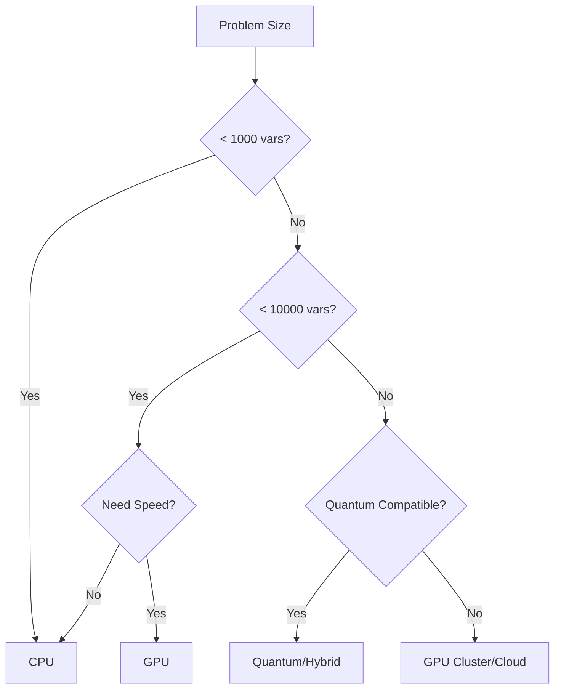

# QuantRS2-Tytan Hardware Deployment Guide

This guide covers deployment strategies for QuantRS2-Tytan across various hardware platforms, from local CPUs to quantum annealers.

## Table of Contents

1. [Hardware Overview](#hardware-overview)
2. [CPU Deployment](#cpu-deployment)
3. [GPU Deployment](#gpu-deployment)
4. [Quantum Hardware](#quantum-hardware)
5. [Cloud Deployment](#cloud-deployment)
6. [Hybrid Architectures](#hybrid-architectures)
7. [Performance Monitoring](#performance-monitoring)
8. [Troubleshooting](#troubleshooting)

## Hardware Overview

### Supported Platforms

| Platform | Type | Best For | Typical Problem Size |
|----------|------|----------|---------------------|
| CPU | Classical | Development, small-medium problems | < 10,000 variables |
| GPU | Classical | Large problems, parallel sampling | < 100,000 variables |
| D-Wave | Quantum | Specific QUBO problems | < 5,000 qubits |
| IBM Quantum | Gate-based | Research, QAOA | < 100 qubits |
| Fujitsu DA | Digital Annealer | Industrial optimization | < 100,000 variables |
| AWS Braket | Cloud Quantum | Exploration, hybrid | Varies |

### Decision Tree



## CPU Deployment

### Local Deployment

#### System Requirements
- **Minimum**: 4 cores, 8GB RAM
- **Recommended**: 8+ cores, 32GB RAM
- **Optimal**: 16+ cores, 64GB+ RAM

#### Installation
```bash
# Install with CPU optimizations
cargo install quantrs2-tytan --features="cpu-optimized"

# Verify installation
quantrs2-tytan --version
```

#### Configuration
```rust
use quantrs2_tytan::{CpuBackend, CpuConfig};

let cpu_backend = CpuBackend::new(CpuConfig {
    num_threads: num_cpus::get(),
    use_simd: true,
    simd_width: detect_simd_width(),
    numa_aware: true,
    thread_pinning: true,
});
```

#### Performance Optimization
```rust
// NUMA-aware allocation
#[cfg(target_os = "linux")]
{
    use libnuma::{NodeMask, numa_run_on_node_mask};
    
    let mask = NodeMask::new();
    mask.set(0); // Use NUMA node 0
    numa_run_on_node_mask(&mask);
}

// CPU affinity
use core_affinity;
let cores = core_affinity::get_core_ids().unwrap();
core_affinity::set_for_current(cores[0]);
```

### Cluster Deployment

#### MPI Setup
```bash
# Install MPI dependencies
sudo apt-get install mpich libmpich-dev

# Build with MPI support
cargo build --features="mpi"
```

#### Cluster Configuration
```rust
use quantrs2_tytan::{MpiBackend, MpiConfig};

let mpi_backend = MpiBackend::new(MpiConfig {
    comm_world: mpi::initialize().unwrap(),
    partition_strategy: PartitionStrategy::BlockCyclic,
    sync_interval: 100,
    reduction_op: ReductionOp::Min,
});

// Run on cluster
// mpirun -np 32 ./quantrs2-solver --input problem.qubo
```

## GPU Deployment

### NVIDIA GPUs

#### Requirements
- CUDA 11.0+ or 12.0+
- NVIDIA Driver 450.80+
- Compute Capability 6.0+

#### Installation
```bash
# Install CUDA toolkit
wget https://developer.download.nvidia.com/compute/cuda/12.0.0/local_installers/cuda_12.0.0_525.60.13_linux.run
sudo sh cuda_12.0.0_525.60.13_linux.run

# Build with CUDA support
cargo build --features="cuda"

# Verify GPU
nvidia-smi
```

#### GPU Configuration
```rust
use quantrs2_tytan::{GpuBackend, GpuConfig, DeviceSelection};

let gpu_backend = GpuBackend::new(GpuConfig {
    device_selection: DeviceSelection::Auto,
    memory_pool_size: 4 * 1024 * 1024 * 1024, // 4GB
    kernel_config: KernelConfig {
        block_size: 256,
        grid_size: GridSize::Auto,
        shared_memory_size: 48 * 1024,
    },
    use_tensor_cores: true,
    async_execution: true,
});

// Multi-GPU setup
let multi_gpu = MultiGpuBackend::new(vec![0, 1, 2, 3]) // Use GPUs 0-3
    .with_strategy(MultiGpuStrategy::DataParallel)
    .with_nvlink(true);
```

### AMD GPUs

#### ROCm Setup
```bash
# Install ROCm
wget -q -O - https://repo.radeon.com/rocm/rocm.gpg.key | sudo apt-key add -
sudo apt update
sudo apt install rocm-dev

# Build with ROCm
cargo build --features="rocm"
```

#### Configuration
```rust
let rocm_backend = RocmBackend::new(RocmConfig {
    device_id: 0,
    wavefront_size: 64,
    use_hip_graphs: true,
});
```

## Quantum Hardware

### D-Wave Systems

#### Setup
```bash
# Install D-Wave Ocean SDK
pip install dwave-ocean-sdk

# Configure API token
dwave config create
```

#### Integration
```rust
use quantrs2_tytan::{DWaveBackend, DWaveConfig};

let dwave_backend = DWaveBackend::new(DWaveConfig {
    token: std::env::var("DWAVE_TOKEN")?,
    endpoint: "https://cloud.dwavesys.com/sapi/v2/",
    solver: "Advantage_system4.1",
    embedding_params: EmbeddingParams {
        max_chain_length: 7,
        chain_strength_multiplier: 2.0,
        timeout: Duration::from_secs(30),
    },
    annealing_params: AnnealingParams {
        annealing_time: 20, // microseconds
        num_reads: 1000,
        auto_scale: true,
    },
});

// Submit problem
let embedding = dwave_backend.find_embedding(&qubo)?;
let response = dwave_backend.sample_qubo(&qubo, embedding)?;
```

#### Embedding Optimization
```rust
// Use minorminer for better embeddings
let embedder = MinorMinerEmbedder::new()
    .with_tries(10)
    .with_timeout(60)
    .with_threads(4);

let embedding = embedder.find_embedding(&qubo, &dwave_backend.topology())?;

// Chain break analysis
let chain_breaks = analyze_chain_breaks(&response);
if chain_breaks.avg_breaks > 0.1 {
    // Increase chain strength
    config.embedding_params.chain_strength_multiplier *= 1.5;
}
```

### IBM Quantum

#### Setup
```python
# Install Qiskit
pip install qiskit qiskit-aer qiskit-ibm-runtime

# Configure credentials
from qiskit_ibm_runtime import QiskitRuntimeService
QiskitRuntimeService.save_account(channel="ibm_quantum", token="YOUR_TOKEN")
```

#### QAOA Implementation
```rust
use quantrs2_tytan::{IbmQuantumBackend, QaoaConfig};

let ibm_backend = IbmQuantumBackend::new(IbmqConfig {
    backend_name: "ibmq_qasm_simulator", // or real device
    token: std::env::var("IBMQ_TOKEN")?,
    hub: "ibm-q",
    group: "open",
    project: "main",
});

let qaoa = QaoaSolver::new(QaoaConfig {
    layers: 3,
    optimizer: ClassicalOptimizer::COBYLA,
    initial_params: InitialParams::TrotterizedAnnealing,
    measurement_shots: 8192,
});

let result = qaoa.solve(&qubo, &ibm_backend)?;
```

### Other Quantum Platforms

#### Rigetti
```rust
let rigetti_backend = RigettiBackend::new(RigettiConfig {
    endpoint: "https://api.qcs.rigetti.com",
    device: "Aspen-M-3",
    compiler_flags: vec!["--optimize", "--native-gates"],
});
```

#### IonQ
```rust
let ionq_backend = IonQBackend::new(IonQConfig {
    api_key: std::env::var("IONQ_API_KEY")?,
    backend: "harmony", // or "aria"
    error_mitigation: true,
});
```

## Cloud Deployment

### AWS Deployment

#### EC2 Setup
```bash
# Launch GPU instance
aws ec2 run-instances \
    --image-id ami-0abcdef1234567890 \
    --instance-type p4d.24xlarge \
    --key-name my-key \
    --security-groups my-sg
```

#### AWS Batch Configuration
```yaml
# job-definition.yaml
jobDefinitionName: quantrs2-solver
type: container
parameters:
  vcpus: 96
  memory: 768000
  gpus: 8
containerProperties:
  image: quantrs2/solver:latest
  resourceRequirements:
    - type: GPU
      value: 8
```

#### S3 Integration
```rust
use quantrs2_tytan::{S3Storage, StorageConfig};

let storage = S3Storage::new(StorageConfig {
    bucket: "my-qubo-problems",
    region: Region::UsEast1,
    credentials: Credentials::from_env()?,
});

// Save results
storage.save_results("job-123", &results).await?;
```

### Google Cloud Platform

#### GKE Deployment
```yaml
# deployment.yaml
apiVersion: apps/v1
kind: Deployment
metadata:
  name: quantrs2-solver
spec:
  replicas: 4
  template:
    spec:
      containers:
      - name: solver
        image: gcr.io/project/quantrs2:latest
        resources:
          limits:
            nvidia.com/gpu: 2
```

#### Cloud Run Setup
```bash
# Build and deploy
gcloud builds submit --tag gcr.io/PROJECT/quantrs2
gcloud run deploy quantrs2 \
    --image gcr.io/PROJECT/quantrs2 \
    --platform managed \
    --memory 32Gi \
    --cpu 8
```

### Azure Deployment

#### AKS with GPU
```bash
# Create AKS cluster with GPU nodes
az aks create \
    --resource-group myRG \
    --name myAKS \
    --node-vm-size Standard_NC24ads_A100_v4 \
    --node-count 2 \
    --enable-addons monitoring
```

## Hybrid Architectures

### CPU-GPU Hybrid

```rust
use quantrs2_tytan::{HybridBackend, HybridConfig};

let hybrid = HybridBackend::new(HybridConfig {
    cpu_backend: CpuBackend::new(Default::default()),
    gpu_backend: GpuBackend::new(Default::default()),
    partition_strategy: PartitionStrategy::ProblemSize {
        gpu_threshold: 5000,
    },
    load_balancing: LoadBalancing::Dynamic,
});

// Automatically routes to appropriate backend
let results = hybrid.solve(&qubo)?;
```

### Classical-Quantum Hybrid

```rust
let hybrid_solver = QuantumClassicalHybrid::new()
    .with_quantum_backend(dwave_backend)
    .with_classical_backend(gpu_backend)
    .with_strategy(HybridStrategy::IterativeRefinement {
        quantum_percent: 0.2,
        max_iterations: 10,
        improvement_threshold: 0.01,
    });

// Workflow:
// 1. Classical preprocessing
// 2. Quantum sampling for hard core
// 3. Classical post-processing
let solution = hybrid_solver.solve(&problem)?;
```

## Performance Monitoring

### Metrics Collection

```rust
use quantrs2_tytan::{MetricsCollector, MetricType};

let collector = MetricsCollector::new()
    .with_metrics(vec![
        MetricType::Energy,
        MetricType::Throughput,
        MetricType::MemoryUsage,
        MetricType::GpuUtilization,
        MetricType::Temperature,
    ])
    .with_interval(Duration::from_secs(1));

// Start monitoring
let monitor = collector.start_monitoring(&backend);

// Get real-time metrics
let metrics = monitor.current_metrics();
println!("GPU Utilization: {}%", metrics.gpu_util);
println!("Memory Usage: {} MB", metrics.memory_mb);
```

### Prometheus Integration

```rust
use prometheus::{Encoder, TextEncoder, Counter, Gauge};

lazy_static! {
    static ref SOLUTIONS_TOTAL: Counter = Counter::new(
        "quantrs2_solutions_total", 
        "Total solutions found"
    ).unwrap();
    
    static ref BEST_ENERGY: Gauge = Gauge::new(
        "quantrs2_best_energy",
        "Best energy found"
    ).unwrap();
}

// Export metrics
let encoder = TextEncoder::new();
let metric_families = prometheus::gather();
encoder.encode(&metric_families, &mut buffer)?;
```

### Logging and Tracing

```rust
use tracing::{info, debug, instrument};

#[instrument(skip(qubo))]
fn solve_with_trace(qubo: &Qubo) -> Result<Solution> {
    info!("Starting solve for {} variables", qubo.size());
    
    let span = tracing::span!(Level::DEBUG, "sampling");
    let _enter = span.enter();
    
    debug!("Using backend: {}", backend.name());
    let result = backend.sample(qubo)?;
    
    info!(
        best_energy = result.best_energy(),
        samples = result.len(),
        "Solve completed"
    );
    
    Ok(result)
}
```

## Troubleshooting

### Common Issues

#### 1. GPU Out of Memory
```rust
// Solution: Use batching
let batch_config = BatchConfig {
    max_batch_size: 1000,
    overlap: 0.1,
    compression: true,
};

let batched_solver = BatchedSolver::new(gpu_backend, batch_config);
```

#### 2. Poor Embedding Quality
```rust
// Solution: Try multiple embedding methods
let embedders = vec![
    Box::new(MinorMinerEmbedder::new()),
    Box::new(LayoutAwareEmbedder::new()),
    Box::new(ChainCouplerEmbedder::new()),
];

let best_embedding = find_best_embedding(&qubo, &embedders)?;
```

#### 3. Network Timeouts
```rust
// Solution: Implement retry logic
let retry_config = RetryConfig {
    max_attempts: 5,
    initial_delay: Duration::from_secs(1),
    backoff_factor: 2.0,
    max_delay: Duration::from_secs(60),
};

let client = QuantumClient::new()
    .with_retry(retry_config)
    .with_timeout(Duration::from_secs(300));
```

### Debugging Tools

#### Hardware Validation
```rust
// Test hardware capabilities
let validator = HardwareValidator::new();
let report = validator.validate(&backend)?;

println!("Hardware Report:");
println!("  Compute capability: {}", report.compute_capability);
println!("  Max problem size: {}", report.max_problem_size);
println!("  Features: {:?}", report.features);
```

#### Performance Profiling
```rust
// Enable detailed profiling
std::env::set_var("QUANTRS2_PROFILE", "1");
std::env::set_var("QUANTRS2_PROFILE_OUTPUT", "trace.json");

// Run with profiling
let profiled_result = backend.sample_with_profiling(&qubo)?;

// Analyze results
let profile = profiled_result.profile();
println!("Time breakdown:");
for (phase, duration) in profile.phases() {
    println!("  {}: {:.2}ms", phase, duration.as_secs_f64() * 1000.0);
}
```

### Best Practices

1. **Start Small**: Test with small problems first
2. **Monitor Resources**: Watch memory and GPU usage
3. **Use Appropriate Hardware**: Match hardware to problem type
4. **Enable Logging**: Set appropriate log levels
5. **Benchmark Regularly**: Track performance over time

## Deployment Checklist

- [ ] Hardware requirements verified
- [ ] Dependencies installed
- [ ] Environment variables configured
- [ ] Network connectivity tested
- [ ] Monitoring setup complete
- [ ] Backup/recovery plan in place
- [ ] Performance baselines established
- [ ] Documentation updated