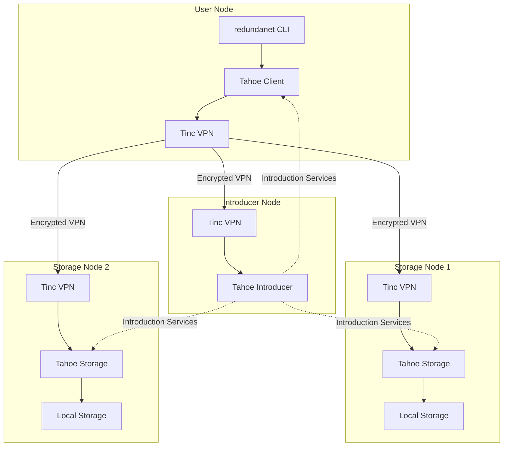

# RedundaNet - Distributed Encrypted Storage Network

RedundaNet is a distributed, encrypted storage system built on a secure mesh VPN network. It enables users to contribute storage resources to a collective grid while maintaining privacy through end-to-end encryption.

## Features

- **Decentralized Architecture**: No central authority or single point of failure
- **End-to-End Encryption**: Data is encrypted before leaving the user's device using Tahoe-LAFS
- **GPG-Based Authentication**: Secure node identity verification
- **Private Networking**: Secure Tinc mesh VPN isolates the storage network from the public internet
- **Erasure Coding**: Data is split and distributed across multiple nodes (3-of-10 scheme by default)
- **Resource Sharing**: Users contribute resources and benefit from the collective capacity
- **Containerized Deployment**: Easy setup with Docker Compose
- **Python-Based CLI**: Modern CLI with Typer for easy management

## Architecture



## Quick Start

### Prerequisites

- Python 3.11+
- Docker and Docker Compose
- GPG (for key management)

### Installation

#### Using pip (recommended)

```bash
pip install redundanet
```

#### Using Poetry (for development)

```bash
git clone https://github.com/adefilippo83/project-earthgrid.git
cd project-earthgrid
poetry install
```

### Initialize a Node

```bash
# Interactive setup
redundanet init

# Or with options
redundanet init --node-name my-node --vpn-ip 10.100.0.10
```

### Start Services with Docker

```bash
# Start as a storage node
docker compose -f docker/docker-compose.yml --profile storage up -d

# Start as a client only
docker compose -f docker/docker-compose.yml --profile client up -d

# Start as an introducer (network coordinator)
docker compose -f docker/docker-compose.yml --profile introducer up -d
```

### Check Status

```bash
redundanet status
```

## CLI Commands

```
redundanet --help

Commands:
  init        Initialize a new node
  status      Show node and network status
  sync        Sync manifest from repository
  validate    Validate manifest file

  node        Node management commands
    list      List all nodes in the network
    info      Show detailed node information
    add       Add a new node to manifest
    remove    Remove a node from manifest

  network     Network management
    join      Join an existing network
    leave     Leave the network
    peers     Show connected peers
    vpn       VPN management (start/stop/status)

  storage     Storage management
    status    Show storage status
    mount     Mount Tahoe filesystem
    unmount   Unmount filesystem
    upload    Upload a file
    download  Download a file
```

## Configuration

RedundaNet uses a YAML manifest file to define network configuration:

```yaml
network:
  name: my-network
  version: "1.0.0"
  domain: redundanet.local
  vpn_network: 10.100.0.0/16

tahoe:
  shares_needed: 3
  shares_happy: 7
  shares_total: 10
  introducer_furl: pb://...

nodes:
  - name: node1
    internal_ip: 192.168.1.10
    vpn_ip: 10.100.0.1
    public_ip: 1.2.3.4
    gpg_key_id: ABCD1234
    roles: [introducer, storage]
    storage_contribution: 500GB
```

## Development

### Setup Development Environment

```bash
# Clone repository
git clone https://github.com/adefilippo83/project-earthgrid.git
cd project-earthgrid

# Install dependencies
make install

# Run tests
make test

# Run linting
make lint

# Run type checking
make type-check
```

### Project Structure

```
redundanet/
├── src/redundanet/          # Main Python package
│   ├── cli/                 # Typer CLI commands
│   ├── core/                # Core business logic
│   ├── vpn/                 # Tinc VPN management
│   ├── storage/             # Tahoe-LAFS integration
│   ├── auth/                # GPG authentication
│   ├── network/             # Network utilities
│   └── utils/               # Shared utilities
├── docker/                  # Docker configurations
├── tests/                   # Test suite
├── docs/                    # Documentation
└── manifests/               # Example manifests
```

## Documentation

- [Installation Guide](docs/installation.md)
- [Quick Start Guide](docs/quickstart.md)
- [Configuration Reference](docs/configuration.md)
- [Architecture Overview](docs/architecture.md)

## Contributing

1. Fork the repository
2. Create a feature branch (`git checkout -b feature/amazing-feature`)
3. Make your changes
4. Run tests (`make test`)
5. Run linting (`make lint`)
6. Commit your changes (`git commit -m 'Add amazing feature'`)
7. Push to the branch (`git push origin feature/amazing-feature`)
8. Open a Pull Request

## License

This project is licensed under the GPL License - see the [LICENSE](LICENSE) file for details.

## Acknowledgments

- [Tahoe-LAFS](https://tahoe-lafs.org/) - Distributed storage system
- [Tinc VPN](https://www.tinc-vpn.org/) - Mesh VPN daemon
- [Typer](https://typer.tiangolo.com/) - CLI framework
