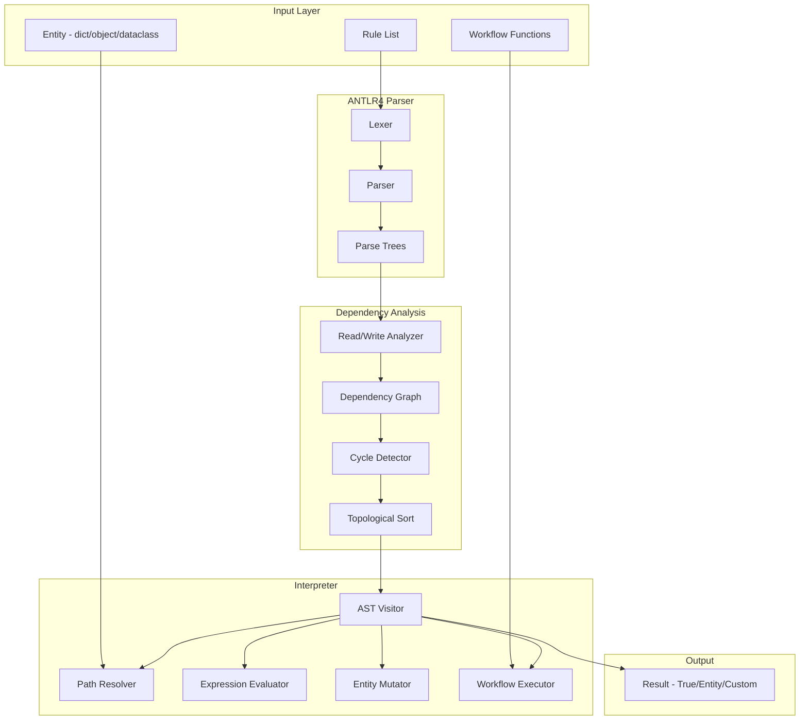

# Business Rules DSL Implementation Plan

## Architecture Overview




## DSL Grammar Design

**Rule syntax:**

```javascript
condition => action [; action]* [; ret expression]?
```

**Examples:**

```javascript
# Simple condition with return
entity.user.age >= 18 => true

# Nested attribute with list indexing
entity.orders[-1].total > 100 => workflow("apply_discount")

# Mutation with explicit return
entity.balance < 0 => entity.status = "overdrawn"; ret entity

# Compound conditions with arithmetic
entity.price * entity.quantity >= 1000 and entity.is_premium => entity.discount += 0.1

# Multiple actions
entity.type == "vip" => workflow("notify_vip"); entity.processed = true; ret entity
```

**Supported operators:**

- Comparison: `==`, `!=`, `<`, `>`, `<=`, `>=`
- Logical: `and`, `or`, `not`
- Arithmetic: `+`, `-`, `*`, `/`, `%`
- Membership: `in`, `not in`
- Assignment: `=`, `+=`, `-=`, `*=`, `/=`

## Project Structure

```javascript
rule-interpreter/
├── pyproject.toml
├── src/
│   └── rule_interpreter/
│       ├── __init__.py          # Public API exports
│       ├── engine.py            # RuleEngine class (main entry point)
│       ├── grammar/
│       │   ├── BusinessRules.g4 # ANTLR4 grammar definition
│       │   └── generated/       # ANTLR4 generated Python files
│       ├── visitor.py           # AST visitor/interpreter
│       ├── analyzer.py          # Read/write analysis for rules
│       ├── dependency_graph.py  # Dependency graph + cycle detection
│       ├── path_resolver.py     # Entity attribute path resolution
│       ├── exceptions.py        # Custom exceptions
│       └── workflows.py         # Workflow registry and decorator
└── tests/
    ├── test_parser.py
    ├── test_visitor.py
    ├── test_engine.py
    ├── test_dependency_graph.py
    └── test_workflows.py
```


## Core Components

### 1. ANTLR4 Grammar (`BusinessRules.g4`)

Define lexer and parser rules for:

- Attribute paths with dot notation and bracket indexing
- Expressions (arithmetic, comparison, logical)
- Actions (assignments, workflow calls, return statements)
- Rule structure (condition `=>` actions)

### 2. RuleEngine Class

```python
class RuleEngine:
    def __init__(self, mode: Literal["first_match", "all_match"] = "first_match"):
        ...
    
    def add_rules(self, rules: str | list[str]) -> None:
        """Parse and add rule(s) - accepts single string or list"""
    
    def evaluate(self, entity: Any, workflows: dict[str, Callable | Workflow] = None) -> Any:
        """Evaluate rules against entity in dependency order.
        Returns True by default, or explicit ret value."""
    
    def get_dependency_graph(self) -> dict[int, set[int]]:
        """Return the computed dependency graph (rule index -> depends on indices)"""
    
    @staticmethod
    def workflow(name: str, reads: list[str] = None, writes: list[str] = None):
        """Decorator for registering workflow functions with optional dependency declarations"""
```


### 3. Path Resolver

Handle flexible entity access:

- Dict: `entity["attr"]["nested"]`
- Object: `getattr(entity, "attr").nested`
- List indexing: `entity.items[-1]`
- Raise `PathResolutionError` on missing paths

### 4. Visitor/Interpreter

Walk the ANTLR parse tree and:

- Evaluate conditions (left side)
- Execute actions (right side) if condition is true
- Handle mutations, workflow calls, return values
- Default return `True` if no explicit `ret`
- Track reads/writes for dependency analysis

### 5. Dependency Graph Builder

Analyze rules and build execution order:

```python
class DependencyGraph:
    def __init__(self, rules: list[ParsedRule]):
        ...
    
    def analyze(self) -> None:
        """Build graph from read/write sets of each rule"""
    
    def detect_cycles(self) -> list[list[int]]:
        """Find all cycles, return list of cycle paths"""
    
    def get_execution_order(self) -> list[int]:
        """Return topologically sorted rule indices (breaks cycles arbitrarily with warning)"""
```

**Dependency detection logic:**

- For each rule, extract:
- **Reads**: All attribute paths accessed in condition (left side) + workflow declared reads
- **Writes**: All attribute paths mutated in actions (right side) + workflow declared writes
- Rule B depends on Rule A if: `B.reads ∩ A.writes ≠ ∅`
- Use Kahn's algorithm for topological sort
- On cycle detection: log warning, break cycle by removing edge to lowest-index rule

### 6. Workflow System with Dependency Declarations

Workflows can declare what attributes they read/write:

```python
# Decorator approach (for registered workflows)
@RuleEngine.workflow("calculate_area", reads=["entity.length", "entity.width"], writes=["entity.area"])
def calculate_area(entity):
    entity.area = entity.length * entity.width

# Wrapper class approach (for dict-passed workflows)
workflows = {
    "square": Workflow(
        fn=lambda e: setattr(e, 'squared', e.length ** 2),
        reads=["entity.length"],
        writes=["entity.squared"]
    )
}

# Plain callable still works (no dependency tracking)
workflows = {"log": lambda e: print(e)}
```

The `Workflow` wrapper class:

```python
@dataclass
class Workflow:
    fn: Callable
    reads: list[str] = field(default_factory=list)
    writes: list[str] = field(default_factory=list)
```

When building the dependency graph, workflow reads/writes are merged with the rule's own reads/writes.

## Implementation Steps

1. **Set up ANTLR4 tooling** - Add antlr4-tools and antlr4-python3-runtime to dependencies, create grammar file structure
2. **Write the grammar** - Define complete lexer/parser rules in `BusinessRules.g4`
3. **Generate parser** - Run ANTLR4 to generate Python lexer/parser/visitor classes
4. **Implement path resolver** - Flexible attribute access for dicts, objects, dataclasses with list indexing support
5. **Implement AST visitor** - Interpret the parse tree: evaluate expressions, execute actions, handle mutations, track read/write sets
6. **Implement workflow system** - `Workflow` wrapper class with reads/writes, decorator with dependency args, merge with rule analysis
7. **Implement dependency graph** - Build graph from combined rule + workflow read/write analysis, detect cycles with warnings, topological sort