# Shunollo - The Biomimetic Physics Engine

[](https://pypi.org/project/shunollo/)
[](https://opensource.org/licenses/Apache-2.0)
[](https://github.com/TheLazyEyedJedi/Shunollo/actions/workflows/ci.yml)
[](https://www.python.org/downloads/)

**A Universal Physics Engine for Cognitive Architectures**

Shunollo provides a pure, agnostic physics layer for translating any data stream into sensory qualia - enabling AI systems to "feel" their environment through entropy, roughness, viscosity, and other universal metrics.

> [!IMPORTANT]
> **Status**: Production Ready (v0.3.9)
> *   **Physics**: Modular (Thermodynamics, Quantum, Optics, Mechanics)
> *   **Integrity**: 228 Tests (Unit, Integration, Functional, Performance)
> *   **Performance**: Sub-millisecond latency (<0.1ms)
> *   **Safety**: Verified (Refractory Period, Thermal Limits)

## 100% Open Source

Shunollo is fully open source under the Apache 2.0 license. There is no "Enterprise Edition" or paid tier of the library itself. You get **everything**.

**Build whatever you want.** That's why we made this.

## Key Features

### Physics Engine (Multivariate Sensory Qualia)
Transform any data stream into a normalized physics fingerprint:
- **Mechanics**: Energy, Entropy, Roughness, Viscosity
- **Thermodynamics**: Temperature, Landauer Cost, Arrhenius Rates
- **Quantum**: Radical Pair coherence, Tunneling
- **Time Series**: Volatility, Lyapunov Exponents, Poisson Detection
- **High-Order**: Dissonance, Hamiltonian, Lagrangian Action

### Physics-RAG (Integrated v0.3.9) 🆕
**Retrieval-Augmented Generation for Sensation** - your AI remembers what it has "felt" before:

```python
from shunollo_core.memory.hippocampus import Hippocampus
from shunollo_core.models import ShunolloSignal

# Store an experience
hippo = Hippocampus()
signal = ShunolloSignal(energy=5.0, roughness=0.8, entropy=6.5)
hippo.remember(signal)

# Later: Déjà Vu - "Have I felt this before?"
query_vector = new_signal.to_vector(normalize=True)
similar_episodes = hippo.recall_similar(query_vector, k=3)

if similar_episodes:
    past_signal, distance = similar_episodes[0]
    print(f"Déjà Vu! This feels like {past_signal.timestamp} (distance: {distance})")
```

**Why it matters**: Enables One-Shot Learning. Detect an anomaly once, store the sensory signature, recognize it instantly on reoccurrence.

## Architecture

```
shunollo/
├── shunollo_core/       # Pure Physics (Math only)
│   ├── physics/         # Mechanics, Thermo, Quantum, etc.
│   ├── brain/           # Autoencoder (Imagination)
│   ├── cognition/       # Active Inference + DDM
│   └── memory/          # Holographic + Hippocampus
└── shunollo_runtime/    # Nervous System (Event Bus)
```



```mermaid
graph LR
    subgraph Shunollo Core
    A[Physics Engine] --> B[18-dim Vector]
    B --> M[Hippocampus]
    M -->|Déjà Vu| B
    end
    
    subgraph Shunollo Runtime
    B --> C((Thalamus Bus))
    C --> D[Neural Cortex]
    C --> E[Reflex Agent]
    end
    
    D & E --> F[Decision]
```

## Installation

```bash
pip install shunollo
```

## Quick Start

```python
# Pure physics calculation
from shunollo_core.physics.mechanics import calculate_entropy, calculate_roughness
entropy = calculate_entropy(data)
roughness = calculate_roughness(entropy, jitter=0.1)

# Create a sensory signal
signal = ShunolloSignal(
    energy=1.5,
    entropy=entropy,
    roughness=roughness,
)

# Get 13-dimensional sensory vector
vector = vectorize_sensation(signal.to_dict())

# Store in episodic memory
hippo = Hippocampus()
hippo.remember(signal)

# Check novelty: "How new is this sensation?"
novelty = hippo.get_novelty_score(signal.to_vector())
if novelty > 1.0:
    print("Novel pattern detected!")
```

## License

Apache 2.0 - See [LICENSE](LICENSE)

## Documentation

- [THE_SHUNOLLO_CODEX.md](THE_SHUNOLLO_CODEX.md) - Philosophy & Vision
- [docs/EXAMPLES.md](docs/EXAMPLES.md) - **4 Real-World Examples** (Finance, Health, IoT, DevOps)
- [docs/whitepapers/](docs/whitepapers/) - Physics Theory
- [docs/technical/SENSORY_LEXICON.md](docs/technical/SENSORY_LEXICON.md) - Sensory Vocabulary
- [docs/technical/BRAIN_MAP.md](docs/technical/BRAIN_MAP.md) - Neural Architecture
- [docs/TESTING.md](docs/TESTING.md) - **Testing Strategy & Validation**

## Community

- 📖 [Roadmap](ROADMAP.md) - See what's coming
- 🐛 [Issue Tracker](https://github.com/TheLazyEyedJedi/Shunollo/issues) - Report bugs
- 💬 [Discussions](https://github.com/TheLazyEyedJedi/Shunollo/discussions) - Ask questions

## Contributing

We welcome research contributions. Please see [CONTRIBUTING.md](CONTRIBUTING.md) for architectural rules and setup instructions.

> **Note**: By contributing, you agree to our [Contributor License Agreement](.github/CLA.md).
