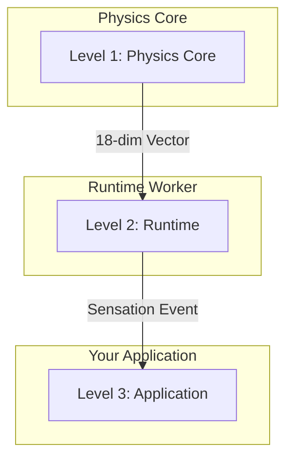

# THE SHUNOLLO CODEX: Bio-Digital Architecture

## I. THE CORE PHILOSOPHY
**"We are not building a logging tool; we are building a synthetic organism."**

The Shunollo Platform is a cognitive observability system modeled after biological homeostasis. We have achieved **Architecture 3.0** (v0.3.8), utilizing a **Modular Physics Core** and **Decentralized Synaptic Bus**.

### The "Synaptic Stack" (Decentralized)

---

## II. LICENSING: 100% OPEN SOURCE
**"The Physics is Free. Build What You Want."**

* **Shunollo Core (Open Source / Apache 2.0):**
    * *Analogy:* The Human Body (Anatomy).
    * *Function:* Physics, Routing, Basic Health, Reflexes.
    * *Value:* Ubiquity, Trust, Standardization.

**The Dependency Rule:**
* Shunollo Core is a standalone library.
* Applications built on Shunollo are independent products.
* Shunollo Core NEVER imports from any application.

---

## III. ANATOMICAL GLOSSARY (The Internal Language)

We use biological terms to design the architecture, but we use industry-standard terms for public APIs and UI.

### Level 1: The Physiology (System Components)
| Bio-Internal Name | Public/Dev Name | Function & Logic |
| :--- | :--- | :--- |
| **Transduction Agent** | **Signal Transducer** | Converts raw data into standardized "Sensation Events." |
| **The Thalamus** | **Event Bus (Redis)** | The central router. No Agent talks directly to another. |
| **Ganglion Agent** | **Reflex Processor** | Filters noise or triggers instant reflexes. |
| **Homeostasis** | **Auto-Scaling / Health** | Keeps variables within a "Safe Zone" via feedback loops. |
| **The Immune System** | **Active Defense / ACL** | Distinguishes "Self" from "Non-Self". |
| **Nociception** | **Priority Alerting** | A dedicated "Pain Channel" for critical errors. |
| **Motor Cortex** | **Effector Bus** | The output pathways. Decouples "Decision" from "Action". |
| **Training Governor** | **Value Alignment** | Safety circuit that vetoes unsafe updates. |

### Level 2: The Molecular Level (Code Units)
| Bio-Internal Name | Dev Name | Function & Logic |
| :--- | :--- | :--- |
| **Metabolite / ATP** | **Variable / Quota** | Fuel for logic. |
| **Metabolic Gating** | **Rate Limiting** | Prevents burnout. |
| **DNA / Genome** | **Config / Constants** | The blueprint. Should not change at runtime. |
| **Enzyme** | **Function** | A specialized catalyst. |
| **Organelle** | **Docker Container** | A membrane-bound compartment. |

---

## IV. PHYSIOLOGY: THE TWO FLOW SYSTEMS
**We strictly separate the "Blood" from the "Nerves."**

1.  **The Circulatory System (Data Plane):**
    * *Carries:* Heavy resources (Logs, Blobs, Metrics).
    * *Speed:* Slow, high bandwidth.
    * *Rule:* **Never treat Data like a Signal.**

2.  **The Nervous System (Control Plane):**
    * *Carries:* Information & Commands (Pointers, Status Codes, Alerts).
    * *Speed:* Instant, low bandwidth.
    * *Rule:* **The Nerve only carries the pointer.**

---

## V. THE INTERFACE STRATEGY ("The Rosetta Stone")
**"Biomimetic Architecture, Industry-Standard Interface."**

We do not force users to learn biology. We translate:
* *Internal Logic:* "The Nociceptor fired due to tissue damage."
* *External UI:* "Critical Alert: High Latency detected on Node 4."

---

## VI. DEVELOPMENT GUIDELINES
1.  **The Scientific Method:** Every deployment is an experiment.
2.  **The Digestion Rule:** API Endpoints should only queue data, never process it.
3.  **The Teratoma Check:** If a Class does too much, it is a Tumor. Surgery is required.

---

## VII. DEFINITION OF DONE (The Immune Response)
**"A mutation that is not validated is a cancer."**

1.  **Selection Pressure (Testing):**
    *   Unit Tests for all new functions.
    *   Feature Tests for full workflows.
    *   Full test suite for regression prevention.

2.  **Genetic Record (Documentation):**
    *   Update `docs/` to reflect new capabilities.
    *   Explain the "Why", not just the "How".

3.  **Anatomy Update (Architecture):**
    *   If the shape of the system changes, update documentation.
