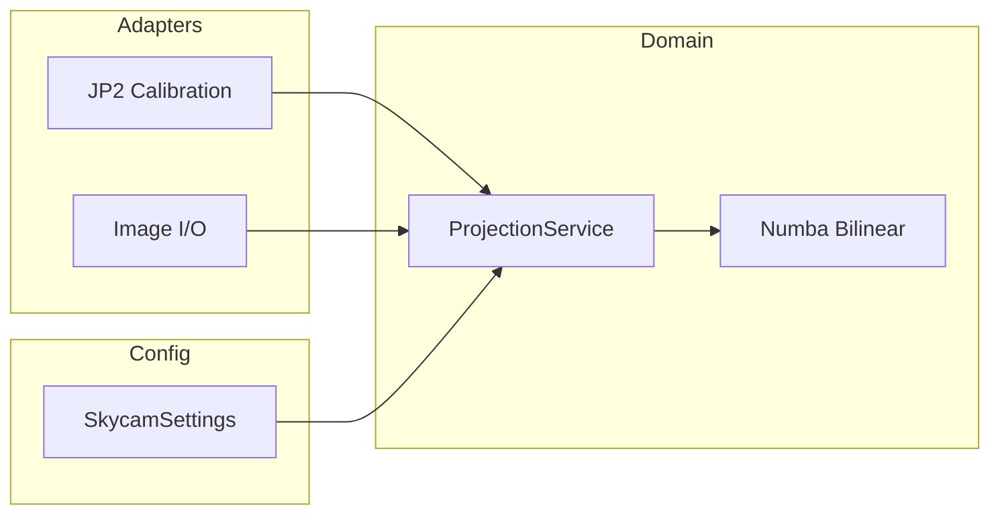

# skycam

<p align="center">
  <strong>Camera-agnostic fisheye image projection library for ground-based sky observation</strong>
</p>

<!-- Canonical Badge Row: Status → Stack → Tooling → Info -->
<p align="center">
  <!-- Status -->
  <a href="https://github.com/eurocontrol-asu/skycam/actions/workflows/ci.yml"></a>
  <a href="https://coveralls.io/github/eurocontrol-asu/skycam?branch=main"></a>
  <!-- Stack -->
  
  
  
  <!-- Tooling -->
  <a href="https://github.com/astral-sh/ruff"></a>
  <a href="https://github.com/astral-sh/uv"></a>
  <!-- Info -->
  <a href="https://pypi.org/project/skycam/"></a>
  
  <a href="https://eurocontrol-asu.github.io/skycam/"></a>
</p>

---

## ✨ Features

| Feature | Description |
|---------|-------------|
| ⚡ **Numba JIT** | ~100x faster projection via compiled bilinear interpolation |
| 💾 **Coordinate Cache** | Sub-100ms init after first calibration load |
| 🏛️ **Hexagonal Architecture** | Clean separation of domain, adapters, and config |
| ✅ **Pydantic v2** | Validated settings with environment variable support |
| 🔬 **Scientific Accuracy** | WGS84 geodesic calculations via GeographicLib |

## 🚀 Installation

```bash
uv add skycam
```

Or with pip:

```bash
pip install skycam
```

## 📖 Quick Start

```python
from pathlib import Path

from skycam.adapters import JP2CalibrationLoader, load_jp2
from skycam.domain.models import ProjectionSettings
from skycam.domain.projection import ProjectionService

# Load calibration and create projector
loader = JP2CalibrationLoader(Path("calibration"))
calibration = loader.load("visible")
projector = ProjectionService(
    calibration=calibration,
    settings=ProjectionSettings(),
)

# Project fisheye → regular grid
projected = projector.project(load_jp2(Path("input.jp2")))
```

## 🏗️ Architecture



## ⚙️ Configuration

Environment variables (prefix: `SKYCAM_`):

| Variable | Default | Description |
|----------|---------|-------------|
| `SKYCAM_CALIBRATION_DIR` | `calibration` | JP2 calibration files directory |
| `SKYCAM_CATEGORY` | `visible` | Camera category (`visible`, `infrarouge`) |
| `SKYCAM_DATA_DIR` | `data` | Input/output data directory |

## 🛠️ Development

```bash
git clone https://github.com/eurocontrol-asu/skycam.git
cd skycam
make install  # uv sync --all-groups
make check    # lint + audit + test
```

## 📚 Documentation

**[eurocontrol-asu.github.io/skycam](https://eurocontrol-asu.github.io/skycam/)**

- [🚀 Tutorial](https://eurocontrol-asu.github.io/skycam/tutorial/) — Project your first image in 5 minutes
- [🛠️ Guides](https://eurocontrol-asu.github.io/skycam/guides/) — How-to recipes for common tasks
- [🧠 Concepts](https://eurocontrol-asu.github.io/skycam/concepts/) — Architecture and algorithm deep-dive
- [📚 Reference](https://eurocontrol-asu.github.io/skycam/reference/) — Complete API documentation

## 🤝 Contributing

See [CONTRIBUTING.md](CONTRIBUTING.md) for guidelines.

## 📄 License

EUPL-1.2 — See [LICENSE](LICENSE) for details.
