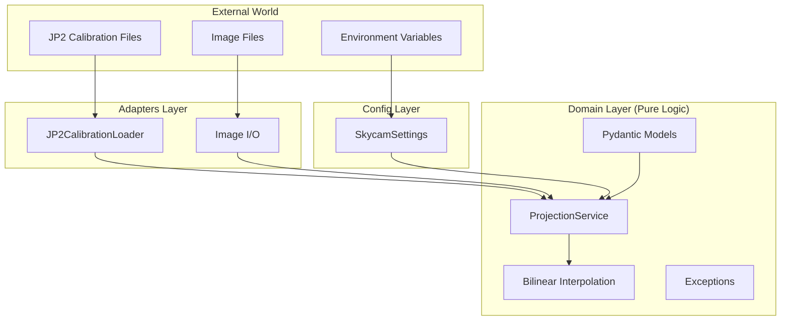
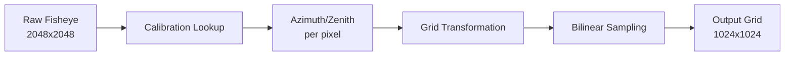

# 🧠 Concepts

Understand the architecture, algorithms, and design decisions behind skycam.

---

## Architecture Overview

skycam follows **Hexagonal Architecture** (Ports & Adapters) to separate concerns:



### Layer Responsibilities

| Layer | Purpose | Dependencies |
|-------|---------|--------------|
| **Domain** | Pure business logic, no I/O | Only standard library + numpy/scipy |
| **Adapters** | I/O operations (files, network) | OpenCV, external formats |
| **Config** | Environment/file configuration | Pydantic Settings |

---

## The Projection Algorithm

### Problem Statement

A hemispherical (fisheye) camera captures a 180° field of view. Each pixel in the raw image corresponds to a specific **azimuth** (compass direction) and **zenith** (angle from vertical).

To analyze the image, we need to project it onto a regular grid in Cartesian coordinates.

### Algorithm Steps



1. **Calibration Lookup**: Each pixel position maps to (azimuth, zenith) via JP2 calibration maps
2. **Grid Transformation**: Define output grid in physical coordinates (meters)
3. **Inverse Mapping**: For each output grid point, find the corresponding (azimuth, zenith)
4. **Bilinear Sampling**: Sample the raw image at sub-pixel precision

### The Azimuth Alignment Formula

```python
# CRITICAL: Legacy azimuth alignment
interpolation_azimuth = (interpolation_azimuth - 3 * np.pi / 2) % (2 * np.pi) - np.pi
```

This transformation aligns computed azimuths with the legacy JP2 calibration convention. Without it, the output would be rotated 270°.

---

## Performance Optimizations

### Numba JIT Compilation

The core bilinear interpolation is compiled to machine code via Numba:

```python
@jit(nopython=True, parallel=True, cache=True, fastmath=True)
def bilinear_sample(image, coords):
    ...
```

| Optimization | Effect |
|--------------|--------|
| `nopython=True` | Full compilation, no Python interpreter |
| `parallel=True` | Multi-threaded via `prange` |
| `cache=True` | Persists compiled code between sessions |
| `fastmath=True` | Relaxed IEEE-754 for speed |

**Result:** ~100x speedup (447ms → 4.6ms per projection)

### Coordinate Caching

The expensive step is building the `LinearNDInterpolator` (~10s). Once built, we cache the precomputed pixel coordinates:

```
calibration/.cache/
└── pixel_coords_1024_a1b2c3d4.npy
```

The hash suffix encodes: `image_size + resolution + square_size + cloud_height + max_zenith`.

**Result:** Subsequent loads take <100ms.

---

## Calibration Data Format

### JP2 Encoding Convention

Calibration files store angles as **uint16** in range `[0, 64000]`:

| File | Formula | Result Range |
|------|---------|--------------|
| `azimuth_*.jp2` | `360° × raw / 64000 - 180°` | `[-π, π]` radians |
| `zenith_*.jp2` | `90° × raw / 64000` | `[0, π/2]` radians |

### Why JP2?

JPEG 2000 provides:

- **Lossless compression** for scientific data
- **16-bit depth** (vs 8-bit JPEG)
- **Tiled decoding** for large images

---

## Design Decisions

### Why Pydantic v2?

- **Immutable models** (`frozen=True`) prevent accidental mutation
- **Validation at construction** catches errors early
- **Environment integration** via `pydantic-settings`
- **JSON serialization** for config files

### Why Hexagonal Architecture?

- **Testability**: Domain logic tested without I/O
- **Flexibility**: Swap adapters (e.g., S3 instead of local files)
- **Clarity**: Clear dependency direction (adapters → domain)

### Why Not a CLI?

skycam is a **library**, not an application. The projection logic is meant to be embedded in larger systems (Dagster pipelines, web services, etc.).
