# 🚀 Tutorial: Project Your First Image

!!! success "What you'll learn"
    In 5 minutes, you'll project a fisheye camera image onto a regular grid—the core operation of skycam.

## Prerequisites

- Python 3.12+
- [uv](https://github.com/astral-sh/uv) package manager
- Sample calibration files (JP2 format)

## Step 1: Install skycam

```bash
uv add skycam
```

## Step 2: Prepare Your Files

You need two types of files:

1. **Calibration maps** (provided by your camera vendor):
   - `azimuth_visible.jp2` — Azimuth angles for each pixel
   - `zenith_visible.jp2` — Zenith angles for each pixel

2. **Input image** — A fisheye camera image (JP2 or JPEG)

Create this structure:

```
my_project/
├── calibration/
│   ├── azimuth_visible.jp2
│   └── zenith_visible.jp2
├── input.jp2
└── project_image.py
```

## Step 3: Write the Projection Script

Create `project_image.py`:

```python
from pathlib import Path

from skycam.adapters import JP2CalibrationLoader, load_jp2, save_image
from skycam.domain.models import ProjectionSettings
from skycam.domain.projection import ProjectionService

# 1. Load calibration data
loader = JP2CalibrationLoader(Path("calibration"))
calibration = loader.load("visible")

# 2. Create projection service with default settings
settings = ProjectionSettings()
projector = ProjectionService(calibration=calibration, settings=settings)

# 3. Project the image
image = load_jp2(Path("input.jp2"))
projected = projector.project(image)

# 4. Save the result
save_image(projected, Path("output.jpg"))
print("✅ Projection complete! Check output.jpg")
```

## Step 4: Run It

```bash
uv run python project_image.py
```

You should see:

```
✅ Projection complete! Check output.jpg
```

## What Just Happened?

```mermaid
flowchart LR
    A[🐟 Fisheye Image] --> B[ProjectionService]
    C[📐 Calibration Maps] --> B
    B --> D[📊 Regular Grid Image]
```



1. **Calibration maps** define how each pixel in your fisheye image maps to azimuth/zenith angles
2. **ProjectionService** uses bilinear interpolation to sample the fisheye image at grid points
3. The output is a regular rectangular grid suitable for analysis

## Next Steps

- [🛠️ How to optimize batch processing](guides.md)
- [🧠 Understand the projection algorithm](concepts.md)
- [📚 API Reference](reference.md)
