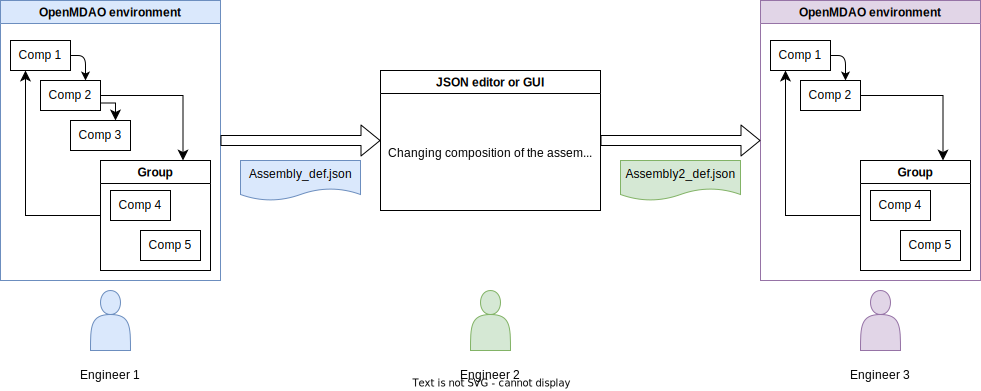
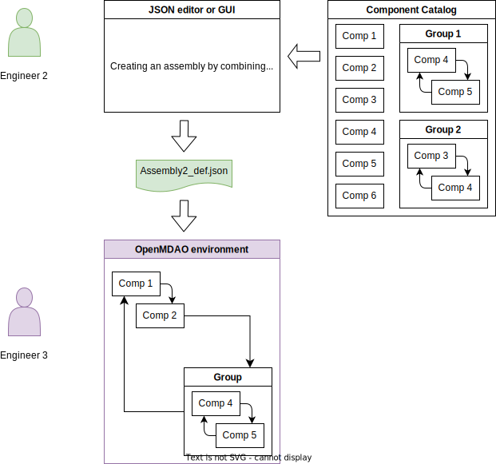

# Demonstration of using the standard evaluator

## Creating the assembly in OpenMDAO / Python
In this demonstration in three parts we show how the standard evaluator allows a very flexible way of managing MDAO analyses processes. The below graphic shows the workflow we can enable.

We start the workflow with an engineer assembling a MDAO workflow using multiple components and groups, all of which use dual inheritance to be descendants of both the standard evaluator and the appropriate OpenMDAO base classes. After assembling a workflow the engineer can now save the workflow in a JSON file, and pass this file to another engineer.

The second engineer can use other tools, for example a to be developed GUI, to manipulate the assembly. We can even enable that the second engineer could start an assembly from scratch using information about the components available in a library and their interfaces (future demo). After editing the assembly the second engineer can now save the updated definition file again in a JSON file, and hand it over to the third engineer.

The third engineer can use the JSON file from the second engineer and can instantiate the new assembly. This is a fully working OpenMDAO assembly that can now be used for MDAO studies.

## Creating the assembly from a catalog of components / groups

The second process we are enabling starts with a catalog of components that are leveraging the standard evaluator interface functionality while also being OpenMDOA components. In this case as shown in the above graphic the engineer 2 has access to a catalog of components (which can include groups of components that are used as a building block). The engineer can then assemble these building blocks in multiple ways. They can just combine the different components by for example loading the required components into Python dictionaries, and then creating a new dictionary combining them in the appropriate way within Python or a Jupyter Notebook. We might facilitate this with helper routines. After the dictionary is assembled it is stored as a JSON.

A more likely scenario from a productivity perspective is to actual develop a GUI which allows the engineer to assemble the components in a similar way as is being done in tools like Ansys ModelCenter or Dassault 3DX. This capability allows the building of such a GUI, especially when the components allow the clean definition of options as implemented in the standard evaluator. *Development of a GUI is not part of this contract.*

Another scenario would involve the building of a translator from other frameworks like Ansys ModelCenter, Dassault 3DX, or Dassault Cameo. Those translators would read out the structure of assemblies developed within them, and than create the required JSON file. A requirement for this would be that the components defined in the other tools can be replaced with a standard evaluator implementation of the functionality. *Development of these converters is not part of this contract.*

After the assembly is created it can be passed to engineer 3 that will be executing the the OpenMDAO assemblies as defined by the JSON file.