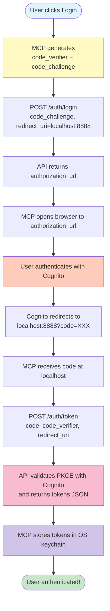
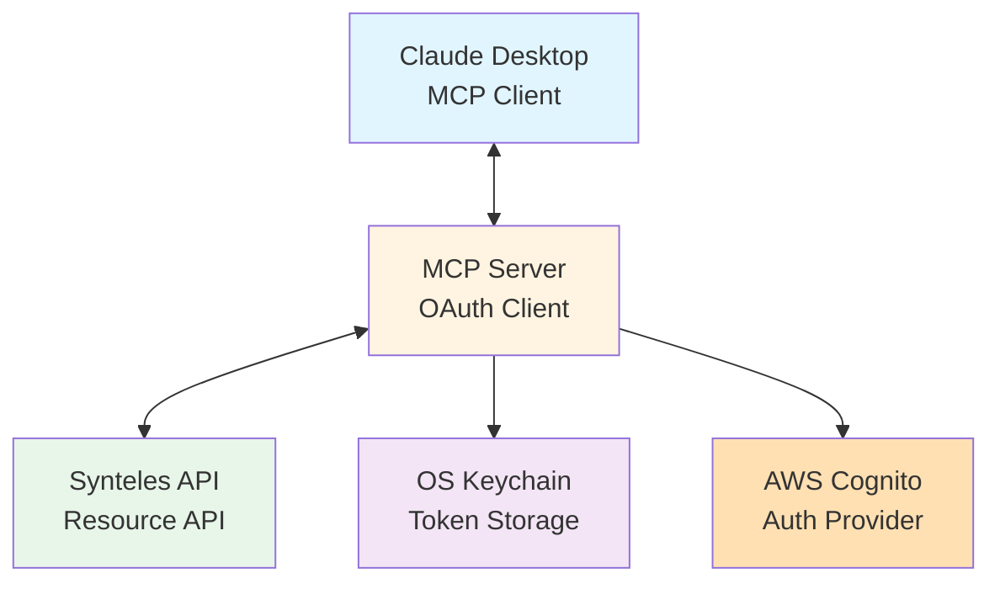
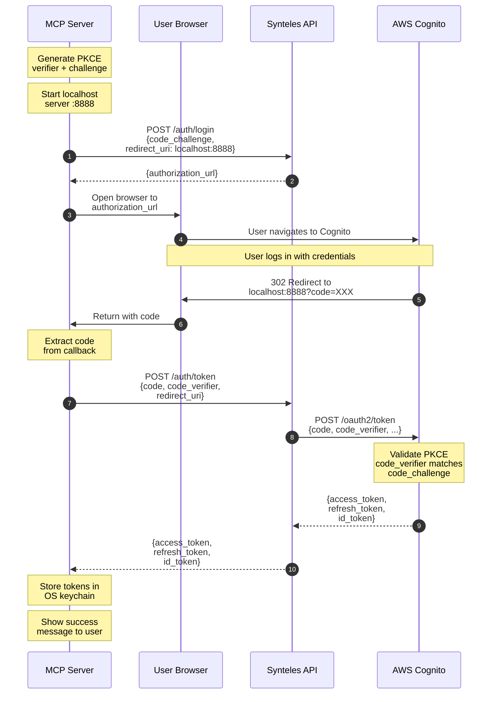
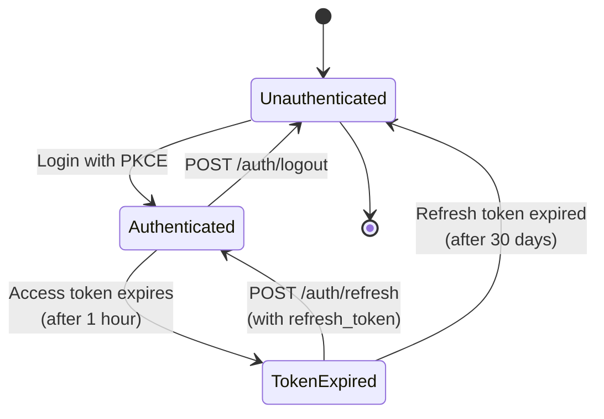

# OAuth Authentication Implementation Proposal
## Synteles Platform MCP Server

**Date:** 2025-12-05
**Status:** Proposed
**Version:** 1.0

---

## Executive Summary

This document proposes an OAuth 2.0 with PKCE authentication implementation for the Synteles Platform MCP Server that integrates with the **new** `/auth/login` and `/auth/token` API endpoints while following MCP best practices for secure token management.

**Final Approach:** The API now implements a clean OAuth2 PKCE flow with dedicated endpoints:
- `POST /auth/login` - Returns authorization URL (no redirect)
- `POST /auth/token` - Exchanges code + code_verifier for tokens (returns JSON)
- `POST /auth/refresh` - Refreshes tokens
- `POST /auth/logout` - Revokes tokens

This is the standard OAuth2 PKCE flow for public clients, perfectly suited for MCP servers.

### How It Works



### Key Changes Required

| Component | Change Required | Complexity |
|-----------|----------------|------------|
| API Endpoints | **✅ Already Implemented!** POST /auth/login & /auth/token | ✅ Done |
| Cognito Config | Add `http://localhost:8888` to allowed callback URLs | ⭐ Low (configuration) |
| MCP Server | Implement OAuth client with PKCE | ⭐⭐ Medium (new module) |
| DynamoDB | Not needed | ✅ None |
| Session Storage | Not needed | ✅ None |

---

## Current State

**Existing Implementation:**
- Environment variable-based authentication (`SYNTELES_ACCESS_TOKEN`)
- Manual token management by users
- No token refresh mechanism
- No secure token storage

**Limitations:**
- Poor user experience (manual token copying)
- Security risk (tokens in environment variables)
- No automatic token refresh
- Tokens expire after 1 hour with no recovery

---

## Proposed Architecture

### Overview



### Updated OAuth Flow with PKCE (New Implementation)



**Key Points:**
- ✅ Clean OAuth2 PKCE flow - no session storage, no DynamoDB
- ✅ MCP server keeps `code_verifier` in memory (not stored remotely)
- ✅ `POST /auth/login` returns authorization URL (step 4)
- ✅ `POST /auth/token` handles PKCE validation and token exchange (steps 10-13)
- ✅ Tokens returned as JSON, never in URLs
- ✅ Cognito validates code_verifier matches code_challenge
- ✅ Standard OAuth2 flow for SPAs/public clients

### Token Lifecycle



### Components

1. **OAuth Client Module** - Handles PKCE flow and token exchange
2. **Token Manager** - Manages token lifecycle (store, retrieve, refresh)
3. **Callback Server** - Temporary HTTP server for OAuth callback (localhost:8888)
4. **MCP Tools** - User-facing authentication commands (`login()`, `logout()`, `auth_status()`)

---

## Implementation Strategy

### Option A: Modified API Flow (RECOMMENDED)

**Requires:** Minor API modification to support localhost callback

**Flow:**
1. User calls `login()` MCP tool
2. MCP server generates PKCE code_verifier and code_challenge
3. MCP server starts temporary HTTP server on `http://localhost:8888/callback`
4. MCP server opens browser to `/auth/login?code_challenge={challenge}&code_challenge_method=S256&redirect_uri=http://localhost:8888/callback`
5. User authenticates with Cognito
6. API redirects to `http://localhost:8888/callback?code={code}`
7. MCP server exchanges code for tokens
8. Tokens stored in OS keychain
9. Temporary server shuts down

**API Changes Needed:**
- `/auth/login` must accept `redirect_uri` parameter
- `/auth/callback` must support localhost redirect URIs
- Cognito must whitelist `http://localhost:*` as valid redirect URI

**Pros:**
✅ Best user experience (fully automated)
✅ Most secure (no manual token handling)
✅ Follows OAuth 2.0 best practices
✅ Industry standard approach

**Cons:**
❌ Requires API backend changes
❌ Requires Cognito configuration update

---

### Option B: Device Code Flow Alternative

**Requires:** New `/auth/device` endpoints

**Flow:**
1. User calls `login()` MCP tool
2. MCP server requests device code from `/auth/device/code`
3. API returns: `{"user_code": "ABCD-1234", "device_code": "...", "verification_uri": "https://portal.synteles.dev/activate"}`
4. MCP server displays: "Go to https://portal.synteles.dev/activate and enter code: ABCD-1234"
5. MCP server polls `/auth/device/token` endpoint
6. User enters code in browser on portal
7. Portal approves device
8. MCP server receives tokens on next poll
9. Tokens stored in OS keychain

**API Changes Needed:**
- `POST /auth/device/code` - Issue device code
- `POST /auth/device/token` - Poll for tokens
- Portal UI page for code entry

**Pros:**
✅ Works on headless systems
✅ No localhost callback needed
✅ Good for CLI tools

**Cons:**
❌ Requires significant API changes
❌ Requires portal UI changes
❌ More steps for user

---

### Option C: Hybrid Approach (INTERIM SOLUTION)

**Requires:** No API changes, uses existing endpoints creatively

**Flow:**
1. User calls `login()` MCP tool
2. MCP server generates PKCE pair
3. MCP server constructs auth URL: `/auth/login?code_challenge={challenge}`
4. MCP server opens browser OR displays URL to user
5. User authenticates with Cognito
6. API redirects to portal: `https://portal.synteles.dev?access_token={token}&id_token={id_token}&refresh_token={refresh_token}`
7. Portal displays tokens in a copy-friendly format OR auto-sends to localhost
8. User copies tokens and pastes into MCP prompt OR Portal auto-posts to localhost
9. MCP server stores tokens in keychain

**API Changes Needed:**
- None (uses existing flow)
- Optional: Portal enhancement to auto-post tokens to localhost

**Pros:**
✅ Works with current API
✅ Still uses PKCE (secure)
✅ Can be improved incrementally

**Cons:**
❌ Manual token copying (poor UX)
❌ Tokens visible in browser (security concern)
❌ Multi-step process

---

## Recommended Approach: **Option A**

Based on security, user experience, and OAuth best practices, **Option A** is recommended.

---

## Detailed Implementation Plan

### Phase 1: Core Infrastructure

#### 1.1 Add Dependencies

```toml
# pyproject.toml
dependencies = [
    "mcp[cli]>=1.21.1",
    "requests",
    "keyring>=24.0.0",          # Secure token storage
    "secretstorage>=3.3.0",     # Linux keyring backend
]
```

#### 1.2 Required Environment Variables

```bash
# API Configuration
export SYNTELES_API_DOMAIN="api.synteles.dev"  # Optional, defaults to api.synteles.dev

# Legacy (deprecated) - for backward compatibility
export SYNTELES_ACCESS_TOKEN="..."  # Will be removed in v2.0
```

**No AWS credentials required!** The MCP server stores `code_verifier` in memory during the login flow.

#### 1.2 Create Token Storage Module

**File:** `synteles_platform_mcp/auth/token_store.py`

```python
"""Secure token storage using OS keychain."""

import keyring
from typing import Optional, Tuple
import logging

logger = logging.getLogger(__name__)

SERVICE_NAME = "synteles-platform-mcp"

class TokenStore:
    """Manages secure storage of OAuth tokens."""

    def save_tokens(
        self,
        access_token: str,
        refresh_token: str,
        id_token: Optional[str] = None,
    ) -> None:
        """Store tokens in OS keychain."""
        keyring.set_password(SERVICE_NAME, "access_token", access_token)
        keyring.set_password(SERVICE_NAME, "refresh_token", refresh_token)
        if id_token:
            keyring.set_password(SERVICE_NAME, "id_token", id_token)
        logger.info("Tokens stored securely in OS keychain")

    def load_tokens(self) -> Tuple[Optional[str], Optional[str], Optional[str]]:
        """Retrieve tokens from OS keychain."""
        access_token = keyring.get_password(SERVICE_NAME, "access_token")
        refresh_token = keyring.get_password(SERVICE_NAME, "refresh_token")
        id_token = keyring.get_password(SERVICE_NAME, "id_token")
        return access_token, refresh_token, id_token

    def get_access_token(self) -> Optional[str]:
        """Get current access token."""
        return keyring.get_password(SERVICE_NAME, "access_token")

    def clear_tokens(self) -> None:
        """Remove all tokens from keychain."""
        for key in ["access_token", "refresh_token", "id_token"]:
            try:
                keyring.delete_password(SERVICE_NAME, key)
            except keyring.errors.PasswordDeleteError:
                pass  # Token doesn't exist
        logger.info("Tokens cleared from OS keychain")

    def has_tokens(self) -> bool:
        """Check if tokens exist."""
        return keyring.get_password(SERVICE_NAME, "access_token") is not None
```

#### 1.3 Create OAuth Client Module

**File:** `synteles_platform_mcp/auth/oauth_client.py`

```python
"""OAuth 2.0 with PKCE authentication client."""

import secrets
import hashlib
import base64
import webbrowser
import threading
from http.server import HTTPServer, BaseHTTPRequestHandler
from urllib.parse import urlparse, parse_qs
import logging
import requests
from typing import Optional, Tuple

from .token_store import TokenStore

logger = logging.getLogger(__name__)

class CallbackHandler(BaseHTTPRequestHandler):
    """HTTP handler for OAuth callback - receives authorization code from Cognito."""

    auth_code: Optional[str] = None
    auth_error: Optional[str] = None

    def do_GET(self):
        """Handle GET request for OAuth callback with authorization code."""
        query = urlparse(self.path).query
        params = parse_qs(query)

        if 'code' in params:
            # Successfully received authorization code from Cognito
            CallbackHandler.auth_code = params['code'][0]
            self.send_response(200)
            self.send_header('Content-type', 'text/html')
            self.end_headers()
            self.wfile.write(b"""
                <html>
                <body style="font-family: system-ui; padding: 40px; text-align: center;">
                    <h1 style="color: #22c55e;">&#x2713; Authentication In Progress...</h1>
                    <p>Completing authentication securely.</p>
                    <p>You can close this window and return to Claude Desktop.</p>
                </body>
                </html>
            """)
        elif 'error' in params:
            CallbackHandler.auth_error = params['error'][0]
            self.send_response(400)
            self.send_header('Content-type', 'text/html')
            self.end_headers()
            self.wfile.write(f"""
                <html>
                <body style="font-family: system-ui; padding: 40px; text-align: center;">
                    <h1 style="color: #ef4444;">&#x2717; Authentication Failed</h1>
                    <p>Error: {params['error'][0]}</p>
                    <p>You can close this window and try again.</p>
                </body>
                </html>
            """.encode())
        else:
            # Unexpected response
            CallbackHandler.auth_error = "Invalid callback - missing code"
            self.send_response(400)
            self.send_header('Content-type', 'text/html')
            self.end_headers()
            self.wfile.write(b"""
                <html>
                <body style="font-family: system-ui; padding: 40px; text-align: center;">
                    <h1 style="color: #ef4444;">&#x2717; Invalid Callback</h1>
                    <p>Missing authorization code. Please try again.</p>
                </body>
                </html>
            """)

    def log_message(self, format, *args):
        """Suppress HTTP server logs."""
        pass


class OAuthClient:
    """OAuth 2.0 PKCE client for Synteles Platform API."""

    def __init__(self, api_domain: str = "api.synteles.dev"):
        self.api_domain = api_domain
        self.base_url = f"https://{api_domain}/v1"
        self.token_store = TokenStore()

    def _generate_pkce_pair(self) -> Tuple[str, str]:
        """Generate PKCE code verifier and challenge.

        Returns:
            Tuple of (code_verifier, code_challenge)
        """
        # Generate 32-byte random code verifier
        code_verifier = base64.urlsafe_b64encode(
            secrets.token_bytes(32)
        ).decode('utf-8').rstrip('=')

        # Generate SHA256 challenge
        code_challenge = base64.urlsafe_b64encode(
            hashlib.sha256(code_verifier.encode('utf-8')).digest()
        ).decode('utf-8').rstrip('=')

        return code_verifier, code_challenge

    def login(self, callback_port: int = 8888, timeout: int = 120) -> dict:
        """Start OAuth login flow with PKCE using new POST /auth/login endpoint.

        Args:
            callback_port: Port for local callback server (default: 8888)
            timeout: Timeout in seconds for user to complete auth (default: 120)

        Returns:
            Dict with login result

        Raises:
            Exception: If authentication fails
        """
        # Generate PKCE pair
        code_verifier, code_challenge = self._generate_pkce_pair()

        # Start local callback server to receive authorization code
        CallbackHandler.auth_code = None
        CallbackHandler.auth_error = None

        server = HTTPServer(('localhost', callback_port), CallbackHandler)
        server_thread = threading.Thread(target=server.handle_request)
        server_thread.daemon = True
        server_thread.start()

        # Call POST /auth/login to get authorization URL
        redirect_uri = f"http://localhost:{callback_port}"
        try:
            response = requests.post(
                f"{self.base_url}/auth/login",
                json={
                    "code_challenge": code_challenge,
                    "redirect_uri": redirect_uri
                },
                headers={"Content-Type": "application/json"},
                timeout=10
            )

            if response.status_code != 200:
                raise Exception(f"Login request failed: {response.text}")

            auth_response = response.json()
            authorization_url = auth_response.get("authorization_url")

            if not authorization_url:
                raise Exception("No authorization_url in response")

        except Exception as e:
            server.server_close()
            raise Exception(f"Failed to get authorization URL: {e}") from e

        logger.info(f"Opening browser for authentication")
        print(f"\n🔐 Opening browser for authentication...")
        print(f"If browser doesn't open, visit:\n{authorization_url}\n")

        # Open browser to Cognito authorization page
        webbrowser.open(authorization_url)

        # Wait for callback with authorization code
        server_thread.join(timeout=timeout)

        if CallbackHandler.auth_error:
            raise Exception(f"Authentication failed: {CallbackHandler.auth_error}")

        if not CallbackHandler.auth_code:
            raise Exception("Authentication timeout - no authorization code received")

        # Exchange authorization code for tokens using POST /auth/token
        try:
            token_response = requests.post(
                f"{self.base_url}/auth/token",
                json={
                    "code": CallbackHandler.auth_code,
                    "code_verifier": code_verifier,
                    "redirect_uri": redirect_uri
                },
                headers={"Content-Type": "application/json"},
                timeout=30
            )

            if token_response.status_code != 200:
                raise Exception(f"Token exchange failed: {token_response.text}")

            tokens = token_response.json()

        except Exception as e:
            raise Exception(f"Failed to exchange code for tokens: {e}") from e

        # Store tokens securely in OS keychain
        self.token_store.save_tokens(
            access_token=tokens["access_token"],
            refresh_token=tokens["refresh_token"],
            id_token=tokens.get("id_token")
        )

        logger.info("Successfully authenticated and stored tokens")
        return {
            "status": "success",
            "message": "Successfully authenticated! Tokens stored securely.",
            "expires_in": tokens.get("expires_in", 3600)
        }


    def refresh_access_token(self) -> Optional[str]:
        """Refresh access token using refresh token.

        Returns:
            New access token or None if refresh fails
        """
        _, refresh_token, _ = self.token_store.load_tokens()

        if not refresh_token:
            logger.warning("No refresh token available")
            return None

        try:
            response = requests.post(
                f"{self.base_url}/auth/refresh",
                json={"refresh_token": refresh_token},
                timeout=30
            )

            if response.status_code != 200:
                logger.error(f"Token refresh failed: {response.text}")
                return None

            tokens = response.json()

            # Update stored tokens
            self.token_store.save_tokens(
                access_token=tokens["access_token"],
                refresh_token=refresh_token,  # Keep existing refresh token
                id_token=tokens.get("id_token")
            )

            logger.info("Access token refreshed successfully")
            return tokens["access_token"]

        except Exception as e:
            logger.exception(f"Error refreshing token: {e}")
            return None

    def logout(self) -> dict:
        """Clear stored tokens and logout.

        Returns:
            Logout status
        """
        self.token_store.clear_tokens()
        logger.info("User logged out, tokens cleared")
        return {
            "status": "success",
            "message": "Logged out successfully. Tokens cleared from secure storage."
        }

    def get_access_token(self) -> Optional[str]:
        """Get current access token, refreshing if needed.

        Returns:
            Valid access token or None
        """
        access_token = self.token_store.get_access_token()

        if not access_token:
            return None

        # TODO: Add token expiration check and auto-refresh
        # For now, return the token as-is
        return access_token
```

### Phase 2: MCP Tool Integration

#### 2.1 Add Authentication Tools

**File:** `synteles_platform_mcp/main.py` (additions)

```python
# Add at the top with other imports
from .auth.oauth_client import OAuthClient
from .auth.token_store import TokenStore

# Initialize OAuth client (add after mcp initialization)
oauth_client = OAuthClient(SYNTELES_API_DOMAIN)
token_store = TokenStore()

# ================================
# Authentication Tools
# ================================

@mcp.tool()
def login(callback_port: int = 8888) -> dict[str, Any]:
    """Authenticate with Synteles Platform using OAuth 2.0.

    This will open your default web browser to complete authentication.
    After successful login, tokens will be stored securely in your OS keychain.

    Args:
        callback_port: Port for local callback server (default: 8888)

    Returns:
        Authentication status and token expiration info

    Example:
        >>> login()
        {
            "status": "success",
            "message": "Successfully authenticated! Tokens stored securely.",
            "expires_in": 3600
        }
    """
    return oauth_client.login(callback_port=callback_port)


@mcp.tool()
def logout() -> dict[str, str]:
    """Logout and clear all stored authentication tokens.

    This removes all tokens from secure storage. You will need to
    login() again to use authenticated endpoints.

    Returns:
        Logout confirmation

    Example:
        >>> logout()
        {"status": "success", "message": "Logged out successfully."}
    """
    return oauth_client.logout()


@mcp.tool()
def auth_status() -> dict[str, Any]:
    """Check current authentication status.

    Returns information about whether you're logged in and token status.

    Returns:
        Authentication status including:
        - authenticated: Whether valid tokens exist
        - has_access_token: Whether access token is stored
        - has_refresh_token: Whether refresh token is stored

    Example:
        >>> auth_status()
        {
            "authenticated": true,
            "has_access_token": true,
            "has_refresh_token": true,
            "message": "Authenticated and ready to use API"
        }
    """
    access_token, refresh_token, _ = token_store.load_tokens()

    authenticated = access_token is not None

    return {
        "authenticated": authenticated,
        "has_access_token": access_token is not None,
        "has_refresh_token": refresh_token is not None,
        "message": (
            "Authenticated and ready to use API" if authenticated
            else "Not authenticated. Please run login() first."
        )
    }
```

#### 2.2 Update Request Helper to Use Stored Tokens

```python
def _make_request(
    method: str,
    endpoint: str,
    access_token: str | None = None,
    json_data: dict[str, Any] | None = None,
    params: dict[str, str] | None = None,
) -> requests.Response:
    """Make an authenticated HTTP request to the Synteles Platform API.

    Now automatically uses stored token if no token provided.
    Attempts token refresh on 401 errors.
    """
    # Try to get token from storage if not provided
    if access_token is None:
        access_token = oauth_client.get_access_token()

    # Fall back to environment variable
    if access_token is None:
        access_token = SYNTELES_ACCESS_TOKEN

    if not access_token:
        msg = (
            "Access token is required. Please run login() to authenticate "
            "or set SYNTELES_ACCESS_TOKEN environment variable."
        )
        raise PlatformAPIError(msg)

    url = f"https://{SYNTELES_API_DOMAIN}/v1{endpoint}"
    headers = {
        "Authorization": f"Bearer {access_token}",
        "Content-Type": "application/json",
    }

    try:
        response = requests.request(
            method=method,
            url=url,
            headers=headers,
            json=json_data,
            params=params,
            timeout=30,
        )

        # Handle 401 - try to refresh token
        if response.status_code == HTTP_401_UNAUTHORIZED and access_token == oauth_client.get_access_token():
            logger.info("Access token expired, attempting refresh...")
            new_token = oauth_client.refresh_access_token()

            if new_token:
                # Retry request with new token
                headers["Authorization"] = f"Bearer {new_token}"
                response = requests.request(
                    method=method,
                    url=url,
                    headers=headers,
                    json=json_data,
                    params=params,
                    timeout=30,
                )
            else:
                msg = "Access token expired and refresh failed. Please run login() again."
                raise PlatformAPIError(msg)

        # Handle other error codes
        if response.status_code >= HTTP_400_BAD_REQUEST:
            error_msg = response.json().get("error", "Unknown error") if response.text else "Unknown error"
            logger.error("API request failed: %s %s - Status %d: %s", method, url, response.status_code, error_msg)
            raise PlatformAPIError(f"API request failed (HTTP {response.status_code}): {error_msg}")

        return response

    except requests.exceptions.RequestException as e:
        logger.exception("Request exception occurred: %s", e)
        raise PlatformAPIError(f"Request failed: {e}") from e
```

### Phase 3: Cognito Configuration

#### 3.1 Update Cognito Allowed Callback URLs

**Required:** Add localhost URLs to Cognito App Client allowed callback URLs

**Current Configuration:**
```
https://portal.synteles.com/callback
```

**Updated Configuration:**
```
https://portal.synteles.com/callback
http://localhost:8888
http://localhost:8000
http://localhost:9000
```

**How to Update:**
1. Go to AWS Cognito Console
2. Select User Pool
3. Go to App Integration → App clients
4. Edit App Client Settings
5. Add localhost URLs to "Allowed callback URLs"
6. Save changes

**That's It!** No other infrastructure changes needed. The new POST endpoints are already implemented.

---

## Migration Plan

### For Existing Users

1. **Backward Compatibility:** Keep environment variable support
2. **Gradual Migration:**
   - v1.0: Both methods work (env var + OAuth)
   - v1.1: OAuth recommended, env var deprecated warning
   - v2.0: OAuth required, env var removed

### Migration Script

```python
@mcp.tool()
def migrate_to_oauth(env_token: str) -> dict[str, str]:
    """Migrate from environment variable token to OAuth.

    This is a one-time migration helper. After migration,
    you won't need to manually manage tokens anymore.

    Args:
        env_token: Your current SYNTELES_ACCESS_TOKEN value

    Returns:
        Migration status
    """
    # This would initiate OAuth flow and transition user
    # from manual token management to OAuth
    pass
```

---

## Security Considerations

### Token Storage Security

| Method | Security Level | Platform Support |
|--------|---------------|------------------|
| OS Keychain | ⭐⭐⭐⭐⭐ High | macOS Keychain |
| Secret Service | ⭐⭐⭐⭐⭐ High | Linux (GNOME/KDE) |
| Credential Manager | ⭐⭐⭐⭐⭐ High | Windows DPAPI |
| Environment Variable | ⭐⭐ Low | All (not recommended) |
| Config File | ⭐ Very Low | All (NEVER use) |

### PKCE Benefits

- ✅ Protects against authorization code interception
- ✅ No client secret needed (safe for desktop apps)
- ✅ Prevents CSRF attacks
- ✅ Industry standard (RFC 7636)

### Token Lifecycle

```
┌─────────────────────────────────────────────────────────┐
│ Token Lifecycle                                         │
├─────────────────────────────────────────────────────────┤
│                                                         │
│  login() ──► Store tokens in keychain                  │
│      │                                                  │
│      ├──► Access Token (1 hour TTL)                    │
│      └──► Refresh Token (30 days TTL)                  │
│                                                         │
│  API Call ──► Use Access Token                         │
│      │                                                  │
│      ├──► Success ──► Continue                         │
│      │                                                  │
│      └──► 401 Error ──► Auto-refresh with Refresh Token│
│                  │                                      │
│                  ├──► Success ──► Retry API call       │
│                  └──► Failure ──► Prompt re-login      │
│                                                         │
│  logout() ──► Clear all tokens from keychain           │
│                                                         │
└─────────────────────────────────────────────────────────┘
```

---

## Testing Plan

### Unit Tests

```python
# tests/test_token_store.py
def test_save_and_load_tokens():
    """Test token storage and retrieval."""
    pass

def test_clear_tokens():
    """Test token deletion."""
    pass

# tests/test_oauth_client.py
def test_pkce_generation():
    """Test PKCE code verifier and challenge generation."""
    pass

def test_token_refresh():
    """Test automatic token refresh."""
    pass
```

### Integration Tests

```python
# tests/integration/test_oauth_flow.py
def test_full_oauth_flow():
    """Test complete OAuth flow (requires manual interaction)."""
    pass

def test_auto_refresh_on_401():
    """Test automatic token refresh on API 401."""
    pass
```

### Manual Testing Checklist

- [ ] Fresh login flow works
- [ ] Browser opens correctly
- [ ] Callback is received
- [ ] Tokens stored in keychain
- [ ] API calls work with stored token
- [ ] Token auto-refresh works on expiration
- [ ] Logout clears tokens
- [ ] Re-login works after logout
- [ ] Works on macOS
- [ ] Works on Linux
- [ ] Works on Windows

---

## Timeline Estimate

| Phase | Tasks | Effort |
|-------|-------|--------|
| **Phase 1:** Core Infrastructure | Token store, OAuth client | 2-3 days |
| **Phase 2:** MCP Integration | Tools, request helper updates | 1-2 days |
| **Phase 3:** API Backend Changes | Update `/auth/login`, Cognito config | 1-2 days |
| **Phase 4:** Testing | Unit, integration, manual | 2-3 days |
| **Phase 5:** Documentation | User guide, migration docs | 1 day |
| **Total** | | **7-11 days** |

**Note:** Timeline reduced by 1 day compared to original proposal since we don't need to create a new `/auth/token` endpoint.

---

## Success Metrics

1. **User Experience:**
   - Authentication takes < 30 seconds
   - Zero manual token copying
   - Tokens auto-refresh transparently

2. **Security:**
   - All tokens stored in OS keychain
   - PKCE used for all OAuth flows
   - No tokens in logs or error messages

3. **Reliability:**
   - < 1% authentication failure rate
   - Token refresh success rate > 99%
   - Works across all supported platforms

---

## Alternative Considerations

### Alternative 1: API Key-Only Authentication

**Approach:** Users create API keys via portal, use them instead of OAuth

**Pros:**
- Simple implementation
- No OAuth complexity
- Works for programmatic access

**Cons:**
- Long-lived credentials (security risk)
- No automatic refresh
- Manual key rotation needed

**Verdict:** ❌ Not recommended for primary auth method

### Alternative 2: Session-Based Authentication

**Approach:** MCP server maintains session with API

**Pros:**
- Traditional web approach
- Well understood

**Cons:**
- Not suitable for desktop applications
- Requires persistent server
- Poor fit for MCP architecture

**Verdict:** ❌ Not applicable to MCP servers

---

## Recommendations

1. **Implement Option A** (Modified API Flow) for best user experience
2. **Use `keyring` library** for cross-platform token storage
3. **Add comprehensive logging** for debugging OAuth flow
4. **Provide fallback** to environment variable during transition
5. **Create user documentation** with screenshots of flow
6. **Test thoroughly** on all three platforms (macOS, Linux, Windows)

---

## Next Steps

1. **Get stakeholder approval** on proposed approach
2. **Coordinate with API team** on required backend changes
3. **Create detailed technical specification** for API endpoints
4. **Set up development environment** with local Cognito instance
5. **Begin Phase 1 implementation** (core infrastructure)
6. **Create PR for review** after Phase 1 completion

---

## Questions for Discussion

1. **API Changes:** Can we commit to implementing `/auth/token` endpoint?
2. **Cognito Config:** Can we whitelist localhost callback URLs?
3. **Timeline:** Is 8-12 day timeline acceptable?
4. **Fallback:** Should we keep environment variable auth indefinitely?
5. **Device Flow:** Should we also implement device code flow for headless systems?

---

## Appendix A: Example User Flows

### First-Time User

```
User: Can you list my agentlets?
MCP: You need to authenticate first. Let me help you login.

[MCP calls login() tool]
MCP: Opening your browser for authentication...

[Browser opens, user logs in with Cognito]
[Callback received, tokens stored]

MCP: ✓ Authentication successful! Now fetching your agentlets...
[Lists agentlets]
```

### Returning User (Token Expired)

```
User: Can you get my organization info?
MCP: Sure! Fetching organization details...

[API returns 401]
[MCP automatically refreshes token]

MCP: Here's your organization information:
[Shows org details]
```

### User Wants to Logout

```
User: Logout please
MCP: [Calls logout() tool]
MCP: ✓ Logged out successfully. All tokens cleared from secure storage.
```

---

## Appendix B: Environment Variables Reference

```bash
# API Configuration
export SYNTELES_API_DOMAIN="api.synteles.dev"  # Optional, defaults to api.synteles.dev

# Legacy Token Authentication (deprecated, will be removed in v2.0)
export SYNTELES_ACCESS_TOKEN="eyJ..."  # Not recommended, use login() instead

# Debug/Development
export SYNTELES_MCP_DEBUG="true"  # Enable debug logging
export SYNTELES_MCP_CALLBACK_PORT="8888"  # Override default callback port
```

---

**End of Proposal**
