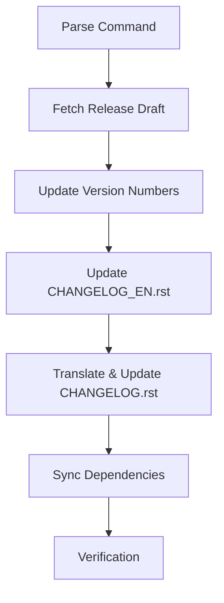

# Release Preparation Workflow

This document guides AI assistants to automate release preparation for throttled-py.

> `{GITHUB_REPOSITORY}` = `https://github.com/ZhuoZhuoCrayon/throttled-py`

## Quick Start

```
# With release draft URL
release v3.2.0 {GITHUB_REPOSITORY}/releases/tag/untagged-xxxxx

# With changelog content directly
release v3.2.0
<paste release draft content here>
```

## Workflow Overview



## Step 1: Parse Input

Extract from user input:
- **Version**: `vX.Y.Z` → `X.Y.Z`
- **Release Date**: Use today's date (`YYYY-MM-DD`)
- **Changelog**: From URL or directly provided content

## Step 2: Get Release Changelog

- If URL provided: Fetch content from the release draft URL
- If content provided: Use the changelog content directly
- If neither accessible: Ask user to provide the content

## Step 3: Update Version Numbers

Update version string in these files:

| File                            | Location                |
|---------------------------------|-------------------------|
| `pyproject.toml`                | `version = "X.Y.Z"`     |
| `throttled/__init__.py`         | `__version__ = "X.Y.Z"` |
| `throttled/asyncio/__init__.py` | `__version__ = "X.Y.Z"` |

## Step 4: Update CHANGELOG_EN.rst

Insert new entry after the title section:

```rst
vX.Y.Z - YYYY-MM-DD
---------------------

`简体中文 (vX.Y.Z) <{GITHUB_REPOSITORY}/blob/main/CHANGELOG.rst#vxyz---YYYY-MM-DD>`_ | English

**{emoji} {category_title}**

- {change_entries}

**Full Changelog**: {GITHUB_REPOSITORY}/compare/vPREV...vX.Y.Z
```

**Reference**: Read `.github/release-drafter-config.yml` for:
- Category titles and their emojis
- Entry format template

## Step 5: Translate & Update CHANGELOG.rst

Insert translated entry after the title section:

```rst
vX.Y.Z - YYYY-MM-DD
---------------------

`English Documents Available (vX.Y.Z) <{GITHUB_REPOSITORY}/blob/main/CHANGELOG_EN.rst#vxyz---YYYY-MM-DD>`_ | 简体中文

**{emoji} {category_title_zh}**

- {translated_change_entries}

**完整更新日志**: {GITHUB_REPOSITORY}/compare/vPREV...vX.Y.Z
```

### Translation Reference

| EN Category      | ZH Category |
|------------------|-------------|
| Breaking Changes | 破坏性变更       |
| New Features     | 功能          |
| Improvements     | 优化          |
| Bug Fixes        | Bug 修复      |
| Dependencies     | 依赖项更新       |
| Documentation    | 文档          |
| Tests            | 测试          |
| Maintenance      | 维护工作        |

### Common Translations

| English                     | Chinese               |
|-----------------------------|-----------------------|
| add / add support for       | 添加 / 添加对 ... 的支持      |
| fix / resolve               | 修复                    |
| update / improve / optimize | 更新 / 改进 / 优化          |
| implement                   | 实现                    |
| remove                      | 移除                    |
| refactor                    | 重构                    |

**Note**: Preserve technical terms, @author mentions, and PR numbers.

## Step 6: Sync Dependencies

Run the following command to sync dependencies and update `uv.lock`:

```bash
uv sync --all-groups --all-extras
```

This ensures `uv.lock` reflects the updated version in `pyproject.toml`.

## Step 7: Verification

- [ ] Version numbers consistent across all 3 files
- [ ] `uv.lock` updated successfully
- [ ] Cross-references between EN/ZH changelogs are correct
- [ ] RST anchor format: `#vxyz---YYYY-MM-DD` (no dots, lowercase)
- [ ] All categories from release draft included
- [ ] Only include sections that have content

## Format Reference

Refer to existing entries in `CHANGELOG.rst` and `CHANGELOG_EN.rst` for exact formatting.
