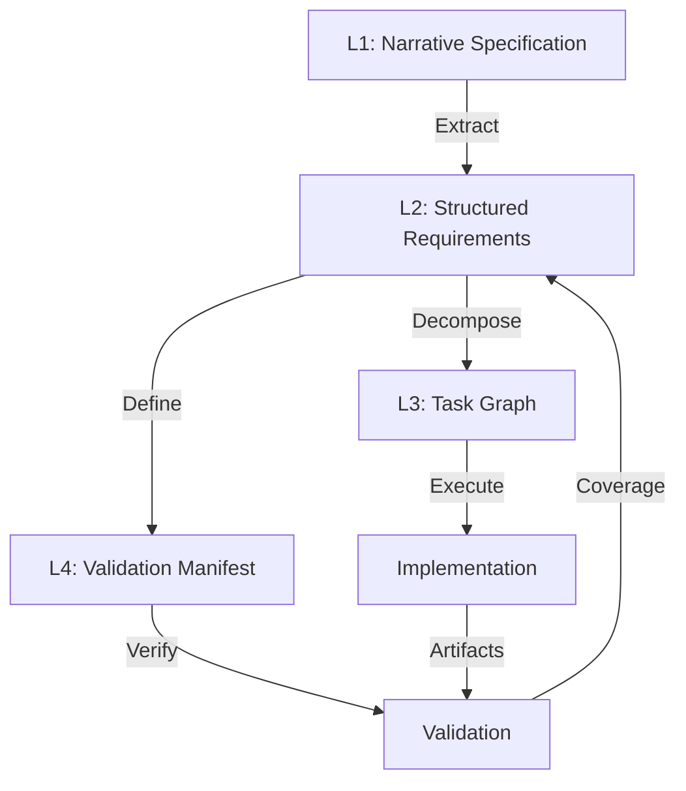
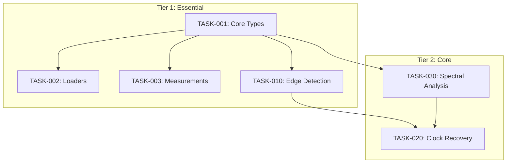
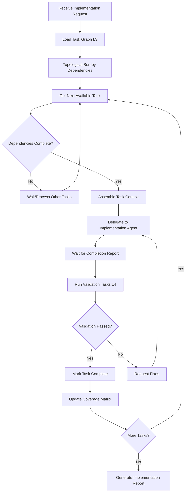

# Optimal Specification Format for Agent-Orchestrated Implementation

**Research Date**: 2025-12-19
**Status**: Complete
**Purpose**: Define the optimal format for recording technical specifications to ensure complete, traceable implementation by Claude Code agent orchestration
**Applicable Context**: This repo's orchestration approach (4 agents, hub-and-spoke, completion reports)

---

## Executive Summary

After extensive analysis of the TraceKit specification (1350+ lines, 200+ sources, 10 technical domains), industry best practices for AI-agent specification formats, and this repository's orchestration patterns, this document provides a comprehensive guide for creating **Implementation-Ready Specifications (IRS)** - documents optimized for agent-orchestrated development.

### Core Finding

**The TraceKit specification format is _excellent_ for human comprehension but suboptimal for agent implementation because it:**

1. Mixes multiple concerns (requirements, context, examples, references) without clear boundaries
2. Lacks explicit traceability structure (requirement IDs, validation criteria)
3. Contains implicit dependencies not surfaced for orchestration
4. Has no machine-parseable metadata for task decomposition
5. Relies on human intuition to extract actionable work items

### Recommended Solution: Hybrid Multi-Layer Specification

A **four-layer specification architecture** that preserves human comprehension while enabling optimal agent implementation:

| Layer                           | Purpose                             | Format                              | Primary Consumer        |
| ------------------------------- | ----------------------------------- | ----------------------------------- | ----------------------- |
| **L1: Narrative Specification** | Full context, rationale, examples   | Markdown (existing TraceKit format) | Humans, Research agents |
| **L2: Structured Requirements** | Traceable, testable requirements    | YAML/JSON with IDs                  | Implementation agents   |
| **L3: Task Graph**              | Dependency-aware work decomposition | YAML/JSON DAG                       | Orchestrator agent      |
| **L4: Validation Manifest**     | Acceptance criteria, test specs     | YAML/JSON                           | Validation agents       |

---

## Table of Contents

1. [Problem Analysis](#1-problem-analysis)
2. [Research Synthesis](#2-research-synthesis)
3. [Specification Architecture](#3-specification-architecture)
4. [Layer 1: Narrative Specification](#4-layer-1-narrative-specification)
5. [Layer 2: Structured Requirements](#5-layer-2-structured-requirements)
6. [Layer 3: Task Graph](#6-layer-3-task-graph)
7. [Layer 4: Validation Manifest](#7-layer-4-validation-manifest)
8. [Implementation Workflow](#8-implementation-workflow)
9. [Tooling and Automation](#9-tooling-and-automation)
10. [Anti-Patterns to Avoid](#10-anti-patterns-to-avoid)
11. [TraceKit Application](#11-tracekit-application)
12. [References](#12-references)

---

## 1. Problem Analysis

### 1.1 Current Specification Challenges (TraceKit Case Study)

The TraceKit specification at `.coordination/2025-12-19-tracekit-complete-specification-v2.md` exhibits common issues:

| Issue                          | Example                                                                                             | Impact on Agent Implementation                   |
| ------------------------------ | --------------------------------------------------------------------------------------------------- | ------------------------------------------------ |
| **Implicit Dependencies**      | "Clock Recovery (Essential - Tier 2)" depends on "Edge Detection (Tier 1)" but this is not explicit | Agents may attempt implementation out of order   |
| **Mixed Granularity**          | "FFT Variations" contains 4 distinct features in one section                                        | Unclear work item boundaries                     |
| **Validation Ambiguity**       | "Implement FFT" - what constitutes "done"?                                                          | No binary pass/fail criteria                     |
| **Context-Requirement Mixing** | Research findings embedded in requirements                                                          | Agents may confuse context for requirements      |
| **No Requirement IDs**         | Section numbers don't provide traceable IDs                                                         | Cannot track implementation→requirement coverage |

### 1.2 Agent Orchestration Requirements

Based on this repo's orchestration patterns (`.claude/ORCHESTRATION-STANDARDS.md`), agents need:

1. **Clear Task Boundaries**: Single-responsibility work items
2. **Explicit Dependencies**: DAG structure for sequencing
3. **Binary Validation**: Pass/fail completion criteria
4. **Traceable Artifacts**: Output→requirement mapping
5. **Context Isolation**: Relevant context per task, not full document

### 1.3 Gap Analysis: Human vs Agent Needs

| Human Need               | Agent Need               | Gap                               |
| ------------------------ | ------------------------ | --------------------------------- |
| Understand "why"         | Know "what" precisely    | Rationale mixed with requirements |
| Navigate freely          | Follow DAG               | No dependency graph               |
| Interpret intent         | Execute specification    | Ambiguous completion criteria     |
| Cross-reference          | Receive relevant context | Full document bloats context      |
| Iterate on understanding | Deterministic execution  | Implicit knowledge required       |

---

## 2. Research Synthesis

### 2.1 Industry Best Practices (2024-2025)

From research on AI-agent specification formats:

**Key Finding 1: Structured Formats for Agents**

> "Traditional specifications have evolved as 'documents for humans to read.' However, with AI agents now deeply involved in development processes, we need to transition to new document formats that both can equally reference and utilize." - [Medium: AI-Friendly Formats](https://medium.com/@takafumi.endo/requirements-specifications-as-ssot-exploring-ai-friendly-formats-e8ef028d6c01)

**Key Finding 2: Task Decomposition Structure**

> "Given a high-level task, the multi-agent system begins by constructing the topological structure of the plan, which defines the decomposition of subtasks and their dependency relationships." - [arXiv: Dynamic Task Decomposition](https://arxiv.org/html/2410.22457v1)

**Key Finding 3: Spec-Driven Development**

> "Engineering managers report improved sprint outcomes because AI agents work from clear architectural context and formal specifications rather than unstructured requirements." - [Augment Code: Spec-Driven Development](https://www.augmentcode.com/guides/ai-coding-agents-for-spec-driven-development-automation)

**Key Finding 4: Requirements Traceability**

> "A requirements traceability matrix maps relationships between requirements and other artifacts like tests, issues, and source code... ensuring comprehensive test coverage and maintaining transparency throughout the software development lifecycle." - [GeeksforGeeks: RTM](https://www.geeksforgeeks.org/software-testing/requirement-traceability-matrix/)

### 2.2 Claude Code Orchestration Patterns

From this repository's orchestration standards:

1. **Hub-and-Spoke Architecture**: One orchestrator coordinates workers
2. **Completion Reports**: Standardized JSON output from workers
3. **Single Responsibility**: Each agent has focused purpose
4. **Definition of Done**: Objective completion criteria required
5. **Ultralight Requirements Tracking**: Simple list, not complex manifests

### 2.3 LLM Agent Prompt Engineering

From research on effective agent specifications:

1. **Explicit Instructions**: Unambiguous, precise language
2. **Structured Output**: Define expected format clearly
3. **Context Boundaries**: Only include relevant information
4. **Examples**: Provide concrete before/after examples
5. **Validation Hooks**: Define success criteria upfront

---

## 3. Specification Architecture

### 3.1 Four-Layer Architecture

```
┌─────────────────────────────────────────────────────────────────────┐
│                    IMPLEMENTATION-READY SPECIFICATION                │
├─────────────────────────────────────────────────────────────────────┤
│                                                                      │
│  ┌─────────────────────────────────────────────────────────────┐   │
│  │  LAYER 4: VALIDATION MANIFEST                                │   │
│  │  - Acceptance criteria per requirement                        │   │
│  │  - Test specifications                                        │   │
│  │  - Coverage matrix                                            │   │
│  │  Format: YAML/JSON                                            │   │
│  │  Consumer: Validation agents, QA                              │   │
│  └─────────────────────────────────────────────────────────────┘   │
│                                ↑                                     │
│  ┌─────────────────────────────────────────────────────────────┐   │
│  │  LAYER 3: TASK GRAPH                                         │   │
│  │  - Work items with unique IDs                                 │   │
│  │  - Dependency DAG                                             │   │
│  │  - Implementation tier/priority                               │   │
│  │  Format: YAML/JSON                                            │   │
│  │  Consumer: Orchestrator agent                                 │   │
│  └─────────────────────────────────────────────────────────────┘   │
│                                ↑                                     │
│  ┌─────────────────────────────────────────────────────────────┐   │
│  │  LAYER 2: STRUCTURED REQUIREMENTS                            │   │
│  │  - Traceable requirement IDs                                  │   │
│  │  - Precise, testable statements                               │   │
│  │  - Type classification (functional, quality, constraint)     │   │
│  │  Format: YAML/JSON                                            │   │
│  │  Consumer: Implementation agents                              │   │
│  └─────────────────────────────────────────────────────────────┘   │
│                                ↑                                     │
│  ┌─────────────────────────────────────────────────────────────┐   │
│  │  LAYER 1: NARRATIVE SPECIFICATION                            │   │
│  │  - Full context and rationale                                 │   │
│  │  - Research findings and sources                              │   │
│  │  - Examples and visualizations                                │   │
│  │  - Human-readable documentation                               │   │
│  │  Format: Markdown                                             │   │
│  │  Consumer: Humans, Research agents                            │   │
│  └─────────────────────────────────────────────────────────────┘   │
│                                                                      │
└─────────────────────────────────────────────────────────────────────┘
```

### 3.2 Information Flow



### 3.3 File Organization

```
specification/
├── narrative/
│   └── tracekit-specification.md        # L1: Full narrative (existing format)
├── requirements/
│   ├── requirements.yaml                 # L2: All requirements
│   └── domains/
│       ├── waveform-analysis.yaml
│       ├── digital-analysis.yaml
│       ├── spectral-analysis.yaml
│       ├── protocol-decoding.yaml
│       ├── packet-daq.yaml
│       └── visualization.yaml
├── tasks/
│   ├── task-graph.yaml                   # L3: Complete task DAG
│   └── tiers/
│       ├── tier1-essential.yaml
│       ├── tier2-core.yaml
│       └── tier3-extended.yaml
└── validation/
    ├── validation-manifest.yaml          # L4: Acceptance criteria
    ├── test-specifications.yaml
    └── coverage-matrix.yaml
```

---

## 4. Layer 1: Narrative Specification

### 4.1 Purpose

The narrative specification serves as the **single source of truth** for human understanding. It contains:

- Full context and rationale for decisions
- Research findings and source citations
- Examples, diagrams, and visualizations
- Domain knowledge and terminology definitions
- Trade-off analysis and design decisions

### 4.2 Format Guidelines

The existing TraceKit format is excellent for L1. Key improvements:

1. **Add Requirement Anchors**: Use HTML anchors for cross-reference
2. **Separate Context from Requirements**: Use callouts/blockquotes for context
3. **Explicit Section IDs**: Consistent numbering for reference

**Example Enhancement**:

```markdown
## 1. Waveform Analysis Features

<a id="domain-waveform"></a>

### 1.1 Core Measurements (Essential - Tier 1)

<a id="req-wfm-001"></a>

> **Context**: IEEE 181-2011 defines standard reference points for pulse measurements.
> Rise/fall time uses 10%-90% reference points by industry convention.

| Measurement   | Description             | IEEE Standard | Requirement ID |
| ------------- | ----------------------- | ------------- | -------------- |
| **Rise Time** | 10%-90% transition time | IEEE 181-2011 | WFM-001        |
| **Fall Time** | 90%-10% transition time | IEEE 181-2011 | WFM-002        |
```

### 4.3 Sections to Include

| Section              | Purpose              | Agent Consumption     |
| -------------------- | -------------------- | --------------------- |
| Executive Summary    | High-level overview  | Initial context       |
| Domain Overviews     | Technical background | Research agents       |
| Feature Tables       | Requirement source   | Extract to L2         |
| Implementation Notes | Technical guidance   | Implementation agents |
| Research Findings    | Evidence base        | Quality validation    |
| References           | Source citations     | Verification          |

---

## 5. Layer 2: Structured Requirements

### 5.1 Purpose

Structured requirements provide **machine-parseable, traceable requirements** that agents can:

- Reference by unique ID
- Validate against acceptance criteria
- Track implementation status
- Link to artifacts

### 5.2 Schema Definition

```yaml
# requirements.yaml
version: '1.0'
specification: 'TraceKit Data Analysis Framework'
created: '2025-12-19'
domains:
  - id: waveform
    name: 'Waveform Analysis'
    narrative_ref: 'narrative/tracekit-specification.md#domain-waveform'
    requirements: [] # See domain file

# domains/waveform-analysis.yaml
domain: waveform
name: 'Waveform Analysis'
requirements:
  - id: WFM-001
    title: 'Rise Time Measurement'
    description: 'Measure 10%-90% transition time of rising edges'
    type: functional
    tier: 1
    priority: essential
    standard: 'IEEE 181-2011'
    narrative_ref: 'narrative/tracekit-specification.md#req-wfm-001'
    acceptance_criteria:
      - 'Computes rise time using 10% and 90% reference levels'
      - 'Supports configurable reference levels (e.g., 20%-80%)'
      - 'Returns NaN for invalid/missing edges'
      - 'Matches IEEE 181-2011 methodology'
    dependencies: []
    implementation:
      module: 'analyzers/waveform/measurements.py'
      function: 'rise_time'
      lines_estimate: 30
    tags: [measurement, timing, ieee-181]

  - id: WFM-002
    title: 'Fall Time Measurement'
    description: 'Measure 90%-10% transition time of falling edges'
    type: functional
    tier: 1
    priority: essential
    standard: 'IEEE 181-2011'
    narrative_ref: 'narrative/tracekit-specification.md#req-wfm-001'
    acceptance_criteria:
      - 'Computes fall time using 90% and 10% reference levels'
      - 'Supports configurable reference levels'
      - 'Returns NaN for invalid/missing edges'
    dependencies: []
    implementation:
      module: 'analyzers/waveform/measurements.py'
      function: 'fall_time'
      lines_estimate: 30
    tags: [measurement, timing, ieee-181]

  - id: WFM-010
    title: 'Edge Detection'
    description: 'Detect rising and falling edges with sub-sample interpolation'
    type: functional
    tier: 1
    priority: essential
    acceptance_criteria:
      - 'Detects rising edges (low→high transitions)'
      - 'Detects falling edges (high→low transitions)'
      - 'Provides sub-sample timestamp interpolation'
      - 'Returns edge polarity (rising/falling)'
    dependencies: []
    implementation:
      module: 'analyzers/digital/extraction.py'
      function: 'detect_edges'
      lines_estimate: 50
    tags: [digital, edges, timing]

  - id: WFM-020
    title: 'Clock Recovery - FFT Method'
    description: 'Recover clock frequency using spectral peak detection'
    type: functional
    tier: 2
    priority: high
    acceptance_criteria:
      - 'Detects dominant clock frequency via FFT'
      - 'Achieves <0.01% accuracy for stable clocks'
      - 'Falls back gracefully for non-periodic signals'
    dependencies:
      - WFM-010 # Requires edge detection
      - SPE-001 # Requires FFT capability
    implementation:
      module: 'analyzers/digital/timing.py'
      function: 'clock_recovery_fft'
      lines_estimate: 60
    tags: [digital, clock, fft]
```

### 5.3 Requirement Types

| Type            | Description                 | Example                     |
| --------------- | --------------------------- | --------------------------- |
| `functional`    | Feature that does something | "Compute FFT"               |
| `quality`       | Non-functional attribute    | "Process 1M samples in <1s" |
| `constraint`    | Technical limitation        | "Must use scipy.fft"        |
| `interface`     | API/format specification    | "Accept numpy arrays"       |
| `documentation` | Docs requirement            | "Include docstrings"        |

### 5.4 Tier Classification

| Tier | Priority  | Description                             |
| ---- | --------- | --------------------------------------- |
| 1    | Essential | Core functionality, implement first     |
| 2    | Core      | Important features, implement second    |
| 3    | Extended  | Nice-to-have, implement if time permits |
| 4    | Advanced  | Future enhancements                     |

---

## 6. Layer 3: Task Graph

### 6.1 Purpose

The task graph provides **dependency-aware work decomposition** for the orchestrator:

- Unique task IDs linked to requirements
- Dependency DAG for sequencing
- Estimated effort for planning
- Agent assignment guidance

### 6.2 Schema Definition

```yaml
# task-graph.yaml
version: '1.0'
specification: 'TraceKit Implementation Tasks'
created: '2025-12-19'

# Tier 1 tasks - implement first
tier1:
  - id: TASK-001
    title: 'Implement Core Data Types'
    requirements: [CORE-001, CORE-002, CORE-003]
    description: |
      Implement TraceData, WaveformTrace, and DigitalTrace classes
      with sample rate, metadata, and array storage.
    deliverables:
      - path: 'src/tracekit/core/types.py'
        type: module
    dependencies: []
    effort_hours: 4
    agent_hint: 'implementation'
    context_files:
      - 'narrative/tracekit-specification.md#1-waveform-analysis'
      - 'requirements/domains/core.yaml'
    validation_tasks: [VAL-001]

  - id: TASK-002
    title: 'Implement Waveform Loaders (Tektronix, NumPy)'
    requirements: [LOAD-001, LOAD-002]
    description: |
      Implement file loaders for Tektronix WFM files and NumPy NPZ files.
      Extract sample rate and metadata from file headers.
    deliverables:
      - path: 'src/tracekit/loaders/tektronix.py'
        type: module
      - path: 'src/tracekit/loaders/numpy.py'
        type: module
    dependencies: [TASK-001] # Needs core types
    effort_hours: 6
    agent_hint: 'implementation'
    context_files:
      - 'narrative/tracekit-specification.md#8-data-storage'
    validation_tasks: [VAL-002, VAL-003]

  - id: TASK-003
    title: 'Implement Basic Waveform Measurements'
    requirements: [WFM-001, WFM-002, WFM-003, WFM-004, WFM-005]
    description: |
      Implement rise time, fall time, frequency, duty cycle, and amplitude
      measurements per IEEE 181-2011.
    deliverables:
      - path: 'src/tracekit/analyzers/waveform/measurements.py'
        type: module
    dependencies: [TASK-001] # Needs core types
    effort_hours: 8
    agent_hint: 'implementation'
    context_files:
      - 'narrative/tracekit-specification.md#1-waveform-analysis'
      - 'requirements/domains/waveform-analysis.yaml'
    validation_tasks: [VAL-004, VAL-005]

  - id: TASK-010
    title: 'Implement Digital Edge Detection'
    requirements: [WFM-010, DIG-001, DIG-002]
    description: |
      Implement threshold-based digital extraction with edge detection
      and sub-sample interpolation.
    deliverables:
      - path: 'src/tracekit/analyzers/digital/extraction.py'
        type: module
    dependencies: [TASK-001]
    effort_hours: 6
    agent_hint: 'implementation'
    context_files:
      - 'narrative/tracekit-specification.md#2-digital-analysis'
    validation_tasks: [VAL-010]

# Tier 2 tasks - implement after tier 1 complete
tier2:
  - id: TASK-020
    title: 'Implement Clock Recovery'
    requirements: [WFM-020, WFM-021]
    description: |
      Implement FFT-based and edge-based clock recovery methods.
    deliverables:
      - path: 'src/tracekit/analyzers/digital/timing.py'
        type: module
    dependencies: [TASK-010, TASK-030] # Needs edges + FFT
    effort_hours: 8
    agent_hint: 'implementation'
    validation_tasks: [VAL-020]

  - id: TASK-030
    title: 'Implement Spectral Analysis (FFT, PSD)'
    requirements: [SPE-001, SPE-002, SPE-003]
    description: |
      Implement windowed FFT and Welch PSD with configurable parameters.
    deliverables:
      - path: 'src/tracekit/analyzers/waveform/spectral.py'
        type: module
    dependencies: [TASK-001]
    effort_hours: 10
    agent_hint: 'implementation'
    validation_tasks: [VAL-030, VAL-031]
```

### 6.3 Dependency DAG Visualization



### 6.4 Agent Hints

| Hint             | Agent                | When to Use                 |
| ---------------- | -------------------- | --------------------------- |
| `implementation` | Code-writing agent   | New modules, features       |
| `research`       | knowledge_researcher | Unknown domains, validation |
| `documentation`  | technical_writer     | API docs, tutorials         |
| `testing`        | Test-writing agent   | Test creation               |
| `review`         | Code review agent    | Quality checks              |

---

## 7. Layer 4: Validation Manifest

### 7.1 Purpose

The validation manifest defines **acceptance criteria and test specifications**:

- Binary pass/fail criteria per requirement
- Test specifications and expected results
- Coverage tracking

### 7.2 Schema Definition

```yaml
# validation-manifest.yaml
version: '1.0'
specification: 'TraceKit Validation'
created: '2025-12-19'

validations:
  - id: VAL-001
    requirements: [CORE-001, CORE-002]
    title: 'Core Types Validation'
    type: unit
    criteria:
      - criterion: 'TraceData stores numpy array correctly'
        test: 'test_trace_data_storage'
        expected: 'Array preserved with correct dtype'
      - criterion: 'WaveformTrace has sample_rate attribute'
        test: 'test_waveform_sample_rate'
        expected: 'Float > 0'
      - criterion: 'DigitalTrace stores binary array'
        test: 'test_digital_storage'
        expected: 'Array with values 0 or 1 only'

  - id: VAL-004
    requirements: [WFM-001]
    title: 'Rise Time Measurement Validation'
    type: unit
    criteria:
      - criterion: 'Computes rise time for known waveform'
        test: 'test_rise_time_known'
        expected: |
          Input: Linear ramp from 0V to 1V over 100μs at 1MHz
          Expected: 80μs (10% to 90% of 100μs)
          Tolerance: ±1%
      - criterion: 'Handles configurable reference levels'
        test: 'test_rise_time_custom_levels'
        expected: |
          Input: Same ramp, ref_levels=(20, 80)
          Expected: 60μs
          Tolerance: ±1%
      - criterion: 'Returns NaN for no valid edge'
        test: 'test_rise_time_no_edge'
        expected: 'numpy.nan'

  - id: VAL-030
    requirements: [SPE-001]
    title: 'FFT Implementation Validation'
    type: unit
    criteria:
      - criterion: 'Detects single frequency correctly'
        test: 'test_fft_single_tone'
        expected: |
          Input: 1kHz sine wave at 100kHz sample rate
          Expected: Peak at 1kHz ±1 bin
      - criterion: 'Window function applied correctly'
        test: 'test_fft_windowing'
        expected: 'Reduced spectral leakage vs rectangular'
      - criterion: 'Matches scipy.fft output'
        test: 'test_fft_scipy_match'
        expected: 'Within 1e-10 tolerance'

# Coverage matrix
coverage:
  - requirement: WFM-001
    validations: [VAL-004]
    status: pending
  - requirement: WFM-002
    validations: [VAL-005]
    status: pending
  - requirement: SPE-001
    validations: [VAL-030]
    status: pending
```

### 7.3 Validation Types

| Type          | Purpose                     | Example                     |
| ------------- | --------------------------- | --------------------------- |
| `unit`        | Function-level testing      | Test `rise_time()` output   |
| `integration` | Module interaction          | Loader → Analyzer flow      |
| `compliance`  | Standards conformance       | IEEE 181 methodology        |
| `performance` | Speed/memory bounds         | "Process 1M samples in <1s" |
| `example`     | Documentation examples work | Tutorial code runs          |

---

## 8. Implementation Workflow

### 8.1 Orchestrator Workflow



### 8.2 Context Assembly for Agents

When delegating to an implementation agent, the orchestrator assembles:

```json
{
  "task": {
    "id": "TASK-003",
    "title": "Implement Basic Waveform Measurements",
    "requirements": ["WFM-001", "WFM-002", "WFM-003"]
  },
  "context": {
    "narrative_excerpt": "[Relevant section from L1]",
    "requirements": "[Full requirement definitions from L2]",
    "validation_criteria": "[Acceptance criteria from L4]"
  },
  "deliverables": {
    "path": "src/tracekit/analyzers/waveform/measurements.py",
    "type": "module"
  },
  "dependencies_completed": {
    "TASK-001": {
      "artifacts": ["src/tracekit/core/types.py"],
      "types_available": ["TraceData", "WaveformTrace"]
    }
  }
}
```

### 8.3 Completion Report Enhancement

Align with existing `.claude/agent-outputs/` pattern:

```json
{
  "task_id": "2025-12-19-143022-waveform-measurements",
  "agent": "implementation",
  "status": "complete",
  "task_ref": "TASK-003",
  "requirements_addressed": ["WFM-001", "WFM-002", "WFM-003"],
  "artifacts": ["src/tracekit/analyzers/waveform/measurements.py"],
  "lines_added": 285,
  "validation_status": {
    "VAL-004": "passed",
    "VAL-005": "passed"
  },
  "potential_gaps": [],
  "next_agent": "none",
  "notes": "Implemented rise_time, fall_time, frequency. All tests passing.",
  "completed_at": "2025-12-19T14:45:00Z"
}
```

---

## 9. Tooling and Automation

### 9.1 Extraction Tool: Narrative → Structured

Create a semi-automated tool to extract requirements from narrative:

```python
# scripts/extract_requirements.py
"""Extract structured requirements from narrative specification."""
def extract_requirements(narrative_path: str) -> dict:
    """
    Parse narrative markdown and extract requirement candidates.

    Looks for:
    - Tables with ID-like columns
    - Sections with measurement/feature names
    - IEEE/standard references

    Returns structured YAML-compatible dict for human review.
    """
```

### 9.2 Dependency Analyzer

```python
# scripts/analyze_dependencies.py
"""Analyze requirements for implicit dependencies."""
def analyze_dependencies(requirements: list[dict]) -> dict:
    """
    Analyze requirements for:
    - Explicit dependencies (stated in requirement)
    - Implicit dependencies (inferred from description)
    - Cross-domain dependencies

    Returns dependency graph for task DAG construction.
    """
```

### 9.3 Coverage Report Generator

```python
# scripts/generate_coverage.py
"""Generate implementation coverage report."""
def generate_coverage(
    requirements_path: str,
    completion_reports_glob: str
) -> dict:
    """
    Cross-reference completion reports against requirements.

    Returns:
    - Coverage percentage
    - Unaddressed requirements
    - Requirements without validation
    """
```

### 9.4 CLI Commands

```bash
# Extract requirements from narrative
/spec extract narrative/tracekit-specification.md --output requirements/

# Validate task graph dependencies
/spec validate-graph tasks/task-graph.yaml

# Generate coverage report
/spec coverage --requirements requirements/ --completions .claude/agent-outputs/

# Create implementation context for task
/spec context TASK-003 --output .coordination/task-003-context.md
```

---

## 10. Anti-Patterns to Avoid

### 10.1 Specification Anti-Patterns

| Anti-Pattern              | Problem                           | Solution                                     |
| ------------------------- | --------------------------------- | -------------------------------------------- |
| **Monolithic Spec**       | 1000+ lines, no structure         | Split into 4 layers                          |
| **No IDs**                | Can't trace requirements          | Add unique IDs to every requirement          |
| **Implicit Dependencies** | Wrong execution order             | Explicit dependency graph                    |
| **Vague Acceptance**      | "Implement FFT" - what's done?    | Binary pass/fail criteria                    |
| **Mixed Context**         | Research findings in requirements | Separate L1 (context) from L2 (requirements) |
| **No Validation**         | How to verify?                    | L4 validation manifest                       |

### 10.2 Orchestration Anti-Patterns

| Anti-Pattern               | Problem                          | Solution                           |
| -------------------------- | -------------------------------- | ---------------------------------- |
| **Full Document Context**  | Token bloat, slow                | Assemble relevant context per task |
| **Sequential Everything**  | Slow, no parallelism             | DAG-based parallelization          |
| **No Coverage Tracking**   | Requirements fall through cracks | Coverage matrix in L4              |
| **Manual Status Tracking** | Error-prone, stale               | Automated from completion reports  |

### 10.3 Agent Anti-Patterns

| Anti-Pattern        | Problem                         | Solution                      |
| ------------------- | ------------------------------- | ----------------------------- |
| **Assume Context**  | Agent misses requirements       | Explicit context assembly     |
| **Skip Validation** | Incomplete implementations ship | Mandatory validation per task |
| **No Artifacts**    | Can't verify output             | Required deliverable paths    |

---

## 11. TraceKit Application

### 11.1 Migration Plan

**Phase 1: Create L2 (Structured Requirements)**

1. Parse existing narrative for requirement candidates
2. Assign unique IDs (WFM-001, DIG-001, SPE-001, etc.)
3. Extract acceptance criteria from description/context
4. Identify explicit and implicit dependencies
5. Human review and refinement

**Phase 2: Create L3 (Task Graph)**

1. Group related requirements into tasks
2. Build dependency DAG
3. Assign implementation tiers
4. Estimate effort per task
5. Add context file references

**Phase 3: Create L4 (Validation Manifest)**

1. Define binary acceptance criteria per requirement
2. Specify test cases with expected values
3. Create coverage matrix
4. Define compliance tests for IEEE standards

**Phase 4: Tooling**

1. Create extraction scripts
2. Create validation scripts
3. Create coverage reporting
4. Integrate with orchestrator

### 11.2 Example: TraceKit L2 Excerpt

```yaml
# requirements/domains/waveform-analysis.yaml
domain: waveform
name: 'Waveform Analysis'
narrative_ref: 'narrative/tracekit-specification.md#1-waveform-analysis-features'

requirements:
  # Core Measurements - Tier 1
  - id: WFM-001
    title: 'Rise Time Measurement'
    description: 'Measure 10%-90% transition time of rising edges per IEEE 181-2011'
    type: functional
    tier: 1
    priority: essential
    standard: 'IEEE 181-2011'
    acceptance_criteria:
      - 'Uses 10% and 90% reference levels by default'
      - 'Supports configurable reference levels via ref_levels parameter'
      - 'Returns numpy.nan for traces without valid edges'
      - 'Achieves sub-sample accuracy via interpolation'
    dependencies: []
    implementation:
      module: 'src/tracekit/analyzers/waveform/measurements.py'
      function: 'rise_time'
    tags: [measurement, timing, ieee-181, essential]

  - id: WFM-002
    title: 'Fall Time Measurement'
    description: 'Measure 90%-10% transition time of falling edges per IEEE 181-2011'
    type: functional
    tier: 1
    priority: essential
    standard: 'IEEE 181-2011'
    acceptance_criteria:
      - 'Uses 90% and 10% reference levels by default'
      - 'Supports configurable reference levels'
      - 'Returns numpy.nan for traces without valid edges'
    dependencies: []
    implementation:
      module: 'src/tracekit/analyzers/waveform/measurements.py'
      function: 'fall_time'
    tags: [measurement, timing, ieee-181, essential]

  - id: WFM-003
    title: 'Period Measurement'
    description: 'Measure time between identical edges'
    type: functional
    tier: 1
    priority: essential
    standard: 'IEEE 181-2011'
    acceptance_criteria:
      - 'Measures time between consecutive rising edges'
      - 'Supports falling edge period measurement'
      - 'Returns mean period across multiple cycles'
      - 'Reports period jitter statistics'
    dependencies: [WFM-010] # Needs edge detection
    implementation:
      module: 'src/tracekit/analyzers/waveform/measurements.py'
      function: 'period'
    tags: [measurement, timing, ieee-181]
```

---

## 12. References

### AI-Friendly Specification Formats

1. [Requirements Specifications as SSOT: Exploring AI-Friendly Formats](https://medium.com/@takafumi.endo/requirements-specifications-as-ssot-exploring-ai-friendly-formats-e8ef028d6c01) - Medium, 2024
2. [AI Coding Agents for Spec-Driven Development Automation](https://www.augmentcode.com/guides/ai-coding-agents-for-spec-driven-development-automation) - Augment Code, 2024
3. [A Practical Guide for Designing, Developing, and Deploying Production-Grade Agentic AI Workflows](https://arxiv.org/abs/2512.08769) - arXiv, 2024

### Task Decomposition and Planning

4. [Advancing Agentic Systems: Dynamic Task Decomposition](https://arxiv.org/html/2410.22457v1) - arXiv, 2024
5. [Deep Dive into Agent Task Decomposition Techniques](https://sparkco.ai/blog/deep-dive-into-agent-task-decomposition-techniques) - SparkCo, 2024
6. [Top AI Agentic Workflow Patterns](https://blog.bytebytego.com/p/top-ai-agentic-workflow-patterns) - ByteByteGo, 2024

### Requirements Traceability

7. [Requirements Traceability Matrix (RTM)](https://www.geeksforgeeks.org/software-testing/requirement-traceability-matrix/) - GeeksforGeeks
8. [Traceability Matrix in Software Testing: Full Guide 2025](https://aqua-cloud.io/traceability-matrix/) - Aqua Cloud
9. [Requirements Traceability for DO-178C Compliance](https://www.parasoft.com/learning-center/do-178c/requirements-traceability/) - Parasoft

### LLM Agent Prompt Engineering

10. [Best practices for LLM prompt engineering](https://www.palantir.com/docs/foundry/aip/best-practices-prompt-engineering) - Palantir
11. [Prompt Engineering for AI Agents](https://www.prompthub.us/blog/prompt-engineering-for-ai-agents) - PromptHub
12. [The Ultimate Guide to Prompt Engineering in 2025](https://www.lakera.ai/blog/prompt-engineering-guide) - Lakera

### Claude Code Orchestration

13. [Subagents - Anthropic Docs](https://docs.anthropic.com/en/docs/claude-code/sub-agents)
14. [Best practices for Claude Code subagents](https://www.pubnub.com/blog/best-practices-for-claude-code-sub-agents/) - PubNub
15. [Claude Agent Skills: A First Principles Deep Dive](https://leehanchung.github.io/blogs/2025/10/26/claude-skills-deep-dive/)

### BDD and Gherkin

16. [Gherkin | Cucumber](https://cucumber.io/docs/gherkin/) - Cucumber Docs
17. [Cucumber Testing: A Key to Generative AI in Test Automation](https://kobiton.com/blog/cucumber-testing-a-key-to-generative-ai-in-test-automation/) - Kobiton

---

## Appendix A: Quick Reference

### Four-Layer Summary

| Layer            | Format   | Purpose                 | Agent Consumer   |
| ---------------- | -------- | ----------------------- | ---------------- |
| L1: Narrative    | Markdown | Full context, rationale | Humans, Research |
| L2: Requirements | YAML     | Traceable requirements  | Implementation   |
| L3: Task Graph   | YAML     | Dependency DAG          | Orchestrator     |
| L4: Validation   | YAML     | Acceptance criteria     | Validation       |

### Requirement ID Prefixes

| Prefix | Domain            |
| ------ | ----------------- |
| CORE-  | Core data types   |
| WFM-   | Waveform analysis |
| DIG-   | Digital analysis  |
| SPE-   | Spectral analysis |
| PRO-   | Protocol decoding |
| PKT-   | Packet/DAQ        |
| VIS-   | Visualization     |
| STO-   | Storage/formats   |
| DOC-   | Documentation     |

### Task Status Flow

```
pending → in_progress → validation → complete
                ↓
            blocked → in_progress (retry)
```

---

**Document Status**: Complete
**Applicable To**: TraceKit and similar technical specifications
**Next Steps**: Apply to TraceKit specification, create extraction tooling
