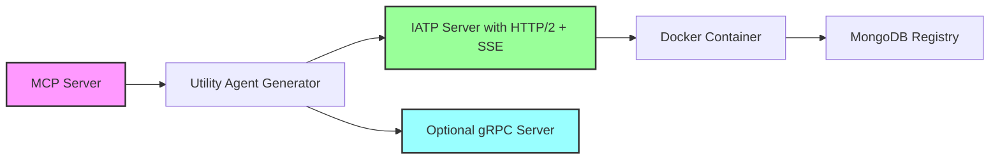
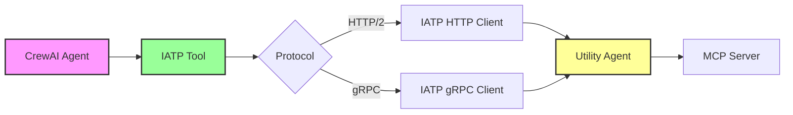
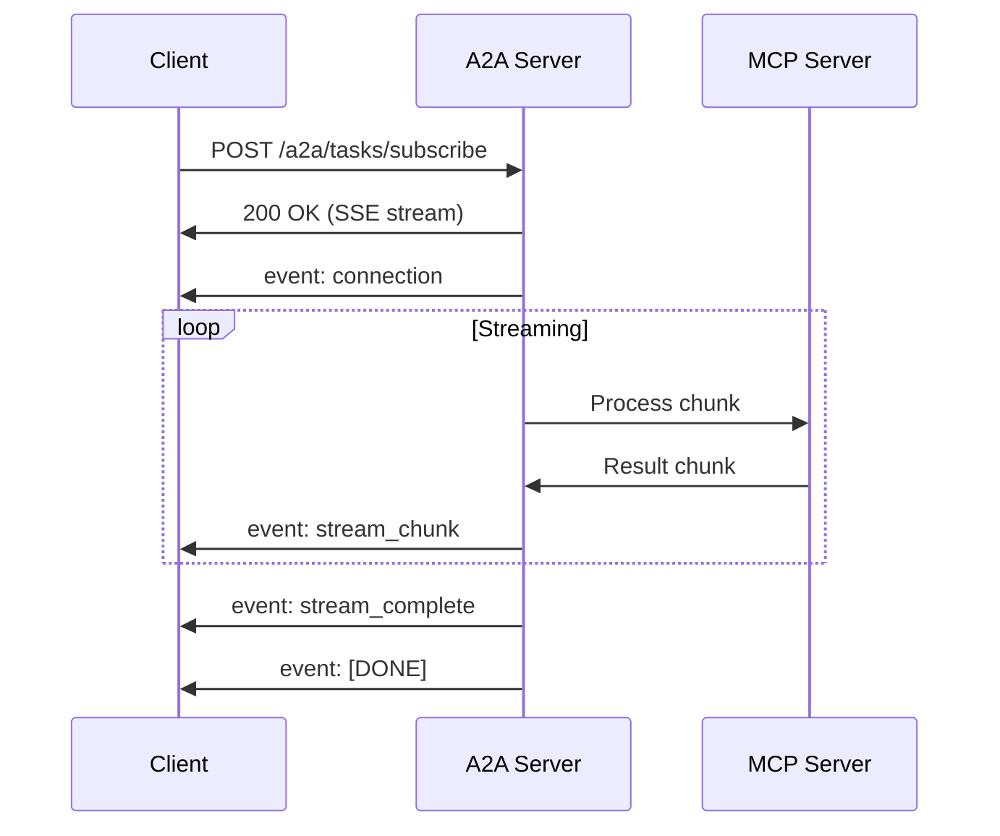
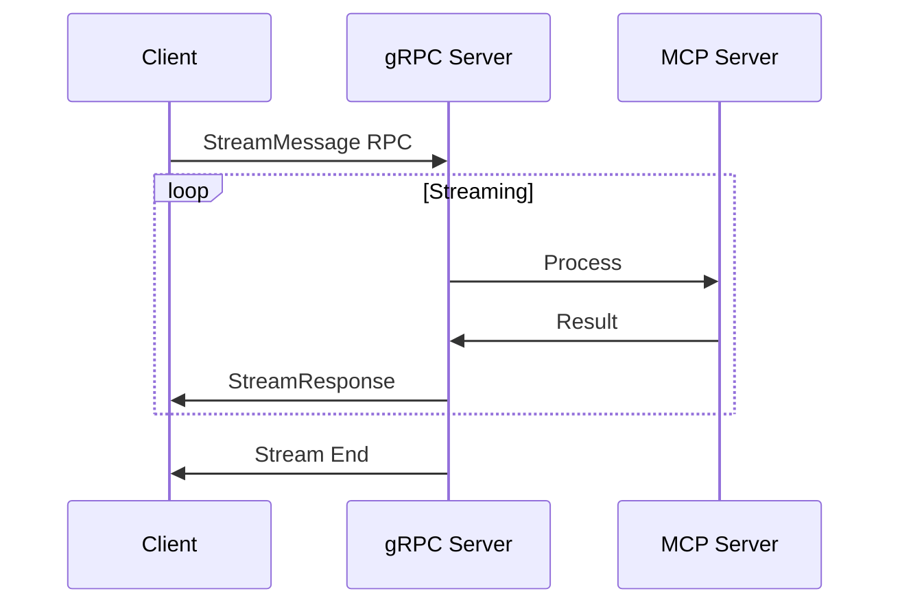

# Inter-Agent Transfer Protocol (IATP)

The IATP folder implements the Inter-Agent Transfer Protocol, enabling AI Agents to utilize other AI Agents as tools. This implementation uses the A2A protocol library as the underlying communication mechanism and allows CrewAI agents to act as both IATP servers (utility agents) and clients.

## Overview

The IATP implementation provides:
- **Utility Agent Creation**: Convert MCP servers into IATP-compatible utility agents
- **IATP Client Tools**: Enable CrewAI crews to use utility agents as tools via IATP protocol
- **Protocol Support**: HTTP/2 with SSE streaming and optional gRPC for high-performance scenarios
- **Registry Management**: MongoDB-based registry for discovering utility agents

## Architecture

### A. Utility Agent (IATP Server) Flow



### B. CrewAI Client (IATP Client) Flow



## IATP Operation Modes

The IATP protocol supports two distinct operation modes, each designed for different use cases:

### 1. Synchronous JSON-RPC Mode

This is the default mode for simple request-response patterns:

**How it works:**
- Client sends: `message/send` request via JSON-RPC
- Server processes the request using CrewAI agents
- Server returns: A single `Message` result
- The `ResultAggregator` waits for exactly ONE message to complete the request

**When to use:**
- Direct questions requiring one answer
- Traditional API-like interactions
- When you need a complete response before proceeding
- CrewAI operations that produce a final result

**Example flow:**
```
Client: "What is the current BTC price?"
Server: Processes request...
Server: Returns: "The current BTC price is $107,398.50"
```

**Important:** In this mode, the agent executor should only send ONE message to the event queue. Sending multiple events (like status updates) will confuse the `ResultAggregator` and cause timeouts.

### 2. Asynchronous Streaming Mode (SSE)

This mode uses Server-Sent Events for real-time updates and long-running operations:

**How it works:**
- Client sends: `message/send` with `output_mode: "text/event-stream"`
- Server returns: A `Task` object with an ID immediately
- Client subscribes: Connects to `/a2a/tasks/subscribe` endpoint for SSE
- Server streams: Multiple events using `CustomEvent` objects

**When to use:**
- Long-running operations with progress updates
- Real-time data feeds (market prices, trading signals)
- Multi-step workflows where intermediate results matter
- When you need to show progress to users

**Event types in streaming mode:**
- `stream_start`: Indicates streaming has begun
- `stream_chunk`: Contains a chunk of data
- `message`: Standard message updates
- `progress`: Progress updates with percentage
- `status`: Task status changes (RUNNING, COMPLETED, FAILED)
- `stream_complete`: Indicates streaming has finished
- `stream_error`: Error occurred during streaming

**Example flow:**
```
Client: "Monitor BTC price for the next minute"
Server: Returns Task ID: "task_123"
Client: Subscribes to SSE endpoint
Server: Sends stream_start event
Server: Sends stream_chunk: "BTC: $107,398.50"
Server: Sends stream_chunk: "BTC: $107,401.25"
Server: Sends stream_chunk: "BTC: $107,395.00"
Server: Sends stream_complete event
```

### Implementation Guidelines

**For Synchronous Mode:**
```python
# In agent_executor.py
async def _execute_standard(self, context, event_queue, request_text):
    # Process request
    result = process_with_crewai(request_text)
    
    # Send ONLY ONE message
    msg = new_agent_text_message(str(result))
    msg.taskId = context.task_id  # Important: Set task ID
    await event_queue.enqueue_event(msg)
```

**For Streaming Mode:**
```python
# In agent_executor.py
async def _execute_streaming(self, context, event_queue, request_text):
    # Send start event
    await event_queue.enqueue_event(
        CustomEvent("stream_start", {"message": "Starting"})
    )
    
    # Stream chunks
    async for chunk in get_streaming_data():
        await event_queue.enqueue_event(
            CustomEvent("stream_chunk", {"content": chunk})
        )
    
    # Send completion
    await event_queue.enqueue_event(
        CustomEvent("stream_complete", {"message": "Done"})
    )
```

## Key Components

### 1. Server Components (`iatp/server/`)

- **`templates/`**: Jinja2 templates for generating utility agents
  - `__main__.py.j2`: Main entry point with HTTP/2 and SSE support
  - `agent_executor.py.j2`: Executor with streaming capabilities
  - `grpc_server.py.j2`: Optional gRPC server implementation
  - `pyproject.toml.j2`: Dependencies including HTTP/2 and optional gRPC

### 2. Client Components (`iatp/client/`)

- **`crewai_a2a_tools.py`**: HTTP/2-based IATP tools for CrewAI (using A2A protocol)
  - Persistent HTTP/2 connections with multiplexing
  - SSE streaming support for real-time data
  - Connection pooling and retry logic
  
- **`grpc_a2a_tools.py`**: gRPC-based IATP tools for high-performance scenarios
  - Channel pooling for load distribution
  - Unary, server-streaming, and bidirectional streaming
  - Built-in retry and circuit breaker patterns

### 3. Registry Components (`iatp/registry/`)

- **`iatp_registry_api.py`**: High-level API for registry operations
  - Find and list MCP servers
  - No direct MongoDB exposure to utility agents

## Protocol Features

### HTTP/2 with SSE Streaming

**When to use**: Default choice for most scenarios
- ✅ Wide compatibility
- ✅ Works through proxies and load balancers
- ✅ Human-readable protocol
- ✅ Built-in browser support for debugging

**Features**:
- HTTP/2 multiplexing: Multiple concurrent requests over single connection
- Server-Sent Events: Real-time streaming responses
- Keep-alive connections: Reduced latency
- Automatic reconnection: Built into SSE protocol

### gRPC Support

**When to use**: High-performance, low-latency scenarios
- ✅ Binary protocol: More efficient than HTTP/JSON
- ✅ Strongly typed: Protocol buffer definitions
- ✅ Bidirectional streaming: Full-duplex communication
- ✅ Built-in flow control and backpressure

**Features**:
- Channel pooling: Load distribution across connections
- All streaming modes: Unary, server-streaming, client-streaming, bidirectional
- Reflection support: Runtime service discovery
- Configurable message sizes and stream limits

## Usage Examples

### Creating a Utility Agent

```python
from traia_iatp.server import IATPServerAgentGenerator
from traia_iatp.core.models import MCPServer, MCPServerType

# Create MCP server specification
mcp_server = MCPServer(
    id="hyperliquid-mcp-001",
    name="hyperliquid-mcp",
    url="http://localhost:3000/mcp",
    server_type=MCPServerType.STREAMABLE_HTTP,
    description="Trading tools for Hyperliquid DEX",
    capabilities=["get_market_data", "place_order", "get_positions"]
)

# Generate utility agent
generator = IATPServerAgentGenerator()
agent = generator.generate_agent(
    mcp_server=mcp_server,
    agent_name="Hyperliquid Trading Agent",
    agent_description="Trading on Hyperliquid DEX"
)
```

### Using HTTP/2 A2A Tools in CrewAI

```python
from traia_iatp.client.crewai_a2a_tools import A2AToolkit

# Create HTTP/2 tool with streaming support
tool = A2AToolkit.create_tool_from_endpoint(
    endpoint="http://localhost:8000",
    name="Trading Agent",
    description="Execute trades via A2A"
)

# Use in CrewAI agent
agent = Agent(
    role="Trader",
    tools=[tool]
)

# Basic usage
result = await tool._arun("Get current BTC price")
print(f"Price: {result}")
```

### Using gRPC A2A Tools

```python
from traia_iatp.client.grpc_a2a_tools import GrpcA2AToolkit

# Create gRPC tool for high-performance
tool = GrpcA2AToolkit.create_tool_from_endpoint(
    endpoint="localhost:50051",
    name="Trading Agent gRPC",
    description="High-frequency trading via gRPC",
    pool_size=20,  # More channels for high load
    use_tls=True
)

# Use same interface as HTTP tools
result = await tool._arun("Execute trade: BUY 0.1 BTC")
```

## Streaming Patterns

### SSE Streaming (HTTP/2)



### gRPC Streaming



## Performance Considerations

### HTTP/2 vs gRPC

| Feature | HTTP/2 + SSE | gRPC |
|---------|--------------|------|
| Protocol | Text (JSON) | Binary (Protobuf) |
| Streaming | Server-only | Bidirectional |
| Browser Support | Yes | Limited |
| Debugging | Easy | Requires tools |
| Performance | Good | Excellent |
| Message Size | Flexible | Fixed by proto |

### Connection Pooling

Both protocols support connection pooling:
- **HTTP/2**: Single connection with up to 100 concurrent streams
- **gRPC**: Multiple channels with round-robin distribution

## Deployment

### Docker Support

Generated utility agents include:
- Multi-protocol support in single container
- Health checks for both HTTP and gRPC endpoints
- Environment-based configuration

### Environment Variables

```bash
# HTTP/2 Server
PORT=8000
HOST=0.0.0.0

# gRPC Server (optional)
GRPC_PORT=50051

# TLS Support
USE_TLS=true
TLS_CERT_PATH=/certs/server.crt
TLS_KEY_PATH=/certs/server.key
```

## Future Enhancements

1. **WebSocket Support**: For browser-based clients
2. **GraphQL Gateway**: Unified query interface
3. **Service Mesh Integration**: Istio/Linkerd support
4. **Distributed Tracing**: OpenTelemetry integration
5. **Protocol Buffer Registry**: Centralized schema management 