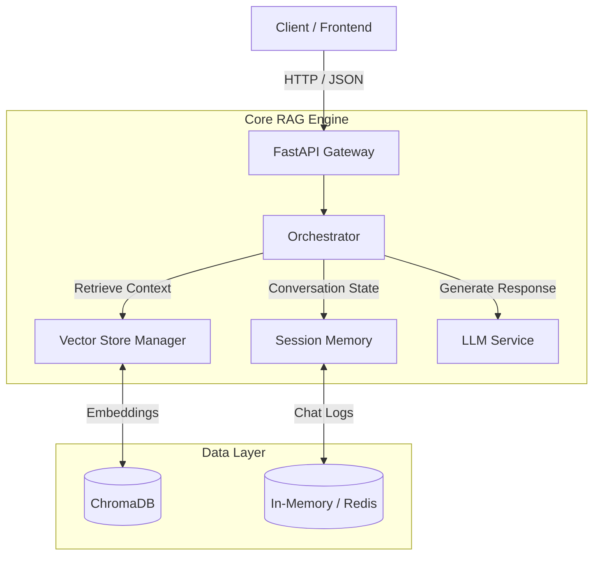

<div align="center">

# 🚀 TUG (TheUltimateRAG)

### A Modular, Production-Ready Foundation for Next-Generation AI Applications

Build scalable, secure, and intelligent RAG (Retrieval-Augmented Generation) systems without reinventing the wheel.

[](https://www.python.org/downloads/release/python-3100/)
[](https://fastapi.tiangolo.com)
[](https://www.langchain.com)
[](https://opensource.org/licenses/MIT)

🔗 **Official Website & Documentation**  
👉 https://ultimaterag.vercel.app/

[Key Features](#-key-features) •
[Architecture](#-system-architecture) •
[Getting Started](#-getting-started) •
[Visualizer](#-rag-visualizer-gui) •
[API](#-api-endpoints) •
[Contributing](#-contributing)

</div>

---

## 📖 What is TUG (TheUltimateRAG)?

**TUG (TheUltimateRAG)** is a **real-world, production-grade RAG framework**, not just another tutorial or demo project.

It is designed to solve common problems developers face when moving from simple prototypes to **scalable AI systems**, such as:

- Multi-user data separation
- Long-term memory handling
- Organizational knowledge sharing
- Clean, modular architecture

Whether you’re building:

- A **corporate knowledge assistant**
- A **legal or research AI**
- A **personal second-brain**
- Or a **multi-tenant SaaS AI platform**

👉 **TUG (TheUltimateRAG) gives you a strong, extensible backend foundation.**

For a complete walkthrough, architecture deep-dives, and usage examples,  
📘 **visit the official documentation:**  
**https://ultimaterag.vercel.app/**

---

## 🌟 Key Features (Explained Simply)

| Feature                             | What It Means for You                                            |
| ----------------------------------- | ---------------------------------------------------------------- |
| ⚡ **High-Performance API**         | Built with **FastAPI** for fast, async, and scalable AI services |
| 🛡️ **True Multi-Tenant Isolation**  | Each user’s data is fully isolated and secure                    |
| 🏢 **Organization-Level Knowledge** | Share documents across teams without duplicating data            |
| 🧠 **Session-Aware Memory**         | Conversations retain context naturally across turns              |
| 🔍 **Hybrid Semantic Search**       | Metadata-aware vector search with logical filters                |
| 👁️ **RAG Visualizer GUI**           | Real-time visualization of retrieval, context, and generation    |

---

## 🏗️ System Architecture (Designed for Flexibility)

The system follows a **plug-and-play architecture**.  
You can replace or extend **any core component** without breaking the rest of the system.

- Swap vector databases
- Change LLM providers
- Add custom memory logic
- Introduce agent workflows



📖 **Detailed architecture explanation available at:**
👉 [https://ultimaterag.vercel.app/](https://ultimaterag.vercel.app/)

---

## 🚀 Getting Started Quickly

### Requirements

- Python **3.10+**
- Node.js & npm (for the Visualizer UI)
- API keys (OpenAI, Anthropic, etc.)

### Installation Steps

1️⃣ **Clone the Repository**

```bash
pip install TUG
```

# 🔐 Environment Configuration for TheUltimateRAG

To run **TheUltimateRAG** correctly, you must create and configure a `.env` file.  
This file stores environment-specific settings such as API keys, database configs, and runtime options.

The project uses **Pydantic Settings + python-dotenv**, so all variables defined in `.env` are automatically loaded at startup.

---

## 📁 Step 1: Create the `.env` File

At the **root of the project**, create a file named:

```bash
.env
```

---

## ⚙️ Step 2: Required & Optional Environment Variables

Below is a **complete reference** of supported environment variables, grouped by purpose.

You only need to configure the parts relevant to your setup.

---

## 🧩 Core Application Settings

```env
APP_NAME=TheUltimateRAG
APP_ENV=development        # development | production
DEBUG=true
```

| Variable   | Description               |
| ---------- | ------------------------- |
| `APP_NAME` | Application name          |
| `APP_ENV`  | Runtime environment       |
| `DEBUG`    | Enable/disable debug logs |

---

## 🤖 LLM & Embedding Providers

```env
LLM_PROVIDER=openai        # openai | ollama | anthropic
EMBEDDING_PROVIDER=openai # openai | ollama | huggingface
MODEL_NAME=gpt-3.5-turbo
```

| Variable             | Description              |
| -------------------- | ------------------------ |
| `LLM_PROVIDER`       | LLM backend to use       |
| `EMBEDDING_PROVIDER` | Embedding model provider |
| `MODEL_NAME`         | Chat model name          |

---

## 🔑 API Keys (Required Based on Provider)

### OpenAI

```env
OPENAI_API_KEY=sk-xxxxxxxxxxxxxxxx
```

### Anthropic

```env
ANTHROPIC_API_KEY=sk-ant-xxxxxxxxxxxx
```

> ⚠️ **Note:**
> If `LLM_PROVIDER` or `EMBEDDING_PROVIDER` is set to `openai`,
> `OPENAI_API_KEY` **must be provided**, otherwise a warning will be shown.

---

## 🧠 Ollama Configuration (Local Models)

```env
OLLAMA_BASE_URL=http://localhost:11434
```

Use this only if you are running **Ollama locally**.

---

## 🗂️ Vector Database Configuration

### ChromaDB (Default – Local)

```env
VECTOR_DB_TYPE=chroma
VECTOR_DB_PATH=./chroma_db_data
EMBEDDING_DIMENSION=1536
```

### PostgreSQL + PGVector

```env
VECTOR_DB_TYPE=postgres
POSTGRES_HOST=localhost
POSTGRES_PORT=5432
POSTGRES_DB=vector_db
POSTGRES_USER=postgres
POSTGRES_PASSWORD=postgres
```

| Variable              | Description                 |
| --------------------- | --------------------------- |
| `VECTOR_DB_TYPE`      | `chroma` or `postgres`      |
| `VECTOR_DB_PATH`      | Local ChromaDB storage path |
| `EMBEDDING_DIMENSION` | Vector embedding size       |

---

## 🧠 Memory & Conversation Storage (Redis)

```env
MEMORY_WINDOW_SIZE=10
MEMORY_WINDOW_LIMIT=10

REDIS_HOST=localhost
REDIS_PORT=6379
REDIS_DB=0
REDIS_USER=default
REDIS_PASSWORD=
```

The system automatically builds the Redis connection URL internally.

---

## 🔄 How `.env` Is Loaded

The project uses:

- `python-dotenv`
- `pydantic-settings`

```python
load_dotenv()
settings = Settings()
```

So no manual loading is required.

---

## ✅ Minimal `.env` (Quick Start)

If you want to get started **quickly**, this is enough:

```env
OPENAI_API_KEY=sk-xxxxxxxxxxxxxxxx
LLM_PROVIDER=openai
EMBEDDING_PROVIDER=openai
VECTOR_DB_TYPE=chroma
```

---

📘 Refer to the full configuration guide here:
👉 [https://theultimaterag.vercel.app/](https://theultimaterag.vercel.app/)

3️⃣ **Run the Platform**

```bash
TUG start
```

_or_

```bash
python app.py
```

---

## 🖥️ RAG Visualizer GUI

A dedicated **React-based GUI** lets you:

- Inspect retrieved documents
- Understand context flow
- Debug hallucinations
- Optimize retrieval strategies

```bash
cd rag_visualizer
npm install
npm run dev
```

---

## 📡 API Endpoints Overview

Access live API documentation at:
👉 `http://localhost:8000/docs`

### Core APIs

- **POST** `/api/v1/chat` → Chat with your knowledge base
- **POST** `/api/v1/ingest` → Secure document ingestion

### Agent & Advanced APIs

- **GET** `/api/v1/agent/tools`
- **POST** `/api/v1/agent/search`
- **POST** `/api/v1/agent/workflow` → Self-correcting RAG pipelines

📘 Full API reference:
👉 [https://theultimaterag.vercel.app/](https://theultimaterag.vercel.app/)

---

## 🤝 Contributing

Contributions are welcome and encouraged 🚀

1. Fork the repository
2. Create a feature branch
3. Commit your changes
4. Open a Pull Request

See `CONTRIBUTING.md` for guidelines.

## 🎓 Learning & Documentation

- 📘 **Official Docs:** [https://theultimaterag.vercel.app/](https://theultimaterag.vercel.app/)
- 📚 **User Manual:** `USER_MANUAL.md`
- 🌱 **Git Learning Guide:** `LEARN.md`

---

<div align="center">
Built with ❤️ by Matrixxboy  
Empowering real-world RAG systems
</div>
