# 📡 Cutting the Cord: Distributed Audio Monitoring with ZeroMQ

In the [previous post](./10%20-%20Process%20Isolation:%20Daemon%20Priority.md), I talked about breaking the **Global Interpreter Lock (GIL)** by running the "Ear" and the "Brain" as separate processes. That solved the stability problem - but it left us with a physical one.

The Producer and Consumer were still trapped on the same machine.

If your microphone is in a server rack, an attic, or a factory floor, you probably don't have a 4K monitor attached to it to see the [Real-Time Meter](https://www.google.com/search?q=./09%2520-%2520Audio%2520Engineering.md). You want the data *where you are*, not where the microphone is.

**The Solution:** replace the memory queue with a **TCP Socket**, turning a local Python script into a distributed IoT system.

## 🧠 The "Transport" Abstraction

The key to this architecture was realizing that the application logic doesn't care *how* it gets the audio; it just needs a stream of data chunks.

I refactored the codebase to introduce a **Transport Layer**. This allows the application to swap its "spine" at runtime via a simple CLI flag:

1. **In-Memory Transport (Legacy):** Uses Python's `queue.Queue`. Fast, reliable, but local-only.
2. **ZMQ Transport (Distributed):** Uses `tcp://` sockets via [ZeroMQ](https://zeromq.org/). The queue is now the network itself.

## ⚡ Why ZeroMQ?

For a project like this, standard protocols like HTTP (REST) or MQTT are too slow or too heavy. We need to stream raw audio arrays at 48,000 samples per second with minimal latency.

ZeroMQ (ØMQ) is the perfect fit:

* **Brokerless:** There is no central server (like RabbitMQ or Mosquitto) to install. The Raspberry Pi *is* the server.
* **Binary Efficient:** It sends raw bytes (via Pickle), avoiding the overhead of JSON serialization.
* **Pub-Sub Pattern:** The microphone captures once, but multiple computers can listen.

## 🌐 The "Remote Sentry" Topology

This architecture enables a classic **Edge Computing** topology:

* **The Edge Node (Raspberry Pi):** Dumb, rugged, and headless. It runs the **Producer Daemon**. It captures audio, timestamps it, and broadcasts it to the network. It does zero processing.
* **The Workstation (Laptop):** Powerful and interactive. It runs the **Consumer App**. It subscribes to the stream, renders high-FPS charts, calculates LUFS, and records to disk.

### The Network Flow

```mermaid
graph LR
    subgraph "Raspberry Pi (The Ears)"
        Mic((🎤 UMIK)) -->|Capture| Listener[Producer Daemon]
        Listener -->|ZMQ PUB| Net[Port 5555]
    end

    Net -.->|TCP Stream| WiFi((📶 WiFi))

    subgraph "Laptop (The Brain)"
        WiFi -.->|ZMQ SUB| Consumer[Consumer App]
        Consumer -->|Process| Plot[Real Time Plot]
        Consumer -->|Save| Disk[Recorder]
    end
    
    style Net fill:#f9f,stroke:#333
    style WiFi fill:#bbf,stroke:#333

```



## 🛠️ How to Run It

This update makes the `umik-base-app` incredibly flexible. You can now mix and match components across machines.

**1. On the Edge Device (Producer):**
Start the app in "Producer Mode". It will initialize the hardware, load the calibration file, and start streaming on Port 5555.

```bash
# Start capturing and broadcasting
umik-real-time-meter --producer --calibration-file "umik-1/700.txt" --zmq-port 5555

```

**2. On Your Laptop (Consumer):**
Start the app in "Consumer Mode". It skips hardware initialization (it doesn't need a mic!) and connects to the Pi's IP address.

```bash
# Connect to the Pi and display the meter locally
umik-real-time-meter --consumer --zmq-host 192.168.1.50 --zmq-port 5555

```

Now, your laptop is displaying the RMS and LUFS levels of the sound occurring in the other room, in real-time, with zero load on the Pi's CPU.

## 🔮 The Future: Multi-Consumer

Because of the **Pub-Sub** pattern, the Pi broadcasts to anyone listening. This opens the door for complex setups:

* **Computer A** displays the Real-Time Meter.
* **Computer B** records the stream to a NAS.
* **Computer C** runs an AI classifier to detect anomalies.

All happening simultaneously, all fed by one $35 Raspberry Pi.

#IoT #ZeroMQ #DistributedSystems #Python #Audio #RaspberryPi #Networking